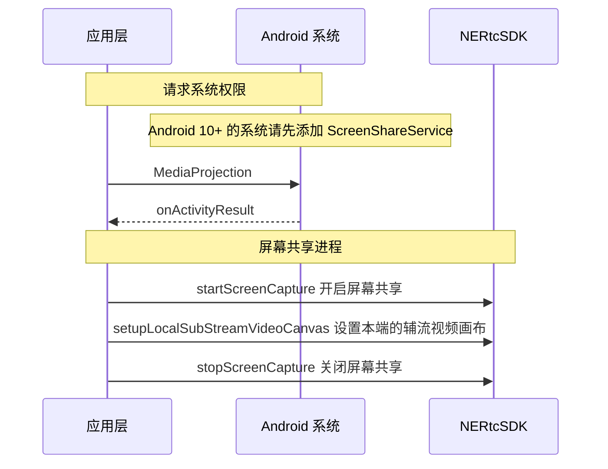
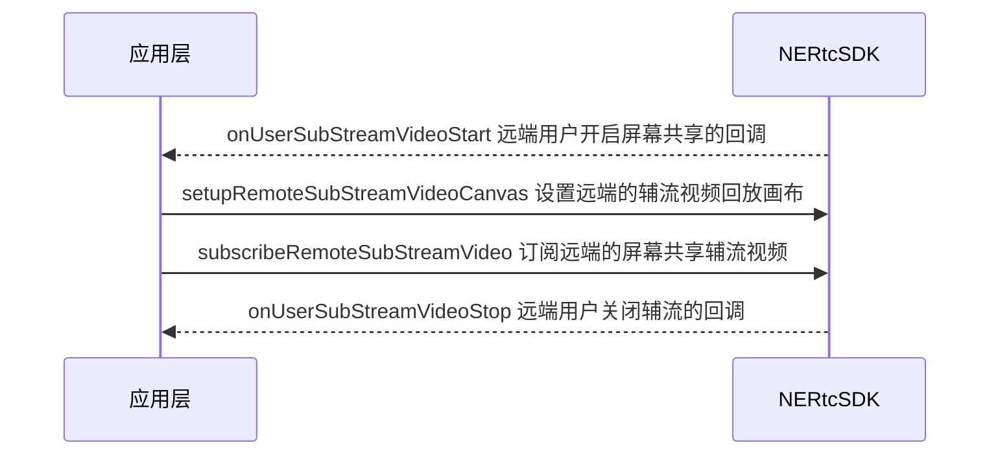

<!--- keywords:实时音视频,屏幕共享 -->

在大型会议或在线教育等场景中，为了满足提升沟通效率的需求，主讲人或老师需要将本端的屏幕内容分享给远端参会者或在线学生观看。NERTC 支持屏幕共享功能，帮助您实时分享本端设备的屏幕内容。

## 功能介绍

通过 NERTC SDK 可以在视频通话或互动直播过程中实现屏幕共享，主播或连麦者可以将自己的屏幕内容，以视频的方式分享给远端参会者或在线观众观看，从而提升沟通效率，一般适用于多人视频聊天、在线会议以及在线教育场景。

- 视频会议场景中，参会者可以在会议中将本地的文件、数据、网页、PPT 等画面分享给其他与会者，让其他与会者更加直观的了解讨论的内容和主题。

- 在线课堂场景中，老师可以通过屏幕共享将课件、笔记、教学内容等画面展示给远端的其他学生观看，降低传统教学模式下的沟通成本，提升教育场景的用户体验。

网易云信 NERTC SDK 以辅流的形式实现屏幕共享，即单独为屏幕共享开启一路上行的视频流，摄像头的视频流作为主流，屏幕共享的视频流作为辅流，两路视频流并行，主播同时上行摄像头画面和屏幕画面两路画面。

::: note note
此外 NERTC SDK 还支持在共享屏幕的同时，也共享本地播放的系统背景音。具体请参考 [音频共享](https://doc.yunxin.163.com/nertc/guide/DE4NTE1MzI?platform=android)。
:::

## <span id="Android 注意事项">注意事项</span>

- NERTC Android、iOS、Windows 和 macOS SDK V3.9.0 及以上版本，Web SDK V4.1.0 及以上版本支持通过辅流实现屏幕共享。如果使用辅流的屏幕共享方案，请保证房间内所有成员均升级到支持版本以上，否则互相通信时会因同时发送主流和辅流造成通话异常等问题。
- 如果您的 App 无法针对所有端进行强制升级，屏幕共享场景中仅部分端使用 V3.9.0 及以上版本，为避免上述通话异常问题，必须保证通话过程中单人同时只有一路上行视频流。当需要将视频流切换为屏幕共享流时，请先通过 <a href="https://doc.yunxin.163.com/nertc/references/android/doxygen/Latest/zh/html/classcom_1_1netease_1_1lava_1_1nertc_1_1sdk_1_1_n_e_rtc.html#ad5c6e217dacfc20546617d98e3b5ba9b" target="_blank">`enableLocalVideo`</a> 关闭视频流，再通过 <a href="https://doc.yunxin.163.com/nertc/references/android/doxygen/Latest/zh/html/classcom_1_1netease_1_1lava_1_1nertc_1_1sdk_1_1_n_e_rtc_ex.html#a39898aeaa3451d08e02466305a2e5a13" target="_blank">`startScreenCapture`</a> 启动屏幕共享流。反向切换同理。
- MediaProjection 等 API 需要 Android API level 21+，使用方法请参考 <a href="https://developer.android.com/reference/android/media/projection/MediaProjection" target="_blank">Google MediaProjection API</a> 文档。
- **Android 10** 及以后的版本屏幕共享系统要求开启一个前台服务，因此需要在 `AndroidManifest.xml` 中添加 service，同时将 **compileSdkVersion** 设置为 29。请根据您的业务需求添加 service。
- **Android 14**（API 级别 34）及以上需声明如下权限，以免出现应用闪退等异常。详情请参考 [排查 Android 14 (API 34) 屏幕共享崩溃问题](https://doc.yunxin.163.com/nertc/faq/TY3MjQxODg?platform=client)。
    ```XML
    <uses-permission android:name="android.permission.FOREGROUND_SERVICE_MEDIA_PROJECTION" />
    ```

## 示例项目源码

网易云信提供 [屏幕共享的示例项目源码 ScreenShare ](https://github.com/netease-im/G2-API-Examples/tree/main/android/VideoCapability/ScreenShare)，您可以参考该源码实现屏幕共享。

## <span id="本端共享屏幕">本端共享屏幕</span>

### <span id="API 调用时序"> **API 调用时序** </span>

开发 Android 系统的应用时，您需要使用 Android 原生 API 和 NERTC API 共同实现屏幕共享功能。API 调用时序如下图所示。



### 第一步：获取用户屏幕录制授权

在进行屏幕共享前，需要获取用户录制屏幕的授权，不同版本下需要获取的权限如下：

- 若用户使用的是 Android 10.0 以下版本，可以使用系统提供的 MediaProjection 和 MediaProjectionManager 进行屏幕录制。该情况下，系统会弹窗提示用户是否允许应用录制屏幕，需要用户同意授权。

    请通过 <a href="https://developer.android.com/reference/android/media/projection/MediaProjection" target="_blank">`MediaProjection`</a> 创建 `ScreenCaptureIntent` 请求屏幕共享权限，并将 intent 传递给 `startActivityForResult()`。

    **示例代码** 如下：
    ```Java
    @TargetApi(Build.VERSION_CODES.LOLLIPOP)
    private void startScreenCapture() {
        MediaProjectionManager mediaProjectionManager =
                (MediaProjectionManager) getApplication().getSystemService(
                        Context.MEDIA_PROJECTION_SERVICE);
        startActivityForResult(
                mediaProjectionManager.createScreenCaptureIntent(), CAPTURE_PERMISSION_REQUEST_CODE);
    }
    ```

- 若用户使用的是 Android 10.0 及以上版本，在使用上述系统 API 的同时，需要通过添加 ScreenShareService 并开启前台服务，并在 `AndroidManifest.xml` 中注册 Service，添加 foregroundServiceType 属性。

    **示例代码** 如下：
    ```XML
    <uses-permission android:name="android.permission.FOREGROUND_SERVICE" />

    <application>
        <service
                android:name="xxx.SimpleScreenShareService"
                android:foregroundServiceType="mediaProjection">
                <intent-filter>
                    <action android:name="com.netease.Yunxin.ScreenShare" />
                </intent-filter>
            </service>
    </application>
    ```

    具体请参考 <a href="https://github.com/netease-im/Advanced-Video/tree/master/ScreenShare/ScreenShare-Android-Java" target="_blank">Demo</a> 或 [提交工单](https://app.yunxin.163.com/global/service/ticket/create) 联系网易云信技术支持工程师。

### 第二步：开启屏幕共享

在加入房间之后调用 <a href="https://doc.yunxin.163.com/nertc/references/android/doxygen/Latest/zh/html/classcom_1_1netease_1_1lava_1_1nertc_1_1sdk_1_1_n_e_rtc_ex.html#a39898aeaa3451d08e02466305a2e5a13" target="_blank">`startScreenCapture`</a> 方法开启屏幕共享，以辅流形式发送屏幕共享内容。<br>调用此方法时，您需要设置 `screenConfig` 配置本地辅流的编码参数，传入请求权限后返回的 intent data，并设置 `MediaProjection.Callback()` 以接收屏幕共享状态回调。

其中 [`NERtcScreenConfig`](https://doc.yunxin.163.com/nertc/references/android/doxygen/Latest/zh/html/classcom_1_1netease_1_1lava_1_1nertc_1_1sdk_1_1video_1_1_n_e_rtc_screen_config.html) 结构体的参数说明如下表所示。

| 参数 | 参数说明 |
| -- | -- |
| contentPrefer | 屏幕共享编码策略倾向：|\
| | - **CONTENT_PREFER_MOTION（默认）**：内容类型为动画。当用户共享的内容是视频、电影或游戏等动态画面时，推荐选择此枚举值。此时 frameRate 参数完全按照您的设置处理。 |\
| | - **CONTENT_PREFER_DETAILS**：内容类型为细节。当用户共享的内容是图片、文字或 PPT 等静态画面时，推荐选择此枚举值。此时 frameRate 参数最高可设置为 10 帧。 |
| videoProfile | 视频编码的分辨率。<br>具体请参考 [NERtcEncodeConfig.videoProfile](https://doc.yunxin.163.com/nertc/references/android/doxygen/Latest/zh/html/classcom_1_1netease_1_1lava_1_1nertc_1_1sdk_1_1video_1_1_n_e_rtc_encode_config.html#a31233f13576043fe47ca4b45537b1ae0)。 |
| frameRate | 视频编码的帧率。<br>可以设置为 0、7（默认）、10、15、24、30 fps，具体请参考 [NERtcVideoFrameRate](https://doc.yunxin.163.com/nertc/references/android/doxygen/Latest/zh/html/enumcom_1_1netease_1_1lava_1_1nertc_1_1sdk_1_1video_1_1_n_e_rtc_encode_config_1_1_n_e_rtc_video_frame_rate.html)。 |
| minFramerate | 视频编码的最小帧率。<br>默认值为 0，表示使用默认的最小帧率。 |
| bitrate | 视频编码的码率，单位为 Kbps。<br>若设置的码率为 0 或超出合理范围，SDK 会自行计算出合理区间处理码率，具体请参考 [分辨率、帧率、码率参照表](https://doc.yunxin.163.com/nertc/guide/jEzNTM2NDg?platform=android#%E5%88%86%E8%BE%A8%E7%8E%87%E3%80%81%E5%B8%A7%E7%8E%87%E5%92%8C%E7%A0%81%E7%8E%87%E5%8F%82%E7%85%A7%E8%A1%A8)。 |
| minBitrate | 视频编码的最小码率，单位为 Kbps。 |

此外，网易云信提供一些常见场景下的参数推荐搭配值，供您参考，具体如下表所示。

| 参数名称 | 常规推荐值 | 一起看视频 | 共享 PPT |
| -- | -- | -- | -- |
| contentPrefer | CONTENT_PREFER_MOTION | CONTENT_PREFER_MOTION | CONTENT_PREFER_DETAILS |
| videoProfile | HD720P | HD720P | HD1080p |
| frameRate | FRAME_RATE_FPS_7 | FRAME_RATE_FPS_30 | FRAME_RATE_FPS_7 |
| bitrate | 0（默认值） | 0（默认值） | 0（默认值） |

::: note note
- 若屏幕共享的内容为静态画面，设置较高的帧率并不经济，推荐 7 fps 即可。
- 若用户要共享的屏幕内容包含大量文字，可以适当提高分辨率和码率设置。
:::

**示例代码** 如下：

```Java
//在权限请求返回中打开屏幕共享接口
@TargetApi(Build.VERSION_CODES.LOLLIPOP)
@Override
public void onActivityResult(int requestCode, int resultCode, Intent data) {
    if (requestCode != CAPTURE_PERMISSION_REQUEST_CODE)
        return;
    if(resultCode != Activity.RESULT_OK) {
        showToast("您拒绝了录屏请求。");
        getUiKitButtons().find("screen_cast", Boolean.class).setState(false);
        return;
    }
    NERtcScreenConfig screenProfile = new NERtcScreenConfig();
    screenProfile.videoProfile = mScreenProfile;
    screenProfile.contentPrefer = mScreenContent;
    screenProfile.frameRate = mScreenFps;
    screenProfile.minFramerate = mScreenMinFps;
    screenProfile.bitrate = mScreenEncodeBitrate;
    screenProfile.minBitrate = mScreenEncodeMinBitrate;
    mScreenService.startScreenCapture(screenProfile, data, new MediaProjection.Callback() {
        @Override
        public void onStop() {
            super.onStop();
            showToast("录屏已停止");
        }
    });
}
```

### 第三步：设置本端辅流画布

调用 <a href="https://doc.yunxin.163.com/nertc/references/android/doxygen/Latest/zh/html/classcom_1_1netease_1_1lava_1_1nertc_1_1sdk_1_1_n_e_rtc_ex.html#a8a3fa528315d1acc2c55bd7470594b92" target="_blank">`setupLocalSubStreamVideoCanvas`</a> 方法设置本端的辅流视频画布。<br>调用此接口时，您需要设置 `render` 参数配置视频画布。

::: note note
您可以在开启屏幕共享前后随时设置本端辅流画布。
:::

**示例代码** 如下：

```Java
NERtcEx.getInstance().setupLocalSubStreamVideoCanvas(mScreenView);
```

### 第四步：停止屏幕共享

若您要结束屏幕共享，请调用 <a href="https://doc.yunxin.163.com/nertc/references/android/doxygen/Latest/zh/html/classcom_1_1netease_1_1lava_1_1nertc_1_1sdk_1_1_n_e_rtc_ex.html#ad9698fc72f1797655d9382e315132e3d" target="_blank">`stopScreenCapture`</a> 方法关闭辅流形式的屏幕共享。

**示例代码** 如下：

```Java
NERtcEx.getInstance().stopScreenCapture();
```

## <span id="Android 观看远端屏幕共享">观看远端屏幕共享</span>

### <span id="API 调用时序"> **API 调用时序** </span>



### <span id="实现方法">实现方法</span>

1. 远端用户加入房间。
2. 收到 <a href="https://doc.yunxin.163.com/nertc/references/android/doxygen/Latest/zh/html/interfacecom_1_1netease_1_1lava_1_1nertc_1_1sdk_1_1_n_e_rtc_callback_ex.html#acbd2a5b0adf2c815271aa4a0934b0d4a" target="_blank">`onUserSubStreamVideoStart`</a> 其他用户开启屏幕共享辅流通道的回调。
3. 通过 <a href="https://doc.yunxin.163.com/nertc/references/android/doxygen/Latest/zh/html/classcom_1_1netease_1_1lava_1_1nertc_1_1sdk_1_1_n_e_rtc_ex.html#a2b956df8d6c39b941e3ca6d3e8a86784" target="_blank">`setupRemoteSubStreamVideoCanvas`</a> 设置远端的辅流视频回放画布。
4. 通过 <a href="https://doc.yunxin.163.com/nertc/references/android/doxygen/Latest/zh/html/classcom_1_1netease_1_1lava_1_1nertc_1_1sdk_1_1_n_e_rtc_ex.html#a81db18186e7a268e6db4714d5f0cf096" target="_blank">`subscribeRemoteSubStreamVideo`</a> 订阅远端的屏幕共享辅流视频，订阅之后才能接收远端的辅流视频数据。
5. 收到 <a href="https://doc.yunxin.163.com/nertc/references/android/doxygen/Latest/zh/html/interfacecom_1_1netease_1_1lava_1_1nertc_1_1sdk_1_1_n_e_rtc_callback_ex.html#a07d214f7b396b43b1cbd44b142f932b9" target="_blank">`onUserSubStreamVideoStop`</a> 其他用户关闭辅流的回调，结束屏幕共享。

### <span id="示例代码">示例代码</span>

```Java
public void onUserSubStreamVideoStart(long uid,int maxProfile) {
    Log.i(TAG, "onUserSubStreamVideoStart uid: " + uid);
    NERtcEx.getInstance().subscribeRemoteSubStreamVideo(
        user.userId, true);
    NERtcEx.getInstance().setupRemoteSubStreamVideoCanvas(view, uid);
}
```

## API 参考

| **方法** | **功能描述** |
| :-- | :-- |
| <a href="https://doc.yunxin.163.com/nertc/references/android/doxygen/Latest/zh/html/classcom_1_1netease_1_1lava_1_1nertc_1_1sdk_1_1_n_e_rtc_ex.html#a39898aeaa3451d08e02466305a2e5a13" target="_blank">`startScreenCapture`</a> | 开启屏幕共享。 |
| <a href="https://doc.yunxin.163.com/nertc/references/android/doxygen/Latest/zh/html/classcom_1_1netease_1_1lava_1_1nertc_1_1sdk_1_1_n_e_rtc_ex.html#a8a3fa528315d1acc2c55bd7470594b92" target="_blank">`setupLocalSubStreamVideoCanvas`</a> | 设置本端的辅流视频画布。 |
| <a href="https://doc.yunxin.163.com/nertc/references/android/doxygen/Latest/zh/html/classcom_1_1netease_1_1lava_1_1nertc_1_1sdk_1_1_n_e_rtc_ex.html#ad9698fc72f1797655d9382e315132e3d" target="_blank">`stopScreenCapture`</a> | 关闭屏幕共享。 |
| <a href="https://doc.yunxin.163.com/nertc/references/android/doxygen/Latest/zh/html/classcom_1_1netease_1_1lava_1_1nertc_1_1sdk_1_1_n_e_rtc_ex.html#a2b956df8d6c39b941e3ca6d3e8a86784" target="_blank">`setupRemoteSubStreamVideoCanvas`</a> | 设置远端的辅流视频回放画布。 |
| <a href="https://doc.yunxin.163.com/nertc/references/android/doxygen/Latest/zh/html/interfacecom_1_1netease_1_1lava_1_1nertc_1_1sdk_1_1_n_e_rtc_callback_ex.html#acbd2a5b0adf2c815271aa4a0934b0d4a" target="_blank">`onUserSubStreamVideoStart`</a> | 通知本端关于远端用户开启屏幕共享辅流通道的回调。 |
| <a href="https://doc.yunxin.163.com/nertc/references/android/doxygen/Latest/zh/html/classcom_1_1netease_1_1lava_1_1nertc_1_1sdk_1_1_n_e_rtc_ex.html#a81db18186e7a268e6db4714d5f0cf096" target="_blank">`subscribeRemoteSubStreamVideo`</a> | 订阅远端的屏幕共享辅流视频 |
| <a href="https://doc.yunxin.163.com/nertc/references/android/doxygen/Latest/zh/html/interfacecom_1_1netease_1_1lava_1_1nertc_1_1sdk_1_1_n_e_rtc_callback_ex.html#a07d214f7b396b43b1cbd44b142f932b9" target="_blank">`onUserSubStreamVideoStop`</a> | 通知本端关于远端用户关闭屏幕共享辅流通道的回调。 |