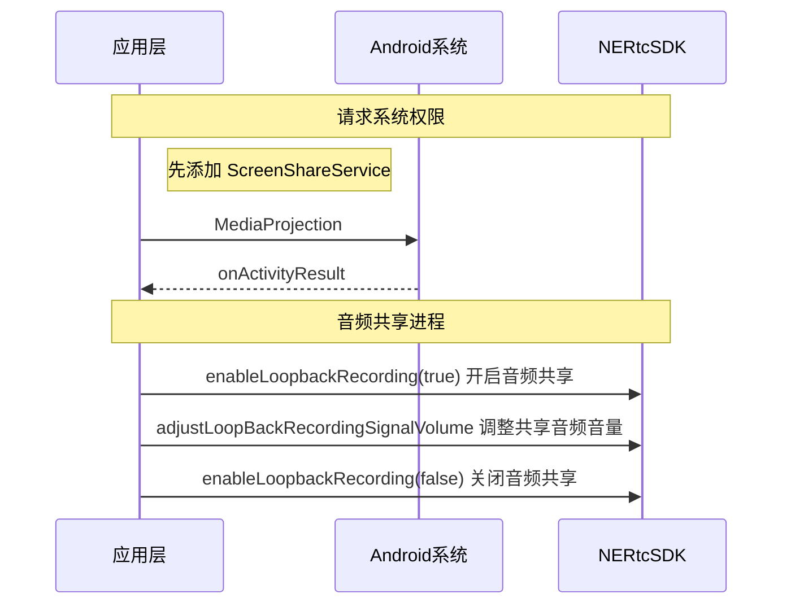

在屏幕分享或共享本地播放的音乐文件等场景中，用户常常需要将本地系统音频发送至远端。NERTC 提供了音频共享功能，帮助您在共享屏幕的同时也能播放本地背景音，或者共享本地视频文件或音乐文件的声音，为您规避播放在线音乐文件可能会遇到的版权问题。

## 功能介绍

通过 NERTC SDK 可以在视频通话或互动直播的过程中实现音频共享，主持人、主播或连麦者可以将本地播放的音频流分享给远端参会者或在线观众收听，从而提升视频通话体验。

音频共享适用于在线会议、在线教育以及互动直播等场景，具体场景说明如下。

- 视频会议场景中，参会者可以在会议中将本地的音频文件、PPT 背景音等所有系统声音分享给其他与会者，让其他与会者更加沉浸式地了解讨论的内容和主题。
- 在线课堂场景中，老师可以线上教学过程中在将课件、教学视频的背景音等所有系统声音分享给远端的学生，提升教育场景的用户体验。
- 互动直播场景中，主播可以在直播过程中将本地播放的音乐、视频背景音等所有系统声音分享给远端的观众，避免了因需要播放在线音乐而遇到的版权问题，同时丰富了场景体验。

## 注意事项

- Android 10 及以后的版本音频共享系统要求开启一个前台服务，因此您需要在 AndroidManifest.xml 中添加 service，同时将 compileSdkVersion 设置为 29。请根据您的业务需求添加 service。
- MediaProjection 等 API 需要 Android API level 21+，使用方法请参考 [Google MediaProjection API 文档](https://developer.android.com/reference/android/media/projection/MediaProjection)。
- 您不能同时使用音频自播放和音频共享功能。 否则会导致加入音视频通话房间后，无法听到对端用户的音频和本地共享音频的声音。 

## 实现方法

### **API 调用时序**

开发 Android 系统的应用时，您需要使用 Android 原生 API 和 NERTC API 共同实现音频共享功能。API 调用时序如下图所示。



  

### **配置步骤**

1. 添加 ScreenShareService，具体请参考 <a href="https://github.com/netease-im/Advanced-Video/tree/master/ScreenShare/ScreenShare-Android-Java" target="_blank">Demo</a> 或联系技术支持。
2. 通过 <a href="https://developer.android.com/reference/android/media/projection/MediaProjection" target="_blank">`MediaProjection`</a> 创建 `ScreenCaptureIntent` 请求屏幕共享权限，并将 intent 传递给 `startActivityForResult()` 。
3. 在加入房间后调用 <a href="https://doc.yunxin.163.com/docs/interface/NERTC_SDK/Latest/Android/html/classcom_1_1netease_1_1lava_1_1nertc_1_1sdk_1_1_n_e_rtc_ex.html#ab58bf9505ec8005bf54affb13df84d74" target="_blank">`enableLoopbackRecording`</a> 方法。调用此方法时，您需要设置 `enable` 参数为 true 开启音频共享，传入请求权限后返回的 intent data，并设置 `MediaProjection.Callback()` 以接收音频共享状态回调。
4. 调用 <a href="https://doc.yunxin.163.com/docs/interface/NERTC_SDK/Latest/Android/html/classcom_1_1netease_1_1lava_1_1nertc_1_1sdk_1_1_n_e_rtc_ex.html#a95b92c66b776e9268dc451bb76ade940" target="_blank">`adjustLoopBackRecordingSignalVolume`</a> 方法调整共享音频音量。调用该方法时，您需要设置 `volume` 参数指定采集信号量。该参数的取值范围为 0 ~ 100。
5. 需要结束音频共享时，调用 <a href="https://doc.yunxin.163.com/docs/interface/NERTC_SDK/Latest/Android/html/classcom_1_1netease_1_1lava_1_1nertc_1_1sdk_1_1_n_e_rtc_ex.html#ab58bf9505ec8005bf54affb13df84d74" target="_blank">`enableLoopbackRecording`</a> 方法并设置 `enable` 参数为 false 停止音频共享。

### **示例代码**

```
if(open){
    //ScreenShareService部分参考demo实现
    if (ScreenShareService.mediaProjectionIntent == null) {
        MediaProjectionManager mediaProjectionManager = null;
        if (Build.VERSION.SDK_INT >= Build.VERSION_CODES.Q) {
            mediaProjectionManager = (MediaProjectionManager) mActivity.getSystemService(Context.MEDIA_PROJECTION_SERVICE);
            Intent permissionIntent = mediaProjectionManager.createScreenCaptureIntent();
            startActivityForResult(permissionIntent, LOOP_BACK_START_CODE);
        }
    }else{
        if(Build.VERSION.SDK_INT >= Build.VERSION_CODES.Q) {
            int nRet = NERtcEx.getInstance().enableLoopbackRecording(true, ScreenShareService.mediaProjectionIntent, new MediaProjection.Callback() {
                @Override
                public void onStop() {
                    mUIHandler.post(new Runnable() {
                    @Override
                    public void run() {
                        Log.w(TAG, "系统录音已停止");
                    }});
                    super.onStop();
        }});
        }
    }
}else {
    NERtcEx.getInstance().enableLoopbackRecording(false, null, null);
}
```

## API 参考
| **方法** | **功能描述**|
|:--|:--|
|<a href="https://doc.yunxin.163.com/docs/interface/NERTC_SDK/Latest/Android/html/classcom_1_1netease_1_1lava_1_1nertc_1_1sdk_1_1_n_e_rtc_ex.html#ab58bf9505ec8005bf54affb13df84d74" target="_blank">`enableLoopbackRecording`</a>|开启或关闭音频共享|
|<a href="https://doc.yunxin.163.com/docs/interface/NERTC_SDK/Latest/Android/html/classcom_1_1netease_1_1lava_1_1nertc_1_1sdk_1_1_n_e_rtc_ex.html#a95b92c66b776e9268dc451bb76ade940" target="_blank">`adjustLoopBackRecordingSignalVolume`</a>|调整音频共享音量|