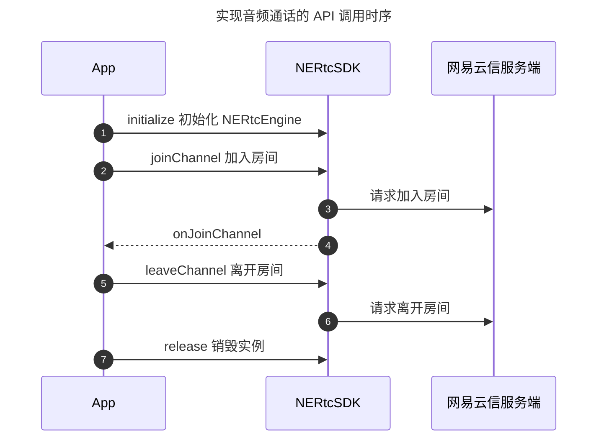
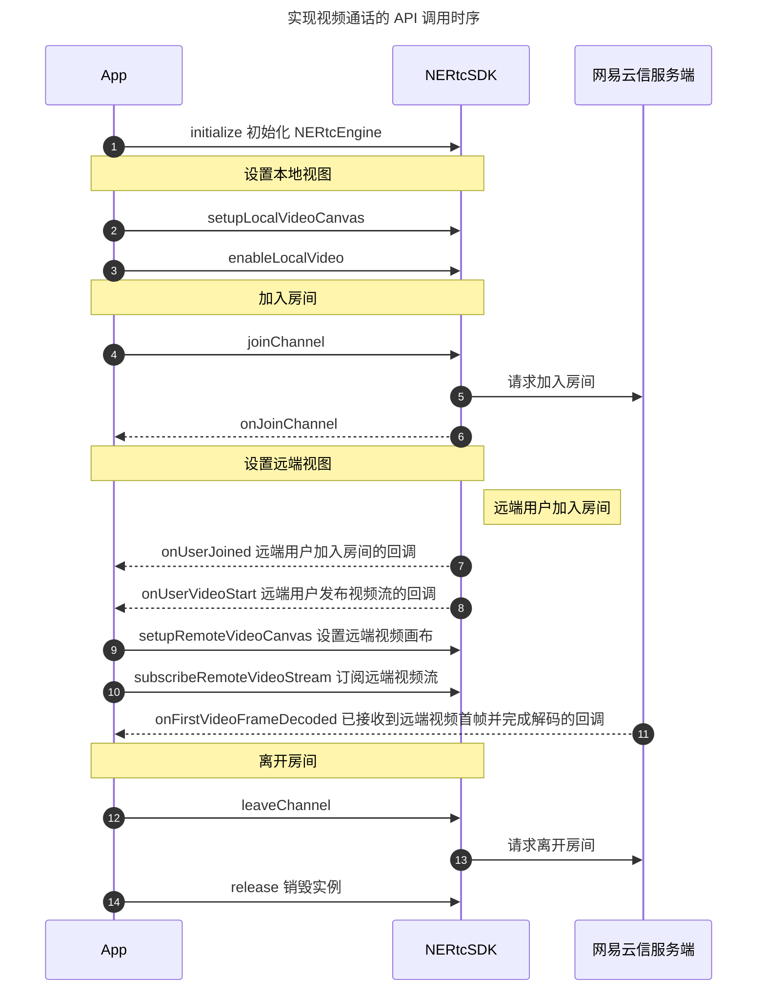

<!--和互动直播对应文档步骤不一致，请勿直接替换。相比互动直播文档，增加跑通示例代码、删除部分推流步骤-->

网易云信音视频通话产品的基本功能包括高质量的实时音视频通话。当您成功初始化 SDK 之后，您可以简单体验本产品的基本业务流程。本文为您展示音视频通话提供的基本业务流程。

## <span id="前提条件">准备工作</span>

请确认您已完成以下操作：

- [创建应用并获取 App Key](https://doc.yunxin.163.com/console/guide/TIzMDE4NTA?platform=console)。
- [开通音视频通话 2.0 服务](https://doc.yunxin.163.com/nertc/quick-start/TYzODcyNjE)。
- [集成 SDK（Android）](https://doc.yunxin.163.com/nertc/quick-start/DcyNDc0ODI)，其中需要 **添加必要的设备权限**。

## <span id="示例代码">示例代码</span>

网易云信为您提供完整的 **创建界面** 及 **实现基础音视频通话** 的示例代码作为参考，您可以直接拷贝用于运行测试。

::: details 单击展开查看创建界面的完整示例 XML 代码。
```XML
<?xml version="1.0" encoding="utf-8"?>
<RelativeLayout xmlns:android="http://schemas.android.com/apk/res/android"
    android:layout_width="match_parent"
    android:layout_height="match_parent">

    <TextView
        android:id="@+id/tv_channel_name"
        android:layout_width="wrap_content"
        android:layout_height="wrap_content"
        android:layout_centerHorizontal="true"
        android:layout_margin="12dp"
        android:text="频道名称：xxx"
        android:textSize="16sp" />

    <FrameLayout
        android:layout_width="match_parent"
        android:layout_height="match_parent"
        android:layout_below="@id/tv_channel_name">

        <com.netease.lava.nertc.sdk.video.NERtcVideoView
            android:id="@+id/render_remote_user"
            android:layout_width="match_parent"
            android:layout_height="match_parent" />

        <TextView
            android:id="@+id/tv_remote_uid"
            android:layout_width="wrap_content"
            android:layout_height="wrap_content"
            android:layout_centerHorizontal="true"
            android:layout_margin="12dp"
            android:text="对端 uid：xxx"
            android:textSize="16sp" />
    </FrameLayout>

    <FrameLayout
        android:layout_width="wrap_content"
        android:layout_height="wrap_content"
        android:layout_below="@id/tv_channel_name"
        android:layout_alignParentEnd="true"
        android:layout_margin="12dp">

        <com.netease.lava.nertc.sdk.video.NERtcVideoView
            android:id="@+id/render_local_user"
            android:layout_width="135dp"
            android:layout_height="240dp" />

        <TextView
            android:id="@+id/tv_local_uid"
            android:layout_width="wrap_content"
            android:layout_height="wrap_content"
            android:layout_centerHorizontal="true"
            android:layout_margin="12dp"
            android:text="本地 uid：xxx"
            android:textSize="16sp" />

    </FrameLayout>

    <LinearLayout
        android:layout_width="wrap_content"
        android:layout_height="wrap_content"
        android:layout_alignParentBottom="true"
        android:layout_centerHorizontal="true"
        android:orientation="horizontal">

        <Button
            android:id="@+id/btn_enable_video"
            android:layout_width="wrap_content"
            android:layout_height="wrap_content"
            android:layout_margin="12dp"
            android:text="关闭视频"
            android:textColor="@color/black" />


        <Button
            android:id="@+id/btn_enable_audio"
            android:layout_width="wrap_content"
            android:layout_height="wrap_content"
            android:layout_margin="12dp"
            android:text="关闭语音"
            android:textColor="@color/black" />

        <Button
            android:id="@+id/btn_leave_channel"
            android:layout_width="wrap_content"
            android:layout_height="wrap_content"
            android:layout_margin="12dp"
            android:text="结束通话"
            android:textColor="@color/black" />

    </LinearLayout>

</RelativeLayout>
```
:::

::: details 单击展开查看实现音视频通话的完整示例 Java 代码。
```Java
NERtcVideoView localRenderView = findViewById(R.id.render_view_local);
//小画布置于大画布上面
localRenderView.setZOrderMediaOverlay(true);

NERtcVideoView remoteRenderView = findViewById(R.id.render_view_remote);

NERtcCallback neRtcCallback = new NERtcCallbackEx() {
    @Override
    public void onJoinChannel(int result, long channelId, long elapsed, long uid) {
        if (result == NERtcConstants.ErrorCode.OK) {
            // 加入房间成功
        } else {
            // 加入房间失败，退出页面
            finish();
        }
    }

    @Override
    public void onLeaveChannel(int result) {
    }

    @Override
    public void onUserJoined(long uid) {
    }

    @Override
    public void onUserLeave (long uid,int reason) {
    }

    @Override
    public void onUserAudioStart(long uid) {
    }

    @Override
    public void onUserAudioStop(long uid) {
    }

    @Override
    public void onUserVideoStart(long uid,int maxProfile) {
        //对方开启视频，按需设置画布及订阅视频
        NERtcEx.getInstance().setupRemoteVideoCanvas(remoteRenderView,uid);
        NERtcEx.getInstance().subscribeRemoteVideoStream(uid, NERtcRemoteVideoStreamType.kNERtcRemoteVideoStreamTypeHigh,true);
    }

    @Override
    public void onUserVideoStop(long uid) {
        //释放之前绑定的画布
        NERtcEx.getInstance().setupRemoteVideoCanvas(null,uid);
    }

    @Override
    public void onDisconnect(int reason) {
        // 与服务器断连，退出页面
        finish();
    }

    //*******其他一些回调******
};

//初始化 SDK
try {
    NERtc.getInstance().init(getApplicationContext(), "your_app_key", neRtcCallback, null);
} catch (Exception e) {
    e.printStackTrace();
    showToast("SDK 初始化失败");
    finish();
    return;
}

//设置本地视频参数
NERtcVideoConfig videoConfig = new NERtcVideoConfig();
videoConfig.width = 1080;
videoConfig.height = 720;
videoConfig.frameRate = NERtcEncodeConfig.NERtcVideoFrameRate.FRAME_RATE_FPS_30;
NERtcEx.getInstance().setLocalVideoConfig(videoConfig);

//加入房间前提前设置好视频开启状态
NERtcEx.getInstance().enableLocalVideo(true,kNERtcVideoStreamTypeMain);

//设置本地画布
NERtcEx.getInstance().setupLocalVideoCanvas(localRenderView);

//加入房间
long yourUid = 1234567;//同一个房间不允许相同 uid
NERtcEx.getInstance().joinChannel("your_token", "your_channel_name", yourUid，null);

//结束通话
NERtcEx.getInstance().leaveChannel();

//释放 SDK
NERtcEx.getInstance().release();
```
:::

## 实现流程

实现 **音频通话** 的 API 调用时序如下图所示。



实现 **视频通话** 的 API 调用时序如下图所示。



<a id="实现音视频通话"></a>

## 第一步：创建音视频通话界面

::: details 您可以参考此步骤根据业务场景创建相应的音视频通话界面，若您已实现相应界面，请忽略该步骤。单击展开查看创建音视频通话界面的相关说明。

实现基础的音视频通话，建议您参考 [XML 界面的示例代码](#示例代码) 在界面上添加以下控件。

- 房间 ID
- 用户昵称
- 本端视频窗口
- 远端视频窗口
- 麦克风按钮
- 摄像头按钮
- 结束通话按钮

效果图如下图所示。


:::

## <span id="2.导入类">第二步：导入类</span>

在您的工程中对应实现音视频通话的 Activity 文件里添加如下代码先导入以下重要类：

```Java
import com.netease.lava.nertc.sdk.NERtcCallbackEx;
import com.netease.lava.nertc.sdk.NERtcConstants;
import com.netease.lava.nertc.sdk.NERtcEx;
import com.netease.lava.nertc.sdk.NERtcParameters;
import com.netease.lava.nertc.sdk.video.NERtcRemoteVideoStreamType;
import com.netease.lava.nertc.sdk.video.NERtcVideoView;
```

## <span id="3.初始化">第三步：初始化</span>

默认情况下，请在导入后的 `nertc-sdk-4.x.xx.jar` 文件中先执行 [`init`](https://doc.yunxin.163.com/nertc/api-refer/android/doxygen/Latest/zh/html/classcom_1_1netease_1_1lava_1_1nertc_1_1sdk_1_1_n_e_rtc.html#a2198fb57cd127a8ae136e1f450236e57) 方法完成初始化。

::: note notice
您需要将 `App_Key` 替换为您在 [准备工作](#前提条件) 阶段创建的应用对应的 App Key。
:::

**示例代码** 如下：

```Java
private void initializeSDK() {
      try {
          NERtcEx.getInstance().init(getApplicationContext(),Config.APP_KEY,callback,null);
      } catch (Exception e) {
          showToast("SDK 初始化失败");
          finish();
          ...
          return;
      }
      ...
}
```

为了实现标准音视频通话业务，您还需要在初始化时 **注册相关必要回调**，建议您请在初始化方法中传入原型为 **NERtcCallbackEx** 的以下回调，并增加相应必要的处理。

```Java
//NERtcCallbackEx 重要回调

//本端用户加入房间结果回调
@Override
public void onJoinChannel(int result, long channelId, long elapsed, long uid) {
    if (result == NERtcConstants.ErrorCode.OK) {
        // 加入房间成功
    } else {
        // 加入房间失败，退出页面
    }
}

//本端用户离开房间回调
@Override
public void onLeaveChannel(int result) {
}

//远端用户加入房间
@Override
public void onUserJoined(long uid) {
}

//远端用户离开房间
@Override
public void onUserLeave (long uid,int reason) {
}

//远端用户打开音频
@Override
public void onUserAudioStart(long uid) {
}

//远端用户关闭音频
@Override
public void onUserAudioStop(long uid) {
}

//远端用户打开视频，建议在此按需设置画布及订阅视频
@Override
public void onUserVideoStart(long uid,int maxProfile) {
}

//远端用户关闭视频，可释放之前绑定的画布
@Override
public void onUserVideoStop(long uid) {
}

//与服务器断连，退出页面
@Override
public void onDisconnect(int reason) {
}
```

## <span id="4.设置本地视图">第四步：设置本地视图</span>

初始化成功后，可以设置本地视图，来预览本地图像。您可以根据业务需要实现加入房间之前预览或加入房间后预览。

::: note note
- 若您想设置画布渲染参数，可以调用 [`setScalingType`](https://doc.yunxin.163.com/nertc/api-refer/android/doxygen/Latest/zh/html/classcom_1_1netease_1_1lava_1_1nertc_1_1sdk_1_1video_1_1_n_e_rtc_video_view.html#a23a371a170ba14bd98c9266cd9f3b8b6) 方法设置渲染缩放模式或调用 [`setMirror`](https://doc.yunxin.163.com/nertc/api-refer/android/doxygen/Latest/zh/html/classcom_1_1netease_1_1lava_1_1nertc_1_1sdk_1_1video_1_1_n_e_rtc_video_view.html#a486bc04bd43ba0c45a06234d83e1b86a) 方法设置镜像模式。
- 若您想调整摄像头的相关参数，请参考 [视频设备管理](https://doc.yunxin.163.com/nertc/quick-start/DcwNjA4NzQ?platform=android) 进行设置。
- 在加入房间前，默认预览分辨率为 640*480，您可以通过 [`setLocalVideoConfig`](https://doc.yunxin.163.com/nertc/api-refer/android/doxygen/Latest/zh/html/classcom_1_1netease_1_1lava_1_1nertc_1_1sdk_1_1_n_e_rtc.html#ac0ae5d451a01fe2510d1c21e909c247a) 接口的 `width ` 和 `height` 参数调整采集分辨率。
:::

- 实现加入房间前预览。

    1. 调用 [`setupLocalVideoCanvas`](https://doc.yunxin.163.com/nertc/api-refer/android/doxygen/Latest/zh/html/classcom_1_1netease_1_1lava_1_1nertc_1_1sdk_1_1_n_e_rtc.html#a4c008dfb1448f3bb09115d411bf21f27) 与 [`startVideoPreview(streamType)`](https://doc.yunxin.163.com/nertc/api-refer/android/doxygen/Latest/zh/html/classcom_1_1netease_1_1lava_1_1nertc_1_1sdk_1_1_n_e_rtc.html#afbf7f0de6fdd33a63d9f8bb60031e5f8) 方法，在加入房间前设置本地视图，预览本地图像。

        **示例代码** 如下：

        ```Java
        //以开启本地视频主流预览为例
        NERtcVideoView localView = (NERtcVideoView)findViewById(R.id.render_view_local);
        NERtcEx.getInstance().setupLocalVideoCanvas(localView);
        NERtcEx.getInstance().startVideoPreview(kNERtcVideoStreamTypeMain);

        //设置本地视频画面的渲染模式：以保证原始视频尺寸比例为例（可选）
        localView.setScalingType(NERtcConstants.VideoScalingType.SCALE_ASPECT_FIT);

        //设置本地视频画面的镜像模式：以开启镜像为例（可选）
        localView.setMirror(true);
        ```

    2. 若要结束预览，或者准备加入房间时，调用 [`stopVideoPreview(streamType)`](https://doc.yunxin.163.com/nertc/api-refer/android/doxygen/Latest/zh/html/classcom_1_1netease_1_1lava_1_1nertc_1_1sdk_1_1_n_e_rtc.html#a23f4d820a20c7be94ae4d793a81c8a0d) 方法停止预览。

        ::: note note
        [`stopVideoPreview(streamType)`](https://doc.yunxin.163.com/nertc/api-refer/android/doxygen/Latest/zh/html/classcom_1_1netease_1_1lava_1_1nertc_1_1sdk_1_1_n_e_rtc.html#a23f4d820a20c7be94ae4d793a81c8a0d) 的 `streamType` 参数请与 [`startVideoPreview(streamType)`](https://doc.yunxin.163.com/nertc/api-refer/android/doxygen/Latest/zh/html/classcom_1_1netease_1_1lava_1_1nertc_1_1sdk_1_1_n_e_rtc.html#afbf7f0de6fdd33a63d9f8bb60031e5f8) 的保持一致，即同为主流或辅流的开启和停止预览。
        :::

- 实现加入房间后预览。

    调用 [`setupLocalVideoCanvas`](https://doc.yunxin.163.com/nertc/api-refer/android/doxygen/Latest/zh/html/classcom_1_1netease_1_1lava_1_1nertc_1_1sdk_1_1_n_e_rtc.html#a4c008dfb1448f3bb09115d411bf21f27) 设置本地视图，再调用 [`enableLocalVideo(streamType)`](https://doc.yunxin.163.com/nertc/api-refer/android/doxygen/Latest/zh/html/classcom_1_1netease_1_1lava_1_1nertc_1_1sdk_1_1_n_e_rtc.html#ad5c6e217dacfc20546617d98e3b5ba9b) 方法进行视频的采集发送与预览。成功加入房间后，即可预览本地图像。

    **示例代码** 如下：

    ```Java
    //设置本地预览画布
    NERtcVideoView localView = (NERtcVideoView)findViewById(R.id.render_view_local);
    NERtcEx.getInstance().setupLocalVideoCanvas(localView);

    //以开启本地视频主流采集并发送为例
    NERtcEx.getInstance().enableLocalVideo(true,kNERtcVideoStreamTypeMain);

    //设置本地视频画面的渲染模式：以保证原始视频尺寸比例为例（可选）
    localView.setScalingType(NERtcConstants.VideoScalingType.SCALE_ASPECT_FIT);

    //设置本地视频画面的镜像模式：以开启镜像为例（可选）
    localView.setMirror(true);
    ```

## <span id="5.加入房间">第五步：加入房间</span>

加入房间前，请确保已完成初始化相关事项。若您的业务中涉及呼叫邀请等机制，建议通过 [信令](/docs/DA5MjI4NDY/DE2MTc5MTQ) 实现，总体实现流程请参考 [一对一会话操作流程](https://doc.yunxin.163.com/signaling/quick-start/DE2MTc5MTQ?platform=android#%E4%B8%80%E5%AF%B9%E4%B8%80%E4%BC%9A%E8%AF%9D%E6%93%8D%E4%BD%9C%E6%B5%81%E7%A8%8B)，具体呼叫邀请机制的实现请参考 [邀请机制](https://doc.yunxin.163.com/signaling/quick-start/zc3NDkzNDU?platform=android)。

调用 [`joinChannel`](https://doc.yunxin.163.com/nertc/api-refer/android/doxygen/Latest/zh/html/classcom_1_1netease_1_1lava_1_1nertc_1_1sdk_1_1_n_e_rtc.html#a53a91a0990a55753e319f1719761b599) 方法加入房间。

::: note note
调用 `joinChannel` 之后，NERTC SDK 会通过 Android 的 [`AudioManager.setMode()`](https://developer.android.com/reference/android/media/AudioManager#setMode(int)) 方法调整音频模式（audio mode），此后请勿修改 SDK 调整过的音频模式，否则会导致音频路由错误等问题。
:::

**示例代码** 如下：

```Java
NERtcEx.getInstance().joinChannel(token,channelName,uid,channelOptions);
```

**参数说明**：

<table>
  <tr>
    <th width="30%"><b>参数</b></th>
    <th width="60%"><b>说明</b></th>
  </tr>
  <tr>
    <td>token</td>
    <td>安全认证签名（NERTC Token）。<br><ul><li>调试模式下：可设置为 null。产品默认为安全模式，您可以在网易云信控制台将鉴权模式修改为调试模式，具体请参考 <a href="https://doc.yunxin.163.com/nertc/quick-start/TQ0MTI2ODQ?platform=android" target="_blank">Token 鉴权</a>。<br><b>调试模式的安全性不高，请在产品正式上线前修改为安全模式。</b><li>产品正式上线后：请设置为已获取的 <a href="https://doc.yunxin.163.com/nertc/quick-start/TQ0MTI2ODQ?platform=android#%E7%94%B3%E8%AF%B7%20Token" target="_blank">NERTC Token</a>。安全模式下必须设置为获取到的 Token。若未传入正确的 Token 将无法进入房间。<p><b>推荐使用安全模式</b>。</td>
  </tr>
    <tr>
    <td>channelName</td>
    <td>房间名称，长度为 1 ~ 64 字节。目前支持以下 89 个字符：a-z, A-Z, 0-9, space, !#$%&()+-:;≤.,>? @[]^_{|}~"。<br>设置相同房间名称的用户会进入同一个通话房间。<br><note type="note">您也可以在加入通道前，通过 <a href="https://doc.yunxin.163.com/nertc/server-apis/jg3NjcyNTE?platform=server" target="_blank">创建房间</a> 接口创建房间。加入房间时，若传入的 {channelName} 未事先创建，则网易云信服务器内部将为其自动创建一个名为 {channelName} 的通话房间。</note></li></td>
  </tr>
    <tr>
    <td>uid</td>
    <td>用户的唯一标识 ID，为数字串，房间内每个用户的 uid 必须是唯一的。<note type="notice">此 uid 为用户在您应用中的 ID，请在您的业务服务器上自行管理并维护。</note></td>
  </tr>
    <tr>
    <td>channelOptions</td>
    <td>加入房间时可以设置携带一些特定信息，包括高级权限密钥。默认值为 NULL，具体请参考 <a href="https://doc.yunxin.163.com/nertc/api-refer/android/doxygen/Latest/zh/html/classcom_1_1netease_1_1lava_1_1nertc_1_1sdk_1_1_n_e_rtc_join_channel_options.html" target="_blank">NERtcJoinChannelOptions</a>。</td>
  </tr>
</table>

::: note note
- SDK 发起加入房间请求后，服务器会进行响应，您可以通过 [`NERtcCallback`](https://doc.yunxin.163.com/nertc/api-refer/android/doxygen/Latest/zh/html/interfacecom_1_1netease_1_1lava_1_1nertc_1_1sdk_1_1_n_e_rtc_callback.html) 的 [`onJoinChannel`](https://doc.yunxin.163.com/nertc/api-refer/android/doxygen/Latest/zh/html/interfacecom_1_1netease_1_1lava_1_1nertc_1_1sdk_1_1_n_e_rtc_callback.html#a1030d71d7fed4d6de3b932f66a523be7) 回调监听加入房间的结果，同时该回调会抛出当前通话房间的 **channelId** 与加入房间总耗时（毫秒）。其中 **channelId** 即音视频通话的 ID，建议您在业务层保存该数据，以便于后续问题排查。

- 成功加入房间之后，您可以通过监听 [`onConnectionStateChanged`](https://doc.yunxin.163.com/nertc/api-refer/android/doxygen/Latest/zh/html/interfacecom_1_1netease_1_1lava_1_1nertc_1_1sdk_1_1_n_e_rtc_callback_ex.html#ae3828816577fc2565eddf813976789c3) 回调实时监控自己在本房间内的连接状态。
:::

## <span id="6.设置远端视图并发起订阅">第六步：设置远端视图并发起订阅</span>

音视频通话过程中，除了要显示本地的视频画面，通常也要显示参与互动的其他连麦者/主播的远端视频画面。

::: details 单击点开查看设置远端视图并订阅的完整示例 Java 代码。
```Java
//对方开启视频，按需设置画布及订阅视频
NERtcVideoView remoteRenderView = findViewById(R.id.render_view_remote);
NERtcEx.getInstance().setupRemoteVideoCanvas(remoteRenderView,uid);
NERtcEx.getInstance().subscribeRemoteVideoStream(uid, NERtcRemoteVideoStreamType.kNERtcRemoteVideoStreamTypeHigh,true);
```
:::

1. 监听远端用户进出房间。

    当远端用户加入房间时，本端会触发 [`onUserJoined`](https://doc.yunxin.163.com/nertc/api-refer/android/doxygen/Latest/zh/html/interfacecom_1_1netease_1_1lava_1_1nertc_1_1sdk_1_1_n_e_rtc_callback.html#ae61dabff9747cbd455442eafb8dfe414) 回调，并抛出对方的 uid。

    ::: note note
    当本端加入房间后，也会通过此回调抛出通话房间内已有的其他用户。
    :::

2. 设置远端视频画布。

    在监听到远端用户加入房间或发布视频流后，本端可以调用 [`setupRemoteVideoCanvas`](https://doc.yunxin.163.com/nertc/api-refer/android/doxygen/Latest/zh/html/classcom_1_1netease_1_1lava_1_1nertc_1_1sdk_1_1_n_e_rtc.html#a42244c0d7d497ab5d3a3390aeb619a3e) 方法设置远端用户视频画布，用于显示其视频画面。

    <b>示例代码</b> 如下：

    ```Java
    NERtcVideoView remoteRenderView = findViewById(R.id.render_view_remote);
    NERtcEx.getInstance().setupRemoteVideoCanvas(remoteRenderView,uid);
    ```

3. 监听远端视频流发布。

    当房间中的其他用户发布视频流时，本端会触发 [`onUserVideoStart`](https://doc.yunxin.163.com/nertc/api-refer/android/doxygen/Latest/zh/html/interfacecom_1_1netease_1_1lava_1_1nertc_1_1sdk_1_1_n_e_rtc_callback.html#a3bb52968ab05a708cee947a0bec33873) 回调。

4. 订阅远端视频流。

    在监听到远端用户发布视频流后，本端可以调用 [`subscribeRemoteVideoStream`](https://doc.yunxin.163.com/nertc/api-refer/android/doxygen/Latest/zh/html/classcom_1_1netease_1_1lava_1_1nertc_1_1sdk_1_1_n_e_rtc.html#aeb6ccb7d3481f5524abdc6e4dd38d51a) 方法对其发起视频流的订阅，来将对方的视频流渲染到视频画布上。

    <b>示例代码</b>如下：
    ```Java
    NERtcEx.getInstance().subscribeRemoteVideoStream(uid, streamType, subscribe);
    ```

5. 监听远端用户离开房间或关闭视频功能。

    - **[`onUserLeave`](https://doc.yunxin.163.com/nertc/api-refer/android/doxygen/Latest/zh/html/interfacecom_1_1netease_1_1lava_1_1nertc_1_1sdk_1_1_n_e_rtc_callback.html#aeb2604dfb4551fe537f61b67fd1cfa5b)**：用户离开房间回调。

    - **[`onUserVideoStop`](https://doc.yunxin.163.com/nertc/api-refer/android/doxygen/Latest/zh/html/interfacecom_1_1netease_1_1lava_1_1nertc_1_1sdk_1_1_n_e_rtc_callback.html#a8760fd3f131541b619db31848b97d66c)**：远端用户关闭视频功能回调。

## <span id="7.音频流">第七步：音频流</span>

在 NERTC SDK 中，本地音频的采集发布和远端音频订阅播放是默认启动的，正常情况下无需开发者主动干预。

## <span id="8.退出通话房间">第八步：退出通话房间</span>

调用 [`leaveChannel`](https://doc.yunxin.163.com/nertc/api-refer/android/doxygen/Latest/zh/html/classcom_1_1netease_1_1lava_1_1nertc_1_1sdk_1_1_n_e_rtc.html#af42a2d700d78e67022ea04345229fe94) 方法退出通话房间。

**示例代码** 如下：

```Java
NERtcEx.getInstance().leaveChannel();
```

**NERtcCallback** 提供 [`onLeaveChannel`](https://doc.yunxin.163.com/nertc/api-refer/android/doxygen/Latest/zh/html/interfacecom_1_1netease_1_1lava_1_1nertc_1_1sdk_1_1_n_e_rtc_callback.html#a8c4cbc5219d80e3dedf66d0570d470a4) 回调来监听当前用户退出房间的结果。

## <span id="9.销毁实例">第九步：销毁实例</span>

当确定 App 短期内不再使用音视频通话实例时，可以调用 [`release`](https://doc.yunxin.163.com/nertc/api-refer/android/doxygen/Latest/zh/html/classcom_1_1netease_1_1lava_1_1nertc_1_1sdk_1_1_n_e_rtc.html#adccc96746b013e42f18937482ed08ac5) 方法释放对应的对象资源。

**示例代码** 如下：

```Java
// 销毁实例
NERtcEx.getInstance().release();
```