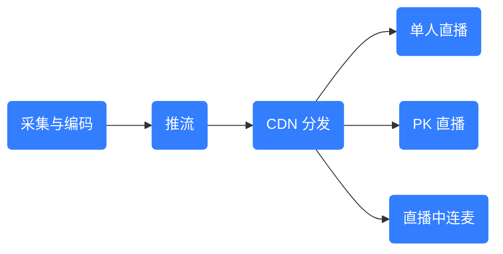
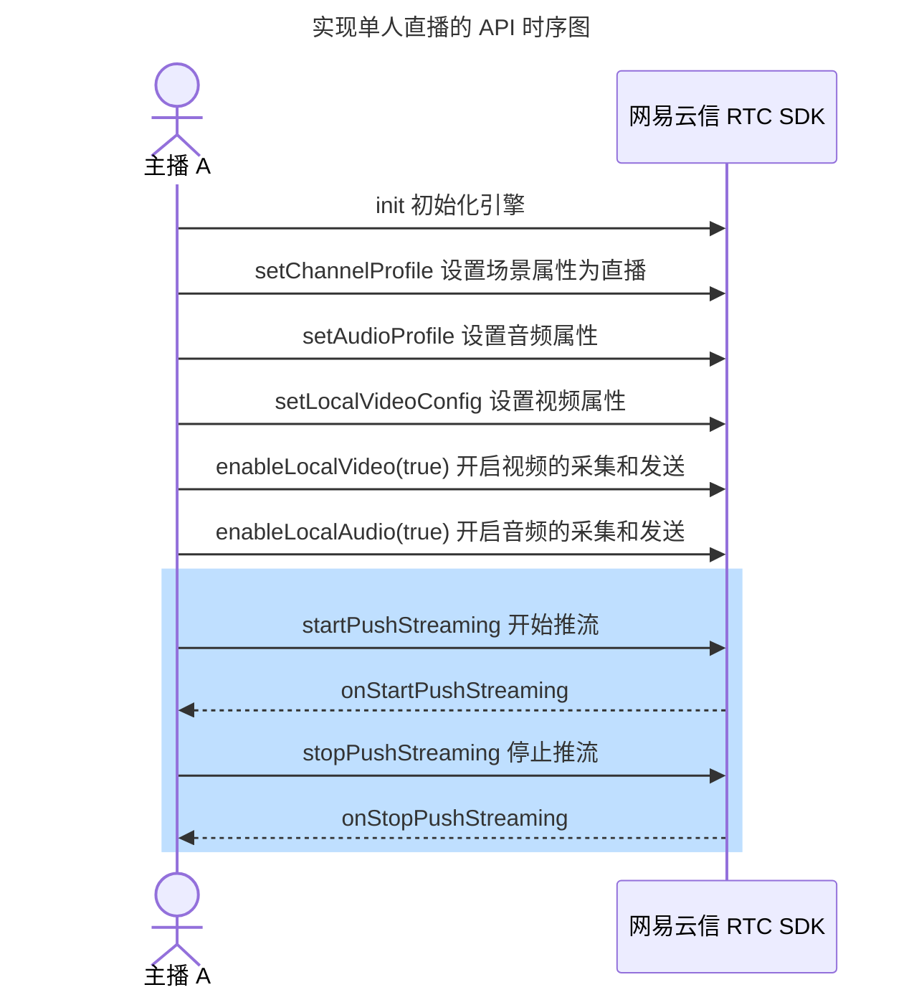
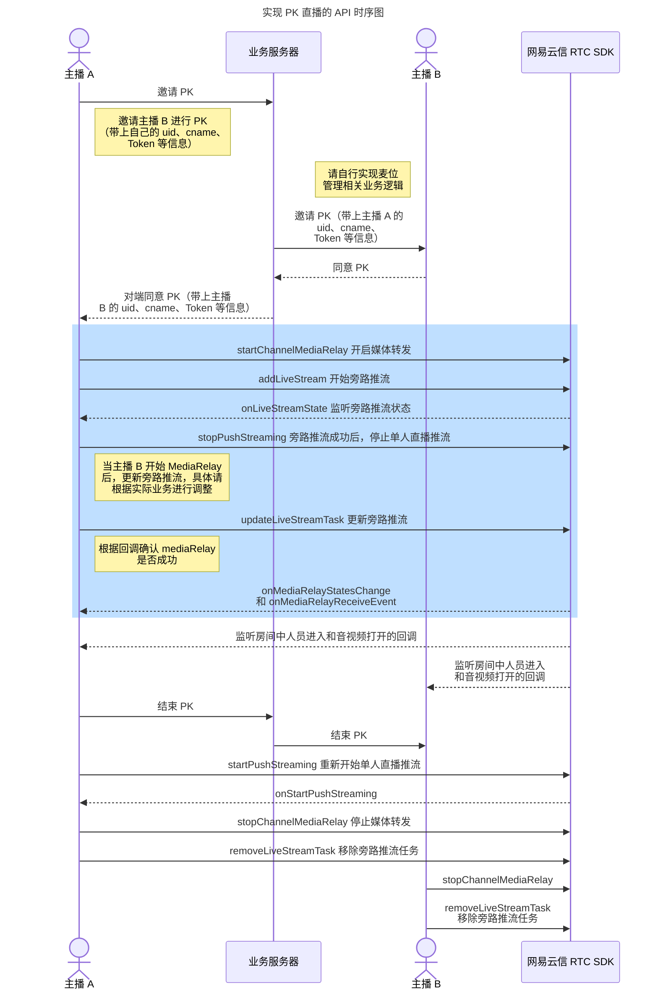
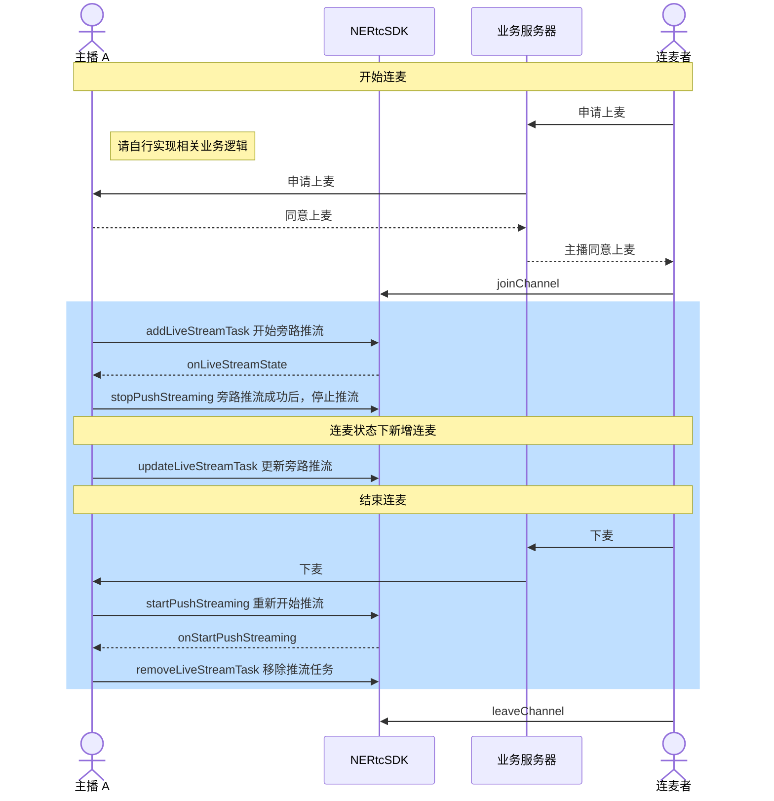

<!-- keywords: 直播推流,CDN,PK 直播,连麦 -->

网易云信音视频通话 SDK（简称 NERTC SDK）融合了 CDN 推流能力，您只要集成一个 SDK，即可实现单人直播、PK 直播和连麦功能。应用可以在三个场景间无缝切换，大大提升 PK 直播的用户体验。本文介绍如何在安卓工程中，通过 Maven 引入 NERTC SDK，并实现 CDN 推流能力。

进行本文操作前，请确保您已经完成了前置准备工作：


## 功能介绍

CDN（Content Delivery Network，内容分发网络）推流，是指利用 CDN 技术将音视频直播或实时数据流从直播编码器、监控摄像头等源头传输到互联网用户的过程。关键流程如下：



1. 采集与编码：通过摄像机、虚拟设备等采集端，采集音视频内容，并对其进行编码压缩，转换成适合网络传输的数字流格式。
2. 推流：通过 RTMP（Real-Time Messaging Protocol，实时消息传输协议）、HLS（HTTP Live Streaming）、FLV（Flash Video）等协议，将编码后的音视频流上传至 CDN 的入口节点。
3. CDN 分发：通过网易云信全球分布的边缘节点网络，将推流数据迅速、高效地缓存并分发到距离观众最近的 CDN 节点。
4. 拉流与播放：观众通过播放器或 App，从 CDN 边缘节点 **拉取** 音视频流，实时观看低延迟和高质量的直播视频，并进行直播互动。
    - 在单人直播时，NERTC SDK 将主播的音视频直接推流到 CDN 分发，观众无需加入房间即可通过播放器拉流观看。
    - 在 PK 直播时，通过跨频道转发，无须切换 NERTC SDK，也不需要退出或重新进入房间，直接将媒体流转发到主播房间和挑战者房间，实现主播跨房间与其他主播实时互动。直播间内的观众可以同时观看两个主播 PK 互动，场景无缝切换。
    - 直播中连麦成功后，观众在房间里与主播进行实时音视频通话，增加直播互动。

### **单人直播**

单人直播的架构原理如下图所示。


单人直播模式下，主播 A 和主播 B 分别加入房间 A 和 B，NERTC SDK 将主播音视频直接推流到 CDN 分发，观众端使用 RTMP/HLS/FLV 协议进行拉流观看。

### **PK 直播**

PK 直播的架构原理如下图所示。


PK 直播的业务流程说明如下：

1. 主播 A 发出 PK 邀请，主播 B 同意。
2. 通过跨频道转发，主播 A 和主播 B 不需要退出原房间，直接将媒体流转发到房间 A 和房间 B 中，实现主播跨房间与其他主播实时互动。
3. 互动直播服务器将主播 A 和主播 B 的音视频进行混屏转码后，推到 CDN 分发。
4. 观众端使用 RTMP/HLS/FLV 协议进行拉流观看。

### **连麦**

连麦的架构原理如下图所示。


连麦的业务流程说明如下：

1. 观众申请上麦，主播同意上麦申请后，观众加入 RTC 房间。
2. 互动直播服务器将主播和观众的音视频进行混屏转码后，推到 CDN 分发。
3. 观众端使用 RTMP/HLS/FLV 协议进行拉流观看。

## 应用场景

CDN 推流适用于直播间 PK、游戏、在线教育等场景：

- 秀场直播：PK 连麦是视频互动直播的主流玩法，多个主播间通过主动邀请、随机匹配等方式互相配对，连麦成功后通过斗歌等方式进行 PK 竞技，并在一定时限内决出胜负，获胜一方可获得奖励，例如粉丝礼物、打赏、积分等。
- 游戏场景：用户可以选择与其他玩家进行 PK，通过 PK 功能实现双方的音视频流同步播放，提高游戏体验。
- 电商直播：可通过引入 PK 连麦模式，实现价格比拼等直播形式，激起用户的购买欲望，摆脱传统电商直播缺少互动的单调形式。
- 在线教育：老师和学生可以通过 PK 功能进行互动课堂，实现音视频流的同步播放，提高学习效果。

## <span id="示例代码">下载示例代码</span>

网易云信为您提供 **实现 CDN 推流** 的示例代码作为参考，您可以单击下载 [CDN 推流最佳实践代码.zip](https://yx-web-nosdn.netease.im/common/0ac34dc9d6aeb439f426ad6ae55b9d79/直播推流最佳实践代码-Android.zip)，直接拷贝用于运行测试。

## 集成 NERTC SDK

只有 5.6.10 及以后版本的 NERTC SDK 支持 CDN 推流功能，请参考如下方法集成对应版本的 NERTC SDK。详细的集成 SDK 的步骤请参考 [集成 SDK](https://doc.yunxin.163.com/nertc/guide/DcyNDc0ODI?platform=android)。

### 下载 NERTC SDK

- 使用 Maven 集成 5.6.25 版本 SDK 的示例代码如下：

    ```Maven
    implementation 'com.netease.yunxin:nertc:5.6.25'
    ```

- 如需手动集成，请到 [SDK 下载中心](https://doc.yunxin.163.com/nertc/resource?platform=all) 的 **直播推流区域** 下载对应的 SDK。

    :::note note
    为了保障您的直播业务用户体验，接入之前，请　[提交工单](https://app.yunxin.163.com/global/service/ticket/create) 联系网易云信技术支持工程师，根据您的场景为您提供专属的 1 对 1 服务。
    :::

### <span id="导入类"> 导入类文件</span>

在您的工程中对应实现音视频通话的 Activity 文件里添加如下代码先导入以下重要类：

```Java
import com.netease.lava.nertc.sdk.NERtcCallbackEx;
import com.netease.lava.nertc.sdk.NERtcConstants;
import com.netease.lava.nertc.sdk.NERtcEx;
import com.netease.lava.nertc.sdk.NERtcParameters;
import com.netease.lava.nertc.sdk.video.NERtcRemoteVideoStreamType;
import com.netease.lava.nertc.sdk.video.NERtcVideoView;
```

## 注意事项

- 拉流时，只支持网易云信播放器 `NELivePlayer` 进行拉流，其他播放器暂不兼容。
- 单人直播切换到 PK 直播时，音频采样率必须保持一致。
- 旁路推流时，请使用客户端推流接口（[`addLiveStreamTask`](https://doc.yunxin.163.com/nertc/api-refer/android/doxygen/Latest/zh/html/classcom_1_1netease_1_1lava_1_1nertc_1_1sdk_1_1_n_e_rtc_ex.html#ad2041ecad6d89313da6c52b34f1a36a3)）。不要使用服务端的旁路推流接口，因为客户端推流接口针对本场景做了适配处理。

<a id="Broadcasting"></a>

## 实现单人直播

### API 时序图



### 实现方法

1. 初始化引擎。

    调用 <a href="https://doc.yunxin.163.com/nertc/api-refer/android/doxygen/Latest/zh/html/classcom_1_1netease_1_1lava_1_1nertc_1_1sdk_1_1_n_e_rtc.html#a2198fb57cd127a8ae136e1f450236e57" target="_blank">`init`</a> 方法完成初始化。

    您还需要在初始化时 **注册相关必要回调**，建议您请在初始化方法中传入原型为 **NERtcCallbackEx** 的回调，并增加相应必要的处理。直播推流相关回调请参考 [常用回调](#callback)。

    ```Java
    NERtcEx.getInstance().init(context, appKey, callback, option);
    ```

2. 开始直播前，调用 [`setChannelProfile`](https://doc.yunxin.163.com/nertc/api-refer/android/doxygen/Latest/zh/html/classcom_1_1netease_1_1lava_1_1nertc_1_1sdk_1_1_n_e_rtc_ex.html#a9a299bfd254abbe461efbd60d5f9dcb3) 接口，设置房间的场景属性为直播场景（`kNERtcChannelProfileLiveBroadcasting`）。

    ```Java
    NERtcEx.getInstance().setChannelProfile(LIVE_BROADCASTING);
    ```

3. 调用 [`setLocalVideoConfig`](https://doc.yunxin.163.com/nertc/api-refer/android/doxygen/Latest/zh/html/classcom_1_1netease_1_1lava_1_1nertc_1_1sdk_1_1_n_e_rtc.html#ac0ae5d451a01fe2510d1c21e909c247a) 设置视频参数。

    ```Java
    //设置本地视频主流编码参数，建议 960*540*15 帧，对于清晰度有较高要求的可以选择 1280*720*15 帧
    NERtcVideoConfig videoConfig = new NERtcVideoConfig();
    videoConfig.width = 1280;// 设置分辨率宽
    videoConfig.height = 720;// 设置分辨率高
    videoConfig.frameRate = NERtcVideoFrameRate.FRAME_RATE_FPS_15; //视频帧率

    NERtcEx.getInstance().setLocalVideoConfig(videoConfig); //设置本地视频参数
    ```
4. 调用 [`setAudioProfile`](https://doc.yunxin.163.com/nertc/api-refer/android/doxygen/Latest/zh/html/classcom_1_1netease_1_1lava_1_1nertc_1_1sdk_1_1_n_e_rtc.html#a577e39135f6388f4d02e4cb72f97a9f3) 设置音频参数。

    ```Java
     //audioprofile 设置为 HIGH_QUALITY 和 MUSIC, 保证直播音频效果
    NERtcEx.getInstance().setAudioProfile(NERtcConstants.AudioProfile.HIGH_QUALITY, NERtcConstants.AudioScenario.MUSIC);
    ```

5. 设置本地视频画布。

    初始化成功后，可以设置本地视图，来预览本地图像。您可以根据业务需要实现加入房间之前预览或加入房间后预览。

    ```Java
    NERtcVideoView canvas = renderLayout.findViewById(R.id.render_view);
    NERtcEx.getInstance().setupLocalVideoCanvas(canvas);
    ```

    ::: note note
    - 若您想设置画布渲染参数，可以调用 [`setScalingType`](https://doc.yunxin.163.com/nertc/api-refer/android/doxygen/Latest/zh/html/classcom_1_1netease_1_1lava_1_1nertc_1_1sdk_1_1video_1_1_n_e_rtc_video_view.html#a23a371a170ba14bd98c9266cd9f3b8b6) 方法设置渲染缩放模式或调用 [`setMirror`](https://doc.yunxin.163.com/nertc/api-refer/android/doxygen/Latest/zh/html/classcom_1_1netease_1_1lava_1_1nertc_1_1sdk_1_1video_1_1_n_e_rtc_video_view.html#a486bc04bd43ba0c45a06234d83e1b86a) 方法设置镜像模式。
    - 若您想调整摄像头的相关参数，请参考 [视频设备管理](https://doc.yunxin.163.com/nertc/guide/DcwNjA4NzQ?platform=android) 进行设置。
    :::

    若需要实现加入房间前预览，参考如下。

    1. 调用 <a href="https://doc.yunxin.163.com/nertc/api-refer/android/doxygen/Latest/zh/html/classcom_1_1netease_1_1lava_1_1nertc_1_1sdk_1_1_n_e_rtc.html#a4c008dfb1448f3bb09115d411bf21f27" target="_blank">`setupLocalVideoCanvas`</a> 与 <a href="https://doc.yunxin.163.com/nertc/api-refer/android/doxygen/Latest/zh/html/classcom_1_1netease_1_1lava_1_1nertc_1_1sdk_1_1_n_e_rtc.html#afbf7f0de6fdd33a63d9f8bb60031e5f8" target="_blank">`startVideoPreview(streamType)`</a> 方法，在加入房间前设置本地视图，预览本地图像。

        实现加入房间前预览的示例代码如下：

        ```Java
        //以开启本地视频主流预览为例
        NERtcVideoView localView = (NERtcVideoView)findViewById(R.id.render_view_local);
        NERtcEx.getInstance().setupLocalVideoCanvas(localView);
        NERtcEx.getInstance().startVideoPreview(kNERtcVideoStreamTypeMain);
        ```

    2. 若要结束预览，调用 <a href="https://doc.yunxin.163.com/nertc/api-refer/android/doxygen/Latest/zh/html/classcom_1_1netease_1_1lava_1_1nertc_1_1sdk_1_1_n_e_rtc.html#a23f4d820a20c7be94ae4d793a81c8a0d" target="_blank">`stopVideoPreview(streamType)`</a> 方法停止预览。

        ::: note note
        <a href="https://doc.yunxin.163.com/nertc/api-refer/android/doxygen/Latest/zh/html/classcom_1_1netease_1_1lava_1_1nertc_1_1sdk_1_1_n_e_rtc.html#a23f4d820a20c7be94ae4d793a81c8a0d" target="_blank">`stopVideoPreview(streamType)`</a> 的 `streamType` 参数请与 <a href="https://doc.yunxin.163.com/nertc/api-refer/android/doxygen/Latest/zh/html/classcom_1_1netease_1_1lava_1_1nertc_1_1sdk_1_1_n_e_rtc.html#afbf7f0de6fdd33a63d9f8bb60031e5f8" target="_blank">`startVideoPreview(streamType)`</a> 的保持一致，即同为主流或辅流的开启和停止预览。
        :::

6. 调用 [`enableLocalVideo()`](https://doc.yunxin.163.com/nertc/api-refer/android/doxygen/Latest/zh/html/classcom_1_1netease_1_1lava_1_1nertc_1_1sdk_1_1_n_e_rtc.html#ad5c6e217dacfc20546617d98e3b5ba9b) 和 [`enableLocalAudio`](https://doc.yunxin.163.com/nertc/api-refer/android/doxygen/Latest/zh/html/classcom_1_1netease_1_1lava_1_1nertc_1_1sdk_1_1_n_e_rtc.html#a509ef7ce4710036eb5d76d2c97f1a082)方法进行视频和音频的采集发送。

    ```Java
    NERtcEx.getInstance().enableLocalVideo(true);
    NERtcEx.getInstance().enableLocalAudio(true);
    ```

7. 主播调用 [`startPushStreaming`](https://doc.yunxin.163.com/nertc/api-refer/android/doxygen/Latest/zh/html/classcom_1_1netease_1_1lava_1_1nertc_1_1sdk_1_1_n_e_rtc_ex.html#ac6105aef79bc3cbcd5be568ad00edd03) 接口，将房间中的音视频流推流到 CDN 上，`NERtcPushStreamingConfig` 相关参数说明如下表所示。

    ```Java
    //设置推流参数;
    NERtcPushStreamingConfig config = new NERtcPushStreamingConfig();
    config.streamingRoomInfo = new NERtcStreamingRoomInfo(uid, channelName, token); // token 用于加入房间
    config.streamingUrl = url; //cdn 推流

    //开启推流
    NERtcEx.getInstance().startPushStreaming(config);
    ```

    参数 | 描述
    ---- | ----
    streamingUrl | 指定该音视频流的 CDN 推流地址。推流地址的获取方法请参考 [获取推拉流地址](https://doc.yunxin.163.com/live-streaming/guide/DM4MjYxODY?platform=android#%E6%AD%A5%E9%AA%A43%20%E8%8E%B7%E5%8F%96%E6%8E%A8%E6%8B%89%E6%B5%81%E5%9C%B0%E5%9D%80)。 |
    NERtcStreamingRoomInfo | 推流的房间信息。 |
        token | 安全认证签名（NERTC Token）。<br><ul><li>调试模式下：可设置为 null。<br>产品默认为安全模式，您可以在网易云信控制台将鉴权模式修改为调试模式，具体请参考 <a href="https://doc.yunxin.163.com/nertc/server-apis/TcxNDAxMTI?platform=server#%E4%BF%AE%E6%94%B9%E9%89%B4%E6%9D%83%E6%96%B9%E5%BC%8F" target="_blank">Token 鉴权</a>。<br><b>调试模式的安全性不高，请在产品正式上线前修改为安全模式。</b><li>产品正式上线后：请设置为已获取的 <a href="https://doc.yunxin.163.com/nertc/server-apis/TcxNDAxMTI?platform=server#%20%E8%8E%B7%E5%8F%96%20Token%20" target="_blank">NERTC Token</a>。<br>安全模式下必须设置为获取到的 Token。若未传入正确的 Token 将无法进入房间。<p><b>推荐使用安全模式</b>。 |
        channel_name | 房间名称。<br>长度为 1 ~ 64 字节。支持以下字符类型：<ul><li>英文大小写<li>数字<li>空格<li>特殊字符 `!#$%&()+-:;≤.,>? @[]^_{|}~"`<br><note type="note">开始直播时，若房间名称不存在，则网易云信服务器内部将自动创建一个名为 {channel_name} 的通话房间。 |
        uid | 用户的唯一标识 ID，为数字串，房间内每个用户的 uid 必须是唯一的。<note type="notice">此 uid 为用户在您应用中的 ID，请在您的业务服务器上自行管理并维护。 |

7. 推流成功后，房间内的用户会收到 [`onStartPushStreaming`](https://doc.yunxin.163.com/nertc/api-refer/android/doxygen/Latest/zh/html/interfacecom_1_1netease_1_1lava_1_1nertc_1_1sdk_1_1_n_e_rtc_callback_ex.html#a4bfe88f634363ffb7cb58494a8651a40) 回调。

8. 直播结束后，调用 [`stopPushStreaming`](https://doc.yunxin.163.com/nertc/api-refer/android/doxygen/Latest/zh/html/classcom_1_1netease_1_1lava_1_1nertc_1_1sdk_1_1_n_e_rtc_ex.html#aadb99d2bd5950ca7cfb1b39b21d30ca0) 接口停止推流。

    ```Java
    NERtcEx.getInstance().stopPushStreaming();
    ```

9. 停止推流后，房间内的用户会收到 [`onStopPushStreaming`](https://doc.yunxin.163.com/nertc/api-refer/android/doxygen/Latest/zh/html/interfacecom_1_1netease_1_1lava_1_1nertc_1_1sdk_1_1_n_e_rtc_callback_ex.html#a3f4dbef8d72e6d3b222108ab918a31e9) 回调。

## 实现 PK 直播

通过跨房间媒体流转发，主播无须退出/加入原房间，即可将媒体流同时转发到多个房间中，实现 PK 直播。

下文介绍在单人直播的过程中，主播 A 邀请主播 B 进行 PK 直播实现流程。

### API 时序图



### 前提条件

实现 PK 直播前，请确保您已经实现了 [单人直播](#Broadcasting)。

### **开始 PK**

1. 开始 `mediaRelay`。

    主播 A 调用 [`startChannelMediaRelay`](https://doc.yunxin.163.com/nertc/api-refer/android/doxygen/Latest/zh/html/classcom_1_1netease_1_1lava_1_1nertc_1_1sdk_1_1_n_e_rtc_ex.html#aab6a2600bd3799a6a500610989f61c5a) 方法开启媒体转发功能，将主播 A 的视频流推送到主播 B 房间。

    ```Java
    NERtcMediaRelayParam mediaRelayParam = new NERtcMediaRelayParam();
    NERtcMediaRelayParam.ChannelMediaRelayConfiguration config = mediaRelayParam.new ChannelMediaRelayConfiguration();
    NERtcMediaRelayParam.ChannelMediaRelayInfo relayInfo = mediaRelayParam.new ChannelMediaRelayInfo(token, channelName, localUid);//用于加入 PK 目标房间的 token, 与加入 房间获取的 token 方式一致 PK 目标房间的房间号 本人在 PK 目标房间的 uid
    config.setDestChannelInfo(channelName, relayInfo);
    int ret = NERtcEx.getInstance().startChannelMediaRelay(config);
    ```

3. 开启旁路推流任务。

    主播 A 调用 [`addLiveStreamTask`](https://doc.yunxin.163.com/nertc/api-refer/android/doxygen/Latest/zh/html/classcom_1_1netease_1_1lava_1_1nertc_1_1sdk_1_1_n_e_rtc_ex.html#ad2041ecad6d89313da6c52b34f1a36a3) 方法添加旁路推流任务，将主播 A 和 主播 B 房间的音视频流推送到 CDN 上进行合流。

    ```Java
    //设置旁路推流参数
    NERtcLiveStreamTaskInfo taskInfo = new NERtcLiveStreamTaskInfo();
    taskInfo.taskId = @""; //推荐设置为空，5.6.25 版本后支持不设置，或设置空，由 SDK 生成并维护 task 生命周期。
    taskInfo.url = url;
    taskInfo.liveMode = NERtcLiveStreamTaskInfo.NERtcLiveStreamMode.kNERtcLsModeVideo;//推流带视频
    taskInfo.layout = new NERtcLiveStreamLayout();
    //自己
    NERtcLiveStreamUserTranscoding localUser = new NERtcLiveStreamUserTranscoding();
    localUser.uid = uid; //local uid
    localUser.audioPush = true; // 推流是否发布 localUser 的音频
    localUser.videoPush = true;   // 推流是否发布 localUser 的视频
    localUser.x = 0;   // localUser 的视频布局 x 偏移，相对整体布局的左上角
    localUser.y = 0;   // localUser 的视频布局 y 偏移，相对整体布局的左上角
    localUser.width = 360; // localUser 的视频布局宽度
    localUser.height = 640; //localUser 的视频布局高度
    localUser.adaption = NERtcLiveStreamUserTranscoding.NERtcLiveStreamVideoScaleMode.kNERtcLsModeVideoScaleCropFill; //会填满画面，超出部分会被裁减

    //如果此时知道对方 Uid 可以在这里预先填上，如果不知道，可以先不设置 remoteUid，然后参考第 6 步 update
    NERtcLiveStreamUserTranscoding remoteUser = new NERtcLiveStreamUserTranscoding();
    remoteUser.uid = remoteUid;
    remoteUser.audioPush = true; // 推流是否发布 remoteUser 的音频
    remoteUser.videoPush = true; // 推流是否发布 remoteUser 的视频
    remoteUser.x = 360;   // remoteUser 的视频布局 x 偏移，相对整体布局的左上角
    remoteUser.y = 0;     // remoteUser 的视频布局 y 偏移，相对整体布局的左上角
    remoteUser.width = 360; // remoteUser 的视频布局宽度
    remoteUser.height = 640; //remoteUser 的视频布局高度
    remoteUser.adaption = NERtcLiveStreamUserTranscoding.NERtcLiveStreamVideoScaleMode.kNERtcLsModeVideoScaleCropFill;
    taskInfo.layout.userTranscodingList = new ArrayList<>(Arrays.asList(localUser, remoteUser));

    taskInfo.layout.width = 360 * 2; //整体布局宽度
    taskInfo.layout.height = 640 * 2; //整体布局高度

    taskInfo.serverRecordEnabled = serverRecordEnabled;//是否开启服务端录制
    taskInfo.config = new NERtcLiveConfig();
    taskInfo.config.singleVideoPassThrough = singleVideoPassThrough; //单路视频透传开关

    taskInfo.config.audioBitrate = 44100;
    taskInfo.config.channels = 2;
    taskInfo.config.audioBitrate = 128;

    //开启旁路推流

    AddLiveTaskCallback callback = new AddLiveTaskCallback() {
        @Override
        public void onAddLiveStreamTask(String taskId, int errCode) {
            if (0 != errCode) {
                //此时建议按照以下操作回退到单推
                NERtcEx.getInstance().stopChannelMediaRelay());
                NERtcEx.getInstance().removeLiveStreamTask(taskId, this);

                NERtcEx.getInstance().startPushStreaming(pushStreamingConfig);

                return ret;
            }
        }
    };

    ret = NERtcEx.getInstance().addLiveStreamTask(taskInfo, callback);
    if (ret != OK) {
        Log.e(TAG, "enterPK addLiveStreamTask error, return " + ret);

        //此时建议按照以下操作回退到单推
        NERtcEx.getInstance().stopChannelMediaRelay());
        NERtcEx.getInstance().removeLiveStreamTask(taskId, this);

        NERtcEx.getInstance().startPushStreaming(pushStreamingConfig);

        return ret;
    }
    ```

4. 等待旁路推流结果。

    通过 [`onLiveStreamState`](https://doc.yunxin.163.com/nertc/api-refer/android/doxygen/Latest/zh/html/classcom_1_1netease_1_1lava_1_1nertc_1_1sdk_1_1_abs_n_e_rtc_callback_ex.html#acf5d8d436546efd64440d9438c8b3135) 回调监听旁路推流状态，如果状态为 `STATE_PUSHING`，表示旁路推流成功。

    如果旁路推流失败，则根据实际情况进行失败回退，例如调用按如下方法回退到单推。

    ```Java
    //旁路直播状态回调
    @Override
    public void onLiveStreamState(String taskId, String pushUrl, int liveState) {
        Log.i(TAG, "onLiveStreamState, taskId=" + taskId + ", liveState=" + liveState);
        if (liveState == NERtcConstants.LiveStreamState.STATE_PUSHING) {
            NERtcEx.getInstance().stopPushStreaming(); //旁路推流成功，停止单推
        }
        else if(NERtcConstants.LiveStreamState.STATE_PUSH_FAIL){
            //旁路推流失败，此时建议回退到单推，操作如下
            NERtcEx.getInstance().stopChannelMediaRelay());
            NERtcEx.getInstance().removeLiveStreamTask(taskId, this);
            NERtcEx.getInstance().startPushStreaming(pushStreamingConfig);
        }
    }
    ```

5. 停止单人直播推流。

    主播 A 调用 [`stopPushStreaming`](https://doc.yunxin.163.com/nertc/api-refer/android/doxygen/Latest/zh/html/classcom_1_1netease_1_1lava_1_1nertc_1_1sdk_1_1_n_e_rtc_ex.html#aadb99d2bd5950ca7cfb1b39b21d30ca0) 方法停止单人直播推流。

    ```Java
    //在第 4 步骤收到 onNERTCEngineLiveStreamState 回调 kNERtcLsStatePushing 后
    //调用 stopPushStreaming 停止单人直播
    NERtcEx.getInstance().stopPushStreaming();
    ```

6. 等待主播 B 加入房间后更新旁路推流任务。

    主播 A 调用 [`updateLiveStreamTask`](https://doc.yunxin.163.com/nertc/api-refer/android/doxygen/Latest/zh/html/classcom_1_1netease_1_1lava_1_1nertc_1_1sdk_1_1_n_e_rtc_ex.html#a03076e65c0123a135780fd34d7c58321) 方法更新旁路推流任务，如果无法预先知道 PK 对方的 Uid 或保证主播房间和挑战者房间的音视频流能够同步播放，可以参考这一步。

    ```Java
    //对方加入房间回调
    @Override
    public void onJoinChannel(int result, long channelId, long elapsed, long uid) {
        //参考第 3 步的旁路推流设置
        //调用 updateLiveStreamTask 接口更新
    }
    ```

7. 确认 `mediaRelay` 是否成功。

    通过 [`onMediaRelayStatesChange`](https://doc.yunxin.163.com/nertc/api-refer/android/doxygen/Latest/zh/html/interfacecom_1_1netease_1_1lava_1_1nertc_1_1sdk_1_1_n_e_rtc_callback_ex.html#a50b06dedbdb5840f45ba02803773f1f8) 和 [`onMediaRelayReceiveEvent`](https://doc.yunxin.163.com/nertc/api-refer/android/doxygen/Latest/zh/html/interfacecom_1_1netease_1_1lava_1_1nertc_1_1sdk_1_1_n_e_rtc_callback_ex.html#a2b64c4992afc0e759b729b92341c3191) 回调监听媒体转发状态，确认媒体转发是否成功。

    如果媒体转发失败，则根据业务实际情况进行失败回退，例如调用 [`stopChannelMediaRelay`](https://doc.yunxin.163.com/nertc/api-refer/android/doxygen/Latest/zh/html/classcom_1_1netease_1_1lava_1_1nertc_1_1sdk_1_1_n_e_rtc_ex.html#aefe628b0f3b1aac7b9f9f61ee0c502c1) 和 [`removeLiveStreamTask`](https://doc.yunxin.163.com/nertc/api-refer/android/doxygen/Latest/zh/html/classcom_1_1netease_1_1lava_1_1nertc_1_1sdk_1_1_n_e_rtc_ex.html#ac72c0e04551af133cec49a1dc0b7aabc) 方法结束 PK。

    ```Java
    @Override
    public void onMediaRelayReceiveEvent(int event, int code, String channelName) {
        //表示失败
        if (event == MEDIARELAY_EVENT_FAILURE) {
            //旁路推流失败，此时建议回退到单推，操作如下
            NERtcEx.getInstance().stopChannelMediaRelay());
            NERtcEx.getInstance().removeLiveStreamTask(taskId, this);
            NERtcEx.getInstance().startPushStreaming(pushStreamingConfig);
        }
        //表示成功
        if（event == MEDIARELAY_EVENT_CONNECTED）{
            //此时表示 PK 建立成功
        }
    }
    ```

### **结束 PK**

1. 开始单人直播推流。

    主播 A 调用 [`startPushStreaming`](https://doc.yunxin.163.com/nertc/api-refer/android/doxygen/Latest/zh/html/classcom_1_1netease_1_1lava_1_1nertc_1_1sdk_1_1_n_e_rtc_ex.html#ac6105aef79bc3cbcd5be568ad00edd03) 方法开始单人直播推流。

    ```Java
    //设置推流参数，此时 streamingRoomInfo
    NERtcPushStreamingConfig config = new NERtcPushStreamingConfig();
    config.streamingRoomInfo = new NERtcStreamingRoomInfo(mUid, mChannelName, mToken);
    config.streamingUrl = url;

    //开启推流
    NERtcEx.getInstance().startPushStreaming(pushStreamingConfig))
    ```

2. 等待单人直播推流结果。

    主播 A 通过 [`onStartPushStreaming`](https://doc.yunxin.163.com/nertc/api-refer/android/doxygen/Latest/zh/html/interfacecom_1_1netease_1_1lava_1_1nertc_1_1sdk_1_1_n_e_rtc_callback_ex.html#a4bfe88f634363ffb7cb58494a8651a40) 回调监听单人直播推流状态，如果推流成功，则执行下一步操作。

    ```Java
    public void onStartPushStreaming(int result, long channelId) {
    if (OK != result) {
        //开始 cdn 推流失败，此时仍然处于 PK 直播中，可以根据业务情况进行相关处理，如需要继续结束需要参照第一步，再次调用开启推流
        return;
    }

    //停止 MediaRelay
    NERtcEx.getInstance().stopChannelMediaRelay();
    //停止旁路推流
    NERtcEx.getInstance().removeLiveStreamTask(taskId, this)
    }
    ```

3. 停止 mediaRelay。

    主播 A 和 主播 B 分别调用 [`stopChannelMediaRelay`](https://doc.yunxin.163.com/nertc/api-refer/android/doxygen/Latest/zh/html/classcom_1_1netease_1_1lava_1_1nertc_1_1sdk_1_1_n_e_rtc_ex.html#aefe628b0f3b1aac7b9f9f61ee0c502c1) 方法停止媒体转发功能。

    根据第 2 步, 在 onLiveStreamState 回调方法停止 MediaRelay。

4. 移除旁路推流任务。

    主播 A 和 主播 B 分别调用 [`removeLiveStreamTask`](https://doc.yunxin.163.com/nertc/api-refer/android/doxygen/Latest/zh/html/classcom_1_1netease_1_1lava_1_1nertc_1_1sdk_1_1_n_e_rtc_ex.html#ac72c0e04551af133cec49a1dc0b7aabc) 方法移除旁路推流任务。

    根据第 2 步, 在 [`onStartPushStreaming`](https://doc.yunxin.163.com/nertc/api-refer/android/doxygen/Latest/zh/html/interfacecom_1_1netease_1_1lava_1_1nertc_1_1sdk_1_1_n_e_rtc_callback_ex.html#a4bfe88f634363ffb7cb58494a8651a40) 回调方法停止旁路推流。

<a id="taskId"></a>

### 旁路推流 taskId 说明

在 5.6.25 版本后，推流任务 ID（`taskId`）字段为可选，支持不设置或设置为空。在这种情况下，推流任务 ID 由 SDK 生成并管理，并将在用户离开时自动清除。如果需要手动清除推流任务，调用 [`removeLiveStreamTask`](https://doc.yunxin.163.com/nertc/api-refer/android/doxygen/Latest/zh/html/classcom_1_1netease_1_1lava_1_1nertc_1_1sdk_1_1_n_e_rtc_ex.html#ac72c0e04551af133cec49a1dc0b7aabc) 接口，并将 taskId 指定为空即可。

:::note notice
推荐您不设置推流任务 ID（`taskId`），或设置空，能避免异常情况发生，从而避免推拉流失败。
:::

本文按照您设置 `taskId` 为空的方式进行演示说明。如果您需要自行管理，接入方式略有不同，可以参考示例源码，或 [提交工单](https://app.yunxin.163.com/global/service/ticket/create) 联系网易云信技术支持工程师。

### 异常情况回调

1. 旁路推流回调失败处理。

    ```Java
    AddLiveTaskCallback callback = new AddLiveTaskCallback() {
        @Override
        public void onAddLiveStreamTask(String taskId, int errCode) {
            if (0 != errCode) {
            //旁路推流失败，此时建议回退到单推，操作如下
            NERtcEx.getInstance().stopChannelMediaRelay());
            NERtcEx.getInstance().removeLiveStreamTask(taskId, this);
            NERtcEx.getInstance().startPushStreaming(pushStreamingConfig);
            }
        }
    };

    int ret = NERtcEx.getInstance().addLiveStreamTask(taskInfo, this);
    if (ret != OK) {
        //停止 MediaRelay
        NERtcEx.getInstance().stopChannelMediaRelay();
        //停止旁路推流
        NERtcEx.getInstance().removeLiveStreamTask(taskId, this);
        return ret;
    }

    //旁路推流状态回调
    @Override
    public void onLiveStreamState(String taskId, String pushUrl, int liveState) {
        //表示 PK 成功
        if (state == STATE_PUSHING) {
        //参考开始 PK 第 3 步停止单人直播
        } else if (state == STATE_PUSH_FAIL){
            //此时建议按照以下操作回退到单推
            NERtcEx.getInstance().stopChannelMediaRelay();
            NERtcEx.getInstance().removeLiveStreamTask(taskId, this);

            NERtcEx.getInstance().startPushStreaming(pushStreamingConfig);
        }
    }
    ```

2. `MediaRelay` 回调失败处理，回退至单推处理逻辑。

    ```Java
    @Override
    public void onMediaRelayReceiveEvent(int event, int code, String channelName) {
        //表示失败
        if (event == MEDIARELAY_EVENT_FAILURE) {
        //此时建议按照以下操作回退到单推
        NERtcEx.getInstance().stopChannelMediaRelay();
        NERtcEx.getInstance().removeLiveStreamTask(taskId, this);
        NERtcEx.getInstance().startPushStreaming(pushStreamingConfig);
        }
        //表示成功
        if（event == MEDIARELAY_EVENT_CONNECTED）{
        //此时表示 PK 建立成功
        }
    }
    ```

    :::note note
    以上回退时业务需要告知 PK 对方，同时回退。
    :::

## 实现直播中连麦

下文介绍在单人直播的过程中，观众连麦场景下，NERTC SDK 的实现流程。

### API 时序图



### 前提条件

实现在直播的过程中观众连麦前，请确保您已经实现了 [单人直播](#Broadcasting)。

### **开始连麦**

1. 开启旁路推流任务。

    主播 A 调用 [`addLiveStreamTask`](https://doc.yunxin.163.com/nertc/api-refer/android/doxygen/Latest/zh/html/classcom_1_1netease_1_1lava_1_1nertc_1_1sdk_1_1_n_e_rtc_ex.html#ad2041ecad6d89313da6c52b34f1a36a3) 方法添加旁路推流任务，将主播房间和连麦者的音视频流推送到 CDN 上进行合流。

    ```Java
    //设置旁路推流参数
    NERtcLiveStreamTaskInfo taskInfo = new NERtcLiveStreamTaskInfo();
    taskInfo.taskId = "";//推荐设置空，5.6.25 版本后支持不设置，或设置空，由 SDK 生成并维护 task 生命周期。
    taskInfo.url = url;
    taskInfo.liveMode = NERtcLiveStreamTaskInfo.NERtcLiveStreamMode.kNERtcLsModeVideo;//推流带视频
    taskInfo.layout = new NERtcLiveStreamLayout();
    //自己
    NERtcLiveStreamUserTranscoding localUser = new NERtcLiveStreamUserTranscoding();
    localUser.uid = uid; //local uid
    localUser.audioPush = true; // 推流是否发布 localUser 的音频
    localUser.videoPush = true;   // 推流是否发布 localUser 的视频
    localUser.x = 0;   // localUser 的视频布局 x 偏移，相对整体布局的左上角
    localUser.y = 0;   // localUser 的视频布局 y 偏移，相对整体布局的左上角
    localUser.width = 360; // localUser 的视频布局宽度
    localUser.height = 640; //localUser 的视频布局高度
    localUser.adaption = NERtcLiveStreamUserTranscoding.NERtcLiveStreamVideoScaleMode.kNERtcLsModeVideoScaleCropFill; //会填满画面，超出部分会被裁减

    //如果此时知道对方 Uid 可以在这里预先填上，如果不知道，可以先不设置 remoteUid，然后参考第 6 步 update
    NERtcLiveStreamUserTranscoding remoteUser = new NERtcLiveStreamUserTranscoding();
    remoteUser.uid = remoteUid;
    remoteUser.audioPush = true; // 推流是否发布 remoteUser 的音频
    remoteUser.videoPush = true; // 推流是否发布 remoteUser 的视频
    remoteUser.x = 360;   // remoteUser 的视频布局 x 偏移，相对整体布局的左上角
    remoteUser.y = 0;     // remoteUser 的视频布局 y 偏移，相对整体布局的左上角
    remoteUser.width = 360; // remoteUser 的视频布局宽度
    remoteUser.height = 640; //remoteUser 的视频布局高度
    remoteUser.adaption = NERtcLiveStreamUserTranscoding.NERtcLiveStreamVideoScaleMode.kNERtcLsModeVideoScaleCropFill;
    taskInfo.layout.userTranscodingList = new ArrayList<>(Arrays.asList(localUser, remoteUser));

    taskInfo.layout.width = 360 * 2; //整体布局宽度
    taskInfo.layout.height = 640 * 2; //整体布局高度

    taskInfo.serverRecordEnabled = serverRecordEnabled;//是否开启服务端录制
    taskInfo.config = new NERtcLiveConfig();
    taskInfo.config.singleVideoPassThrough = singleVideoPassThrough; //单路视频透传开关

    taskInfo.config.audioBitrate = 44100;
    taskInfo.config.channels = 2;
    taskInfo.config.audioBitrate = 128;
    //结束之前的旁路推流，防止异常
    NERtcEx.getInstance().removeLiveStreamTask(taskId, callback);
    //开启旁路推流
    AddLiveTaskCallback callback = new AddLiveTaskCallback() {
        @Override
        public void onAddLiveStreamTask(String taskId, int errCode) {
            if (0 != errCode) {
            //旁路推流失败，此时建议回退到单推，操作如下
            NERtcEx.getInstance().stopChannelMediaRelay());
            NERtcEx.getInstance().removeLiveStreamTask(taskId, this);
            NERtcEx.getInstance().startPushStreaming(pushStreamingConfig);
            }
        }
    };

    ret = NERtcEx.getInstance().addLiveStreamTask(taskInfo, callback);
    if (ret != OK) {
        Log.e(TAG, "enterPK addLiveStreamTask error, return " + ret);
        return ret;
    }
    ```

3. 等待旁路推流结果。

    通过 [`onLiveStreamState`](https://doc.yunxin.163.com/nertc/api-refer/android/doxygen/Latest/zh/html/classcom_1_1netease_1_1lava_1_1nertc_1_1sdk_1_1_abs_n_e_rtc_callback_ex.html#acf5d8d436546efd64440d9438c8b3135) 回调监听旁路推流状态，如果状态为 `STATE_PUSHING`，表示旁路推流成功。如果旁路推流失败，则调用 `removeLiveStreamTask` 方法移除推流任务。

    ```Java
    //旁路直播状态回调
    @Override
    public void onLiveStreamState(String taskId, String pushUrl, int liveState) {
        Log.i(TAG, "onLiveStreamState, taskId=" + taskId + ", liveState=" + liveState);
        if (liveState == NERtcConstants.LiveStreamState.STATE_PUSHING) {
            NERtcEx.getInstance().stopPushStreaming(); //旁路推流成功，停止单推
        }else if(NERtcConstants.LiveStreamState.STATE_PUSH_FAIL){
            //此时需要按照以下操作回退到单推
            NERtcEx.getInstance().removeLiveStreamTask(taskId, this);
            NERtcEx.getInstance().startPushStreaming(pushStreamingConfig);
        }
    }
    ```

4. 旁路推流成功后，停止单人直播推流。

    主播 A 调用 [`stopPushStreaming`](https://doc.yunxin.163.com/nertc/api-refer/android/doxygen/Latest/zh/html/classcom_1_1netease_1_1lava_1_1nertc_1_1sdk_1_1_n_e_rtc_ex.html#aadb99d2bd5950ca7cfb1b39b21d30ca0) 方法停止单人直播推流。

    ```Java
    //在第 3 步骤收到 onNERTCEngineLiveStreamState 回调 kNERtcLsStatePushing 后
    //调用 stopPushStreaming 停止单人直播
    NERtcEx.getInstance().stopPushStreaming();
    ```

### **结束连麦**

1. 开始单人直播推流。

    主播 A 调用 [`startPushStreaming`](https://doc.yunxin.163.com/nertc/api-refer/android/doxygen/Latest/zh/html/classcom_1_1netease_1_1lava_1_1nertc_1_1sdk_1_1_n_e_rtc_ex.html#ac6105aef79bc3cbcd5be568ad00edd03) 方法开始单人直播推流。

    ```Java
    //设置推流参数;
    NERtcPushStreamingConfig config = new NERtcPushStreamingConfig();
    config.streamingRoomInfo = new NERtcStreamingRoomInfo(uid, channelName, token); // token 用于加入房间
    config.streamingUrl = url; //cdn 推流

    //开启推流
    NERtcEx.getInstance().startPushStreaming(config);
    ```

2. 等待单人直播推流结果。

    主播 A 通过 [`onStartPushStreaming`](https://doc.yunxin.163.com/nertc/api-refer/android/doxygen/Latest/zh/html/interfacecom_1_1netease_1_1lava_1_1nertc_1_1sdk_1_1_n_e_rtc_callback_ex.html#a4bfe88f634363ffb7cb58494a8651a40) 回调监听单人直播推流状态，如果推流成功，则执行下一步操作。

    ```Java
    //开始推流 startPushStreaming 结果回调
    @Override
    public void onStartPushStreaming(int result, long channelId) {
        if (result == OK) {
        //推流成功
        //停止旁路推流
        NERtcEx.getInstance().removeLiveStreamTask(taskId, this);
        showToast("start streaming success");
        } else {
            //开始 cdn 推流失败，此时仍然处于 PK 直播中，可以根据业务情况进行相关处理，如需要继续结束需要参照第一步，再次调用开启推流
            showToast("start streaming failed " + result);
        }
    }
    ```

3. 移除旁路推流任务。

    主播 A 和 主播 B 分别调用[ `removeLiveStreamTask`](https://doc.yunxin.163.com/nertc/api-refer/android/doxygen/Latest/zh/html/classcom_1_1netease_1_1lava_1_1nertc_1_1sdk_1_1_n_e_rtc_ex.html#ac72c0e04551af133cec49a1dc0b7aabc) 方法移除旁路推流任务。

    根据第 2 步, 在 [`onStartPushStreaming`](https://doc.yunxin.163.com/nertc/api-refer/android/doxygen/Latest/zh/html/interfacecom_1_1netease_1_1lava_1_1nertc_1_1sdk_1_1_n_e_rtc_callback_ex.html#a4bfe88f634363ffb7cb58494a8651a40) 回调方法停止旁路推流。

### 异常情况回调

旁路推流回调失败处理，回退至单推处理逻辑：

```Java
AddLiveTaskCallback callback = new AddLiveTaskCallback() {
    @Override
    public void onAddLiveStreamTask(String taskId, int errCode) {
        if (0 != errCode) {
        //旁路推流失败，此时建议回退到单推，操作如下
        NERtcEx.getInstance().removeLiveStreamTask(taskId, this);
        NERtcEx.getInstance().startPushStreaming(pushStreamingConfig);
        }
    }
};

int ret = NERtcEx.getInstance().addLiveStreamTask(taskInfo, this);
if (ret != OK) {
    //停止旁路推流
    NERtcEx.getInstance().removeLiveStreamTask(taskId, this);
    NERtcEx.getInstance().startPushStreaming(pushStreamingConfig);

    return ret;
}

//旁路推流状态回调
@Override
public void onLiveStreamState(String taskId, String pushUrl, int liveState) {
    //表示 PK 成功
    if (state == STATE_PUSHING) {
       //参考开始 PK 第 3 步停止单人直播
    } else if (state == STATE_PUSH_FAIL){
        //此时建议按照以下操作回退到单推
        NERtcEx.getInstance().removeLiveStreamTask(taskId, this);
        NERtcEx.getInstance().startPushStreaming(pushStreamingConfig);
    }
}
```

:::note note
以上回退时业务需要告知连麦对方，主播已经回退，连麦结束。
:::

### 旁路推流 taskId 说明

在 5.6.25 版本后，推流任务 ID（`taskId`）字段为可选，支持不设置或设置为空。并推荐您不设置推流任务 ID（`taskId`），或设置空，能避免异常情况发生，从而避免推拉流失败。更多详情，可参考上文 [旁路推流 taskId 说明](#taskId)。

<a id="callback"></a>

## 常用回调

请在初始化时注册推流相关回调，以下列举推流需要关注的主要回调：

- 单人直播场景需要关注的主要回调如下：

    ```Java
    //开始推流 startPushStreaming 结果回调
    @Override
    public void onStartPushStreaming(int result, long channelId) {
        if (result == OK) {
        //推流成功
        //业务代码
        showToast("start streaming success");
        } else {
            //推流失败
            //业务代码
            showToast("start streaming failed " + result);
        }
    }

    //停止推流 stopPushStreaming 结果回调
    @Override
    public void onStopPushStreaming(int result) {
    //不需要做额外处理 表示不在推流状态
    }

    //推流过程中断开，变为重连状态回调
    @Override
    public void onPushStreamingReconnecting(int reason) {
        //此时表示推流无法连上服务器，正在重连，业务按需处理，可以提示主播
    }

    //推流过程中重连成功回调
    @Override
    public void onPushStreamingReconnectedSuccess() {
        //此时表示重连成功，推流恢复正常
    }

    //SDK 客户端和服务器断开连接
    @Override
    public void onReconnectingStart(long channelId, long uid) {
        //此时表示客户端 SDK 无法连上服务器，正在重连，业务按需处理，可以提示主播
    }

    //SDK 客户端重连状态结果回调
    @Override
    public void onReJoinChannel(int result, long channelId) {
        //此时表示重连成功，SDK 连上了服务器
    }

    //推流过程重连失败，最终断开回调
    @Override
    public void onDisconnect(int reason) {
        //此时表示推流失败了，业务按需处理，如果需要继续推流，需要再次调用 startPushStreaming 接口
    }
    ```

- PK 场景需要关注的主要回调如下：

    ```Java
    //开始推流 startPushStreaming 结果回调
    @Override
    public void onStartPushStreaming(int result, long channelId) {
    if (OK != result) {
            //推流失败，业务按需处理，参考结束 PK 的第 2 步。
        }else{
            //推流成功，业务按需处理，参考结束 PK 的第 2 步。
        }
    }

    //停止推流 stopPushStreaming 结果回调
    @Override
    public void onStopPushStreaming(int result) {
        //可以不需要关注
    }

    //SDK 客户端和服务器断开连接
    @Override
    public void onReconnectingStart() {
        //此时表示客户端 SDK 无法连上服务器，正在重连，业务按需处理，可以提示主播
    }

    //SDK 客户端重连状态结果回调
    @Override
    public void onReJoinChannel(int result, long channelId) {
        //此时表示重连成功，SDK 连上了服务器
    }

    //推流过程重连失败，最终断开回调
    @Override
    public void onDisconnect(int reason) {
        //此时表示推流失败了，业务按需处理，如果需要继续推流，需要再次调用 startPushStreaming 接口
    }

    //MediaRelay 事件回调
    @Override
    public void onMediaRelayReceiveEvent(int event, int code, String channelName) {
        //表示失败
        if (event == MEDIARELAY_EVENT_FAILURE) {
            //参照开始 PK 第 6 步
        }
        //表示成功
        if（event == MEDIARELAY_EVENT_CONNECTED）{
            //参照开始 PK 第 6 步
        }
    }

    //旁路直播状态回调
    @Override
    public void onLiveStreamState(String taskId, String pushUrl, int liveState) {
        //表示 PK 成功
        if (liveState == STATE_PUSHING) {
        //参考开始 PK 第 3 步停止单人直播
        }else{
        //参考开始 PK 第 3 步操作回退到单推
        }
    }
    ```

- 连麦场景需要关注的主要回调如下：

    ```Java
    //开始推流 startPushStreaming 结果回调
    @Override
    public void onStartPushStreaming(int result, long channelId) {
    if (OK != result) {
            //推流失败，业务按需处理，参考结束连麦的第 2 步。
        }else{
            //推流成功，业务按需处理，参考结束连麦的第 2 步。
        }
    }

    //停止推流 stopPushStreaming 结果回调
    @Override
    public void onStopPushStreaming(int result) {
        //可以不需要关注
    }

    //SDK 客户端和服务器断开连接
    @Override
    public void onReconnectingStart() {
        //此时表示客户端 SDK 无法连上服务器，正在重连，业务按需处理，可以提示主播
    }

    //SDK 客户端重连状态结果回调
    @Override
    public void onReJoinChannel(int result, long channelId) {
        //此时表示重连成功，SDK 连上了服务器
    }

    //推流过程重连失败，最终断开回调
    @Override
    public void onDisconnect(int reason) {
        //此时表示推流失败了，业务按需处理，如果需要继续推流，需要再次调用 startPushStreaming 接口
    }

    //MediaRelay 事件回调
    @Override
    public void onMediaRelayReceiveEvent(int event, int code, String channelName) {
        //表示失败
        if (event == MEDIARELAY_EVENT_FAILURE) {
            //参照开始连麦第 6 步
        }
        //表示成功
        if（event == MEDIARELAY_EVENT_CONNECTED）{
            //参照开始连麦第 6 步
        }
    }

    //旁路直播状态回调
    @Override
    public void onLiveStreamState(String taskId, String pushUrl, int liveState) {
        //表示 连麦 成功
        if (liveState == STATE_PUSHING) {
        //参考开始连麦第 3 步停止单人直播
        }else{
        //参考开始连麦第 3 步操作回退到单推
        }
    }
    ```

## 观众端播放器拉流

请使用网易云信播放器进行拉流播放，播放器的实现方法请参考 [实现播放功能](https://doc.yunxin.163.com/live-player/guide/Tc3NjYwNzk?platform=android)。

::: note important
为了避免在播放音视频媒体流时，因网络连接不稳定或者其他问题导致播放失败，请 [设置自动重试参数](https://doc.yunxin.163.com/live-player/guide/Tc3NjYwNzk?platform=android#7-%E5%8F%AF%E9%80%89%E8%AE%BE%E7%BD%AE%E8%87%AA%E5%8A%A8%E9%87%8D%E8%AF%95%E5%8F%82%E6%95%B0)，以提高播放成功率和用户体验。
:::