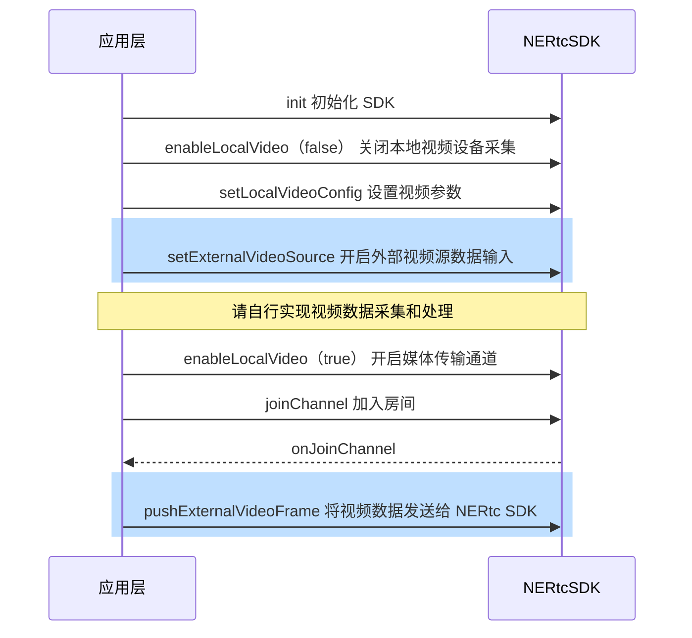

<!--keywords:自定义视频采集,自定义音频渲染,外部视频输入-->

NERTC SDK 提供自定义视频采集功能，帮助您向 NERTC SDK 提供自定义的视频输入源数据（外部视频输入），并由 NERTC  SDK 进行编码推流。本文档为您介绍如何通过 <a href="https://doc.yunxin.163.com/nertc/api-refer/android/doxygen/Latest/zh/html/classcom_1_1netease_1_1lava_1_1nertc_1_1sdk_1_1_n_e_rtc_ex.html#a0b6f78498f4dfa59697af30679130f02" target="_blank">`setExternalVideoSource`</a> 和 <a href="https://doc.yunxin.163.com/nertc/api-refer/android/doxygen/Latest/zh/html/classcom_1_1netease_1_1lava_1_1nertc_1_1sdk_1_1_n_e_rtc_ex.html#a17b9103fc32185304dd742663620c2d5" target="_blank">`pushExternalVideoFrame`</a> 方法实现自定义视频采集功能。

## <span id="功能描述">功能描述</span>

一般情况下，App 采用默认设备采集视频数据，通常是本设备的摄像头模块。但在部分场景下可能需要使用自定义的视频源，例如：

- 由第三方美颜 SDK 负责视频数据采集和视频数据的前处理，NERTC 负责视频数据编码和云端推流。
- 某些视频采集设备被系统独占。为避免与其它业务产生冲突，需要灵活的设备管理策略。例如，直播过程中需要录制短视频。
- 需要使用外部视频源，例如播放本地视频文件、屏幕共享、游戏直播等。

基于以上场景，NERTC SDK 支持使用自定义的视频源，以实现您在实际业务场景中的相关需求。

V5.3.0 及之后版本，子房间支持调用 `NERtcChannel#setExternalVideoSource` 和 `NERtcChannel#pushExternalVideoFrame` 设置外部视频输入。
## 技术原理

NERTC SDK 目前提供 Push 数据源的方式实现自定义的视频源。外部视频输入的场景中，NERTC SDK 会根据 <a href="https://doc.yunxin.163.com/nertc/api-refer/android/doxygen/Latest/zh/html/classcom_1_1netease_1_1lava_1_1nertc_1_1sdk_1_1_n_e_rtc.html#ac0ae5d451a01fe2510d1c21e909c247a" target="_blank">`setLocalVideoConfig`</a>中设置的`profile`或 `height` / `width` 值，调整画面比例，并对数据源进行裁剪或缩放。视频的帧率由数据源自身控制。

在 Push 模式下进行视频源自定义时，视频数据的传输过程如下图所示。


## <span id="注意事项">注意事项</span>

- 自定义视频采集场景中，您需要自行实现视频数据的采集和处理。

- 若您需要开启外部视频采集，建议在创建外部视频输入源之前调用 <a href="https://doc.yunxin.163.com/nertc/api-refer/android/doxygen/Latest/zh/html/classcom_1_1netease_1_1lava_1_1nertc_1_1sdk_1_1_n_e_rtc.html#ad5c6e217dacfc20546617d98e3b5ba9b" target="_blank">`enableLocalVideo`</a> 方法关闭本地视频设备采集（若未打开则无需关心），再在创建外部视频输入源之后再次调用 <a href="https://doc.yunxin.163.com/nertc/api-refer/android/doxygen/Latest/zh/html/classcom_1_1netease_1_1lava_1_1nertc_1_1sdk_1_1_n_e_rtc.html#ad5c6e217dacfc20546617d98e3b5ba9b" target="_blank">`enableLocalVideo`</a> 方法开启媒体传输通道。
- 请先开启外部视频输入（<a href="https://doc.yunxin.163.com/nertc/api-refer/android/doxygen/Latest/zh/html/classcom_1_1netease_1_1lava_1_1nertc_1_1sdk_1_1_n_e_rtc_ex.html#a0b6f78498f4dfa59697af30679130f02" target="_blank">`setExternalVideoSource`</a>），再开启本地视频预览（[NERtc#startVideoPreview](https://doc.yunxin.163.com/docs/interface/NERTC_SDK/Latest/Android/html/classcom_1_1netease_1_1lava_1_1nertc_1_1sdk_1_1_n_e_rtc.html#afbf7f0de6fdd33a63d9f8bb60031e5f8) ）或开启媒体传输通道（<a href="https://doc.yunxin.163.com/nertc/api-refer/android/doxygen/Latest/zh/html/classcom_1_1netease_1_1lava_1_1nertc_1_1sdk_1_1_n_e_rtc.html#ad5c6e217dacfc20546617d98e3b5ba9b" target="_blank">`enableLocalVideo`</a> ）。
- 当外部视频源输入作为主流或辅流时，内部引擎为启用状态，在切换房间（switchChannel）、主动离开房间（leaveChannel）、断网重连失败（onDisconnect）或重新加入房间（onReJoinChannel）后仍然有效。如果需要关闭该功能，请在下次通话前调用接口关闭该功能。

- 视频主流和辅流通道分别只能传输一个视频输入源，例如：
    - 若您已经开启了屏幕共享（使用辅流通道），则外部输入的视频源只能使用主流通道。
    - 若您在 <a href="https://doc.yunxin.163.com/nertc/api-refer/android/doxygen/Latest/zh/html/classcom_1_1netease_1_1lava_1_1nertc_1_1sdk_1_1_n_e_rtc.html#ad5c6e217dacfc20546617d98e3b5ba9b" target="_blank">`enableLocalVideo`</a> 中已通过主流传输本设备的摄像头数据，则外部输入的视频源只能使用辅流通道。


## <span id="实现方法">实现方法</span>

### **API 调用时序**



  


### **配置步骤**

参考如下步骤，在您的项目中通过 Push 方式实现自定义视频源功能：
1. 关闭本地视频设备采集。

    调用 <a href="https://doc.yunxin.163.com/nertc/api-refer/android/doxygen/Latest/zh/html/classcom_1_1netease_1_1lava_1_1nertc_1_1sdk_1_1_n_e_rtc.html#ad5c6e217dacfc20546617d98e3b5ba9b" target="_blank">`enableLocalVideo`</a> 方法，设置 `enable` 参数为 `false`，并设置 `streamType` 为 `kNERtcVideoStreamTypeMain`（主流） 或 `kNERtcVideoStreamTypeSub`（辅流）。
2. 设置基本的视频参数。

    调用<a href="https://doc.yunxin.163.com/nertc/api-refer/android/doxygen/Latest/zh/html/classcom_1_1netease_1_1lava_1_1nertc_1_1sdk_1_1_n_e_rtc.html#ac0ae5d451a01fe2510d1c21e909c247a" target="_blank">`setLocalVideoConfig`</a> 方法，设置基本的视频参数，**特别是 `width`、`height`、`frameRate` 三个重要参数，要与真实的外部输入一致，否则会影响视频质量。**

3. 开启外部视频源数据输入。

    调用 <a href="https://doc.yunxin.163.com/nertc/api-refer/android/doxygen/Latest/zh/html/classcom_1_1netease_1_1lava_1_1nertc_1_1sdk_1_1_n_e_rtc_ex.html#a0b6f78498f4dfa59697af30679130f02" target="_blank">`setExternalVideoSource`</a> 方法，设置 `enable` 参数为 `true`，并设置 `streamType` 为 `kNERtcVideoStreamTypeMain`（主流） 或 `kNERtcVideoStreamTypeSub`（辅流）。

4. 开启媒体传输通道。

    调用 <a href="https://doc.yunxin.163.com/nertc/api-refer/android/doxygen/Latest/zh/html/classcom_1_1netease_1_1lava_1_1nertc_1_1sdk_1_1_n_e_rtc.html#ad5c6e217dacfc20546617d98e3b5ba9b" target="_blank">`enableLocalVideo`</a> 方法，设置 `enable` 参数为 `true`，并设置 `streamType` 为 `kNERtcVideoStreamTypeMain`（主流） 或 `kNERtcVideoStreamTypeSub`（辅流）。

5. 指定外部采集设备后，您需要自行实现视频数据采集和处理，具体实现方法请参考 [ExternalVideo 示例项目源码](https://github.com/netease-im/Advanced-Video/tree/master/ExternalVideo/ExternalVideo-Android-Java)。

6. （可选）设置视频旋转方向。

    当设备方向变化后，您可以通过如下方式实现横竖屏切换：
    
    
    在将视频数据发送给 NERTC SDK 前，通过 <a href="https://doc.yunxin.163.com/nertc/api-refer/android/doxygen/Latest/zh/html/classcom_1_1netease_1_1lava_1_1nertc_1_1sdk_1_1video_1_1_n_e_rtc_video_frame.html">NERtcVideoFrame</a> 设置视频的方向。例如，设置 `rotation` 为 90，使视频帧顺时针旋转 90 度。

7. 将外部视频帧的数据发送给 NERTC SDK。

    完成视频数据处理后，调用 <a href="https://doc.yunxin.163.com/nertc/api-refer/android/doxygen/Latest/zh/html/classcom_1_1netease_1_1lava_1_1nertc_1_1sdk_1_1_n_e_rtc_ex.html#a17b9103fc32185304dd742663620c2d5" target="_blank">`pushExternalVideoFrame`</a> 方法将视频数据发送给 NERTC SDK 进行后续操作；调用此方法时，您需要通过 `frame` 参数传入外部视频帧的数据信息，并设置 `streamType` 为 `kNERtcVideoStreamTypeMain`（主流） 或 `kNERtcVideoStreamTypeSub`（辅流）。
    ::: note note
    - <a href="https://doc.yunxin.163.com/nertc/api-refer/android/doxygen/Latest/zh/html/classcom_1_1netease_1_1lava_1_1nertc_1_1sdk_1_1_n_e_rtc.html#ac0ae5d451a01fe2510d1c21e909c247a" target="_blank">`setLocalVideoConfig`</a>、<a href="https://doc.yunxin.163.com/nertc/api-refer/android/doxygen/Latest/zh/html/classcom_1_1netease_1_1lava_1_1nertc_1_1sdk_1_1_n_e_rtc_ex.html#a0b6f78498f4dfa59697af30679130f02" target="_blank">`setExternalVideoSource`</a> 、<a href="https://doc.yunxin.163.com/nertc/api-refer/android/doxygen/Latest/zh/html/classcom_1_1netease_1_1lava_1_1nertc_1_1sdk_1_1_n_e_rtc.html#ad5c6e217dacfc20546617d98e3b5ba9b" target="_blank">`enableLocalVideo`</a> 和 <a href="https://doc.yunxin.163.com/nertc/api-refer/android/doxygen/Latest/zh/html/classcom_1_1netease_1_1lava_1_1nertc_1_1sdk_1_1_n_e_rtc_ex.html#a17b9103fc32185304dd742663620c2d5" target="_blank">`pushExternalVideoFrame`</a> 4 个接口中设置的视频通道 `streamType` 必须一致，同为主流或辅流，否则 NERTC SDK 会报错。
    
    - <a href="https://doc.yunxin.163.com/nertc/api-refer/android/doxygen/Latest/zh/html/classcom_1_1netease_1_1lava_1_1nertc_1_1sdk_1_1video_1_1_n_e_rtc_video_frame.html">NERtcVideoFrame</a>中的 `width`、`height`、`format` 三个参数的值，要与外部输入的视频的实际值保持一致，否则会影响视频质量。
    - 如果使用的分辨率太高，可能会影响计费，请根据场景，合理使用 <a href="https://doc.yunxin.163.com/nertc/api-refer/android/doxygen/Latest/zh/html/classcom_1_1netease_1_1lava_1_1nertc_1_1sdk_1_1video_1_1_n_e_rtc_video_frame.html">NERtcVideoFrame</a>中的 `height` 和 `width` 值。典型场景的推荐参数请参见[音视频参数配置推荐](https://doc.yunxin.163.com/nertc/guide/DY5Njk1OTc?platform=iOS)。
    - 如果您需要实现加入房间前预留自定义视频，请在 `startVideoPreview`之后，调用 `pushExternalVideoFrame` 接口。
    :::

## 示例项目源码

网易云信提供 [自定义视频采集的示例项目源码 ExternalVideoShare](https://github.com/netease-im/G2-API-Examples/tree/main/android/Advance/ExternalVideoShare)，您可以参考该源码实现自定义视频采集。


## <span id="示例代码">示例代码</span>

```java
     //以开启主流外部视频输入为例

        //1. 先关闭之前的视频主流
        NERtcEx.getInstance().enableLocalVideo(kNERtcVideoStreamTypeMain,false);

        //2. 设置视频参数
        NERtcVideoConfig videoConfig  = new NERtcVideoConfig();
        videoConfig.width = sourceWidth;//1280
        videoConfig.height = sourceHeight;//720
        videoConfig.frameRate = NERtcEncodeConfig.NERtcVideoFrameRate.FRAME_RATE_FPS_15;
        NERtcEx.getInstance().setLocalVideoConfig(videoConfig,kNERtcVideoStreamTypeMain);

        //3. 开启外部视频源数据输入
        NERtcEx.getInstance().setExternalVideoSource(kNERtcVideoStreamTypeMain,true);


        //4. 开启媒体传输通道
        NERtcEx.getInstance().enableLocalVideo(kNERtcVideoStreamTypeMain,true);

        //5. 在合适线程将外部视频帧的数据发送给 NERTC SDK ， 尽量保证数据推送的稳定性，不要忽慢忽快
        NERtcVideoFrame frame = new NERtcVideoFrame();
        frame.data = xxx;
        frame.width = sourceWidth;//1280
        frame.height = sourceHeight;//720
        frame.format = NERtcVideoFrame.Format.I420;//以I420 为例子，请填写真实数据类型
        frame.rotation = 0 ;
        NERtcEx.getInstance().pushExternalVideoFrame(kNERtcVideoStreamTypeMain,frame);
```

## API 参考
| **方法** | **功能描述**|
|:--|:--|
|<a href="https://doc.yunxin.163.com/nertc/api-refer/android/doxygen/Latest/zh/html/classcom_1_1netease_1_1lava_1_1nertc_1_1sdk_1_1_n_e_rtc.html#ad5c6e217dacfc20546617d98e3b5ba9b" target="_blank">`enableLocalVideo`</a>|开启或关闭媒体传输通道|

|<a href="https://doc.yunxin.163.com/nertc/api-refer/android/doxygen/Latest/zh/html/classcom_1_1netease_1_1lava_1_1nertc_1_1sdk_1_1_n_e_rtc.html#ac0ae5d451a01fe2510d1c21e909c247a" target="_blank">`setLocalVideoConfig`</a> |设置视频参数|

|<a href="https://doc.yunxin.163.com/nertc/api-refer/android/doxygen/Latest/zh/html/classcom_1_1netease_1_1lava_1_1nertc_1_1sdk_1_1_n_e_rtc_ex.html#a0b6f78498f4dfa59697af30679130f02" target="_blank">`setExternalVideoSource`</a> |开启外部视频源数据输入|
|<a href="https://doc.yunxin.163.com/nertc/api-refer/android/doxygen/Latest/zh/html/classcom_1_1netease_1_1lava_1_1nertc_1_1sdk_1_1_n_e_rtc_ex.html#a17b9103fc32185304dd742663620c2d5" target="_blank">`pushExternalVideoFrame`</a> |推送外部视频数据帧|

## 常见问题

- **自定义视频源支持哪些数据格式？**

    自定义视频源的数据格式支持 I420、NV21、RGBA、TEXTURE_OES 和 TEXTURE_RGB。


- **自定义视频采集的分辨率和`setLocalVideoConfig`中设置的视频分辨率不一致时，以哪个分辨率为准？**

    当<a href="https://doc.yunxin.163.com/nertc/api-refer/android/doxygen/Latest/zh/html/classcom_1_1netease_1_1lava_1_1nertc_1_1sdk_1_1_n_e_rtc_ex.html#a17b9103fc32185304dd742663620c2d5" target="_blank">`pushExternalVideoFrame`</a>  输入的视频分辨率和 [`setLocalVideoConfig`](https://doc.yunxin.163.com/nertc/api-refer/android/doxygen/Latest/zh/html/classcom_1_1netease_1_1lava_1_1nertc_1_1sdk_1_1_n_e_rtc.html#ac0ae5d451a01fe2510d1c21e909c247a) 中设置的分辨率、画布比例不一致时，例如`pushExternalVideoFrame`的分辨率为640 x 480（4：3）、`setLocalVideoConfig`的分辨率为1280 x 720（16：9），NERTC SDK 的推流视频处理逻辑如下：
    1. 画布比例采用 [`setLocalVideoConfig`](https://doc.yunxin.163.com/nertc/api-refer/android/doxygen/Latest/zh/html/classcom_1_1netease_1_1lava_1_1nertc_1_1sdk_1_1_n_e_rtc.html#ac0ae5d451a01fe2510d1c21e909c247a) 中设置的画布比例，本示例中为 16：9。
    2. 将自定义视频采集的分辨率（本示例中为 640 x 480）按照[`setLocalVideoConfig`](https://doc.yunxin.163.com/nertc/api-refer/android/doxygen/Latest/zh/html/classcom_1_1netease_1_1lava_1_1nertc_1_1sdk_1_1_n_e_rtc.html#ac0ae5d451a01fe2510d1c21e909c247a) 中设置的画布比例（本示例中为 16：9）进行裁剪，得到一个新的分辨率（640 x 360）。
    3. 根据上一步得到的新分辨率和[`setLocalVideoConfig`](https://doc.yunxin.163.com/nertc/api-refer/android/doxygen/Latest/zh/html/classcom_1_1netease_1_1lava_1_1nertc_1_1sdk_1_1_n_e_rtc.html#ac0ae5d451a01fe2510d1c21e909c247a) 中的分辨率，取两者中较小的分辨率作为推流分辨率。因此，本示例中最终的视频分辨率为 640 x 360。
  