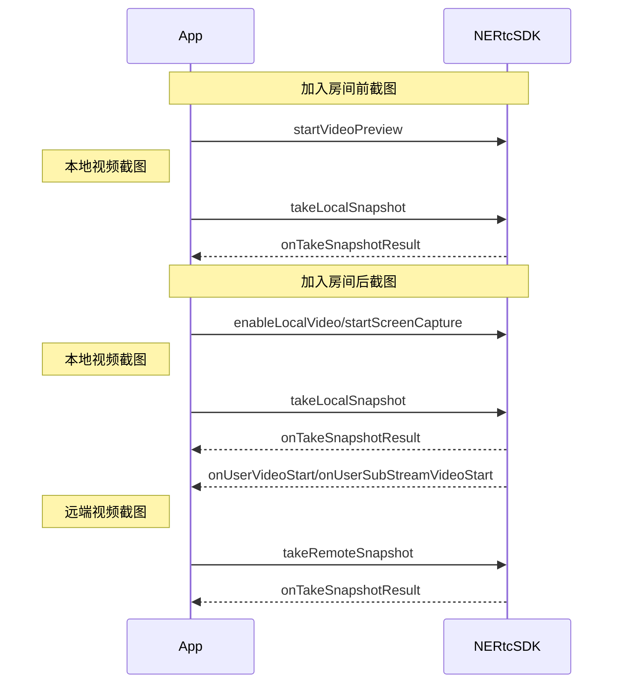

<!--keywords:音视频通话,视频截图-->

在音视频通话场景中，部分用户希望可以通过视频截图功能截取实时视频流画面，以便后续的存档分析、事件备忘、证据留存等等。NERTC SDK 提供视频截图功能，本文为您介绍如何通过 <a href="https://doc.yunxin.163.com/nertc/api-refer/android/doxygen/Latest/zh/html/classcom_1_1netease_1_1lava_1_1nertc_1_1sdk_1_1_n_e_rtc_ex.html#afc29ad8c9cd348258158363315ddaecf" target="_blank">`takeLocalSnapshot`</a> 和 <a href="https://doc.yunxin.163.com/nertc/api-refer/android/doxygen/Latest/zh/html/classcom_1_1netease_1_1lava_1_1nertc_1_1sdk_1_1_n_e_rtc_ex.html#a2302b9bdcedb445e469bbc146e771b30" target="_blank">`takeRemoteSnapshot`</a> 方法进行实时截图。

## 功能介绍

NERTC SDK 支持针对实时视频流进行截图，包括本地主流和辅流画面、远端主流和辅流画面。
<br>视频截图适用于在线教育以及主播直播等场景中，具体场景说明如下：
- 在线课堂场景中，学生对课件或板书内容进行截图，截图作为笔记保存。
- 互动直播场景中，可以通过截图对直播画面进行内容安全审核。

## 注意事项

- 视频截图功能只截取实时视频流数据，截图中 **不包含画布水印** 信息，但可以<b>包含 <a href="/docs/jcyOTA0ODM/zM5OTkzMDA" target="_blank">编码水印</a></b>信息。
- 截图相关接口调用时机如下，如果在其他时机调用截图相关接口，会报错 `ERR_INVALID_OPERATION`，表示当前不支持该操作。

## API 调用时序



## 配置步骤

1. 根据需求调用截图相关接口，实现视频流截图。

- 本地视频主流截图：

    - 加入房间前，在调用 <a href="https://doc.yunxin.163.com/nertc/api-refer/android/doxygen/Latest/zh/html/classcom_1_1netease_1_1lava_1_1nertc_1_1sdk_1_1_n_e_rtc.html#ad5c6e217dacfc20546617d98e3b5ba9b" target="_blank">`startVideoPreview(kNERtcVideoStreamTypeMain)`</a> 方法开启视频预览后，调用 <a href="https://doc.yunxin.163.com/nertc/api-refer/android/doxygen/Latest/zh/html/classcom_1_1netease_1_1lava_1_1nertc_1_1sdk_1_1_n_e_rtc_ex.html#afc29ad8c9cd348258158363315ddaecf" target="_blank">`takeLocalSnapshot`</a> 方法，并设置 `NERtcVideoStreamType` 为 `kNERTCVideoStreamMain` 截取本地主流画面。

    - 加入房间后，在调用 <a href="https://doc.yunxin.163.com/nertc/api-refer/android/doxygen/Latest/zh/html/classcom_1_1netease_1_1lava_1_1nertc_1_1sdk_1_1_n_e_rtc.html#ad5c6e217dacfc20546617d98e3b5ba9b" target="_blank">`enableLocalVideo(kNERtcVideoStreamTypeMain)`</a> 开启本地摄像头采集后，调用 <a href="https://doc.yunxin.163.com/nertc/api-refer/android/doxygen/Latest/zh/html/classcom_1_1netease_1_1lava_1_1nertc_1_1sdk_1_1_n_e_rtc_ex.html#afc29ad8c9cd348258158363315ddaecf" target="_blank">`takeLocalSnapshot`</a> 方法，并设置 `NERtcVideoStreamType` 为 `kNERTCVideoStreamMain` 截取本地主流画面。

- 本地视频辅流截图：

    - 加入房间前，在调用 <a href="https://doc.yunxin.163.com/nertc/api-refer/android/doxygen/Latest/zh/html/classcom_1_1netease_1_1lava_1_1nertc_1_1sdk_1_1_n_e_rtc.html#afbf7f0de6fdd33a63d9f8bb60031e5f8" target="_blank">`startVideoPreview(kNERTCVideoStreamSub)`</a> 方法开启视频预览后，调用 <a href="https://doc.yunxin.163.com/nertc/api-refer/android/doxygen/Latest/zh/html/classcom_1_1netease_1_1lava_1_1nertc_1_1sdk_1_1_n_e_rtc_ex.html#afc29ad8c9cd348258158363315ddaecf" target="_blank">`takeLocalSnapshot`</a> 方法，并设置 `NERtcVideoStreamType` 为 `kNERtcVideoStreamTypeSub` 截取本地辅流画面。

    - 加入房间后，在调用 <a href="https://doc.yunxin.163.com/nertc/api-refer/android/doxygen/Latest/zh/html/classcom_1_1netease_1_1lava_1_1nertc_1_1sdk_1_1_n_e_rtc.html#ad5c6e217dacfc20546617d98e3b5ba9b" target="_blank">`enableLocalVideo(kNERTCVideoStreamSub)`</a> 开启本地摄像头采集后，调用 <a href="https://doc.yunxin.163.com/nertc/api-refer/android/doxygen/Latest/zh/html/classcom_1_1netease_1_1lava_1_1nertc_1_1sdk_1_1_n_e_rtc_ex.html#afc29ad8c9cd348258158363315ddaecf" target="_blank">`takeLocalSnapshot`</a> 方法，并设置 `NERtcVideoStreamType` 为 `kNERtcVideoStreamTypeSub` 截取本地辅流画面。

    - 加入房间后，在调用 <a href="https://doc.yunxin.163.com/nertc/api-refer/android/doxygen/Latest/zh/html/classcom_1_1netease_1_1lava_1_1nertc_1_1sdk_1_1_n_e_rtc_ex.html#a39898aeaa3451d08e02466305a2e5a13" target="_blank">`startScreenCapture`</a> 方法启用屏幕共享后，调用 <a href="https://doc.yunxin.163.com/nertc/api-refer/android/doxygen/Latest/zh/html/classcom_1_1netease_1_1lava_1_1nertc_1_1sdk_1_1_n_e_rtc_ex.html#afc29ad8c9cd348258158363315ddaecf" target="_blank">`takeLocalSnapshot`</a> 方法，并设置 `NERtcVideoStreamType` 为 `kNERtcVideoStreamTypeSub` 截取本地辅流画面。

- 远端视频主/辅流截图：

    在分别收到 <a href="https://doc.yunxin.163.com/nertc/api-refer/android/doxygen/Latest/zh/html/interfacecom_1_1netease_1_1lava_1_1nertc_1_1sdk_1_1_n_e_rtc_callback.html#a3bb52968ab05a708cee947a0bec33873" target="_blank">`onUserVideoStart`</a> 与 <a href="https://doc.yunxin.163.com/nertc/api-refer/android/doxygen/Latest/zh/html/interfacecom_1_1netease_1_1lava_1_1nertc_1_1sdk_1_1channel_1_1_n_e_rtc_channel_callback.html#ab6fe91bb11e601e6f33bd631efbb1ce5" target="_blank">`onUserSubStreamVideoStart`</a> 回调后，调用 <a href="https://doc.yunxin.163.com/nertc/api-refer/android/doxygen/Latest/zh/html/classcom_1_1netease_1_1lava_1_1nertc_1_1sdk_1_1_n_e_rtc_ex.html#a2302b9bdcedb445e469bbc146e771b30" target="_blank">`takeRemoteSnapshot`</a> 方法截取远端视频流画面，截图时可以通过 `NERtcVideoStreamType` 指定截取的视频流是主流还是辅流。

2. 通过回调的方式获取截图文件。

    截图画面数据以 Bitmap 形式通过 `NERtcTakeSnapshotCallback`</a> 类的 <a href="https://doc.yunxin.163.com/nertc/api-refer/android/doxygen/Latest/zh/html/interfacecom_1_1netease_1_1lava_1_1nertc_1_1sdk_1_1video_1_1_n_e_rtc_take_snapshot_callback.html#af57dea2ab3242916fd7c1d1e3fe98b30" target="_blank">`onTakeSnapshotResult`</a> 回调返回。

## Demo 源码

网易云信在 GitHub 上提供了 [视频截图的示例项目源码 SnapshotWatermark](https://github.com/netease-im/G2-API-Examples/tree/main/android/Advance/SnapshotWatermark)，您可以参考该源码实现视频截图。

## 示例代码

```Java
//本地截图
NERtcEx.getInstance().takeLocalSnapshot(NERtcVideoStreamType.kNERtcVideoStreamTypeMain,
        new NERtcTakeSnapshotCallback() {
            @Override
            public void onTakeSnapshotResult(int errorCode, Bitmap image) {
                if(image == null) {
                    showToast("本地主流截图失败");
                } else {
                    showToast("本地主流截图成功");
                    saveBitmapToJpeg(user.userId,NERtcVideoStreamType.kNERtcVideoStreamTypeMain,image);
                }
            }
        });

//远端截图
NERtcEx.getInstance().takeRemoteSnapshot(user.userId, NERtcVideoStreamType.kNERtcVideoStreamTypeMain,
        new NERtcTakeSnapshotCallback() {
    @Override
    public void onTakeSnapshotResult(int errorCode, Bitmap image) {
        if(image == null) {
            showToast("远端主流截图失败 uid: " + user.userId);
        } else {
            showToast("远端主流截图成功 uid: " + user.userId);
            saveBitmapToJpeg(user.userId,NERtcVideoStreamType.kNERtcVideoStreamTypeMain,image);
        }
    }
});
```

### API 参考

| **方法** | **功能描述** |
| :-- | :-- |
| <a href="https://doc.yunxin.163.com/nertc/api-refer/android/doxygen/Latest/zh/html/classcom_1_1netease_1_1lava_1_1nertc_1_1sdk_1_1_n_e_rtc.html#ad5c6e217dacfc20546617d98e3b5ba9b" target="_blank">`enableLocalVideo`</a> | 开启或关闭本地视频采集。 |
| <a href="https://doc.yunxin.163.com/nertc/api-refer/android/doxygen/Latest/zh/html/classcom_1_1netease_1_1lava_1_1nertc_1_1sdk_1_1_n_e_rtc_ex.html#afc29ad8c9cd348258158363315ddaecf" target="_blank">`takeLocalSnapshot`</a> | 截取本地视频流画面 |
| <a href="https://doc.yunxin.163.com/nertc/api-refer/android/doxygen/Latest/zh/html/classcom_1_1netease_1_1lava_1_1nertc_1_1sdk_1_1_n_e_rtc_ex.html#a2302b9bdcedb445e469bbc146e771b30" target="_blank">`takeRemoteSnapshot`</a> | 截取远端视频流画面 |
| <a href="https://doc.yunxin.163.com/nertc/api-refer/android/doxygen/Latest/zh/html/interfacecom_1_1netease_1_1lava_1_1nertc_1_1sdk_1_1video_1_1_n_e_rtc_take_snapshot_callback.html#af57dea2ab3242916fd7c1d1e3fe98b30" target="_blank">`onTakeSnapshotResult`</a> | 截图结果回调 |