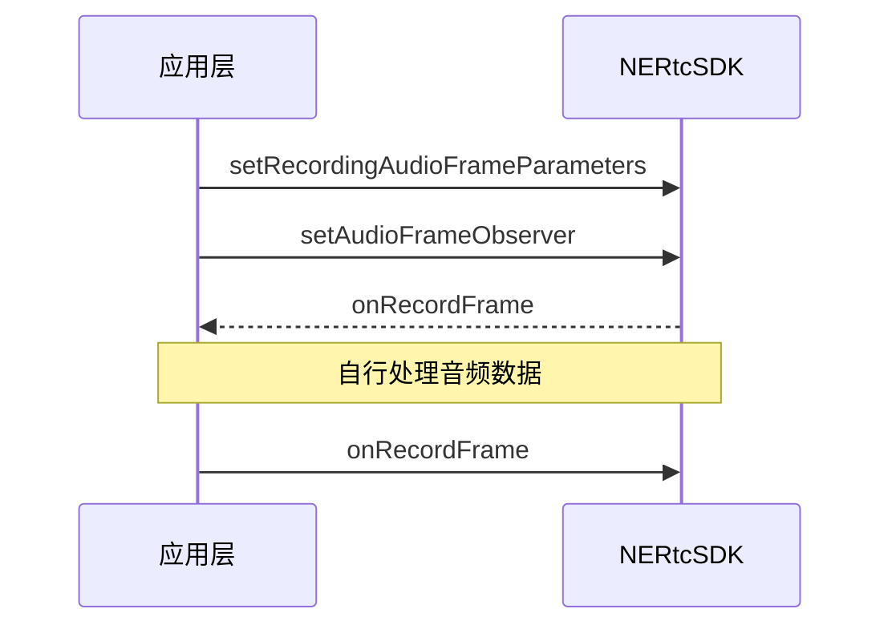

NERTC SDK 的音频模块会严格控制声音设备的采集和播放逻辑，同时支持对采集到的音视频原始数据进行自定义的前处理和后处理，获取想要的播放效果。适用于非标设备接入、自定义音频效果、语音处理、语音识别等场景。

- 前处理：在音频数据发送到编码器前获取原始的音频数据进行修改，主要针对本地麦克风采集到的音频数据或自定义外部音频流。
- 后处理：即在音频数据发送给解码器后获取原始的音频数据进行修改，主要针对接收到的远端用户音频数据。

NERTC SDK 通过提供 `NERtcAudioFrameObserver` 类，实现采集、修改原始音频数据功能。

## 前提条件

在使用原始数据处理功能前，请确保您已在项目中实现基本的实时音视频功能。

## <span id="Android注意事项">注意事项</span>

- 采集回调 <a href="https://doc.yunxin.163.com/nertc/api-refer/android/doxygen/Latest/zh/html/interfacecom_1_1netease_1_1lava_1_1nertc_1_1sdk_1_1audio_1_1_n_e_rtc_audio_frame_observer.html#ae33fb87300fb3664daa5e41929fd468f" target="_blank">`onRecordFrame`</a>、播放回调 <a href="https://doc.yunxin.163.com/nertc/api-refer/android/doxygen/Latest/zh/html/interfacecom_1_1netease_1_1lava_1_1nertc_1_1sdk_1_1audio_1_1_n_e_rtc_audio_frame_observer.html#a1b8a08aa23814c0b4d42550d44dc05fe" target="_blank">`onPlaybackFrame`</a> 中的原始音频数据可进行处理，例如美声变声。
- 混音回调 <a href="https://doc.yunxin.163.com/nertc/api-refer/android/doxygen/Latest/zh/html/interfacecom_1_1netease_1_1lava_1_1nertc_1_1sdk_1_1audio_1_1_n_e_rtc_audio_frame_observer.html#ae1b6429f555bf35d31683fadb9f820bf" target="_blank">`onMixedAudioFrame`</a> 和某一用户的播放回调 <a href="https://doc.yunxin.163.com/nertc/api-refer/android/doxygen/Latest/zh/html/interfacecom_1_1netease_1_1lava_1_1nertc_1_1sdk_1_1audio_1_1_n_e_rtc_audio_frame_observer.html#adcabc16a28b2fb94e33f0be439fc87da" target="_blank">`onPlaybackAudioFrameBeforeMixingWithUserID`</a> 中的原始音频数据不能进行处理。

## 技术原理


## <span id="Android实现方法">实现方法</span>

### **API 调用时序**

以实现修改采集音频的音频数据为例，API 调用时序如下图所示。



  

### **配置步骤**

1. 设置回调的音频采样率。

    - 调用 <a href="https://doc.yunxin.163.com/nertc/api-refer/android/doxygen/Latest/zh/html/classcom_1_1netease_1_1lava_1_1nertc_1_1sdk_1_1_n_e_rtc_ex.html#a76f615a5af2439576915b13c666ba13a" target="_blank">`setRecordingAudioFrameParameters`</a> 方法修改回调的采集音频采样率，并将回调的音频数据设置为只读模式或读写模式。
    - 调用 <a href="https://doc.yunxin.163.com/nertc/api-refer/android/doxygen/Latest/zh/html/classcom_1_1netease_1_1lava_1_1nertc_1_1sdk_1_1_n_e_rtc_ex.html#a97dd67a85b016e5d87a94e7e85ab432c" target="_blank">`setPlaybackAudioFrameParameters`</a> 方法修改回调的播放音频采样率，并将回调的音频数据设置为只读模式或读写模式。
    - 调用 <a href="https://doc.yunxin.163.com/nertc/api-refer/android/doxygen/Latest/zh/html/classcom_1_1netease_1_1lava_1_1nertc_1_1sdk_1_1_n_e_rtc_ex.html#a67d97a3490c7f1a8893bdc0146df38b9" target="_blank">`setMixedAudioFrameParameters`</a> 方法，设置 <a href="https://doc.yunxin.163.com/nertc/api-refer/android/doxygen/Latest/zh/html/interfacecom_1_1netease_1_1lava_1_1nertc_1_1sdk_1_1audio_1_1_n_e_rtc_audio_frame_observer.html#ae1b6429f555bf35d31683fadb9f820bf" target="_blank">`onMixedAudioFrame`</a> 回调中的混音音频采样率。

2. 调用 <a href="https://doc.yunxin.163.com/nertc/api-refer/android/doxygen/Latest/zh/html/classcom_1_1netease_1_1lava_1_1nertc_1_1sdk_1_1_n_e_rtc_ex.html#aecd7e521e88fe84970a7ed0217ea5240" target="_blank">`setAudioFrameObserver`</a> 方法注册语音观测器，并在该方法中实现一个 `NERtcEngineAudioFrameObserver` 类。

3. SDK 返回回调。
    - SDK 收到输入的采集数据和播放的音频数据时，返回 <a href="https://doc.yunxin.163.com/nertc/api-refer/android/doxygen/Latest/zh/html/interfacecom_1_1netease_1_1lava_1_1nertc_1_1sdk_1_1audio_1_1_n_e_rtc_audio_frame_observer.html#ae33fb87300fb3664daa5e41929fd468f" target="_blank">`onRecordFrame`</a> 和 <a href="https://doc.yunxin.163.com/nertc/api-refer/android/doxygen/Latest/zh/html/interfacecom_1_1netease_1_1lava_1_1nertc_1_1sdk_1_1audio_1_1_n_e_rtc_audio_frame_observer.html#a1b8a08aa23814c0b4d42550d44dc05fe" target="_blank">`onPlaybackFrame`</a> 回调。
    - SDK 收到音频采集与播放混合后数据帧时，返回 <a href="https://doc.yunxin.163.com/nertc/api-refer/android/doxygen/Latest/zh/html/interfacecom_1_1netease_1_1lava_1_1nertc_1_1sdk_1_1audio_1_1_n_e_rtc_audio_frame_observer.html#a1b8a08aa23814c0b4d42550d44dc05fe" target="_blank">`onMixedAudioFrame`</a> 回调；SDK 收到某一远端用户播放的音频数据时，返回 <a href="https://doc.yunxin.163.com/nertc/api-refer/android/doxygen/Latest/zh/html/interfacecom_1_1netease_1_1lava_1_1nertc_1_1sdk_1_1audio_1_1_n_e_rtc_audio_frame_observer.html#adcabc16a28b2fb94e33f0be439fc87da" target="_blank">`onPlaybackAudioFrameBeforeMixingWithUserID`</a> 回调。
4. 用户拿到音频数据后，需要根据场景自行进行处理。
5. 完成音频数据处理后，您可以直接进行自播放，或根据场景需求再通过 <a href="https://doc.yunxin.163.com/nertc/api-refer/android/doxygen/Latest/zh/html/interfacecom_1_1netease_1_1lava_1_1nertc_1_1sdk_1_1audio_1_1_n_e_rtc_audio_frame_observer.html#ae33fb87300fb3664daa5e41929fd468f" target="_blank">`onRecordFrame`</a> 和 <a href="https://doc.yunxin.163.com/nertc/api-refer/android/doxygen/Latest/zh/html/interfacecom_1_1netease_1_1lava_1_1nertc_1_1sdk_1_1audio_1_1_n_e_rtc_audio_frame_observer.html#a1b8a08aa23814c0b4d42550d44dc05fe" target="_blank">`onPlaybackFrame`</a> 回调发送给 SDK。

### 示例项目源码
网易云信提供[原始音频数据的示例项目源码 RawAudioCallback ](https://github.com/netease-im/G2-API-Examples/tree/main/android/AudioCapability/RawAudioCallback)，您可以参考该源码实现采集和修改原始音频数据。

### <span id="Android示例代码">**示例代码**</span>
```
///设置音频回调参数
NERtcAudioFrameRequestFormat formatMix = new NERtcAudioFrameRequestFormat();
    formatMix.setChannels(channel);
    formatMix.setSampleRate(sampleRate);
    formatMix.setOpMode(readOnly.isChecked() ? NERtcAudioFrameOpMode.kNERtcAudioFrameOpModeReadOnly : NERtcAudioFrameOpMode.kNERtcAudioFrameOpModeReadWrite);
    Log.i(TAG, "AudioCallback ,channel: "+formatMix.getChannels()+ " Mixed Sample:" + formatMix.getSampleRate() + " ReadWrite:" + formatMix.getOpMode());
NERtcEx.getInstance().setMixedAudioFrameParameters(formatMix);
NERtcEx.getInstance().setPlaybackAudioFrameParameters(formatMix);
NERtcEx.getInstance().setRecordingAudioFrameParameters(formatMix);
NERtcEx.getInstance().setAudioFrameObserver(observer);

///音频数据回调处理
observer = new NERtcAudioFrameObserver() {
            @Override
            public void onRecordFrame(NERtcAudioFrame audioFrame) {
                try {
                    if(!isAudioCallbackDump){
                        return;
                    }
                    if (pcmCallbackRecordDump == null) {
                        pcmCallbackRecordDump = createPCMDump("Record_" +audioFrame.getFormat().getChannels()
                                +"_"+ audioFrame.getFormat().getSampleRate());

                        if(pcmCallbackMixDump == null) {
                            Log.e(TAG, "create dump file failed!");
                            return;
                        }
                    }

                    byte[] remaining = new byte[audioFrame.getData().remaining()];
                    audioFrame.getData().get(remaining);
                    pcmCallbackRecordDump.write(remaining);

                } catch (Exception e) {
                    e.printStackTrace();
                }
            }

            @Override
            public void onPlaybackFrame(NERtcAudioFrame audioFrame) {
                if(!isAudioCallbackDump){
                    return;
                }
                try {

                    if (pcmCallbackPlaybackDump == null) {
                        pcmCallbackPlaybackDump = createPCMDump("PlayBack_" +audioFrame.getFormat().getChannels()
                                +"_"+ audioFrame.getFormat().getSampleRate());
                        if(pcmCallbackMixDump == null) {
                            Log.e(TAG, "create dump file failed!");
                            return;
                        }
                    }

                    byte[] remaining = new byte[audioFrame.getData().remaining()];
                    audioFrame.getData().get(remaining);
                    pcmCallbackPlaybackDump.write(remaining);

                } catch (Exception e) {
                    e.printStackTrace();
                }
            }

            @Override
            public void onPlaybackAudioFrameBeforeMixingWithUserID(long userID, NERtcAudioFrame audioFrame) {
                if(!isAudioCallbackDump){
                    return;
                }
                try {
                    if(mRemoteUserMap.get(userID) != null){

                        if(mRemoteUserMap.get(userID).audioPCMDump == null){

                            mRemoteUserMap.get(userID).audioPCMDump = createPCMDump("PlayBackUid_"+ userID +"_"+ audioFrame.getFormat().getChannels()
                                    +"_"+ audioFrame.getFormat().getSampleRate());
                            if(mRemoteUserMap.get(userID).audioPCMDump == null){
                                Log.e(TAG, "create dump file failed!");
                                return;
                            }
                        }

                        byte[] remaining = new byte[audioFrame.getData().remaining()];
                        audioFrame.getData().get(remaining);
                        mRemoteUserMap.get(userID).audioPCMDump.write(remaining);

                    }
                } catch (Exception e) {
                    e.printStackTrace();
                }
            }

            @Override
            public void onMixedAudioFrame(NERtcAudioFrame audioFrame) {
                if(!isAudioCallbackDump){
                    return;
                }
                try {
                    if (pcmCallbackMixDump == null) {
                        pcmCallbackMixDump = createPCMDump("Mix_" +audioFrame.getFormat().getChannels()
                                +"_"+ audioFrame.getFormat().getSampleRate());
                        if(pcmCallbackMixDump == null) {
                            Log.e(TAG, "create dump file failed!");
                            return;
                        }
                    }

                    byte[] remaining = new byte[audioFrame.getData().remaining()];
                    audioFrame.getData().get(remaining);
                    pcmCallbackMixDump.write(remaining);

                } catch (Exception e) {
                    e.printStackTrace();
                }
            }
        };
```

## API 参考
| **方法** | **功能描述**|
|:--|:--|
|<a href="https://doc.yunxin.163.com/nertc/api-refer/android/doxygen/Latest/zh/html/interfacecom_1_1netease_1_1lava_1_1nertc_1_1sdk_1_1audio_1_1_n_e_rtc_audio_frame_observer.html#ae33fb87300fb3664daa5e41929fd468f" target="_blank">`setRecordingAudioFrameParameters`</a>|设置回调的采集音频采样率|
|<a href="https://doc.yunxin.163.com/nertc/api-refer/android/doxygen/Latest/zh/html/classcom_1_1netease_1_1lava_1_1nertc_1_1sdk_1_1_n_e_rtc_ex.html#a97dd67a85b016e5d87a94e7e85ab432c" target="_blank">`setPlaybackAudioFrameParameters`</a>|设置回调的播放音频采样率|
|<a href="https://doc.yunxin.163.com/nertc/api-refer/android/doxygen/Latest/zh/html/classcom_1_1netease_1_1lava_1_1nertc_1_1sdk_1_1_n_e_rtc_ex.html#a67d97a3490c7f1a8893bdc0146df38b9" target="_blank">`setMixedAudioFrameParameters`</a> |设置回调的混音音频采样率|
|<a href="https://doc.yunxin.163.com/nertc/api-refer/android/doxygen/Latest/zh/html/classcom_1_1netease_1_1lava_1_1nertc_1_1sdk_1_1_n_e_rtc_ex.html#aecd7e521e88fe84970a7ed0217ea5240" target="_blank">`setAudioFrameObserver`</a>|注册语音观测器|
|<a href="https://doc.yunxin.163.com/nertc/api-refer/android/doxygen/Latest/zh/html/interfacecom_1_1netease_1_1lava_1_1nertc_1_1sdk_1_1audio_1_1_n_e_rtc_audio_frame_observer.html#ae33fb87300fb3664daa5e41929fd468f" target="_blank">`onRecordFrame`</a>| 接收本端输入的采集音频数据回调|
|<a href="https://doc.yunxin.163.com/nertc/api-refer/android/doxygen/Latest/zh/html/interfacecom_1_1netease_1_1lava_1_1nertc_1_1sdk_1_1audio_1_1_n_e_rtc_audio_frame_observer.html#a1b8a08aa23814c0b4d42550d44dc05fe" target="_blank">`onPlaybackFrame`</a>|接收本端输入的播放音频数据播放回调|
|<a href="https://doc.yunxin.163.com/nertc/api-refer/android/doxygen/Latest/zh/html/interfacecom_1_1netease_1_1lava_1_1nertc_1_1sdk_1_1audio_1_1_n_e_rtc_audio_frame_observer.html#a1b8a08aa23814c0b4d42550d44dc05fe" target="_blank">`onMixedAudioFrame`</a>|接收采集与播放音频混合数据帧回调|
|<a href="https://doc.yunxin.163.com/nertc/api-refer/android/doxygen/Latest/zh/html/interfacecom_1_1netease_1_1lava_1_1nertc_1_1sdk_1_1audio_1_1_n_e_rtc_audio_frame_observer.html#adcabc16a28b2fb94e33f0be439fc87da" target="_blank">`onPlaybackAudioFrameBeforeMixingWithUserID`</a>|接收远端播放的音频数据帧回调|
