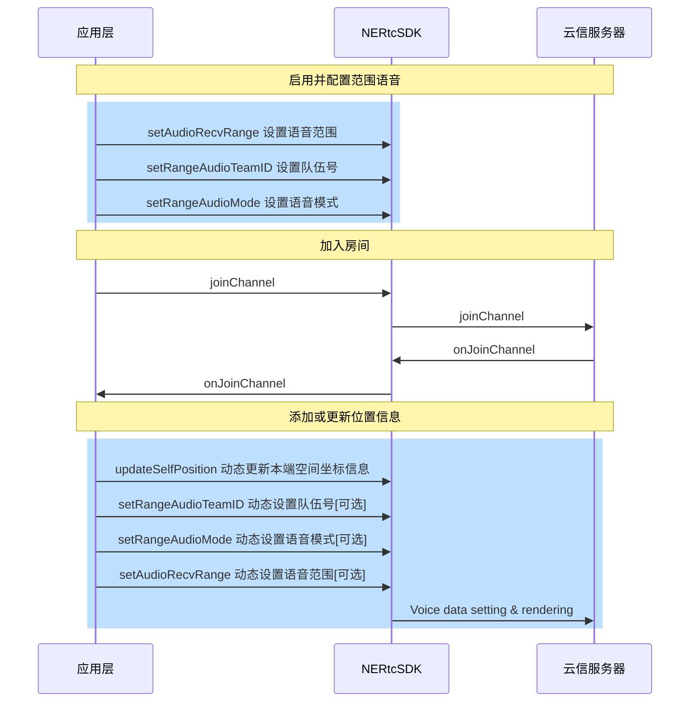

范围语音是指在一个 RTC 房间内，用户可以与一定距离内的其他用户进行实时语音通话。您可以调用 NERtc 客户端接口来更新声源方位，以告知服务器本端的位置，服务器根据**本端世界坐标+本端接收音频的范围**，与**其他端世界坐标 + 其他端接收音频的范围**进行判断，然后对玩家范围内的音频流进行转发。

NERTC SDK 从 V5.5.10 开始支持范围语音。

## 应用场景

范围语音的应用场景举例如下：

| 应用场景 |说明  |  
| :-----| :----| 
| 大逃杀游戏 | 提供大逃杀类型游戏、生存射击类手游中特有的“仅小队”或“所有人”的语音模式。在游戏设置中，根据玩家选择:<ul><li> 仅小队：仅小队内的玩家可以进行语音通话。<li> 所有人：听见队伍中队友声音，以及一定范围内其他对局玩家说话的声音。 |

## 基本概念
使用范围语音功能，涉及到**范围语音的模式**、**语音接收范围**以及 **TeamID** 这三个概念。
- **范围语音的模式**

    当进入范围语音房间时，有两种语音模式可供选择：

    语音模式 | 参数名称 |  功能 |
    :-----| :----|  :----| 
    所有人 | kNERtcRangeAudioModeDefault  |<ul><li> 其他玩家在一定范围内可以听到该玩家说话，如果范围内有其他玩家也选择了此模式，则它们可以进行互相通话。 <li> TeamID 相同的队友可以互相听到。|
    仅小队 | kNERtcRangeAudioModeTeam | 仅 TeamID 相同的队友可以互相听到。 |

    ::: note note
    队友之间的通话不受距离以及语音模式的影响。
    :::


- **语音接收范围**


    


    如果设置的语音模式为**所有人(kNERtcRangeAudioModeDefault)**，此时的语音接收范围受 `updateSelfPosition` 接口影响。

    假设以下两个玩家 A 与 B 为不同的小队，且设置的语音模式为**所有人(kNERtcRangeAudioModeDefault)**：

    玩家坐标 | 语音接收范围 |  与另一玩家声音可达情况 | 与队友声音可达情况 |
    :-----| :----|  :----| :----|
    A(0,0,0) | 10米  |可以听到玩家 B 的声音，因为 B 玩家距离 A 玩家在 10 米内|不影响同一小队成员互相通话|
    B(0,8,0) | 5米 | 不可以听到玩家 A 的声音，因为 A 玩家与 B 玩家距离超过 5 米 |不影响同一小队成员互相通话|


- **TeamID**

    以下介绍 TeamID 为 0 和非 0 代表的意义。

    - 当进入语音房间时指定的 `TeamID != 0` 时，将启用范围语音房间模式。如果某成员使用 `TeamID = 1` 进入语音房间，当他设置语音模式为 `kNERtcRangeAudioModeTeam`，则只有 `TeamID = 1` 的成员能听到他的声音；如果他设置的语音模式为 `kNERtcRangeAudioModeDefault`，则除了  TeamID = 1 的成员，一定范围内的玩家也能听到他的声音。

    <table>
        <tr>
            <th>TeamID 情况</th><th>语音模式</th><th>范围</th><th>声音可达情况</th>
        </tr>
        <tr>
            <td rowspan="2">TeamID != 0，假设 TeamID = 1 </td><td>kNERtcRangeAudioModeTeam </td><td>10米</td><td>声音只能和 TeamID = 1 的成员互通</td>
        </tr>
        <tr>
            <td>kNERtcRangeAudioModeDefault </td><td>10米</td><td>声音能和 TeamID = 1 的成员、以及语音模式设置为 kNERtcRangeAudioModeDefault  的同房间10米范围内成员互通</td>
        </tr>
    </table>

    - 如果某成员使用 TeamID = 0 进入语音房间，将启用范围语音主持人模式。房间内所有人（不论范围语音的模式是所有人还是仅小队）都可以听到该成员的声音。

    <table>
        <tr>
            <th>TeamID 情况</th><th>TeamID 修改时机</th><th>范围</th><th>声音可达情况</th>
        </tr>
        <tr>
            <td >TeamID = 0  </td><td>进房前 无论TeamID 是否为 0，以 TeamID = 0 进入房间</td><td>10米</td><td>说话声音全房间成员（不论语音模式是所有人还是仅小队）都能听到
    <br>能与  TeamID = 0  的成员互相沟通
    <br>不能听到房间内其他人说话声音
    </td>
        </tr>
    
    </table>

### 场景示例
- **大逃杀游戏:**  例如一个生存射击类型的游戏，每 4 个人为一个队伍，则这 4 个人需要设置一个小队号 TeamID，每 100 人为一个对局房间，一个对局共 25 个小队，则 25 个小队都进入一个语音房间。在对局中，如果某玩家想和 10 米范围内的陌生人沟通，则将语音距离范围设置为 10，将语音模式设置为 `kNERtcRangeAudioModeDefault` ，同时打开麦克风及扬声器。如果他只想和小队成员沟通，不和非小队的成员沟通，则只需要将语音模式设置为  `kNERtcRangeAudioModeTeam` 。
- **主持人模式：** 在游戏中例如虚拟桌游场景，主持人说话声音即要房间内所有人听见，也要听见范围内玩家说话的声音，可以让主持人先以 `TeamID != 0` 的形式进入房间，进房后将 `TeamID` 设置为 0，此时主持人说话全房间的人都能听见。


## API 调用时序



## 实现方法


### 步骤1 设置范围语音的距离范围

加入房间前，调用 [`setAudioRecvRange`](https://doc.yunxin.163.com/nertc/api-refer/unity/doxygen/Latest/zh/audioOnly/html/classnertc_1_1_i_rtc_engine.html#a096eb4ee5b1feaa8a74f960c6c2dbcdd) 接口设置语音范围。


**参数描述**如下表所示：


|参数 |类型 | 描述 | 
|---- | ------- | ----------- | 
|audible_distance | Integer  | 监听器能接收到音频的最大距离，用户的声音在该范围内可被听见。<br> 取值范围：[1, max int) ，无默认值。| 
|conversational_distance | Integer  | <note type="note">该参数设置的值对范围语音不起作用，保持默认值即可。</note>监听器不对音频进行衰减的距离，在该距离范围内，扬声器音频保持其原始音量，超出该范围时，声音将会随距离的增加而衰减。默认值为 1。| 
roll_off | Integer |<note type="note">该参数设置的值对范围语音不起作用，保持默认值即可。</note>距离衰减模式。一共有四种：|\
||| - kNERtcDistanceRolloffLogarithmic（0）：指数衰减。|\
||| - kNERtcDistanceRolloffLinear（1）：线性衰减。|\
||| - kNERtcDistanceRolloffNone（2）：无衰减。|\
||| - kNERtcDistanceRolloffLinearOnly（3）：仅线性衰减, 没有方位效果。|

::: note note
如果您只想要实现范围语音，不需要小队模式，您只需要调用`setAudioRecvRange` 接口设置语音的距离范围即可，不需要调用 `setRangeAudioTeamID` 和 `setRangeAudioMode`。
:::

### 步骤2 设置 TeamID
在加入房间前，调用 [`setRangeAudioTeamID`](https://doc.yunxin.163.com/nertc/api-refer/unity/doxygen/Latest/zh/audioOnly/html/classnertc_1_1_i_rtc_engine.html#a28561c58d9dad19e23986093f51d677f) 接口设置队伍号。

::: note note
- 加入房间后，可通过此接口修改队伍号，设置后立即生效。
- 离开房间后，TeamID 失效，需要重新配置TeamID ，请在每次加入房间之前都调用此方法设置 TeamID。
- 如果离开房间后再加入房间，请在收到退房成功回调（`onLeaveChannel`）后，再调用设置队伍号接口。

:::


### 步骤3 设置范围语音的模式

在加入房间前，调用 [`setRangeAudioMode`](https://doc.yunxin.163.com/nertc/api-refer/unity/doxygen/Latest/zh/audioOnly/html/classnertc_1_1_i_rtc_engine.html#abff164051b0c73bac5f2e5c48c709c50) 接口设置语音模式。

语音模式的参数说明如下表所示。

| 语音模式 | 参数名称 |  功能 |
| :-----| :----|  :----| 
|所有人 | kNERtcRangeAudioModeDefault  |<ul><li> 其他玩家在一定范围内可以听到该玩家说话，如果范围内有其他玩家也选择了此模式，则它们可以进行互相通话。 <li> TeamID 相同的队友可以互相听到。|
| 仅小队 | kNERtcRangeAudioModeTeam | 仅 TeamID 相同的队友可以互相听到。 |

::: note note
- 加入房间后，可以随时修改语音模式，并立即生效。
- 离开房间后，此参数不会自动重置为 `kNERtcRangeAudioModeDefault`，所以请在每次加入房间之前都调用此方法设置语音模式。
- 不同范围语音模式，发声者声音的可接收情况说明请参见[附录](#附录)。
:::


### 步骤4 更新声源方位
更新声源方位的目的是向服务器传达本端的位置，以便通过本端的世界坐标和接收范围，与其他端的世界坐标和接收范围进行比较，以实现范围语音的效果。

在加入房间后，每帧调用 [`updateSelfPosition`](https://doc.yunxin.163.com/nertc/api-refer/unity/doxygen/Latest/zh/audioOnly/html/classnertc_1_1_i_rtc_engine.html#abb6017926f59b69d2e159b4c2751bac8) 方法并设置 info 参数，以更新音源或听者的空间位置信息。


| 参数 | 描述 | 
| ---- | -------------- | 
| mSpeakerPosition | 说话者的位置信息，三个值依次表示X、Y、Z的坐标值。默认值{0,0,0}| 
| mSpeakerQuaternion | 说话者的旋转信息，通过四元组来表示，数据格式为{w, x, y, z}。默认值{0,0,0,0}  <note type="note">该参数设置的值暂时不起作用，保持默认值即可。</note>| 
| mHeadQuaternion | 接收者的旋转信息，通过四元组来表示，数据格式为{w, x, y, z}。默认值{0,0,0,0}|
| mHeadPosition| 接收者的位置信息，三个值依次表示X、Y、Z的坐标值。默认值{0,0,0}|


## 示例代码

```
private void EnableAudioRange(){
    int teamID = 1; //设置你的小队ID
    NERtcEx.getInstance().setRangeAudioTeamID(teamID);
    NERtcEx.getInstance().setRangeAudioMode(NERtcRangeAudioMode.kNERtcRangeAudioModeTeam);//设置你的语音模式
    NERtcEx.getInstance().setAudioRecvRange(50, 1, NERtcDistanceRolloffModel.kNERtcDistanceRolloffLinear);
}

//update my position in the game world
private IEnumerator UpdateMySelfPosition()
{
    float[] mouseCoord = new float[]{mouseCoor[0], mouseCoor[1], mouseCoor[2]};
    float[] earCoord = new float[]{earCoor[0], earCoor[1], earCoor[2]};
    float[] mouseCoordForth = new float[]{mouseCoorForth[0], mouseCoorForth[1], mouseCoorForth[2], mouseCoorForth[3]};
    float[] earCoordForth = new float[]{earCoorForth[0], earCoorForth[1], earCoorForth[2], earCoorForth[3]};
    NERtcPositionInfo info = new NERtcPositionInfo(mouseCoord, mouseCoordForth, earCoord, earCoordForth);
    int ret = NERtcEx.getInstance().updateSelfPosition(info);
}
```

## 相关文档

| 文档 | 描述 | 
| ---- | -------------- | 
| [空间音效](https://doc.yunxin.163.com/nertc/guide/TY3NjAzNDE?platform=android) | 如果需要更加沉浸式的体验，建议范围语音配合 3D 音效一起使用。| 


## 附录
- 假设 A 玩家状态为“所有人”，对应 B 玩家在不同语音模式下声音可达情况：
<table>
    <tr>
        <th>是否同一小队</th><th>是否范围内</th><th>语音模式</th><th>A与B 是否能相互听到对方的声音</th>
    </tr>
    <tr>
    <td rowspan="4">同一小队 </td>
    <td rowspan="2">是 </td>
    <td> kNERtcRangeAudioModeDefault</td><td> 是 </td>
    <tr>
    <td> kNERtcRangeAudioModeTeam</td><td> 是 </td>
    </tr>
    <tr>
    <td rowspan="2"> 否</td>
    <td> kNERtcRangeAudioModeDefault </td><td> 是 </td>
    </tr>
    <tr>
    <td> kNERtcRangeAudioModeTeam</td><td>   是</td>
    </tr>
        <tr>
    <td rowspan="4">不同小队 </td>
    <td rowspan="2">是 </td>
    <td> kNERtcRangeAudioModeDefault</td><td> 是 </td>
    <tr>
    <td> kNERtcRangeAudioModeTeam</td><td> 否 </td>
    </tr>
    <tr>
    <td rowspan="2"> 否</td>
    <td> kNERtcRangeAudioModeDefault </td><td> 否 </td>
    </tr>
    <tr>
    <td> kNERtcRangeAudioModeTeam</td><td>否</td>
    </tr>
</table>

- 假设 A 玩家状态为“仅小队”，对应 B 玩家在不同语音模式下声音可达情况：

<table>
    <tr>
        <th>是否同一小队</th><th>是否范围内</th><th>语音模式</th><th>A与B 是否能相互听到对方的声音</th>
    </tr>
    <tr>
    <td rowspan="4">同一小队 </td>
    <td rowspan="2">是 </td>
    <td> kNERtcRangeAudioModeDefault</td><td> 是 </td>
    <tr>
    <td> kNERtcRangeAudioModeTeam</td><td> 是 </td>
    </tr>
    <tr>
    <td rowspan="2"> 否</td>
    <td> kNERtcRangeAudioModeDefault </td><td> 是 </td>
    </tr>
    <tr>
    <td> kNERtcRangeAudioModeTeam</td><td>   是</td>
    </tr>
        <tr>
    <td rowspan="4">不同小队 </td>
    <td rowspan="2">是 </td>
    <td> kNERtcRangeAudioModeDefault</td><td> 否 </td>
    <tr>
    <td> kNERtcRangeAudioModeTeam</td><td> 否 </td>
    </tr>
    <tr>
    <td rowspan="2"> 否</td>
    <td> kNERtcRangeAudioModeDefault </td><td> 否 </td>
    </tr>
    <tr>
    <td> kNERtcRangeAudioModeTeam</td><td>否</td>
    </tr>
</table>


