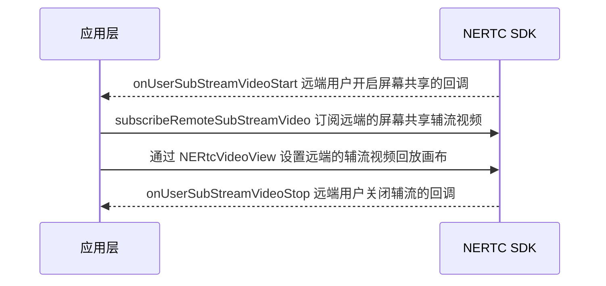

<!--- keywords:实时音视频,屏幕共享 -->

在大型会议或在线教育等场景中，为了满足提升沟通效率的需求，主讲人或老师需要将本端的屏幕内容分享给远端参会者或在线学生观看。网易云信音视频通话 2.0 在 NERTC SDK Flutter 框架上适配了屏幕共享功能，帮助您实时分享本端设备的屏幕内容。

## 应用场景

通过 NERTC SDK，用户可以在视频通话或互动直播过程中实现屏幕共享，主播或连麦者可以将自己的屏幕内容，以视频的方式分享给远端参会者或在线观众观看，从而提升沟通效率，一般适用于多人视频聊天、在线会议以及在线教育场景。

- **视频会议场景**：参会者可以在会议中将本地的文件、数据、网页、PPT 等画面分享给其他与会者，让其他与会者更加直观的了解讨论的内容和主题。

- **在线课堂场景**：老师可以通过屏幕共享将课件、笔记、教学内容等画面展示给远端的其他学生观看，降低传统教学模式下的沟通成本，提升教育场景的用户体验。

NERTC SDK 还支持在共享屏幕的同时，也共享本地播放的系统背景音。具体请参考 [音频共享](https://doc.yunxin.163.com/nertc/guide/zY4MzE0MzE?platform=Flutter)。

## 技术原理

网易云信 NERTC SDK 采用 **双流并发** 的方式实现屏幕共享：

- **主流（摄像头视频流）**：继续传输摄像头采集的视频画面
- **辅流（屏幕共享视频流）**：单独开启一路上行视频流传输屏幕内容

这种设计允许主播同时上行摄像头画面和屏幕画面两路视频流，观众可以同时看到主播本人和共享的屏幕内容。

::: note note 
辅流是相对于主流（摄像头视频）的概念，专门用于传输屏幕共享内容的视频流。通过辅流实现屏幕共享，可以保证屏幕内容和人像画面互不干扰，提供更好的用户体验。
:::

## <span id="注意事项">版本要求</span>

- **最低版本要求**：Android 12、iOS 12.0、NERTC NERTC SDK 3.9.0 及以上版本，才支持通过辅流实现屏幕共享。

- **解决版本冲突**：如果您的应用无法对所有用户设备进行强制升级，而房间内同时存在使用 NERTC SDK [3.9.0](https://doc.yunxin.163.com/nertc/concept/Dc4NTA3MDQ?platform=client#v390-2021-01-26) 以上和以下版本的用户，为避免通话异常，必须确保每个用户同一时间只发送一路视频流。

    **切换流程**：当需要从摄像头视频切换至屏幕共享时，请先调用 <a href="https://doc.yunxin.163.com/nertc/references/flutter/dartdoc/Latest/zh/nertc/NERtcEngine/enableLocalVideo.html" target="_blank">`enableLocalVideo`</a> 关闭摄像头视频，再通过 <a href="https://doc.yunxin.163.com/nertc/references/flutter/dartdoc/Latest/zh/nertc/NERtcEngine/startScreenCapture.html" target="_blank">`startScreenCapture`</a> 开启屏幕共享。从屏幕共享切回摄像头视频时，也请先关闭后开启。

## 安卓注意事项

- Android 端 MediaProjection 等 API 需要 Android API level 21+，使用方法请参考《谷歌官方文档》[MediaProjection](https://developer.android.com/reference/android/media/projection/MediaProjection)。
- Android 10 及以上版本的屏幕共享功能需要开启前台服务，请在 `AndroidManifest.xml` 中添加 `service` 时添加 `foregroundServiceType` 属性。同时将 `compileSdkVersion` 设置为 `29`。

   **示例代码**：

    ```XML
    <uses-permission android:name="android.permission.FOREGROUND_SERVICE" />

    <application>
    <!-- 屏幕共享服务配置 -->
        <service
                android:name="您的包名.SimpleScreenShareService"
                android:foregroundServiceType="mediaProjection">
                <intent-filter>
                    <action android:name="com.netease.Yunxin.ScreenShare" />
                </intent-filter>
            </service>
    </application>
    ```

    具体请参考 <a href="https://github.com/netease-im/Advanced-Video/tree/master/ScreenShare/ScreenShare-Android-Java" target="_blank">Demo</a> 或 [提交工单](https://app.yunxin.163.com/global/service/ticket/create) 联系网易云信技术支持工程师。

## iOS 前置工作

当前的 Flutter 在 iOS 端支持屏幕共享功能与安卓有一定的区别，由于系统限制，iOS 端屏幕共享本质上是跨应用屏幕分享。您需要增加 **Broadcast Upload Extension** 录屏进程，以配合主 App 进程进行推流。实现由系统在需要录屏的时候创建 Extension 录屏进程，并负责接收系统采集到屏幕图像。


总体流程如下图所示：


<a id="createAppGroup"></a>

### 第一步：创建 App Group

App Group 用于主 App 进程和录屏扩展进程之间的数据通信。如果您已有 App Group，**可跳过此步骤**。

1. 登录 [Apple Developer Account](https://developer.apple.com/account/resources)
2. 参考《苹果官方文档》[注册 App Group](https://help.apple.com/developer-account/?lang=en#/dev1d7b147dc)，创建新的 App Group。
3. 参考《苹果官方文档》[启用 App Group](https://help.apple.com/developer-account/?lang=en#/dev4cb6dfbdb)，为您的 App ID 启用 App Group 功能。
4. 重新下载 Provisioning Profile 并配置到 Xcode 中。

### 第二步：创建 Broadcast Extension

创建一个类型为 Broadcast Upload Extension 的 Target，用于存放屏幕共享功能的实现代码。

1. 在 Xcode 中打开项目的工程文件。
2. 在菜单中选择 **Editor > Add Target...**。
3. 在 **iOS** 页签中，选择 **Broadcast Upload Extension**，并单击 **Next**。

    

4. 在 **Product Name** 中为 Extension 命名，例如 **NERtc-ScreenShare-Extension**，单后单击 **Finish**。

### 第三步：引入 NERtcReplayKit

`NERtcReplayKit.xcframework` 可以与核心 SDK 搭配使用，您在集成 SDK 时可引入该 `.xcframework`，详情请参考 [集成 SDK](https://doc.yunxin.163.com/nertc/guide/TM5NzI5MjI)。

1. 将 `NERtcReplayKit.xcframework` 添加到工程，如下图:

    

2. 设置相关 Frameworks Link Setting:
    - **App target** 设置为 **Embed & Sign**。
        
    - **Broadcast Extension** 设置为 **Do not Embed**。
        

3. **Broadcast Extension** 中引入 **NERtcReplayKit** 头文件，在 **SampleHandler** 中，完成相关流程编码。

    ```Objective-C
    #import "SampleHandler.h"
    #import <NERtcReplayKit/NERtcReplayKit.h>

    // 请替换为您的 App Group ID
    static NSString * const kAppGroup = @"group.your.app.group.id";

    @interface SampleHandler () <NEScreenShareSampleHandlerDelegate>
    @end

    @implementation SampleHandler
    - (void)broadcastStartedWithSetupInfo:(NSDictionary<NSString *, NSObject *> *)setupInfo {
    // User has requested to start the broadcast. Setup info from the UI extension can be supplied but
    // optional.
    NEScreenShareBroadcasterOptions *options = [[NEScreenShareBroadcasterOptions alloc] init];
    options.appGroup = kAppGroup;
    #endif
    [NEScreenShareSampleHandler sharedInstance].delegate = self;
    [[NEScreenShareSampleHandler sharedInstance] broadcastStartedWithSetupInfo:options];
    }

    - (void)broadcastPaused {
    // User has requested to pause the broadcast. Samples will stop being delivered.
    [[NEScreenShareSampleHandler sharedInstance] broadcastPaused];
    }

    - (void)broadcastResumed {
    // User has requested to resume the broadcast. Samples delivery will resume.
    [[NEScreenShareSampleHandler sharedInstance] broadcastResumed];
    }

    - (void)broadcastFinished {
    // User has requested to finish the broadcast.
    [[NEScreenShareSampleHandler sharedInstance] broadcastFinished];
    }

    - (void)processSampleBuffer:(CMSampleBufferRef)sampleBuffer
                    withType:(RPSampleBufferType)sampleBufferType {
    [[NEScreenShareSampleHandler sharedInstance] processSampleBuffer:sampleBuffer
                                                            withType:sampleBufferType];
    }

    - (void)onRequestToFinishBroadcastWithError:(NSError *)error {
    [self finishBroadcastWithError:error];
    }
    ```

### 第四步：配置 App Group ID

如果业务上有屏幕共享的场景，在 [初始化 NERTC SDK](https://doc.yunxin.163.com/nertc/guide/jMwNzY0NjM?platform=flutter#%E6%AD%A5%E9%AA%A43-%E5%88%9D%E5%A7%8B%E5%8C%96) 引擎的时候，需要传入 `appGroudId`。

```Dart
void _initRtcEngine() async {
  // 创建 SDK 初始化配置
  NERtcOptions options = NERtcOptions(
    // 配置 App Group ID（iOS 屏幕共享必需）
    appGroup: "group.your.app.group.id",  // 替换为您的 App Group ID
    // 其他配置...
    // logDir: await getLogPath(),
  );

  String appKey = "your_app_key_here";  // 替换为您的网易云信 App Key

  // 错误异常需要处理
  _engine
      .create(appKey: appKey, channelEventCallback: this, options: options)
      .then((value) => _initCallbacks())
      //... more
      .then((value) => _engine.joinChannel('', widget.cid, widget.uid))
      .catchError((e) {
    Fluttertoast.showToast(
        msg: 'catchError:' + e.toString(), gravity: ToastGravity.CENTER);
    return -1;
  });
}
```

## <span id="实现本端共享屏幕">本端共享屏幕</span>

### 第一步：开启屏幕共享

在加入房间之后调用 <a href="https://doc.yunxin.163.com/nertc/references/flutter/dartdoc/Latest/zh/nertc/NERtcEngine/startScreenCapture.html" target="_blank">`startScreenCapture`</a> 方法开启屏幕共享，以辅流形式发送屏幕共享内容。<br>调用此方法时，您需要通过设置 [`NERtcScreenConfig`](https://doc.yunxin.163.com/nertc/references/flutter/dartdoc/Latest/zh/nertc/NERtcScreenConfig-class.html) 配置本地辅流的编码参数。

[`NERtcScreenConfig`](https://doc.yunxin.163.com/nertc/references/flutter/dartdoc/Latest/zh/nertc/NERtcScreenConfig-class.html) 结构体的参数说明如下表所示：

| 参数 | 参数说明 |
| -- | -- |
| contentPrefer | 屏幕共享编码策略倾向：|\
| | - **motion（默认）**：内容类型为动画。当用户共享的内容是视频、电影或游戏等动态画面时，推荐选择此枚举值。此时 frameRate 参数完全按照您的设置处理。 |\
| | - **details**：内容类型为细节。当用户共享的内容是图片、文字或 PPT 等静态画面时，推荐选择此枚举值。此时 frameRate 参数最高可设置为 10 帧。 |
| videoProfile | 视频编码的分辨率。<br>具体请参考 [videoProfile](https://doc.yunxin.163.com/nertc/references/flutter/dartdoc/Latest/zh/nertc/NERtcVideoProfile-class.html)。 |
| frameRate | 视频编码的帧率。<br>可以设置为 0、7（默认）、10、15、24、30 fps，具体请参考 [NERtcVideoFrameRate](https://doc.yunxin.163.com/nertc/references/flutter/dartdoc/Latest/zh/nertc/NERtcVideoFrameRate-class.html)。 |
| minFramerate | 视频编码的最小帧率。<br>默认值为 0，表示使用默认的最小帧率。 |
| bitrate | 视频编码的码率，单位为 Kbps。<br>若设置的码率为 0 或超出合理范围，SDK 会自行计算出合理区间处理码率，具体请参考 [分辨率、帧率、码率参照表](https://doc.yunxin.163.com/nertc/guide/jUwODUyNjI?platform=Flutter#分辨率-帧率和码率参照表)。 |
| minBitrate | 视频编码的最小码率，单位为 Kbps。 |

**典型场景参数配置推荐**

| 参数名称 | 常规推荐值 | 一起看视频 | 共享 PPT |
| -- | -- | -- | -- |
| contentPrefer | motion | motion | details |
| videoProfile | hd720p | hd720p | hd1080p |
| frameRate | fps_7 | fps_30 | fps_7 |
| bitrate | 0（默认值） | 0（默认值） | 0（默认值） |

::: note note
以上表格列出了针对一些典型场景的屏幕共享参数的推荐值，供您参考。
- 若屏幕共享的内容为静态画面，设置较高的帧率并不经济，帧率推荐设置为 7 FPS。
- 若用户要共享的屏幕内容包含大量文字，可以适当提高分辨率和码率设置。
:::

**示例代码**：

```Dart
//打开屏幕共享
NERtcScreenConfig screenProfile = NERtcScreenConfig();
screenProfile.videoProfile = mScreenProfile;
screenProfile.contentPrefer = mScreenContent;
screenProfile.frameRate = mScreenFps;
screenProfile.minFramerate = mScreenMinFps;
screenProfile.bitrate = mScreenEncodeBitrate;
screenProfile.minBitrate = mScreenEncodeMinBitrate;
_engine.startScreenCapture(config).then((value) {
    if (value == 0) {
        setState(() {
            isScreenRecordEnabled = true;
        });
    } else if (value == -1) {
              Fluttertoast.showToast(
                  msg: '当前 iOS 系统版本不支持', gravity: ToastGravity.CENTER);
            } else if (value == -2) {
              Fluttertoast.showToast(
                  msg: '请跳转控制中心长按屏幕录制', gravity: ToastGravity.CENTER);
            } else {
              Fluttertoast.showToast(
                  msg: 'startScreenCapture failed, err:$value',
                  gravity: ToastGravity.CENTER);
            }
});
```

### 第二步：设置本端辅流画布

使用 <a href="https://doc.yunxin.163.com/nertc/references/flutter/dartdoc/Latest/zh/nertc/NERtcVideoView-class.html" target="_blank">`NERtcVideoView`</a> 设置本端的辅流视频画布，用于显示您正在共享的屏幕内容。您需要设置对应的参数来配置视频画布，特别注意将 `subStream` 参数设置为 `true` 以指明这是辅流画布。

::: note note
您可以在开启屏幕共享前后随时设置本端辅流画布。即使不设置本地预览，屏幕共享功能也能正常工作，远端用户将能看到您共享的屏幕内容。
:::

**示例代码**：

```Dart
// 在UI布局中添加屏幕共享预览视图
NERtcVideoView(
    uid: session.mUid,  // 用户ID
    subStream: true,    // 标记为辅流(屏幕共享)视图
    mirrorListenable: session.mirror,  // 一般屏幕共享不需要镜像，可设为false
    rendererEventLister: this,  // 视频渲染事件监听器
)
```

### 第三步：停止屏幕共享

若您要结束屏幕共享，请调用 <a href="https://doc.yunxin.163.com/nertc/references/flutter/dartdoc/Latest/zh/nertc/NERtcEngine/stopScreenCapture.html" target="_blank">`stopScreenCapture`</a> 方法关闭辅流形式的屏幕共享。

**示例代码**：

```Dart
_engine.stopScreenCapture().then((value) {
    if (value == 0) {
        setState(() {
            isScreenRecordEnabled = false;
        });
    }
});
```

## <span id="观看远端屏幕共享">观看远端屏幕共享</span>

### <span id="API 调用时序"> **API 调用时序** </span>



### 实现方法

1. 远端用户加入房间。
2. 收到 <a href="https://doc.yunxin.163.com/nertc/references/flutter/dartdoc/Latest/zh/nertc/NERtcChannelEventCallback/onUserSubStreamVideoStart.html" target="_blank">`onUserSubStreamVideoStart`</a> 回调，表示远端用户开启了屏幕共享的辅流通道。
3. 通过 <a href="https://doc.yunxin.163.com/nertc/references/flutter/dartdoc/Latest/zh/nertc/NERtcVideoView-class.html" target="_blank">`NERtcVideoView`</a> 创建远端辅流视频的显示画布，并设置 `subStream` 属性为 `true` 指明这是辅流画布。
4. 调用 <a href="https://doc.yunxin.163.com/nertc/references/flutter/dartdoc/Latest/zh/nertc/NERtcEngine/subscribeRemoteSubStreamVideo.html" target="_blank">`subscribeRemoteSubStreamVideo`</a> 方法订阅远端的屏幕共享辅流视频，传入 `true` 参数开始接收视频数据。
5. 当收到 <a href="https://doc.yunxin.163.com/nertc/references/flutter/dartdoc/Latest/zh/nertc/NERtcChannelEventCallback/onUserSubStreamVideoStop.html" target="_blank">`onUserSubStreamVideoStop`</a> 回调时，表示远端用户已停止屏幕共享，此时应当取消订阅并移除对应的视图。

### 示例代码

```Dart
 List<_UserSession> _remoteSessions = [];

 @override
  void onUserSubStreamVideoStart(int uid, int maxProfile) {
    setupVideoView(uid, maxProfile, true);
  }

Future<void> setupVideoView(int uid, int maxProfile, bool subStream) async {
    final session = _UserSession(uid, subStream);
    _remoteSessions.add(session);

    if (subStream) {
        _engine.subscribeRemoteSubStreamVideo(uid, true);
    } else {
        _engine.subscribeRemoteVideoStream(
        uid, NERtcRemoteVideoStreamType.high, true);
    }
    setState(() {});
  }

@override
  void onUserSubStreamVideoStop(int uid) {
    releaseVideoView(uid, true);
  }

Future<void> releaseVideoView(int uid, bool subStream) async {
    for (_UserSession session in _remoteSessions.toList()) {
      if (session.uid == uid && subStream == session.subStream) {
        _remoteSessions.remove(session);
        if (forceSubAndUnsubVideo || !_settings.autoSubscribeVideo) {
          if (!subStream) {
            _engine.subscribeRemoteVideoStream(
                uid, NERtcRemoteVideoStreamType.high, false);
          } else {
            _engine.subscribeRemoteSubStreamVideo(uid, false);
          }
        }
        setState(() {});
        break;
      }
    }
  }
```

:::note note
上述示例代码中的 `_UserSession` 是一个用于管理用户视频流的自定义类，需要包含用户ID和是否为辅流的信息。`forceSubAndUnsubVideo` 和 `_settings.autoSubscribeVideo` 是应用层的配置项，用于控制是否需要手动管理视频流的订阅状态。
:::

## API 参考

| **接口** | **功能描述** |
| :-- | :-- |
| <a href="https://doc.yunxin.163.com/nertc/references/flutter/dartdoc/Latest/zh/nertc/NERtcEngine/startScreenCapture.html" target="_blank">`startScreenCapture`</a> | 开启屏幕共享。 |
| <a href="https://doc.yunxin.163.com/nertc/references/flutter/dartdoc/Latest/zh/nertc/NERtcVideoRenderer/attachToLocalSubStreamVideo.html" target="_blank">`attachToLocalSubStreamVideo`</a> | 设置本端的辅流视频画布（通过 <a href="https://doc.yunxin.163.com/nertc/references/flutter/dartdoc/Latest/zh/nertc/NERtcVideoView-class.html" target="_blank">`NERtcVideoView`</a> 统一管理）。 |
| <a href="https://doc.yunxin.163.com/nertc/references/flutter/dartdoc/Latest/zh/nertc/NERtcEngine/stopScreenCapture.html" target="_blank">`stopScreenCapture`</a> | 关闭屏幕共享。 |
| <a href="https://doc.yunxin.163.com/nertc/references/flutter/dartdoc/Latest/zh/nertc/NERtcVideoRenderer/attachToRemoteSubStreamVideo.html" target="_blank">`attachToRemoteSubStreamVideo`</a> | 设置远端的辅流视频回放画布（通过 <a href="https://doc.yunxin.163.com/nertc/references/flutter/dartdoc/Latest/zh/nertc/NERtcVideoView-class.html" target="_blank">`NERtcVideoView`</a> 统一管理）。 |
| <a href="https://doc.yunxin.163.com/nertc/references/flutter/dartdoc/Latest/zh/nertc/NERtcChannelEventCallback/onUserSubStreamVideoStart.html" target="_blank">`onUserSubStreamVideoStart`</a> | 通知本端关于远端用户开启屏幕共享辅流通道的回调。 |
| <a href="https://doc.yunxin.163.com/nertc/references/flutter/dartdoc/Latest/zh/nertc/NERtcEngine/subscribeRemoteSubStreamVideo.html" target="_blank">`subscribeRemoteSubStreamVideo`</a> | 订阅远端的屏幕共享辅流视频 |
| <a href="https://doc.yunxin.163.com/nertc/references/flutter/dartdoc/Latest/zh/nertc/NERtcChannelEventCallback/onUserSubStreamVideoStop.html" target="_blank">`onUserSubStreamVideoStop`</a> | 通知本端关于远端用户关闭屏幕共享辅流通道的回调。 |