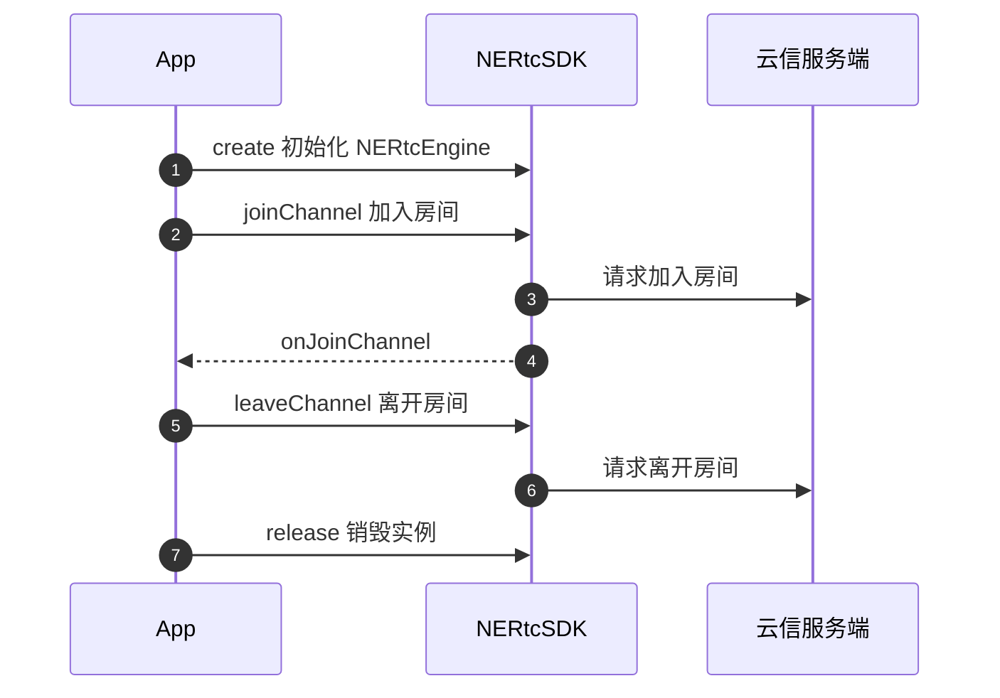
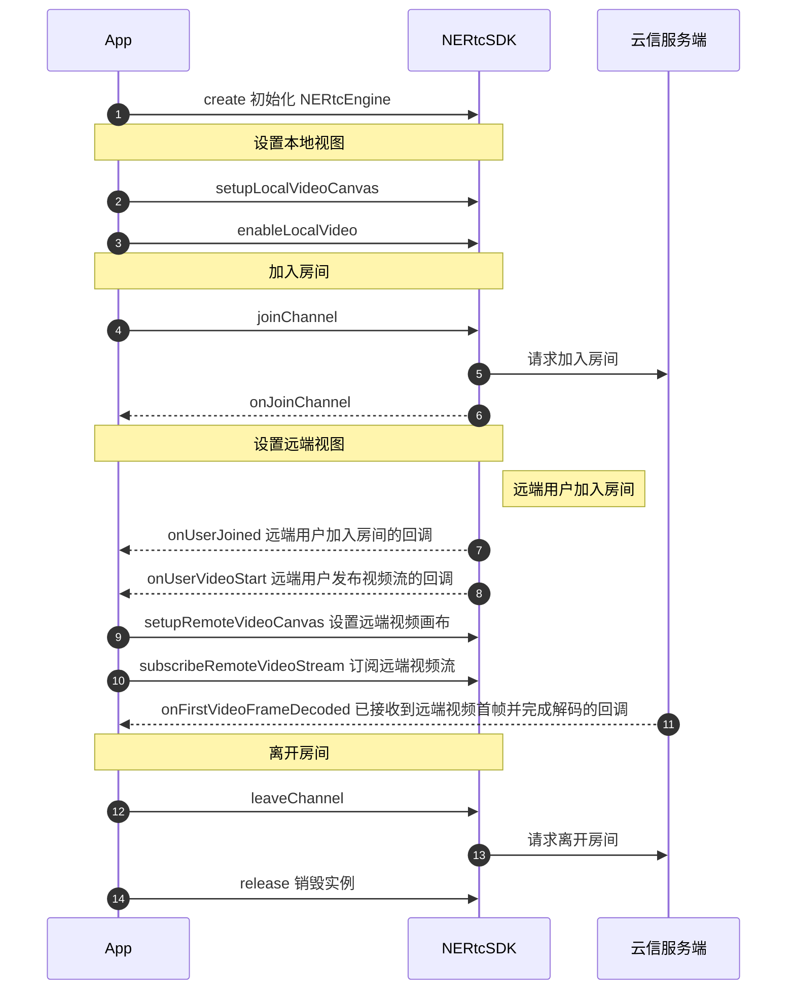

<!--和互动直播对应文档步骤不一致，请勿直接替换。相比互动直播文档，增加跑通示例代码、删除部分推流步骤-->

网易云信音视频通话产品的基本功能包括高质量的实时音视频通话。当您成功初始化 SDK 之后，您可以简单体验本产品的基本业务流程。本文档为您展示音视频通话提供的基本业务流程。

## <span id="前提条件">前提条件</span>
请确认您已完成以下操作：

- [创建应用并获取 App Key](https://doc.yunxin.163.com/console/guide/TIzMDE4NTA?platform=console)。
- [开通音视频通话服务](https://doc.yunxin.163.com/nertc/quick-start/TEzNzQwNzM)。
- [集成 SDK（Flutter）](https://doc.yunxin.163.com/nertc/quick-start/jMwMjEyODE)。


## <span id="示例代码">示例代码</span> 

网易云信为您提供完整的**创建界面**及**实现基础音视频通话**的示例代码作为参考，您可以直接拷贝用于运行测试。


::: details xml 界面的完整示例代码
```
class CallPage extends StatefulWidget {
  final String cid;
  final int uid;

  CallPage({Key? key, required this.cid, required this.uid});

  @override
  _CallPageState createState() {
    return _CallPageState();
  }
}

class _CallPageState extends State<CallPage>
    with
        NERtcVideoRendererEventListener,
        NERtcChannelEventCallback,
        NERtcAudioMixingEventCallback,
        NERtcAudioEffectEventCallback,
        NERtcStatsEventCallback,
        NERtcDeviceEventCallback,
        NERtcLiveTaskCallback {
  late Settings _settings;
  NERtcEngine _engine = NERtcEngine.instance;
  List<_UserSession> _remoteSessions = [];
  _UserSession? _localSession;
  _UserSession? _localSubStreamSession;
  
  bool isAudioEnabled = false;
  bool isVideoEnabled = false;
  bool isFrontCamera = true;
  bool isFrontCameraMirror = true;
  bool isSpeakerphoneOn = false;

  bool forceSubAndUnsubVideo = false;
  final foregroundServiceChannel = const MethodChannel(
      'com.netease.nertc_core.nertc_core_example.foreground_service');

  @override
  void initState() {
    super.initState();
    print('start call: uid=${widget.uid}, cid=${widget.cid}');
    _initSettings().then((value) => _initRtcEngine());
    if (Platform.isAndroid) {
      foregroundServiceChannel.invokeMethod('startForegroundService');
    }
  }

  @override
  Widget build(BuildContext context) {
    screenSize = MediaQuery.of(context).size;

    return WillPopScope(
      child: GestureDetector(
        onTap: () {
          setState(() {
            showControlPanel = !showControlPanel;
          });
        },
        child: Scaffold(
          appBar: AppBar(
            automaticallyImplyLeading: false,
            centerTitle: true,
            title: Text(widget.cid),
          ),
          body: buildCallingWidget(context),
        ),
      ),
      // ignore: missing_return
      onWillPop: () {
        _requestPop();
        return Future.value(true);
      },
    );
  }

  Widget buildCallingWidget(BuildContext context) {
    return Stack(children: <Widget>[
      buildVideoViews(context),
      if (showControlPanel) buildControlPanel(context)
    ]);
  }

  Widget buildControlPanel(BuildContext context) {
    return Container(
        height: 40,
        child: Row(
          children: [
            Expanded(
                child: buildControlButton(
              () {
                bool audioEnabled = !isAudioEnabled;
                _engine.enableLocalAudio(audioEnabled).then((value) {
                  if (value == 0) {
                    setState(() {
                      isAudioEnabled = audioEnabled;
                    });
                  }
                });
              },
              Text(
                isAudioEnabled ? '关闭语音' : '打开语音',
                style: TextStyle(fontSize: 12),
              ),
            )),
            Expanded(
                child: buildControlButton(
              () {
                bool videoEnabled = !isVideoEnabled;
                _engine.enableLocalVideo(videoEnabled).then((value) {
                  if (value == 0) {
                    setState(() {
                      isVideoEnabled = videoEnabled;
                    });
                  }
                });
              },
              Text(
                isVideoEnabled ? '关闭视频' : '打开视频',
                style: TextStyle(fontSize: 12),
              ),
            )),
            Expanded(
                child: buildControlButton(
              () {
                _engine.deviceManager.switchCamera().then((value) {
                  if (value == 0) {
                    isFrontCamera = !isFrontCamera;
                    updateLocalMirror();
                  }
                });
              },
              Text(
                '切换摄像头',
                style: TextStyle(fontSize: 12),
              ),
            )),
            Expanded(
                child: buildControlButton(
              () {
                bool speakerphoneOn = !isSpeakerphoneOn;
                _engine.deviceManager
                    .setSpeakerphoneOn(speakerphoneOn)
                    .then((value) {
                  if (value == 0) {
                    setState(() {
                      isSpeakerphoneOn = speakerphoneOn;
                    });
                  }
                });
              },
              Text(
                isSpeakerphoneOn ? '关闭扬声器' : '打开扬声器',
                style: TextStyle(fontSize: 12),
              ),
            )),
          ],
        ));
  }

  Widget buildVideoViews(BuildContext context) {
    final sessions = [
      if (_localSession != null) _localSession!,
      if (_localSubStreamSession != null) _localSubStreamSession!,
      ..._remoteSessions,
    ];

    return OrientationBuilder(
      builder: (BuildContext context, Orientation orientation) {
        final isLandscape = orientation == Orientation.landscape;
        return GridView.builder(
          scrollDirection: isLandscape ? Axis.horizontal : Axis.vertical,
          gridDelegate: SliverGridDelegateWithFixedCrossAxisCount(
            crossAxisCount: isLandscape ? 1 : 3,
            childAspectRatio: isLandscape ? 16 / 9 : 9 / 16,
            crossAxisSpacing: 2.0,
            mainAxisSpacing: 2.0,
          ),
          itemCount: sessions.length,
          itemBuilder: (BuildContext context, int index) {
            return buildVideoView(context, sessions[index]);
          },
        );
      },
    );
  }

  Widget buildVideoView(BuildContext context, _UserSession session) {
    return Container(
      child: Stack(
        children: [
          NERtcVideoView(
            uid: session.uid == widget.uid ? null : session.uid,
            subStream: session.subStream,
            mirrorListenable: session.mirror,
            rendererEventLister: this,
          ),
          Row(
            mainAxisAlignment: MainAxisAlignment.center,
            children: [
              Text(
                session.subStream ? '${session.uid} @ Sub' : '${session.uid}',
                style: TextStyle(color: Colors.red, fontSize: 10),
              )
            ],
          )
        ],
      ),
    );
  }

```
:::

::: details 实现音视频通话的完整示例代码
```
 NERtcEngine _engine = NERtcEngine.instance;
//初始化SDK
 await _engine
        .create(
            appKey: Config.APP_KEY,
            channelEventCallback: this,
            options: options)

·//添加callback回调
    // _engine.setStatsEventCallback(this);
    _engine.audioMixingManager.setEventCallback(this);
    _engine.audioEffectManager.setEventCallback(this);
    _engine.deviceManager.setEventCallback(this);
    _engine.setLiveTaskEventCallback(this);
    _engine.setEventCallback(this);
  
//设置本地摄像头的采集偏好等配置
    final config = NERtcCameraCaptureConfig.manual(640, 360);
    await _engine.setCameraCaptureConfig(config);


//设置本地视频参数
NERtcVideoConfig config = NERtcVideoConfig();
    config.videoProfile = _settings.videoProfile;
    config.frameRate = _settings.videoFrameRate;
    config.degradationPrefer = _settings.degradationPreference;
    config.frontCamera = _settings.frontFacingCamera;
    config.videoCropMode = _settings.videoCropMode;
    await _engine.setLocalVideoConfig(config);

//加入房间前提前设置好音视频开启状态
if (Platform.isIOS) {
      await _engine.setAudioSessionOperationRestriction(
          NERtcAudioSessionOperationRestriction
              .values[_settings.audioSessionRestriction]);
    }
    await _engine.setAudioProfile(
        NERtcAudioProfile.values[_settings.audioProfile],
        NERtcAudioScenario.values[_settings.audioScenario]);
    await _engine.enableLocalAudio(isAudioEnabled);
    await _engine.enableLocalVideo(isVideoEnabled);


//加入房间
long yourUid = 1234567;//同一个房间不允许相同uid
_engine.joinChannel('', cid, yourUid)

//结束通话
_engine.leaveChannel();

//释放SDK
_engine.release();
```
:::

## API 时序图

实现**音频通话**的 API 调用时序如下图所示。



  
实现**视频通话**的 API 调用时序如下图所示。


## <span id="实现音视频通话">实现音视频通话</span>


### 步骤1: （可选）创建音视频通话界面

::: details 您可以参考此步骤根据业务场景创建相应的音视频通话界面，若您已实现相应界面，请忽略该步骤。

实现基础的音视频通话，建议您参考 [xml 界面的示例代码](#示例代码)在界面上添加以下控件。

- 房间 ID
- 用户昵称
- 本端视频窗口
- 远端视频窗口
- 麦克风按钮
- 摄像头按钮
- 结束通话按钮

效果图如下图所示。


:::  

### 步骤2： 导入类

在您的工程中对应的 Page 文件里添加如下代码先导入以下重要类：

```dart
import 'package:nertc_core/nertc_core.dart';
```

### 步骤3： 初始化

默认情况下，请先执行 [`create`](https://doc.yunxin.163.com/nertc/references/flutter/dartdoc/Latest/zh/nertc/NERtcEngine/create.html) 方法完成初始化。

```java
// 示例
  void _initRtcEngine() async {
      NERtcOptions options = NERtcOptions(
        audioAutoSubscribe: _settings.autoSubscribeAudio,
        serverRecordSpeaker: _settings.serverRecordSpeaker,
        serverRecordAudio: _settings.serverRecordAudio,
        serverRecordVideo: _settings.serverRecordVideo,
        serverRecordMode:
            NERtcServerRecordMode.values[_settings.serverRecordMode],
        videoSendMode: NERtcVideoSendMode.values[_settings.videoSendMode],
        videoEncodeMode:
            NERtcMediaCodecMode.values[_settings.videoEncodeMediaCodecMode],
        videoDecodeMode:
            NERtcMediaCodecMode.values[_settings.videoDecodeMediaCodecMode]);
    _engine
        .create(
            appKey: Config.Your_APP_KEY,
            channelEventCallback: this,
            options: options);
   }
```
::: note notice
您需要将 `App_Key` 替换为您的应用对应的 App Key。
:::

为了实现标准音视频通话业务，您还需要在初始化时**注册相关必要回调**，建议您在初始化方法中传入原型为 **NERtcChannelEventCallback** 的以下回调，并增加相应必要的处理。


```
//NERtcChannelEventCallback 重要回调

//本端用户加入房间结果回调
@override
  void onJoinChannel(int result, int channelId, int elapsed, int uid) {
    
  }

//本端用户离开房间回调
@override
  void onLeaveChannel(int result) {
   
  }

//远端用户加入房间
@override
  void onUserJoined(int uid, NERtcUserJoinExtraInfo? joinExtraInfo) {
    
  }

//远端用户离开房间
void onUserLeave(
      int uid, int reason, NERtcUserLeaveExtraInfo? leaveExtraInfo) {
    for (_UserSession session in _remoteSessions.toList()) {
      if (session.uid == uid) {
        _remoteSessions.remove(session);
      }
    }
    setState(() {});
  }

//远端用户打开音频
@override
  void onUserAudioStart(int uid) {

  }

//远端用户关闭音频
@override
  void onUserAudioStop(int uid) {
  }

//远端用户打开视频，建议在此按需设置画布及订阅视频
@override
  void onUserVideoStart(int uid, int maxProfile) {
    
  }

//远端用户关闭视频，可释放之前绑定的画布
void onUserVideoStop(int uid) {
  }

//与服务器断连，退出页面
@override
  void onDisconnect(int reason) {
  }
```

 
### 步骤4： 设置本地视图

初始化成功后，可以设置本地视图，来预览本地图像。您可以根据业务需要实现加入房间之前预览或加入房间后预览。
::: note note
- 若您想设置画布渲染参数，可以调用 [`setMirror`](https://doc.yunxin.163.com/nertc/references/flutter/dartdoc/Latest/zh/nertc/NERtcVideoRenderer/setMirror.html) 方法设置镜像模式。
- 在加入房间前，默认预览分辨率为 640*480，您可以通过 [`setLocalVideoConfig`](https://doc.yunxin.163.com/nertc/references/flutter/dartdoc/Latest/zh/nertc/NERtcEngine/setLocalVideoConfig.html) 接口的 `width ` 和 `height` 参数调整采集分辨率。
:::

- 实现加入房间前预览。

  1. 通过 [`startVideoPreview`](https://doc.yunxin.163.com/nertc/references/flutter/dartdoc/Latest/zh/nertc/NERtcEngine/startVideoPreview.html) 与 [`NERtcVideoView`](https://doc.yunxin.163.com/nertc/references/flutter/dartdoc/Latest/zh/nertc/NERtcVideoView-class.html) ，在加入房间前设置本地视图，预览本地图像。

        ```java
        // 示例
        _engine.startVideoPreview();
        NERtcVideoView(
            uid: null,
            subStream: session.subStream,
            mirrorListenable: session.mirror,
            rendererEventLister: this,
          ),
        ```
  2. 若要结束预览，或者准备加入房间时，调用[`stopVideoPreview`](https://doc.yunxin.163.com/nertc/references/flutter/dartdoc/Latest/zh/nertc/NERtcEngine/stopVideoPreview )停止预览。

- 实现加入房间后预览。

    调用 <a href="https://doc.yunxin.163.com/nertc/references/flutter/dartdoc/Latest/zh/nertc/NERtcVideoView-class.html" target="_blank">`NERtcVideoView`</a> 设置本地视图，再调用 <a href="https://doc.yunxin.163.com/nertc/references/flutter/dartdoc/Latest/zh/nertc/NERtcEngine/enableLocalVideo.html" target="_blank">`enableLocalVideo`</a> 方法进行视频的采集发送与预览。成功加入房间后，即可预览本地图像。

    ```java
    // 示例
    // 开启本地视频采集并发送
    _engine.enableLocalVideo(true);
    // 设置本地预览画布
    NERtcVideoView(
            uid: null,
            subStream: session.subStream,
            mirrorListenable: session.mirror,
            rendererEventLister: this,
          ),
    ```

### 步骤5： 加入房间

加入房间前，请确保已完成初始化相关事项。

调用 <a href="https://doc.yunxin.163.com/nertc/references/flutter/dartdoc/Latest/zh/nertc/NERtcEngine/joinChannel.html" target="_blank">`joinChannel`</a> 方法加入房间。

::: note note
调用 `joinChannel` 之后，NERTC SDK 会通过 Android 的 <a href="https://developer.android.com/reference/android/media/AudioManager#setMode(int)" target="_blank">`AudioManager.setMode()`</a> 方法调整音频模式（audio mode），此后请勿修改 SDK 调整过的音频模式，否则会导致音频路由错误等问题。
:::

**示例代码**如下：
```java
_engine.joinChannel(token,channelName,uid);
```

**参数说明**：

<table>
  <tr>
    <th width="30%"><b>参数</b></th>
    <th width="60%"><b>说明</b></th>
  </tr>
  <tr>
    <td>token</td>
    <td>安全认证签名（NERTC Token）。<br><ul><li>调试模式下：可设置为 null。产品默认为安全模式，您可以在网易云信控制台将鉴权模式修改为调试模式，具体请参见<a href="https://doc.yunxin.163.com/nertc/quick-start/TQ0MTI2ODQ?platform=android" target="_blank">Token 鉴权</a>。<br><b>调试模式的安全性不高，请在产品正式上线前修改为安全模式。</b><li>产品正式上线后：请设置为已获取的<a href="https://doc.yunxin.163.com/nertc/quick-start/TQ0MTI2ODQ?platform=android" target="_blank">NERTC Token</a>。安全模式下必须设置为获取到的 Token 。若未传入正确的 Token 将无法进入房间。<p><b>推荐使用安全模式</b>。</td>
  </tr>
    <tr>
    <td>channelName</td>
    <td>房间名称，长度为 1 ~ 64 字节。目前支持以下 89 个字符：a-z, A-Z, 0-9, space, !#$%&()+-:;≤.,>? @[]^_{|}~"。<br>设置相同房间名称的用户会进入同一个通话房间。<br><note type="note">您也可以在加入通道前，通过<a href="https://doc.yunxin.163.com/nertc/server-apis/jg3NjcyNTE?platform=server" target="_blank">创建房间</a>接口创建房间。加入房间时，若传入的 {channelName} 未事先创建，则云信服务器内部将为其自动创建一个名为 {channelName} 的通话房间。</note></li></td>
  </tr>
    <tr>
    <td>uid</td>
    <td>用户的唯一标识 id，为数字串，房间内每个用户的 uid 必须是唯一的。<note type="notice">此 uid 为用户在您应用中的 ID，请在您的业务服务器上自行管理并维护。</note></td>
  </tr>
    <tr>
    <td>channelOptions</td>
    <td>加入房间时可以设置携带一些特定信息，包括高级权限密钥。默认值为 NULL，具体请参考 <a href="https://doc.yunxin.163.com/nertc/references/flutter/dartdoc/Latest/zh/nertc/NERtcJoinChannelOptions-class.html" target="_blank">NERtcJoinChannelOptions</a>。</td>
  </tr>
</table>

::: note note
- SDK 发起加入房间请求后，服务器会进行响应，您可以通过 <a href="https://doc.yunxin.163.com/nertc/references/flutter/dartdoc/Latest/zh/nertc/NERtcChannelEventCallback-class.html" target="_blank">`NERtcChannelEventCallback`</a> 的 <a href="https://doc.yunxin.163.com/nertc/references/flutter/dartdoc/Latest/zh/nertc/NERtcChannelEventCallback/onJoinChannel.html" target="_blank">`onJoinChannel`</a> 回调监听加入房间的结果，同时该回调会抛出当前通话房间的 **channelId** 与加入房间总耗时（毫秒）；其中 **channelId** 即音视频通话的 ID，建议您在业务层保存该数据，以便于后续问题排查。

- 成功加入房间之后，您可以通过监听 [`onConnectionStateChanged`](https://doc.yunxin.163.com/nertc/references/flutter/dartdoc/Latest/zh/nertc/NERtcChannelEventCallback/onConnectionStateChanged.html) 回调实时监控自己在本房间内的连接状态。
:::


### 步骤6： 设置远端视图

音视频通话过程中，除了要显示本地的视频画面，通常也要显示参与互动的其他连麦者/主播的远端视频画面。


1. 监听远端用户进出房间。
  
    当远端用户加入房间时，本端会触发 <a href="https://doc.yunxin.163.com/nertc/references/flutter/dartdoc/Latest/zh/nertc/NERtcChannelEventCallback/onUserJoined.html" target="_blank">`onUserJoined`</a> 回调，并抛出对方的 uid。
    
    ::: note note
    当本端加入房间后，也会通过此回调抛出通话房间内已有的其他用户。
    :::

2. 设置远端视频画布。
  
    在监听到远端用户加入房间或发布视频流后，本端可以通过 NERtcVideoView 来设置远端用户视频画布，用于显示其视频画面。
  

3. 监听远端视频流发布。

    当房间中的其他用户发布视频流时，本端会触发 <a href="https://doc.yunxin.163.com/nertc/references/flutter/dartdoc/Latest/zh/nertc/NERtcChannelEventCallback/onUserVideoStart.html" target="_blank">`onUserVideoStart`</a> 回调。

4. 订阅远端视频流。

    在监听到远端用户发布视频流后，本端可以调用 <a href="https://doc.yunxin.163.com/nertc/references/flutter/dartdoc/Latest/zh/nertc/NERtcEngine/subscribeRemoteVideoStream.html" target="_blank">`subscribeRemoteVideoStream`</a> 方法对其发起视频流的订阅，来将对方的视频流渲染到视频画布上。
  


5. 监听远端用户离开房间或关闭视频功能。

    - <a href="https://doc.yunxin.163.com/nertc/references/flutter/dartdoc/Latest/zh/nertc/NERtcChannelEventCallback/onUserLeave.html" target="_blank">`onUserLeave`</a>：用户离开房间回调。

    - <a href="https://doc.yunxin.163.com/nertc/references/flutter/dartdoc/Latest/zh/nertc/NERtcChannelEventCallback/onUserVideoStop.html" target="_blank">`onUserVideoStop`</a>：远端用户关闭视频功能回调。


**示例代码：**

```flutter
NERtcVideoView(
            uid: session.uid == widget.uid ? null : session.uid,
            subStream: session.subStream,
            mirrorListenable: session.mirror,
            rendererEventLister: this,
          );

void onUserVideoStart(int uid, int maxProfile) {
    setupVideoView(uid, maxProfile, false);
  }
 Future<void> setupVideoView(int uid, int maxProfile, bool subStream) async {
    final session = _UserSession(uid, subStream);
    _remoteSessions.add(session);

    if (forceSubAndUnsubVideo || !_settings.autoSubscribeVideo) {
      if (subStream) {
        _engine.subscribeRemoteSubStreamVideo(uid, true);
      } else {
        _engine.subscribeRemoteVideoStream(
            uid, NERtcRemoteVideoStreamType.high, true);
      }
    }
    setState(() {});
  }

  Future<void> releaseVideoView(int uid, bool subStream) async {
    for (_UserSession session in _remoteSessions.toList()) {
      if (session.uid == uid && subStream == session.subStream) {
        _remoteSessions.remove(session);
        if (forceSubAndUnsubVideo || !_settings.autoSubscribeVideo) {
          if (!subStream) {
            _engine.subscribeRemoteVideoStream(
                uid, NERtcRemoteVideoStreamType.high, false);
          } else {
            _engine.subscribeRemoteSubStreamVideo(uid, false);
          }
        }
        setState(() {});
        break;
      }
    }
  }
    @override
  void onUserVideoStop(int uid) {
    releaseVideoView(uid, false);
  }

  @override
  void onUserLeave(
      int uid, int reason, NERtcUserLeaveExtraInfo? leaveExtraInfo) {
    for (_UserSession session in _remoteSessions.toList()) {
      if (session.uid == uid) {
        _remoteSessions.remove(session);
      }
    }
    setState(() {});
  }
```


### 步骤7： 音频流

在 NERTC SDK 中，本地音频的采集发布和远端音频订阅播放是默认启动的，正常情况下无需开发者主动干预。

### 步骤8： 退出通话房间

调用 `leaveChannel` 接口退出通话房间。

```java
// 示例
// 退出通话房间
_engine.leaveChannel();
```

**NERtcChannelEventCallback** 提供 [`onLeaveChannel`](https://doc.yunxin.163.com/nertc/references/flutter/dartdoc/Latest/zh/nertc/NERtcChannelEventCallback/onLeaveChannel.html) 回调来监听当前用户退出房间的结果。

### 步骤9： 销毁实例

当确定 App 短期内不再使用音视频通话实例时，可以调用 `release` 接口释放对应的对象资源。

```java
// 示例
// 销毁实例
_engine.release();
```