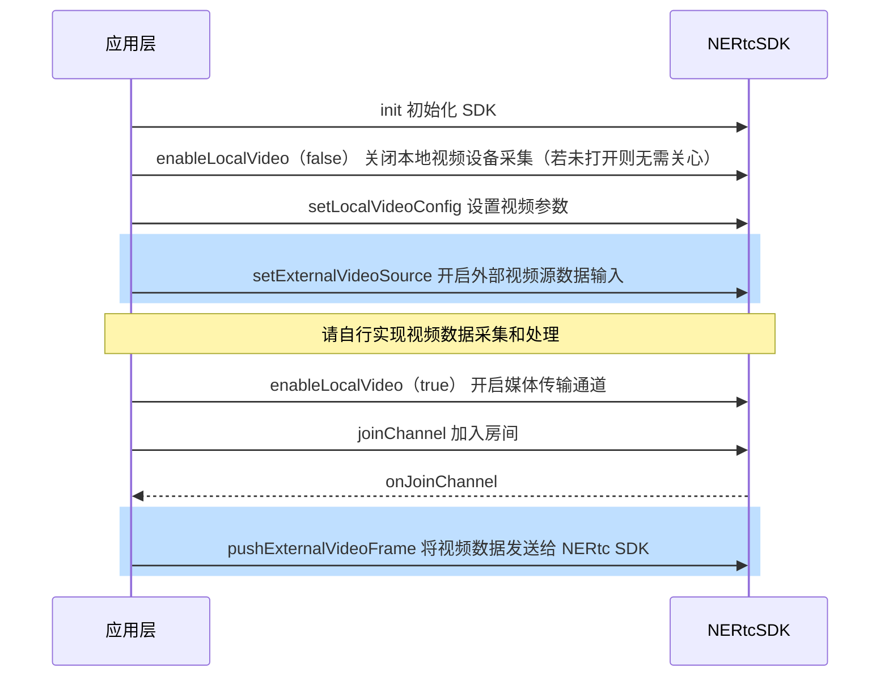

<!--keywords:自定义视频采集,自定义音频渲染,外部视频输入-->

NERTC SDK 提供自定义视频采集功能，帮助您向 NERTC SDK 提供自定义的视频输入源数据（外部视频输入），并由 NERTC  SDK 进行编码推流。本文档为您介绍如何通过 <a href="https://doc.yunxin.163.com/nertc/references/flutter/dartdoc/Latest/zh/nertc/NERtcEngine/setExternalVideoSource.html" target="_blank">`setExternalVideoSource`</a> 和 <a href="https://doc.yunxin.163.com/nertc/references/flutter/dartdoc/Latest/zh/nertc/NERtcEngine/pushExternalVideoFrame.html" target="_blank">`pushExternalVideoFrame`</a> 方法实现自定义视频采集功能。

## <span id="功能描述">功能描述</span>

一般情况下，App 采用默认设备采集视频数据，通常是本设备的摄像头模块。但在部分场景下可能需要使用自定义的视频源，例如：

- 由第三方美颜 SDK 负责视频数据采集和视频数据的前处理，NERTC 负责视频数据编码和云端推流。
- 某些视频采集设备被系统独占。为避免与其它业务产生冲突，需要灵活的设备管理策略。例如，直播过程中需要录制短视频。
- 需要使用外部视频源，例如播放本地视频文件、屏幕共享、游戏直播等。

基于以上场景，NERTC SDK 支持使用自定义的视频源，以实现您在实际业务场景中的相关需求。

## 技术原理

NERTC SDK 目前提供 Push 数据源的方式实现自定义的视频源。外部视频输入时，NERTC SDK 会根据 `setLocalVideoConfig` 中设置的 `profile` 或 `height` / `width` 值，调整画面比例，并对数据源进行裁剪或缩放。视频的帧率由数据源自身控制。

在 Push 模式下进行视频源自定义时，视频数据的传输过程如下图所示。


## <span id="注意事项">注意事项</span>

- 自定义视频采集场景中，您需要自行实现视频数据的采集和处理。

- 若您需要开启外部视频采集，请在创建外部视频输入源之前调用 <a href="https://doc.yunxin.163.com/nertc/references/flutter/dartdoc/Latest/zh/nertc/NERtcEngine/enableLocalVideo.html" target="_blank">`enableLocalVideo`</a> 方法关闭本地视频设备采集（若未打开则无需关心），再在创建外部视频输入源之后再次调用 <a href="https://doc.yunxin.163.com/nertc/references/flutter/dartdoc/Latest/zh/nertc/NERtcEngine/enableLocalVideo.html" target="_blank">`enableLocalVideo`</a> 方法开启媒体传输通道。

- 当外部视频源输入作为主流或辅流时，内部引擎为启用状态，在切换房间（switchChannel）、主动离开房间（leaveChannel）、断网重连失败（onDisconnect）或重新加入房间（onReJoinChannel）后仍然有效。如果需要关闭该功能，请在下次通话前调用接口关闭该功能。

- 视频主流和辅流通道分别只能传输一个视频输入源，例如：
    - 若您已经开启了屏幕共享（使用辅流通道），则外部输入的视频源只能使用主流通道。
    - 若您在 <a href="https://doc.yunxin.163.com/nertc/references/flutter/dartdoc/Latest/zh/nertc/NERtcEngine/enableLocalVideo.html" target="_blank">`enableLocalVideo`</a> 中已通过主流传输本设备的摄像头数据，则外部输入的视频源只能使用辅流通道。


## <span id="实现方法">实现方法</span>

### **API 调用时序**



  


### **配置步骤**


参考如下步骤，在您的项目中通过 Push 方式实现自定义视频源功能：
1. 关闭本地视频设备采集。

    调用 <a href="https://doc.yunxin.163.com/nertc/references/flutter/dartdoc/Latest/zh/nertc/NERtcEngine/enableLocalVideo.html" target="_blank">`enableLocalVideo`</a> 方法，设置 `enable` 参数为 `false`，并设置 `streamType` 为 `NERtcVideoStreamType.main`（主流） 或 `NERtcVideoStreamType.sub`（辅流）。
2. 设置基本的视频参数。

    调用<a href="https://doc.yunxin.163.com/nertc/references/flutter/dartdoc/Latest/zh/nertc/NERtcEngine/setLocalVideoConfig.html" target="_blank">`setLocalVideoConfig`</a> 方法，设置基本的视频参数。

3. 开启外部视频源数据输入。

    调用 <a href="https://doc.yunxin.163.com/nertc/references/flutter/dartdoc/Latest/zh/nertc/NERtcEngine/setExternalVideoSource.html" target="_blank">`setExternalVideoSource`</a> 方法，设置 `enable` 参数为 `true`，并设置 `streamType` 为 `NERtcVideoStreamType.main`（主流） 或 `NERtcVideoStreamType.sub`（辅流）。

4. 开启媒体传输通道。

    调用 <a href="https://doc.yunxin.163.com/nertc/references/flutter/dartdoc/Latest/zh/nertc/NERtcEngine/enableLocalVideo.html" target="_blank">`enableLocalVideo`</a> 方法，设置 `enable` 参数为 `true`，并设置 `streamType` 为 `NERtcVideoStreamType.main`（主流） 或 `NERtcVideoStreamType.sub`（辅流）。

5. 指定外部采集设备后，您需要自行实现视频数据采集和处理。

6. （可选）设置视频旋转方向。

    当设备方向变化后，您可以通过如下方式实现横竖屏切换：
    
    
    在将视频数据发送给 NERTC SDK 前，通过 <a href="https://doc.yunxin.163.com/nertc/references/flutter/dartdoc/Latest/zh/nertc/NERtcVideoFrame-class.html">NERtcVideoFrame</a> 设置视频的方向。例如，设置 `rotation` 为 90，使视频帧顺时针旋转 90 度。

7. 将外部视频帧的数据发送给 NERTC SDK。

    完成视频数据处理后，调用 <a href="https://doc.yunxin.163.com/nertc/references/flutter/dartdoc/Latest/zh/nertc/NERtcEngine/pushExternalVideoFrame.html" target="_blank">`pushExternalVideoFrame`</a> 方法将视频数据发送给 NERTC SDK 进行后续操作；调用此方法时，您需要通过 `frame` 参数传入外部视频帧的数据信息，并设置 `streamType` 为 `NERtcVideoStreamType.main`（主流） 或 `NERtcVideoStreamType.sub`（辅流）。
    ::: note note
    - <a href="https://doc.yunxin.163.com/nertc/references/flutter/dartdoc/Latest/zh/nertc/NERtcEngine/setLocalVideoConfig.html" target="_blank">`setLocalVideoConfig`</a>、<a href="https://doc.yunxin.163.com/nertc/references/flutter/dartdoc/Latest/zh/nertc/NERtcEngine/setExternalVideoSource.html" target="_blank">`setExternalVideoSource`</a> 、<a href="https://doc.yunxin.163.com/nertc/references/flutter/dartdoc/Latest/zh/nertc/NERtcEngine/enableLocalVideo.html" target="_blank">`enableLocalVideo`</a> 和 <a href="https://doc.yunxin.163.com/nertc/references/flutter/dartdoc/Latest/zh/nertc/NERtcEngine/pushExternalVideoFrame.html" target="_blank">`pushExternalVideoFrame`</a> 4 个接口中设置的视频通道 `streamType` 必须一致，同为主流或辅流，否则 NERTC SDK 会报错。
    
    - <a href="https://doc.yunxin.163.com/nertc/references/flutter/dartdoc/Latest/zh/nertc/NERtcVideoFrame-class.html">NERtcVideoFrame</a> 中的  `width`、`height`、`format` 三个参数的值，要与外部输入视频的实际值保持一致，否则会影响视频质量。
    - 如果使用的分辨率太高，可能会影响计费，请根据场景，合理使用 <a href="https://doc.yunxin.163.com/nertc/references/flutter/dartdoc/Latest/zh/nertc/NERtcVideoFrame-class.html">NERtcVideoFrame</a>中的 `height` 和 `width` 值。典型场景的推荐参数请参见[音视频参数配置推荐](https://doc.yunxin.163.com/nertc/guide/TYxMzM5MDg?platform=flutter)。
    - 如果您需要实现加入房间前预留自定义视频，请在 `startVideoPreview`之后，调用 `pushExternalVideoFrame` 接口。
    :::


## <span id="示例代码">示例代码</span>

```java
//以开启主流外部视频输入为例

// 1. 先关闭之前的视频主流
await _engine.enableLocalVideo(false); // 默认是主流
// 2. 设置视频参数
NERtcVideoConfig videoConfig = new NERtcVideoConfig();
videoConfig.width = sourceWidth; // 1280
videoConfig.height = sourceHeight; // 720
videoConfig.frameRate = NERtcVideoFrameRate.fps_15;
await _engine.setLocalVideoConfig(videoConfig);
// 3. 开启外部视频源数据输入
NERtcEx.getInstance().setExternalVideoSource(kNERtcVideoStreamTypeMain, true);

// 4. 开启媒体传输通道
await _engine.setExternalVideoSource(true, streamType: NERtcVideoStreamType.main);

// 5. 用对应的帧率将外部视频帧的数据发送给 NERTC SDK，尽量保证数据推送的稳定性，不要忽慢忽快
_engine.pushExternalVideoFrame(NERtcVideoFrame(
  height: sourceHeight,
  width: sourceWidth,
  rotation: 0,
  data: frameData, // 外部视频帧数据
  format: NERtcVideoFrameFormat.I420, // 实际帧数据的格式，此处只举例
  timeStamp: DateTime.now().millisecondsSinceEpoch
));
```


## API 参考
| **方法** | **功能描述**|
|:--|:--|
|<a href="https://doc.yunxin.163.com/nertc/references/flutter/dartdoc/Latest/zh/nertc/NERtcEngine/enableLocalVideo.html" target="_blank">`enableLocalVideo`</a>|开启或关闭媒体传输通道|

|<a href="https://doc.yunxin.163.com/nertc/references/flutter/dartdoc/Latest/zh/nertc/NERtcEngine/setLocalVideoConfig.html" target="_blank">`setLocalVideoConfig`</a> |设置视频参数|

|<a href="https://doc.yunxin.163.com/nertc/references/flutter/dartdoc/Latest/zh/nertc/NERtcEngine/setExternalVideoSource.html" target="_blank">`setExternalVideoSource`</a> |开启外部视频源数据输入|
|<a href="https://doc.yunxin.163.com/nertc/references/flutter/dartdoc/Latest/zh/nertc/NERtcEngine/pushExternalVideoFrame.html" target="_blank">`pushExternalVideoFrame`</a> |推送外部视频数据帧|

## 常见问题

- **自定义视频源支持哪些数据格式？**

    自定义视频源的数据格式iOS平台支持： I420、NV12、BGRA；
    Android平台支持：I420、NV21、RGBA、TEXTURE_OES 和 TEXTURE_RGB。


- **自定义视频采集的分辨率和`setLocalVideoConfig`中设置的视频分辨率不一致时，以哪个分辨率为准？**

    当<a href="https://doc.yunxin.163.com/nertc/references/flutter/dartdoc/Latest/zh/nertc/NERtcEngine/pushExternalVideoFrame.html" target="_blank">`pushExternalVideoFrame`</a>  输入的视频分辨率和 [`setLocalVideoConfig`](https://doc.yunxin.163.com/nertc/references/flutter/dartdoc/Latest/zh/nertc/NERtcEngine/setLocalVideoConfig.html) 中设置的分辨率、画布比例不一致时，例如`pushExternalVideoFrame`的分辨率为640 x 480（4：3）、`setLocalVideoConfig`的分辨率为1280 x 720（16：9），NERTC SDK 的推流视频处理逻辑如下：
    1. 画布比例采用 [`setLocalVideoConfig`](https://doc.yunxin.163.com/nertc/references/flutter/dartdoc/Latest/zh/nertc/NERtcEngine/setLocalVideoConfig.html) 中设置的画布比例，本示例中为 16：9。
    2. 将自定义视频采集的分辨率（本示例中为 640 x 480）按照[`setLocalVideoConfig`](https://doc.yunxin.163.com/nertc/references/flutter/dartdoc/Latest/zh/nertc/NERtcEngine/setLocalVideoConfig.html) 中设置的画布比例（本示例中为 16：9）进行裁剪，得到一个新的分辨率（640 x 360）。
    3. 根据上一步得到的新分辨率和[`setLocalVideoConfig`](https://doc.yunxin.163.com/nertc/references/flutter/dartdoc/Latest/zh/nertc/NERtcEngine/setLocalVideoConfig.html) 中的分辨率，取两者中较小的分辨率作为推流分辨率。因此，本示例中最终的视频分辨率为 640 x 360。
  