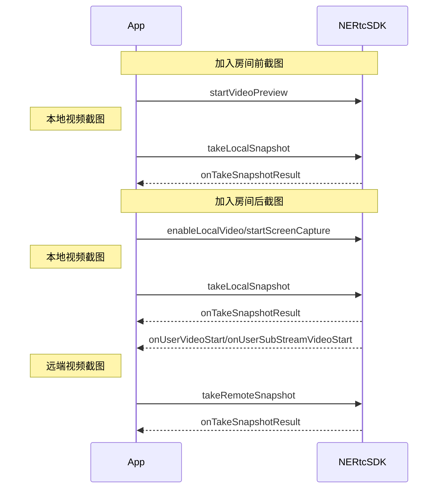

<!--keywords:音视频通话,视频截图-->

在音视频通话场景中，部分用户希望可以通过视频截图功能截取实时视频流画面，以便后续的存档分析、事件备忘、证据留存等等。NERTC SDK 提供视频截图功能，本文档为您介绍如何通过 <a href="https://doc.yunxin.163.com/nertc/references/flutter/dartdoc/Latest/zh/nertc/NERtcEngine/takeLocalSnapshot.html" target="_blank">`takeLocalSnapshot`</a> 和 <a href="https://doc.yunxin.163.com/nertc/references/flutter/dartdoc/Latest/zh/nertc/NERtcEngine/takeRemoteSnapshot.html" target="_blank">`takeRemoteSnapshot`</a> 方法进行实时截图。

## 功能介绍

NERTC SDK 支持针对实时视频流进行截图，包括本地主流和辅流画面、远端主流和辅流画面。
<br>视频截图适用于在线教育以及主播直播等场景中，具体场景说明如下：
- 在线课堂场景中，学生对课件或板书内容进行截图，截图作为笔记保存。
- 互动直播场景中，可以通过截图对直播画面进行内容安全审核。

## 注意事项
- 视频截图功能只截取实时视频流数据，截图中**不包含画布水印**信息，但可以<b>包含编码水印</b>信息。
- 截图相关接口调用时机如下，如果在其他时机调用截图相关接口，会报错 `ERR_INVALID_OPERATION`，表示当前不支持该操作。

## 实现方法

### API 调用时序


  

### 配置步骤

1. 根据需求调用截图相关接口，实现视频流截图。

- 本地视频主流截图：

    - 加入房间前，在调用 <a href="https://doc.yunxin.163.com/nertc/references/flutter/dartdoc/Latest/zh/nertc/NERtcEngine/startVideoPreview.html" target="_blank">`startVideoPreview(streamType: NERtcVideoStreamType.main)`</a> 方法开启视频预览后，调用 <a href="https://doc.yunxin.163.com/nertc/references/flutter/dartdoc/Latest/zh/nertc/NERtcEngine/takeLocalSnapshot.html" target="_blank">`takeLocalSnapshot`</a> 方法，并设置 `NERtcVideoStreamType` 为 `main` 截取本地主流画面，并传入图片存放的绝对路径`path`。

    - 加入房间后，在调用 <a href="https://doc.yunxin.163.com/nertc/references/flutter/dartdoc/Latest/zh/nertc/NERtcEngine/startVideoPreview.html" target="_blank">`enableLocalVideo(streamType: NERtcVideoStreamType.main)`</a> 开启本地摄像头采集后，调用 <a href="https://doc.yunxin.163.com/nertc/references/flutter/dartdoc/Latest/zh/nertc/NERtcEngine/takeLocalSnapshot.html" target="_blank">`takeLocalSnapshot`</a> 方法，并设置 `NERtcVideoStreamType` 为 `main` 截取本地主流画面，并传入图片存放的绝对路径`path`。

- 本地视频辅流截图：

    - 加入房间前，在调用 <a href="https://doc.yunxin.163.com/nertc/references/flutter/dartdoc/Latest/zh/nertc/NERtcEngine/startVideoPreview.html" target="_blank">`startVideoPreview(streamType: NERtcVideoStreamType.sub)`</a> 方法开启视频预览后，调用 <a href="https://doc.yunxin.163.com/nertc/references/flutter/dartdoc/Latest/zh/nertc/NERtcEngine/takeLocalSnapshot.html" target="_blank">`takeLocalSnapshot`</a> 方法，并设置 `NERtcVideoStreamType` 为 `sub` 截取本地辅流画面，并传入图片存放的绝对路径`path`。

    - 加入房间后，在调用 <a href="https://doc.yunxin.163.com/nertc/references/flutter/dartdoc/Latest/zh/nertc/NERtcEngine/startVideoPreview.html" target="_blank">`enableLocalVideo(streamType: NERtcVideoStreamType.sub)`</a> 开启本地摄像头采集后，调用 <a href="https://doc.yunxin.163.com/nertc/references/flutter/dartdoc/Latest/zh/nertc/NERtcEngine/takeLocalSnapshot.html" target="_blank">`takeLocalSnapshot`</a> 方法，并设置 `NERtcVideoStreamType` 为 `sub` 截取本地辅流画面，并传入图片存放的绝对路径`path`。

    - 加入房间后，在调用 <a href="https://doc.yunxin.163.com/nertc/references/flutter/dartdoc/Latest/zh/nertc/NERtcEngine/startScreenCapture.html" target="_blank">`startScreenCapture`</a> 方法启用屏幕共享后，调用 <a href="https://doc.yunxin.163.com/nertc/references/flutter/dartdoc/Latest/zh/nertc/NERtcEngine/takeLocalSnapshot.html" target="_blank">`takeLocalSnapshot`</a> 方法，并设置 `NERtcVideoStreamType` 为 `sub` 截取本地辅流画面，并传入图片存放的绝对路径`path`。

- 远端视频主/辅流截图：

    在分别收到 <a href="https://doc.yunxin.163.com/nertc/references/flutter/dartdoc/Latest/zh/nertc/NERtcChannelEventCallback/onUserVideoStart.html" target="_blank">`onUserVideoStart`</a> 与 <a href="https://doc.yunxin.163.com/nertc/references/flutter/dartdoc/Latest/zh/nertc/NERtcChannelEventCallback/onUserSubStreamVideoStart.html" target="_blank">`onUserSubStreamVideoStart`</a> 回调后，调用 <a href="https://doc.yunxin.163.com/nertc/references/flutter/dartdoc/Latest/zh/nertc/NERtcEngine/takeRemoteSnapshot.html" target="_blank">`takeRemoteSnapshot`</a> 方法截取远端视频流画面，截图时可以通过 `NERtcVideoStreamType` 指定截取的视频流是主流还是辅流。

2. 通过回调的方式获取截图文件。

    成功截图的画面数据存放在传入的`path`中，通过`NERtcChannelEventCallback`</a> 类的 <a href="https://doc.yunxin.163.com/nertc/references/flutter/dartdoc/Latest/zh/nertc/NERtcChannelEventCallback/onTakeSnapshotResult.html" target="_blank">`onTakeSnapshotResult`</a> 回调返回。


## 示例代码

```
//本地截图
int ret = await _engine.takeLocalSnapshot(NERtcVideoStreamType.main, path);

//成功截图的画面数据存放在[path]中，通过 [NERtcChannelEventCallback.onTakeSnapshotResult] 回调返回。
@override
  void onTakeSnapshotResult(int code, String path) {}
        
//远端截图
int ret = await _engine.takeRemoteSnapshot(user.userId, NERtcVideoStreamType.main, path);
//成功截图的画面数据存放在[path]中，通过 [NERtcChannelEventCallback.onTakeSnapshotResult] 回调返回。
@override
  void onTakeSnapshotResult(int code, String path) {}
  
```
## API 参考
| **方法** | **功能描述**|
|:--|:--|
|<a href="https://doc.yunxin.163.com/nertc/references/flutter/dartdoc/Latest/zh/nertc/NERtcEngine/startVideoPreview.html" target="_blank">`enableLocalVideo`</a>|开启或关闭本地视频采集。|
|<a href="https://doc.yunxin.163.com/nertc/references/flutter/dartdoc/Latest/zh/nertc/NERtcEngine/takeLocalSnapshot.html" target="_blank">`takeLocalSnapshot`</a> |截取本地视频流画面|
|<a href="https://doc.yunxin.163.com/nertc/references/flutter/dartdoc/Latest/zh/nertc/NERtcEngine/takeRemoteSnapshot.html" target="_blank">`takeRemoteSnapshot`</a> |截取远端视频流画面|
|<a href="https://doc.yunxin.163.com/nertc/references/flutter/dartdoc/Latest/zh/nertc/NERtcChannelEventCallback/onTakeSnapshotResult.html" target="_blank">`onTakeSnapshotResult`</a>|截图结果回调|