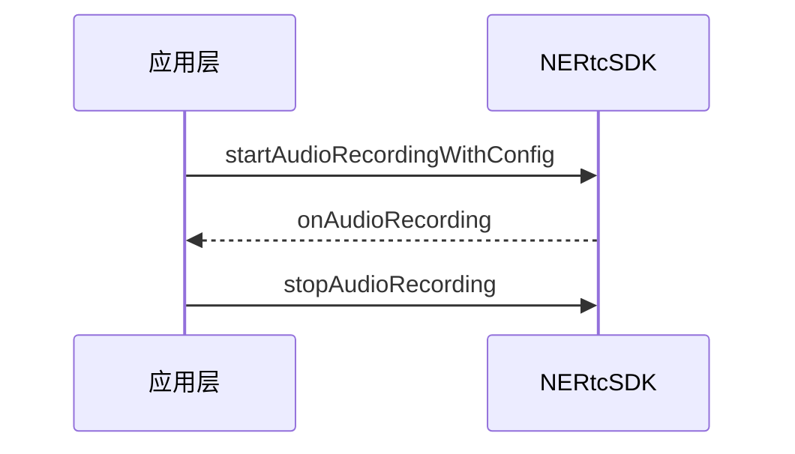

NERTC SDK 在实时音视频通话过程中，支持客户端录制和服务端录制两种录制方式。其中客户端录制支持对通话过程的实时音频录制和循环缓存录制，录制文件保存在用户本地设备中，适用于通话过程录音场景及对游戏场景中对音频问题的定位和排查。

## 功能介绍
客户端音频录制指在通话过程中将房间内混流后的音频流录制下来，并存放在用户本地设备中以供后续回放或存档。NERTC SDK 支持通过客户端进行实时音频录制或循环缓存录制，每次录制生成一个音频文件，其中包含房间内所有用户混流后的音频数据。开启录制时可以指定录制文件的存放路径、格式和内容、录制采样率及音质、循环缓存最大时长等。

目前支持的音频格式包括：
- WAV：文件大，音质保真度高。
- AAC：文件小，有一定的音质损失。

::: note note
播放录制文件时，您可以选择使用系统默认的播放器，或者使用网易云信播放器 SDK，具体请参考[点播](https://doc.yunxin.163.com/jY3NDM4Nzc/docs/jgyNzg2NzY?platform=android)。
:::

## 注意事项

- 文件后缀必须以 `.wav` 或 `.aac` 结尾。

- 加入房间后才能开始录音。

- 客户端只能同时运行一个录音任务。正在录音时，若您重复调用音频录制接口，会结束当前录音任务，并重新开始新的录音任务。

- 在您离开房间时，录音任务会自动停止。您也可以在通话中随时调用 <a href="https://doc.yunxin.163.com/nertc/references/flutter/dartdoc/Latest/zh/nertc/NERtcEngine/stopAudioRecording.html" target="_blank">`stopAudioRecording`</a> 方法手动停止录音。

- 调用原先的 <a href="https://doc.yunxin.163.com/nertc/references/flutter/dartdoc/Latest/zh/nertc/NERtcEngine/startAudioRecording.html" target="_blank">`startAudioRecording`</a> 方法只能进行实时音频录制，调用全新的 <a href="https://doc.yunxin.163.com/nertc/references/flutter/dartdoc/Latest/zh/nertc/NERtcEngine/startAudioRecordingWithConfig.html" target="_blank">`startAudioRecordingWithConfig`</a> 方法可以进行实时音频录制或循环缓存录制，网易云信推荐您使用新版接口，方便您自由切换录制模式；调用其中任意一个音频录制接口且未停止的情况下，调用另外一个接口会自动结束本次音频录制，并开始新的音频录制。

- 在循环缓存录制模式下，若音频录制时长超过指定缓存时长，则最新音频数据会对原先的音频轨道进行覆盖；例如：设置缓存时长为 15 分钟，音频录制时长为 20 分钟，最终生成第 5 至 第 20 分钟的音频录制文件。

## 实现方法

### **API 调用时序**



  


### **配置步骤**

1. 监听 `NERtcChannelEventCallback` 方法设置录制功能的 <a href="https://doc.yunxin.163.com/nertc/references/flutter/dartdoc/Latest/zh/nertc/NERtcChannelEventCallback/onAudioRecording.html" target="_blank">`onAudioRecording`</a> 回调以接收录制过程中的录制信息。
2. 在加入房间后，调用 <a href="https://doc.yunxin.163.com/nertc/references/flutter/dartdoc/Latest/zh/nertc/NERtcEngine/startAudioRecordingWithConfig.html" target="_blank">`startAudioRecordingWithConfig`</a> 方法开启音频录制。调用此方法时，您需要设置 `recordFilePath`、`recordSampleRate` 等参数指定录音文件的配置。相关参数的含义如下。

    - `filePath`：录音文件在本地保存的绝对路径，例如：`sdcard/xxx/audio.aac`。目前仅支持 WAV 或 AAC 文件格式。

    - `recordSampleRate`：录音采样率。该参数单位为 Hz，可以取值为 16000、32000、44100 或 48000，默认值为 32000。

    - `quality`：录音音质。可以指定 AAC 格式的录音文件为低音质、中音质或高音质，默认为中音质。
    
    - `position`：录音对象。相关枚举值如下。
        - mixedRecordingandPlayback（默认）：录制房间内所有成员混流后的音频数据。
        - recording：仅录制本地用户发布的音频流。
        - mixedPlayback：仅录制所有远端用户混流后的音频数据。

    - `cycleTime`：循环缓存的最大时长跨度。该参数单位为秒，可以取值为 0、10、60、360、900，默认值为 0，即实时写文件。

3. 启用该方法后，SDK 会触发 <a href="https://doc.yunxin.163.com/nertc/references/flutter/dartdoc/Latest/zh/nertc/NERtcChannelEventCallback/onAudioRecording.html" target="_blank">`onAudioRecording`</a> 回调，返回音频录制状态及录音文件保存路径。

4. 需要结束音频录制时，调用 <a href="https://doc.yunxin.163.com/nertc/references/flutter/dartdoc/Latest/zh/nertc/NERtcEngine/stopAudioRecording.html" target="_blank">`stopAudioRecording`</a> 方法手动停止音频录制，同时 SDK 会触发相关回调。

    ::: note note
    若您离开房间前未手动停止录音，离开房间后录音进程会自动结束；若您未手动停止本次音频录制又再次调用 <a href="https://doc.yunxin.163.com/nertc/references/flutter/dartdoc/Latest/zh/nertc/NERtcEngine/startAudioRecordingWithConfig.html" target="_blank">`startAudioRecordingWithConfig`</a> 方法，本次录音文件会自动保存至本地指定路径，并开启新的录制任务。
    :::

### **示例代码**

以实时音频录制为例，示例代码如下。

```
//设置回调
_engine.setEventCallback(this);

if (open) {
    NERtcAudioRecordingConfiguration config = NERtcAudioRecordingConfiguration(
              filePath: mFilePath,
              sampleRate: mSampleRate,
              quality: mQuality,
              position: mPosition,
              cycleTime: mCycleTime)
    ret = await _engine.startAudioRecordingWithConfig(config);
} 
else {
    ret = await _engine.stopAudioRecording();
}

   //收到录制回调
   @override
   void onAudioRecording(int code, String filePath) {
    switch (code) {
      case NERtcAudioRecordingCode.errorSuffix:
        {
          //后缀名非法，目前只支持 .aac 或者 .wav 文件
        }
        break;
      case NERtcAudioRecordingCode.openFileFailed:
        {
          //无法创建录音文件，原因通常包括：1) 应用没有磁盘写入权限 2) 文件路径不存在
        }
        break;
      case NERtcAudioRecordingCode.start:
        {
          //接口调用成功，开始录制回调
        }
        break;
      case NERtcAudioRecordingCode.error:
        {
          //录制错误，原因通常为磁盘空间已满，无法写入
        }
        break;
      case NERtcAudioRecordingCode.finish:
        {
          //录制完成，结束。
        }
        break;
      default:
        break;
    }
   }


```

## API 参考

| **方法** | **功能描述**|
|:--|:--|
|<a href="https://doc.yunxin.163.com/nertc/references/flutter/dartdoc/Latest/zh/nertc/NERtcEngine/startAudioRecording.html" target="_blank">`startAudioRecording`</a>|开启实时音频录制|
|<a href="https://doc.yunxin.163.com/nertc/references/flutter/dartdoc/Latest/zh/nertc/NERtcEngine/startAudioRecordingWithConfig.html" target="_blank">`startAudioRecordingWithConfig`</a>|开启实时音频录制或音频缓存录制|
|<a href="https://doc.yunxin.163.com/nertc/references/flutter/dartdoc/Latest/zh/nertc/NERtcChannelEventCallback/onAudioRecording.html" target="_blank">`onAudioRecording`</a> |音频录制回调|
|<a href="https://doc.yunxin.163.com/nertc/references/flutter/dartdoc/Latest/zh/nertc/NERtcEngine/stopAudioRecording.html" target="_blank">`stopAudioRecording`</a> |停止音频录制|