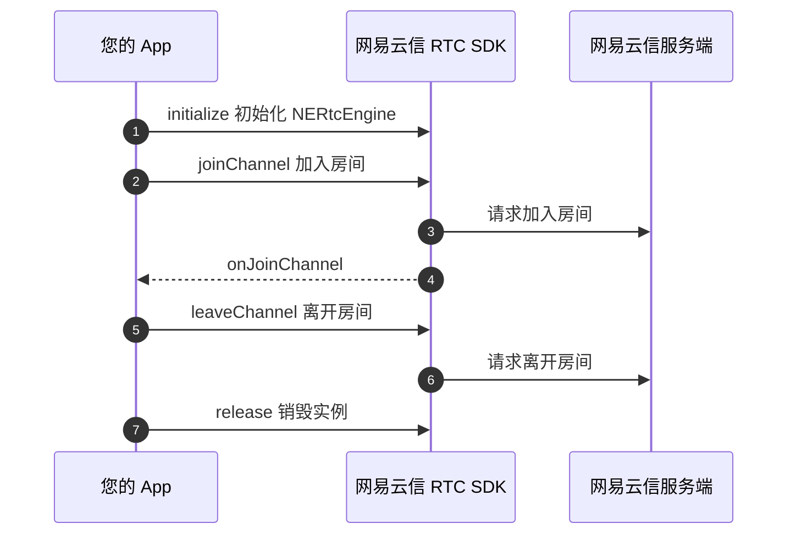
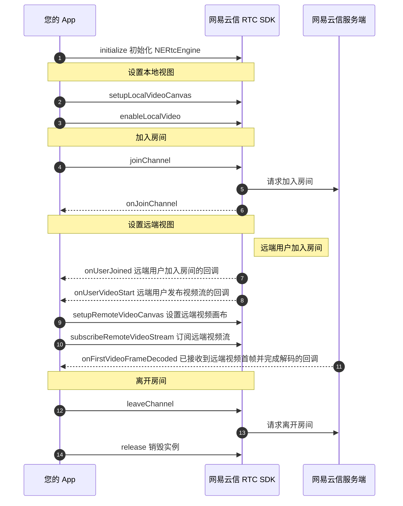

<!--和互动直播对应文档步骤不一致，请勿直接替换。相比互动直播文档，增加跑通示例代码、删除部分推流步骤-->

网易云信音视频通话产品的基本功能包括高质量的实时音视频通话。当您成功初始化 SDK 之后，您可以简单体验本产品的基本业务流程。本文为您展示音视频通话提供的基本业务流程。

## <span id="前提条件">前提条件</span>

请确认您已完成以下操作：

- [创建应用并获取 App Key](https://doc.yunxin.163.com/console/guide/TIzMDE4NTA?platform=console)。
- [开通音视频通话 2.0 服务](https://doc.yunxin.163.com/console/concept/zc3NDYzNzc?platform=console)。
- [集成 SDK（Harmony）](https://doc.yunxin.163.com/nertc/quick-start/zYzNjI3OTY)，并为 SDK **添加必要的设备权限**。

## <span id="示例代码">示例代码</span>

网易云信为您提供完整的 **创建界面** 及 **实现基础音视频通话** 的示例代码作为参考，您可以直接拷贝用于运行测试。

::: details 单击查看运行 SDK 前的 module.json5 权限配置。

在 `entry/src/main/module.json5` 中增加 `requestPermissions`：

```JSON
"requestPermissions": [
  {
    "name": "ohos.permission.INTERNET" // 网络权限
  },
  {
    "name": "ohos.permission.MICROPHONE" // 麦克风权限
  },
  {
    "name": "ohos.permission.CAMERA" // 相机权限
  }
]
```
:::

::: details 单击查看实现音视频通话的完整示例代码。

```TypeScript
import common from '@ohos.app.ability.common';
import { NERtcVideoView , NERtcSDK, NERtcConstants, NERtcCallbackEx} from '@nertc/nertc_sdk';
import prompt from '@ohos.promptAction';
import AbilityAccessCtrl from '@ohos.abilityAccessCtrl';
class User {
  uid: bigint = BigInt(0);
  width?: number = 150;
  height?: number = 150;
  local?: boolean = false; // Is yourself?
}

interface LoginInfo {
  cname: string;
  uid: string;
}
interface Delegate {
  onUserJoin?:(uid: bigint) => void
  onUserLeave?:(uid: bigint, reason: number) => void
}
@Entry
@Component
struct Index {
  @State message: string = 'Hello World';
  TAG: string = "VideoCall"
  context = getContext(this) as common.UIAbilityContext;
  login: LoginInfo = {
    cname: "1392",
    uid: Math.floor(Math.random() * 10000).toString()
  };
  joinFlag: boolean = false
  @State local?: User = undefined
  @State remote?: User = undefined
  delegate: Delegate ={
    onUserJoin:(uid: bigint): void => {
      console.info(this.TAG, `User: ${uid} joined.`)
      if(this.remote == undefined) {
        this.remote = { uid: uid }
        console.info(this.TAG, 'Create Remote User.')
      }
    },

    onUserLeave:(uid: bigint, reason: number): void => {
      console.info(this.TAG, `User: ${uid} leave.`)
      if(this.remote && this.remote.uid === uid) {
        this.remote = undefined
      }
    }
  }
  onPageShow() {
    console.info(this.TAG, '=== CallPage show ===')
    this.RequestPermission()
  }

  build() {
    Row() {
      Column() {
        Text("单击屏幕加入房间")
        Flex({ direction: FlexDirection.Column }) {
          Stack({ alignContent: Alignment.BottomStart }) {
            Stack({ alignContent: Alignment.TopEnd }){

              if(this.remote) {
                NERtcVideoView ({
                  sCanvasId: String(this.remote.uid),
                  onLoad: (() => {
                    if(this.remote) {
                      console.info(this.TAG, `User: ${String(this.remote?.uid)} surface create.`)
                      this.attach(this.remote)
                    }
                  }),
                  onDestroy: (() => {
                    if(this.remote) {
                      console.info(this.TAG, `User: ${String(this.remote?.uid)} surface release.`)
                    }
                  })
                }).width('100%').height('100%')
              }

              if(this.local) {
                NERtcVideoView({
                  sCanvasId: String(this.local.uid),
                  onLoad: (() => {
                    console.info(this.TAG, `User: ${this.local?.uid} surface create.`)
                    if(this.local) this.attach(this.local)
                  }),
                  onDestroy: (() => {
                    console.info(this.TAG, `User: ${this.local?.uid} surface release.`)
                  })
                }).width(this.remote ? 200 : '100%').height(this.remote ? 200 : '100%')
              }

            }.width('100%').height('100%')
          }.width('100%').height('100%')
        }.onClick(() => {
          if(!this.joinFlag) {
            //单击屏幕入会
            let option: NERtcConstants.NERtcOption = { logLevel: NERtcConstants.LogLevel.INFO }
            NERtcSDK.getInstance().init(getContext(), "your-app-key", new ChatCallback(this.delegate), option)
            NERtcSDK.getInstance().enableLocalVideo(true, NERtcConstants.NERtcVideoStreamType.kNERtcVideoStreamTypeMain)
            NERtcSDK.getInstance().joinChannel('', this.login.cname, BigInt(this.login.uid))
            this.local = { uid: BigInt(this.login.uid ?? 0) }
            this.joinFlag = !this.joinFlag
          }else{
            NERtcSDK.getInstance().leaveChannel()
            NERtcSDK.getInstance().release()
            this.joinFlag = !this.joinFlag
          }
        })
      }
      .width('100%')
    }
    .height('100%')
  }

  attach(user: User) {

    let canvas: NERtcConstants.NERtcVideoCanvas = { canvasId: String(user.uid) }
    let local = String(user.uid) === this.login?.uid
    console.info(this.TAG, ' local' + user.uid + 'local2' + this.login?.uid)
    if(local) {
      let ret = NERtcSDK.getInstance().setupLocalVideoCanvas(canvas)
      console.info(this.TAG, 'setLocalVideoCanvas ret:' + ret)
    } else {
      let ret = NERtcSDK.getInstance().setupRemoteVideoCanvas(canvas, user.uid)
      console.info(this.TAG, 'setupRemoteVideoCanvas ret:' + ret)
      NERtcSDK.getInstance().subscribeRemoteVideo(user.uid, true, NERtcConstants.NERtcVideoStreamType.kNERtcVideoStreamTypeMain, NERtcConstants.NERtcRemoteVideoSubscribeType.kNERtcRemoteVideoSubscribeTypeHigh)
    }
  }

  async RequestPermission() {
    let atManager = AbilityAccessCtrl.createAtManager();
    let context = getContext(this);
    try {
      atManager.requestPermissionsFromUser(
        context,
        ["ohos.permission.CAMERA","ohos.permission.MICROPHONE"],
        (err, data) =>
        {
          if(err) {
            prompt.showToast({message: ` 请求权限失败: ${err}`})
            return
          }
          let micGrant: boolean = data.authResults[1] === AbilityAccessCtrl.GrantStatus.PERMISSION_GRANTED;
          let cameraGrant: boolean = data.authResults[0] === AbilityAccessCtrl.GrantStatus.PERMISSION_GRANTED;

          if(!micGrant) {
            prompt.showToast({ message: "麦克风权限未授予" })
          }
          if(!cameraGrant) {
            prompt.showToast({message: "摄像头权限未授予" })
          }
        })
    } catch(err) {
      prompt.showToast({ message: `请求权限失败: ${JSON.stringify(err)}`})
    }
  }
}
class ChatCallback extends NERtcCallbackEx {
  delegate: Delegate
  constructor(delegate: Delegate) {
    super()
    this.delegate = delegate;
  }
  onJoinChannel(result: number, channelId: bigint, elapsed: bigint, uid: bigint): void {
    prompt.showToast({ message: 'Join channel async result:' + result, duration: 2000 })
  }

  onLeaveChannel(result: number): void {

  }

  onUserJoined(uid: bigint, extraInfo?: NERtcConstants.NERtcUserJoinExtraInfo): void {
    if(this.delegate) {
      if (!this.delegate.onUserJoin) throw new Error("onUserJoin not find");
      this.delegate?.onUserJoin(uid)
    }
  }

  onUserLeave(uid: bigint, reason: number, extraInfo?: NERtcConstants.NERtcUserLeaveExtraInfo): void {
    if(this.delegate) {
      if (!this.delegate.onUserLeave) throw new Error("onUserJoin not find");
      this.delegate?.onUserLeave(uid, reason)
    }
  }

  onUserAudioStart(uid: bigint): void {

  }

  onUserAudioStop(uid: bigint): void {

  }

  onUserVideoStart(uid: bigint, maxProfile: number): void {

  }

  onUserVideoStop(uid: bigint): void {

  }
  onLastmileQuality(quality: number):void {

  }
  onLastmileProbeResult(result: NERtcConstants.LiteSDKProbeResult):void {

  }
  onDisconnect(reason: number): void {

  }

  onClientRoleChange(oldRole: number, newRole: number): void {

  }

  onRecvSEIMsg(userId: bigint, data: Uint8Array, dataSize: number): void {

  }
}
```
:::

## 实现流程

### 音频通话

实现 **音频通话** 的 API 调用时序如下图所示。



### 视频通话

实现 **视频通话** 的 API 调用时序如下图所示。



## <span id="实现音视频通话">实现音视频通话</span>

### 一：（可选）创建音视频通话界面

::: details 您可以参考此步骤根据业务场景创建相应的音视频通话界面，若您已实现相应界面，请忽略该步骤。

实现基础的音视频通话，建议您参考 [示例代码](#示例代码) 完成界面创建。

<!-- 效果图如下图所示。-->

<!--  -->

:::

### <span id="2.导入类">二：导入类</span>

在您的工程中 `oh-package.json5` 文件中添加对 NERTC SDK 的依赖：

```JSON
 "dependencies": {
    '@nertc/nertc_sdk': "file:./src/main/libs/nertc_sdk.har"
  }
```

在您的工程中对应实现音视频通话的 ets 文件里添加如下代码先导入以下重要类：

```TypeScript
import { NERtcVideoView , NERtcSDK, NERtcConstants, NERtcCallbackEx} from '@nertc/nertc_sdk';
```

### <span id="3.初始化">三：初始化</span>

默认情况下，请在导入后的文件中先执行 [`init`](https://doc.yunxin.163.com/docs/interface/nertc/harmonyos/typedoc/Latest/zh/interfaces/NERtc.NERtc.html#init) 方法完成初始化。

::: note notice
您需要将 `App_Key` 替换为您的应用对应的 App Key。
:::

**示例代码** 如下：

```TypeScript
class ChatCallback extends NERtcCallbackEx {
  //...
}

initializeSDK() {
    NERtcSDK.getInstance().init(getContext(), "your-app-key", new ChatCallback(), option);
     ...
}
```

为了实现标准音视频通话业务，您还需要在初始化时 **注册相关必要回调**，建议您请在初始化方法中传入原型为 `NERtcCallbackEx` 的以下回调，并增加相应必要的处理。

```TypeScript
//NERtcCallbackEx 重要回调

//本端用户加入房间结果回调
onJoinChannel(result: number, channelId: bigint, elapsed: bigint, uid: bigint): void {
    if (result == NERtcConstants.ErrorCode.NO_ERROR) {
      // 加入房间成功
    } else {
      // 加入房间失败，退出页面
    }
}

//本端用户离开房间回调
onLeaveChannel(result: number): void {

}

//远端用户加入房间
onUserJoined(uid: bigint, extraInfo?: NERtcConstants.NERtcUserJoinExtraInfo): void {

}

//远端用户离开房间
onUserLeave(uid: bigint, reason: number, extraInfo?: NERtcConstants.NERtcUserLeaveExtraInfo): void {

}

//远端用户打开音频
onUserAudioStart(uid: bigint): void {

}

//远端用户关闭音频
onUserAudioStop(uid: bigint): void {

}

//远端用户打开视频，建议在此按需设置画布及订阅视频
onUserVideoStart(uid: bigint, maxProfile: number): void {

}

//远端用户关闭视频，可释放之前绑定的画布
onUserVideoStop(uid: bigint): void {

}

//与服务器断连，退出页面
onDisconnect(reason: number): void {

}
```

### <span id="4.设置本地视图">四：设置本地视图</span>

初始化成功后，可以设置本地视图，来预览本地图像。您可以根据业务需要实现加入房间之前预览或加入房间后预览。

::: note note
- 若您想设置画布渲染参数，可以调用 `setScalingType` 方法设置渲染缩放模式或调用 `setMirror` 方法设置镜像模式。
- 若您想调整摄像头的相关参数，请参考 [视频设备管理](https://doc.yunxin.163.com/nertc/quick-start/Tc5MjY3ODM?platform=harmony) 进行设置。
- 在加入房间前，默认预览分辨率为 640*480，您可以通过 [`setLocalVideoConfig`](https://doc.yunxin.163.com/docs/interface/nertc/harmonyos/typedoc/Latest/zh/interfaces/NERtc.NERtc.html#setlocalvideoconfig) 接口的 `width ` 和 `height` 参数调整采集分辨率。
:::

- 实现加入房间前预览。

    1. 调用 [`setupLocalVideoCanvas`](https://doc.yunxin.163.com/docs/interface/nertc/harmonyos/typedoc/Latest/zh/interfaces/NERtc.NERtc.html#setuplocalvideocanvas) 与 [`startVideoPreview(streamType)`](https://doc.yunxin.163.com/docs/interface/nertc/harmonyos/typedoc/Latest/zh/interfaces/NERtc.NERtc.html#startvideopreview) 方法，在加入房间前设置本地视图，预览本地图像。需要注意的一点是传入给 NERTC SDK `canvasId` 需要和画布 `NERtcVideoView` 中的 `sCanvasId` 保持一致，示例代码是通过用户 ID 来保证的。

        **示例代码** 如下：

        ```TypeScript
        class User {
            uid: bigint = BigInt(0);
            width?: number = 150;
            height?: number = 150;
            local?: boolean = false; // Is yourself?
        }
        attach(user: User) {
            let canvas: NERtcConstants.NERtcVideoCanvas = { canvasId: String(user.uid) }
            let local = String(user.uid) === this.login?.uid
            console.info(this.TAG, ' local' + user.uid + 'local2' + this.login?.uid)
            if(local) {
                let ret = NERtcSDK.getInstance().setupLocalVideoCanvas(canvas)
                console.info(this.TAG, 'setLocalVideoCanvas ret:' + ret)
                }
            }
        NERtcSDK.getInstance().startVideoPreview(NERtcConstants.NERtcVideoStreamType.kNERtcVideoStreamTypeMain)
        NERtcVideoView({
            sCanvasId: String(this.local.uid),
            onLoad: (() => {
                console.info(this.TAG, `User: ${this.local?.uid} surface create.`)
                if(this.local) this.attach(this.local) //调用 attach 方法绑定画布
            }),
            onDestroy: (() => {
                console.info(this.TAG, `User: ${this.local?.uid} surface release.`)
            })
        }).width(this.remote ? 200 : '100%').height(this.remote ? 200 : '100%')

        ```

    2. 若要结束预览，或者准备加入房间时，调用 [`stopVideoPreview(streamType)`](https://doc.yunxin.163.com/docs/interface/nertc/harmonyos/typedoc/Latest/zh/interfaces/NERtc.NERtc.html#stopvideopreview) 方法停止预览。

        ::: note note
        [`stopVideoPreview(streamType)`](https://doc.yunxin.163.com/docs/interface/nertc/harmonyos/typedoc/Latest/zh/interfaces/NERtc.NERtc.html#stopvideopreview) 的 `streamType` 参数请与 [`startVideoPreview(streamType)`](https://doc.yunxin.163.com/docs/interface/nertc/harmonyos/typedoc/Latest/zh/interfaces/NERtc.NERtc.html#startvideopreview) 的保持一致，即同为主流或辅流的开启和停止预览。
        :::

- 实现加入房间后预览。

    调用 [`setupLocalVideoCanvas`](https://doc.yunxin.163.com/docs/interface/nertc/harmonyos/typedoc/Latest/zh/interfaces/NERtc.NERtc.html#setuplocalvideocanvas) 设置本地视图，再调用 [`enableLocalVideo(streamType)`](https://doc.yunxin.163.com/docs/interface/nertc/harmonyos/typedoc/Latest/zh/interfaces/NERtc.NERtc.html#enablelocalvideo) 方法进行视频的采集发送与预览。成功加入房间后，即可预览本地图像。

    **示例代码** 如下：

    ```TypeScript
      class User {
          uid: bigint = BigInt(0);
          width?: number = 150;
          height?: number = 150;
          local?: boolean = false; // Is yourself?
      }
      attach(user: User) {
        let canvas: NERtcConstants.NERtcVideoCanvas = { canvasId: String(user.uid) }
        let local = String(user.uid) === this.login?.uid
        console.info(this.TAG, ' local' + user.uid + 'local2' + this.login?.uid)
        if(local) {
          let ret = NERtcSDK.getInstance().setupLocalVideoCanvas(canvas)
          console.info(this.TAG, 'setLocalVideoCanvas ret:' + ret)
        }
        }
        NERtcSDK.getInstance().enableLocalVideo(true, NERtcConstants.NERtcVideoStreamType.kNERtcVideoStreamTypeMain)
        NERtcVideoView({
          sCanvasId: String(this.local.uid),
          onLoad: (() => {
            console.info(this.TAG, `User: ${this.local?.uid} surface create.`)
            if(this.local) this.attach(this.local) //调用 attach 方法绑定画布
          }),
          onDestroy: (() => {
            console.info(this.TAG, `User: ${this.local?.uid} surface release.`)
          })
        }).width(this.remote ? 200 : '100%').height(this.remote ? 200 : '100%')

    ```

### <span id="5.加入房间">五：加入房间</span>

加入房间前，请确保已完成初始化相关事项。若您的业务中涉及呼叫邀请等机制，建议通过 [信令](https://doc.yunxin.163.com/signaling/concept?platform=android) 实现，总体实现流程请参考 [一对一会话操作流程](https://doc.yunxin.163.com/signaling/quick-start/DE2MTc5MTQ?#%E4%B8%80%E5%AF%B9%E4%B8%80%E4%BC%9A%E8%AF%9D%E6%93%8D%E4%BD%9C%E6%B5%81%E7%A8%8B)，具体呼叫邀请机制的实现请参考 [邀请机制](https://doc.yunxin.163.com/signaling/quick-start/zc3NDkzNDU?)。

调用 [`joinChannel`](https://doc.yunxin.163.com/docs/interface/nertc/harmonyos/typedoc/Latest/zh/interfaces/NERtc.NERtc.html#joinchannel) 方法加入房间。

**示例代码** 如下：

```TypeScript
NERtcSDK.getInstance().joinChannel(token,channelName,uid,channelOptions);
```

**参数说明**：

<table>
  <tr>
    <th width="30%"><b>参数</b></th>
    <th width="60%"><b>说明</b></th>
  </tr>
  <tr>
    <td>token</td>
    <td>安全认证签名（NERTC Token）。<br><ul><li>调试模式下：可设置为 null。产品默认为安全模式，您可以在网易云信控制台将鉴权模式修改为调试模式，具体请参考 <a href="https://doc.yunxin.163.com/nertc/quick-start/jI4NjcyMjk?platform=harmony" target="_blank">Token 鉴权</a>。<br><b>调试模式的安全性不高，请在产品正式上线前修改为安全模式。</b><li>产品正式上线后：请设置为已获取的 <a href="https://doc.yunxin.163.com/nertc/quick-start/jI4NjcyMjk?platform=harmony#%E7%94%B3%E8%AF%B7%20Token" target="_blank">Token</a>。安全模式下必须设置为获取到的 Token。若未传入正确的 Token 将无法进入房间。<p><b>推荐使用安全模式</b>。</td>
  </tr>
    <tr>
    <td>channelName</td>
    <td>房间名称，长度为 1 ~ 64 字节。目前支持以下 89 个字符：a-z, A-Z, 0-9, space, !#$%&()+-:;≤.,>? @[]^_{|}~"。<br>设置相同房间名称的用户会进入同一个通话房间。<br><note type="note">您也可以在加入通道前，通过 <a href="https://doc.yunxin.163.com/nertc/quick-start/jg3NjcyNTE" target="_blank">创建房间</a> 接口创建房间。加入房间时，若传入的 {channelName} 未事先创建，则网易云信服务器内部将为其自动创建一个名为 {channelName} 的通话房间。</note></li></td>
  </tr>
    <tr>
    <td>uid</td>
    <td>用户的唯一标识 ID，为数字串，房间内每个用户的 uid 必须是唯一的。<note type="notice">此 uid 为用户在您应用中的 ID，请在您的业务服务器上自行管理并维护。</note></td>
  </tr>
    <tr>
    <td>channelOptions</td>
    <td>加入房间时可以设置携带一些特定信息，包括高级权限密钥。默认值为 NULL，具体请参考 `NERtcJoinChannelOptions`。</td>
  </tr>
</table>

::: note note
- SDK 发起加入房间请求后，服务器会进行响应，您可以通过 [`NERtcCallback`](https://doc.yunxin.163.com/docs/interface/nertc/harmonyos/typedoc/Latest/zh/interfaces/NERtcCallback.NERtcCallback.html) 的 [`onJoinChannel`](https://doc.yunxin.163.com/docs/interface/nertc/harmonyos/typedoc/Latest/zh/interfaces/NERtcCallback.NERtcCallback.html#onjoinchannel) 回调监听加入房间的结果，同时该回调会抛出当前通话房间的 **channelId** 与加入房间总耗时（毫秒）。其中 `channelId` 即音视频通话的 ID，建议您在业务层保存该数据，以便于后续问题排查。

- 成功加入房间之后，您可以通过监听 [`onConnectionStateChanged`](https://doc.yunxin.163.com/docs/interface/nertc/harmonyos/typedoc/Latest/zh/classes/NERtcCallback.NERtcCallbackEx.html#onconnectionstatechanged) 回调实时监控自己在本房间内的连接状态。
:::

### <span id="6.设置远端视图并发起订阅">六：设置远端视图并发起订阅</span>

音视频通话过程中，除了要显示本地的视频画面，通常也要显示参与互动的其他连麦者/主播的远端视频画面。

::: details 单击展开查看设置远端视图并订阅的完整示例代码。
```TypeScript
//对方开启视频，按需设置画布及订阅视频

let ret = NERtcSDK.getInstance().setupRemoteVideoCanvas(canvas, user.uid)
console.info(this.TAG, 'setupRemoteVideoCanvas ret:' + ret)
NERtcSDK.getInstance().subscribeRemoteVideo(user.uid, true, NERtcConstants.NERtcVideoStreamType.kNERtcVideoStreamTypeMain, NERtcConstants.NERtcRemoteVideoSubscribeType.kNERtcRemoteVideoSubscribeTypeHigh)
```
:::

1. 监听远端用户进出房间。

    当远端用户加入房间时，本端会触发 [`onUserJoined`](https://doc.yunxin.163.com/docs/interface/nertc/harmonyos/typedoc/Latest/zh/interfaces/NERtcCallback.NERtcCallback.html#onuserjoined) 回调，并抛出对方的 uid。

    ::: note note
    当本端加入房间后，也会通过此回调抛出通话房间内已有的其他用户。
    :::

2. 设置远端视频画布。

    在监听到远端用户加入房间或发布视频流后，本端可以调用 [`setupRemoteVideoCanvas`](https://doc.yunxin.163.com/docs/interface/nertc/harmonyos/typedoc/Latest/zh/interfaces/NERtc.NERtc.html#setupremotevideocanvas) 方法设置远端用户视频画布，用于显示其视频画面。

    <b>示例代码</b> 如下：

    ```TypeScript
    let ret = NERtcSDK.getInstance().setupRemoteVideoCanvas(canvas, user.uid)
    console.info(this.TAG, 'setupRemoteVideoCanvas ret:' + ret)
    ```

3. 监听远端视频流发布。

    当房间中的其他用户发布视频流时，本端会触发 [`onUserVideoStart`](https://doc.yunxin.163.com/docs/interface/nertc/harmonyos/typedoc/Latest/zh/interfaces/NERtcCallback.NERtcCallback.html#onuservideostart) 回调。

4. 订阅远端视频流。

    在监听到远端用户发布视频流后，本端可以调用 `subscribeRemoteVideoStream` 方法对其发起视频流的订阅，来将对方的视频流渲染到视频画布上。

    <b>示例代码</b> 如下：

    ```TypeScript
    NERtcSDK.getInstance().subscribeRemoteVideo(user.uid, true, NERtcConstants.NERtcVideoStreamType.kNERtcVideoStreamTypeMain, NERtcConstants.NERtcRemoteVideoSubscribeType.kNERtcRemoteVideoSubscribeTypeHigh)
    ```

5. 监听远端用户离开房间或关闭视频功能。

    - [`onUserLeave`](https://doc.yunxin.163.com/docs/interface/nertc/harmonyos/typedoc/Latest/zh/interfaces/NERtcCallback.NERtcCallback.html#onuserleave)：用户离开房间回调。

    - [`onUserVideoStop`](https://doc.yunxin.163.com/docs/interface/nertc/harmonyos/typedoc/Latest/zh/interfaces/NERtcCallback.NERtcCallback.html#onuservideostop)：远端用户关闭视频功能回调。

### <span id="7.音频流">七：音频流</span>

在 NERTC SDK 中，本地音频的采集发布和远端音频订阅播放是默认启动的，正常情况下无需开发者主动干预。

### <span id="8.退出通话房间">八：退出通话房间</span>

调用 [`leaveChannel`](https://doc.yunxin.163.com/docs/interface/nertc/harmonyos/typedoc/Latest/zh/interfaces/NERtc.NERtc.html#leavechannel) 方法退出通话房间。

**示例代码** 如下：

```TypeScript
NERtcSDK.getInstance().leaveChannel()
```

**`NERtcCallback`** 提供 [`onLeaveChannel`](https://doc.yunxin.163.com/docs/interface/nertc/harmonyos/typedoc/Latest/zh/interfaces/NERtcCallback.NERtcCallback.html#onleavechannel) 回调来监听当前用户退出房间的结果。

### <span id="9.销毁实例">九：销毁实例</span>

当确定 App 短期内不再使用音视频通话实例时，可以调用 [`release`](https://doc.yunxin.163.com/docs/interface/nertc/harmonyos/typedoc/Latest/zh/interfaces/NERtc.NERtc.html#release) 方法释放对应的对象资源。

**示例代码** 如下：

```TypeScript
// 销毁实例
NERtcSDK.getInstance().release();
``` 