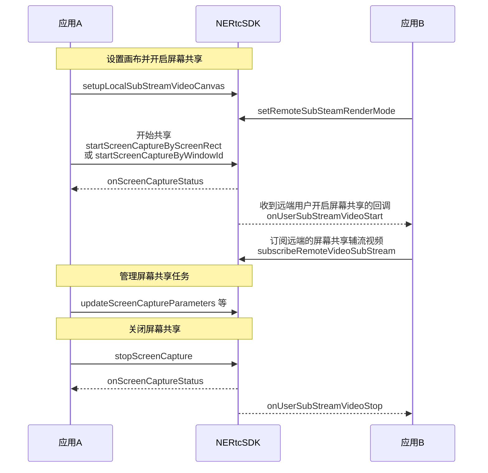

<!--- keywords:实时音视频,屏幕共享,窗口列表 -->

在大型会议或在线教育等场景中，为了满足提升沟通效率的需求，主讲人或老师需要将本端的屏幕内容共享给远端参会者或在线学生观看。NERTC 支持屏幕共享功能，帮助实时共享本端设备的屏幕内容。

## 功能介绍

通过 NERTC SDK 可以在视频通话或互动直播过程中实现屏幕共享，主播或连麦者可以将自己的屏幕内容，以视频的方式共享给远端参会者或在线观众观看，从而提升沟通效率，一般适用于多人视频聊天、在线会议以及在线教育场景。

- 视频会议场景中，参会者可以在会议中将本地的文件、数据、网页、PPT 等画面共享给其他与会者，让其他与会者更加直观的了解讨论的内容和主题。
- 在线课堂场景中，老师可以通过屏幕共享将课件、笔记、教学内容等画面展示给远端的其他学生观看，降低传统教学模式下的沟通成本，提升教育场景的用户体验。

NERTC SDK 以辅流的形式实现屏幕共享，即单独为屏幕共享开启一路上行的视频流，摄像头的视频流作为主流，屏幕共享的视频流作为辅流，两路视频流并行，主播同时上行摄像头画面和屏幕画面两路画面。

## 前提条件

在开始屏幕共享前，请确保已在你的项目中实现基本的实时音视频功能。

## 注意事项

对于 Linux 系统，SDK 会自动判断其显示协议使用的是 X11 协议还是 Wayland 协议。判断系统使用的协议，可以在系统命令行中运行以下命令：`echo $XDG_SESSION_TYPE`。
- X11 协议

    - 桌面共享：SDK 会将所有显示器的屏幕抓取合成进行共享，如果设备连接有两个显示器，两个显示器的画面会同时共享出去。
    - 应用共享：需要向 SDK 提供要共享的应用的窗口ID。

- Wayland 协议
    
    对使用 Wayland 协议的 Linux 系统，SDK 无法获取可选共享对象信息。当用户调用 SDK API 发起屏幕共享时，系统会显示弹窗，展示可选共享对象的相关信息。
    
    - 桌面共享
    
    

    - 应用共享

    


## API 调用时序


  
## 本端共享屏幕

### 设置屏幕共享辅流画布

初始化后通过 [`setupLocalSubStreamVideoCanvas`](https://doc.yunxin.163.com/docs/interface/nertc/linux/doxygen/Latest/zh/html/classnertc_1_1_i_rtc_engine_ex.html#a9abf36ee67a86d2c14d38fbea19764bf) 设置本端的辅流视频回放画布。

::: note note
由于 Linux 端为外部渲染，请自行按需实现本端的屏幕共享辅流视频渲染缩放模式。
:::

### 开启屏幕共享

加入房间后，根据需求开启屏幕共享并设置屏幕共享的方式，屏幕共享内容以辅流形式发送。

- [`startScreenCaptureByScreenRect`](https://doc.yunxin.163.com/docs/interface/nertc/linux/doxygen/Latest/zh/html/classnertc_1_1_i_rtc_engine_ex.html#a1c10c8522dc6715388ffe62f165beed7)：开启屏幕共享，共享范围为指定屏幕的指定区域。
- [`startScreenCaptureByWindowId`](https://doc.yunxin.163.com/docs/interface/nertc/linux/doxygen/Latest/zh/html/classnertc_1_1_i_rtc_engine_ex.html#a8eab357982a5fa500e4e5d5eadb42923)：开启屏幕共享，共享范围为指定窗口的指定区域。

开启屏幕共享之后，远端会触发 [`onUserSubStreamVideoStart`](https://doc.yunxin.163.com/docs/interface/nertc/linux/doxygen/Latest/zh/html/classnertc_1_1_i_rtc_engine_event_handler_ex.html#a48f88b74beb1db6d8ccbca5f079912ee) 回调，本端会触发 [`onScreenCaptureStatus`](https://doc.yunxin.163.com/docs/interface/nertc/linux/doxygen/Latest/zh/html/classnertc_1_1_i_rtc_engine_event_handler_ex.html#a7649a71ffa815cecde17836facd0834a) 回调。

### 管理屏幕共享任务

可以通过以下方法管理屏幕共享任务：

- <a href="https://doc.yunxin.163.com/docs/interface/nertc/linux/doxygen/Latest/zh/html/classnertc_1_1_i_rtc_engine_ex.html#a62d647ee76d11d5790f314e652030878" target="_blank">`updateScreenCaptureParameters`</a>：更新屏幕共享参数。
- <a href="https://doc.yunxin.163.com/docs/interface/nertc/linux/doxygen/Latest/zh/html/classnertc_1_1_i_rtc_engine_ex.html#a797d351e31ec5eecbe434564b7f4d326" target="_blank">`pauseScreenCapture`</a>：暂停屏幕共享。
- <a href="https://doc.yunxin.163.com/docs/interface/nertc/linux/doxygen/Latest/zh/html/classnertc_1_1_i_rtc_engine_ex.html#a7323b3f9e0eee581a0dc67354df4e092" target="_blank">`resumeScreenCapture`</a>：恢复屏幕共享。
- <a href="https://doc.yunxin.163.com/docs/interface/nertc/linux/doxygen/Latest/zh/html/classnertc_1_1_i_rtc_engine_ex.html#a53d4152c3770a262e244752dfaf19801" target="_blank">`updateScreenCaptureRegion`</a>：更新屏幕共享区域。
- <a href="https://doc.yunxin.163.com/docs/interface/nertc/linux/doxygen/Latest/zh/html/classnertc_1_1_i_rtc_engine_ex.html#a05fddbeddc5f4d542bf4213cd9f08a06" target="_blank">`setScreenCaptureMouseCursor`</a>：设置屏幕共享时是否显示鼠标。
- <a href="https://doc.yunxin.163.com/docs/interface/nertc/linux/doxygen/Latest/zh/html/classnertc_1_1_i_rtc_engine_ex.html#a39f8b8e9b6aa1c428ce225beacb8896d" target="_blank">`setScreenCaptureSource`</a>：在屏幕共享过程中快速切换共享的窗口。

### （可选）设置屏幕共享的窗口范围

屏幕共享时，可能需要限制共享屏幕的窗口范围，例如部分涉及敏感信息的窗口区域不进行屏幕共享。NERTC SDK 支持设置共享屏幕的区域范围，目前可通过以下方式实现：

- 开启屏幕共享时，仅共享指定窗口的部分区域。

通过 [`startScreenCaptureByWindowId`](https://doc.yunxin.163.com/docs/interface/nertc/linux/doxygen/Latest/zh/html/classnertc_1_1_i_rtc_engine_ex.html#a8eab357982a5fa500e4e5d5eadb42923) 开启窗口维度的屏幕共享，并通过参数 `region_rect` 指定共享的窗口范围。

- 开启屏幕共享时，仅共享指定屏幕的部分区域，并排除部分窗口。
    
通过 [`startScreenCaptureByScreenRect`](https://doc.yunxin.163.com/docs/interface/nertc/linux/doxygen/Latest/zh/html/classnertc_1_1_i_rtc_engine_ex.html#a1c10c8522dc6715388ffe62f165beed7) 开启屏幕维度的屏幕共享，并通过参数 `region_rect` 指定共享的屏幕范围。


### （可选）高亮显示共享窗口的边框

屏幕共享过程中，可以开启高亮显示共享窗口的边框，方便快速识别当前正在共享的窗口。界面效果类似下图所示。


::: note note
V5.4.10 版本开始支持该功能。
:::

在调用 <a href="https://doc.yunxin.163.com/docs/interface/nertc/linux/doxygen/Latest/zh/html/classnertc_1_1_i_rtc_engine_ex.html#a1c10c8522dc6715388ffe62f165beed7" target="_blank">`startScreenCaptureByScreenRect`</a> 和 <a href="https://doc.yunxin.163.com/docs/interface/nertc/linux/doxygen/Latest/zh/html/classnertc_1_1_i_rtc_engine_ex.html#a8eab357982a5fa500e4e5d5eadb42923" target="_blank">`startScreenCaptureByWindowId`</a> 开启屏幕共享时，将 [`capture_params`](https://doc.yunxin.163.com/docs/interface/nertc/linux/doxygen/Latest/zh/html/structnertc_1_1_n_e_rtc_screen_capture_parameters.html) 中的 `enable_high_light` 设置为 `true`，开启共享屏幕边框高亮显示。并设置 `high_light_width`、`high_light_color` 和 `high_light_length`。


::: note note

屏幕共享过程中，不支持通过 <a href="https://doc.yunxin.163.com/docs/interface/nertc/linux/doxygen/Latest/zh/html/classnertc_1_1_i_rtc_engine_ex.html#a62d647ee76d11d5790f314e652030878" target="_blank">`updateScreenCaptureParameters`</a> 动态修改高亮边框的参数。

:::

参数说明如下表所示。

参数 | 参数说明
---- | -------------- |
enable_high_light | 是否开启共享窗口的边框高亮显示，本场景中请设置为  `true`，默认为 `true`。 | 
high_light_width |高亮边框的线条宽度，单位为 px，默认为 6 px。|
high_light_color | 高亮边框的颜色，使用`0xAABBGGRR`格式，默认值是 0xFF7EDE00 | 
high_light_length | 高亮边框的线条长度，从窗口的任何一个角（共4个角）作为原点，到相邻两边延伸的长度。单位为 px，默认为 120 px。<br>设置为 -1 表示全包围的高亮框。 | 


### 关闭屏幕共享

通过 [`stopScreenCapture`](https://doc.yunxin.163.com/docs/interface/nertc/linux/doxygen/Latest/zh/html/classnertc_1_1_i_rtc_engine_ex.html#a722c1bb960536c104fd3560479f86d72) 关闭辅流形式的屏幕共享。此时远端会触发 [`onUserSubStreamVideoStop`](https://doc.yunxin.163.com/docs/interface/nertc/linux/doxygen/Latest/zh/html/classnertc_1_1_i_rtc_engine_event_handler_ex.html#abf09442bb44e42d300bcae8a1b21aaa3) 和 [`onScreenCaptureStatus`](https://doc.yunxin.163.com/docs/interface/nertc/linux/doxygen/Latest/zh/html/classnertc_1_1_i_rtc_engine_event_handler_ex.html#a7649a71ffa815cecde17836facd0834a) 回调。

::: note notice
若在屏幕共享过程中，SDK 触发 [`kScreenCaptureStatusAbort`](https://doc.yunxin.163.com/docs/interface/nertc/linux/doxygen/Latest/zh/html/namespacenertc.html#ab64601b9bac6ae15cdd9684d6febaf7da913ffca0fcb81fe0f158a8a15808ebaa) 回调，这是由于当前共享的窗口被关闭、进程崩溃等原因导致目标窗口无效。需要在此事件的响应函数中调用 [`stopScreenCapture`](https://doc.yunxin.163.com/docs/interface/nertc/linux/doxygen/Latest/zh/html/classnertc_1_1_i_rtc_engine_ex.html#a722c1bb960536c104fd3560479f86d72) 结束屏幕共享进程。
:::

### <span id="示例代码">示例代码</span>

```cpp
// 设置本地辅流画布 

static void onYuvDataIncomingSubstream(
    nertc::uid_t uid, /*< uid */ 
    void data, /*< 数据指针 */
    uint32_t type, /**< NERtcVideoType */
    uint32_t width, /**< 宽度 */
    uint32_t height, /**< 高度 */
    uint32_t count, /**< 数据类型个数，即offset及stride的数目 */
    uint32_t offset[4], /**< 每类数据偏移 */
    uint32_t stride[4], /**< 每类数据步进 */
    uint32_t rotation, /**< NERtcVideoRotation */
    void user_data /< 用户透传数据 */ 
);

nertc::NERtcVideoCanvas canvas;
canvas.cb = onYuvDataIncomingSubstream;
canvas.user_data = nullptr;
canvas.window =nullptr;
canvas.scaling_mode = kNERtcVideoScaleFit;
rtc_engine_->setupLocalSubStreamVideoCanvas(&canvas);

// 自行实现更新辅流画布缩放模式 
 
// 获取本地辅流启动参数，下面举了两种类型的例子：动画模式和细节模式
// case 1: 动画模式 （流畅度优先），共享视频等高帧率场景
nertc::NERtcScreenCaptureParameters capture_params;
capture_params.profile = kNERtcScreenProfileCustom; // 建议全部使用custom模式，不要使用预置的profile。
capture_params.dimensions = {1920, 1080};
capture_params.frame_rate = 15; // 动画模式最高支持30fps，具体设置多少帧，可参考实际业务和测试效果
capture_params.bitrate = 0;
capture_params.capture_mouse_cursor = true;
capture_params.window_focus = true;
capture_params.excluded_window_list = nullptr;
capture_params.prefer = kNERtcSubStreamContentPreferMotion; //  设置动画模式

// case 2: 细节模式 （清晰度优先）共享文档/ppt推荐
nertc::NERtcScreenCaptureParameters capture_params;
capture_params.profile = kNERtcScreenProfileCustom;
capture_params.dimensions = {1920, 1080};
capture_params.frame_rate = 5; // 细节模式最高支持10fps
capture_params.bitrate = 0;
capture_params.capture_mouse_cursor = true;
capture_params.window_focus = true;
capture_params.prefer = kNERtcSubStreamContentPreferDetails;// 设置细节模式

// 启动辅流 case 1：根据指定区域选择某一个屏幕的共享
nrtc_engine_->startScreenCaptureByScreenRect({ 0,0,0,0 }, { 0,0,0,0 }, capture_params);
// 启动辅流 case 2：根据特定窗口句柄，选择应用窗口共享
nrtc_engine_->startScreenCaptureByWindowId(hwnd, { 0,0,0,0 }, capture_params); 
 
// 暂停屏幕共享 
nrtc_engine_->pauseScreenCapture(); 
 
// 恢复屏幕共享 
nrtc_engine_->resumeScreenCapture(); 
 
// 更新取屏区域 
nrtc_engine_->updateScreenCaptureRegion({ 0,0,640,480 }); 

// 停止屏幕共享 
nrtc_engine_->stopScreenCapture();
```

## 观看远端屏幕共享

### 设置远端辅流画布

远端用户加入房间时，可以通过 [`onUserJoined`](https://doc.yunxin.163.com/docs/interface/nertc/linux/doxygen/Latest/zh/html/classnertc_1_1_i_rtc_engine_event_handler.html#a84a5b3eb47d7f0465082db4bd4bd4989) 事件获取远端用户 ID，并通过 [`setupRemoteSubStreamVideoCanvas`](https://doc.yunxin.163.com/docs/interface/nertc/linux/doxygen/Latest/zh/html/classnertc_1_1_i_rtc_engine_ex.html#a72a28c34a25ae241c75045dc83e84388) 设置指定远端用户的的辅流视频画布。

::: note note
由于 Linux 端为外部渲染，请自行按需实现远端的屏幕共享辅流视频渲染缩放模式。
:::

### 订阅远端用户的屏幕共享流

1. 收到 [`onUserSubStreamVideoStart`](https://doc.yunxin.163.com/docs/interface/nertc/linux/doxygen/Latest/zh/html/classnertc_1_1_i_rtc_engine_event_handler_ex.html#a48f88b74beb1db6d8ccbca5f079912ee) 远端用户开启屏幕共享辅流通道的回调。
2. 通过 [`subscribeRemoteVideoSubStream`](https://doc.yunxin.163.com/docs/interface/nertc/linux/doxygen/Latest/zh/html/classnertc_1_1_i_rtc_engine_ex.html#a210b788405ba94697dfefdd501bac078) 订阅远端的屏幕共享辅流视频，订阅之后才能接收远端的辅流视频数据。

### 结束屏幕共享

收到 [`onUserSubStreamVideoStop`](https://doc.yunxin.163.com/docs/interface/nertc/linux/doxygen/Latest/zh/html/classnertc_1_1_i_rtc_engine_event_handler_ex.html#abf09442bb44e42d300bcae8a1b21aaa3) 其他用户关闭辅流的回调，结束屏幕共享。

### <span id="示例代码">示例代码</span>

```cpp
// 远端辅流处理------------------------------------------- 
// 设置远端辅流画布
static void onYuvDataIncomingSubstream(
    nertc::uid_t uid, /*< uid */ 
    void data, /*< 数据指针 */
    uint32_t type, /**< NERtcVideoType */
    uint32_t width, /**< 宽度 */
    uint32_t height, /**< 高度 */
    uint32_t count, /**< 数据类型个数，即offset及stride的数目 */
    uint32_t offset[4], /**< 每类数据偏移 */
    uint32_t stride[4], /**< 每类数据步进 */
    uint32_t rotation, /**< NERtcVideoRotation */
    void user_data /< 用户透传数据 */ 
);

nertc::NERtcVideoCanvas canvas;
canvas.cb = onYuvDataIncomingSubstream;
canvas.user_data = nullptr;
canvas.window =nullptr;
canvas.scaling_mode = kNERtcVideoScaleFit;
rtc_engine_->setupRemoteSubStreamVideoCanvas(&canvas);

// 自行实现更新远端辅流画布缩放模式 

// 监听远端辅流开启 
void onUserSubStreamVideoStart(uid_t uid, NERtcVideoProfileType max_profile) override{ 
        //订阅远端辅流 
        rtc_engine_->subscribeRemoteVideoSubStream(uid, true); 
        //取消订阅远端辅流 
        rtc_engine_->subscribeRemoteVideoSubStream(uid, false); 
} 
 
//监听远端辅流停止 
void onUserSubStreamVideoStop(uid_t uid) override{ 
        // 取消远端辅流画布 
        rtc_engine_->setupRemoteSubStreamVideoCanvas(uid, nullptr); 
}
```
   
## 常见问题

[共享屏幕时画面卡顿](https://doc.yunxin.163.com/nertc/guide/zc1Mjc4Nzc?platformId=50136#共享屏幕画面卡顿)