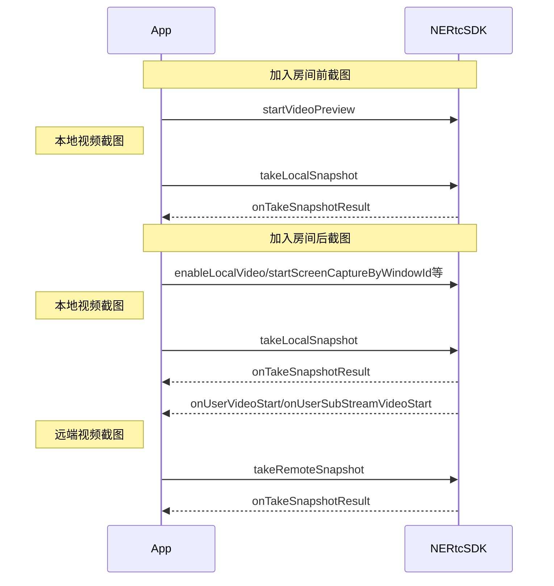

<!--keywords:音视频通话,视频截图-->

在音视频通话场景中，部分用户希望可以通过视频截图功能截取实时视频流画面，以便后续的存档分析、事件备忘、证据留存等等。NERTC SDK 提供视频截图功能，本文档为您介绍如何通过 <a href="https://doc.yunxin.163.com/nertc/api-refer/linux/doxygen/Latest/zh/html/classnertc_1_1_i_rtc_engine_ex.html#a0c64c195919c2fb4c98ad32f1057afc6" target="_blank">`takeLocalSnapshot`</a> 和 <a href="https://doc.yunxin.163.com/nertc/api-refer/linux/doxygen/Latest/zh/html/classnertc_1_1_i_rtc_engine_ex.html#a28966129e4f879209bf06e01617fa50a" target="_blank">`takeRemoteSnapshot`</a> 方法进行实时截图。

## 功能介绍

NERTC SDK 支持针对实时视频流进行截图，包括本地主流和辅流画面、远端主流和辅流画面。
<br>视频截图适用于在线教育以及主播直播等场景中，具体场景说明如下。
- 在线课堂场景中，学生对课件或板书内容进行截图，截图作为笔记保存；
- 互动直播场景中，可以通过截图对直播画面进行内容安全审核。

## 注意事项
- 视频截图功能只截取实时视频流数据，截图中**不包含画布水印**信息，但可以<b>包含<a href="/https://doc.yunxin.163.com/nertc/guide/zM5OTkzMDA" target="_blank">编码水印</a></b>信息。
- 截图相关接口调用时机如下，如果在其他时机调用截图相关接口，会报错 `ERR_INVALID_OPERATION`，表示当前不支持该操作。

## 实现方法

### API 调用时序





### 配置步骤

1. 根据需求调用截图相关接口，实现视频流截图。

- 本地视频主流截图：

    - 加入房间前，在调用 <a href="https://doc.yunxin.163.com/nertc/api-refer/linux/doxygen/Latest/zh/html/classnertc_1_1_i_rtc_engine_ex.html#aff8e53ae30f5c65263a70fd813c960cf" target="_blank">`startVideoPreview(kNERTCVideoStreamMain)`</a> 方法开启视频预览后，调用 <a href="https://doc.yunxin.163.com/nertc/api-refer/linux/doxygen/Latest/zh/html/classnertc_1_1_i_rtc_engine_ex.html#a0c64c195919c2fb4c98ad32f1057afc6" target="_blank">`takeLocalSnapshot`</a> 方法，并设置 `NERtcVideoStreamType` 为 `kNERTCVideoStreamMain` 截取本地主流画面。

    - 加入房间后，在调用 <a href="https://doc.yunxin.163.com/nertc/api-refer/linux/doxygen/Latest/zh/html/classnertc_1_1_i_rtc_engine.html#ad958fcb663c93a8c84d516effc50e863" target="_blank">`enableLocalVideo(kNERTCVideoStreamMain)`</a> 开启本地摄像头采集后，调用 <a href="https://doc.yunxin.163.com/nertc/api-refer/linux/doxygen/Latest/zh/html/classnertc_1_1_i_rtc_engine_ex.html#a0c64c195919c2fb4c98ad32f1057afc6" target="_blank">`takeLocalSnapshot`</a> 方法，并设置 `NERtcVideoStreamType` 为 `kNERTCVideoStreamMain` 截取本地主流画面。

- 本地视频辅流截图：

    - 加入房间前，在调用 <a href="https://doc.yunxin.163.com/nertc/api-refer/linux/doxygen/Latest/zh/html/classnertc_1_1_i_rtc_engine_ex.html#aff8e53ae30f5c65263a70fd813c960cf" target="_blank">`startVideoPreview(kNERTCVideoStreamSub)`</a> 方法开启视频预览后，调用 <a href="https://doc.yunxin.163.com/nertc/api-refer/linux/doxygen/Latest/zh/html/classnertc_1_1_i_rtc_engine_ex.html#a0c64c195919c2fb4c98ad32f1057afc6" target="_blank">`takeLocalSnapshot`</a> 方法，并设置 `NERtcVideoStreamType` 为 `kNERTCVideoStreamSub` 截取本地辅流画面。

    - 加入房间后，在调用 <a href="https://doc.yunxin.163.com/nertc/api-refer/linux/doxygen/Latest/zh/html/classnertc_1_1_i_rtc_engine.html#ad958fcb663c93a8c84d516effc50e863" target="_blank">`enableLocalVideo(kNERTCVideoStreamSub)`</a> 开启本地摄像头采集后，调用 <a href="https://doc.yunxin.163.com/nertc/api-refer/linux/doxygen/Latest/zh/html/classnertc_1_1_i_rtc_engine_ex.html#a0c64c195919c2fb4c98ad32f1057afc6" target="_blank">`takeLocalSnapshot`</a> 方法，并设置 `NERtcVideoStreamType` 为 `kNERTCVideoStreamSub` 截取本地辅流画面。

    - 加入房间后，在调用 <a href="https://doc.yunxin.163.com/nertc/api-refer/linux/doxygen/Latest/zh/html/classnertc_1_1_i_rtc_engine_ex.html#a8eab357982a5fa500e4e5d5eadb42923" target="_blank">`startScreenCaptureByWindowId`</a> 或其他屏幕共享相关方法启用屏幕共享后，调用 <a href="https://doc.yunxin.163.com/nertc/api-refer/linux/doxygen/Latest/zh/html/classnertc_1_1_i_rtc_engine_ex.html#a0c64c195919c2fb4c98ad32f1057afc6" target="_blank">`takeLocalSnapshot`</a> 方法，并设置 `NERtcVideoStreamType` 为 `kNERTCVideoStreamSub` 截取本地辅流画面。

- 远端视频主/辅流截图：

    在分别收到 <a href="https://doc.yunxin.163.com/nertc/api-refer/linux/doxygen/Latest/zh/html/classnertc_1_1_i_rtc_engine_event_handler.html#a0b84dd2fcc3a6f5fe03f36c9cc4911ad" target="_blank">`onUserVideoStart`</a> 与 <a href="https://doc.yunxin.163.com/nertc/api-refer/linux/doxygen/Latest/zh/html/classnertc_1_1_i_rtc_engine_event_handler_ex.html#a48f88b74beb1db6d8ccbca5f079912ee" target="_blank">`onUserSubStreamVideoStart`</a> 回调后，调用 <a href="https://doc.yunxin.163.com/nertc/api-refer/linux/doxygen/Latest/zh/html/classnertc_1_1_i_rtc_engine_ex.html#a28966129e4f879209bf06e01617fa50a" target="_blank">`takeRemoteSnapshot`</a> 方法截取远端视频流画面，截图时可以通过 `NERtcVideoStreamType` 指定截取的视频流是主流还是辅流。

2. 通过回调的方式获取截图文件。

    截图画面数据通过 <a href="https://doc.yunxin.163.com/nertc/api-refer/linux/doxygen/Latest/zh/html/classnertc_1_1_n_e_rtc_take_snapshot_callback.html" target="_blank">`NERtcTakeSnapshotCallback`</a> 的 <a href="https://doc.yunxin.163.com/nertc/api-refer/linux/doxygen/Latest/zh/html/classnertc_1_1_n_e_rtc_take_snapshot_callback.html#ad4cb868ec2fbd8bd35efc3101f343687" target="_blank">`onTakeSnapshotResult`</a> 回调返回。

    截图画面数据类型：
    - Windows：String。BMP 格式图片的路径。
    - macOS：CGImageRef。

## 示例代码

```
//windows
class TEMPTakeSnapshotCallback : public NERtcTakeSnapshotCallback 
{ 
public: 
        TEMPTakeSnapshotCallback() 
        ~TEMPTakeSnapshotCallback() {} 
        /** 
        * 截图结果回调 
        @param errorCode {@link ErrorCode} 
        @param image 截图图片的数据类型。Windows 和 Linux 平台返回的数据是 String 格式，macOS 平台返回的数据是 CGImageRef 格式。 
        */ 
    void onTakeSnapshotResult(int errorCode, const char* image) 
        { 
                //todo  
        } 
}; 
TEMPTakeSnapshotCallback callback; 
 
void doLocal() 
{ 
    nrtc_engine_->takeLocalSnapshot(kNERTCVideoStreamMain, &callback); 
    nrtc_engine_->takeLocalSnapshot(kNERTCVideoStreamSub, &callback); 
} 
void doRemote(uint64_t id) 
{ 
    nrtc_engine_->takeRemoteSnapshot(uid, kNERTCVideoStreamMain, &callback); 
    nrtc_engine_->takeRemoteSnapshot(uid, kNERTCVideoStreamSub, &callback);
}      
```

## API 参考
| **方法** | **功能描述**|
|:--|:--|
|<a href="https://doc.yunxin.163.com/nertc/api-refer/linux/doxygen/Latest/zh/html/classnertc_1_1_i_rtc_engine.html#ad958fcb663c93a8c84d516effc50e863" target="_blank">`enableLocalVideo`</a>|开启或关闭本地视频采集。|
|<a href="https://doc.yunxin.163.com/nertc/api-refer/linux/doxygen/Latest/zh/html/classnertc_1_1_i_rtc_engine_ex.html#a0c64c195919c2fb4c98ad32f1057afc6" target="_blank">`takeLocalSnapshot`</a> |截取本地视频流画面|
|<a href="https://doc.yunxin.163.com/nertc/api-refer/linux/doxygen/Latest/zh/html/classnertc_1_1_i_rtc_engine_ex.html#a28966129e4f879209bf06e01617fa50a" target="_blank">`takeRemoteSnapshot`</a> |截取远端视频流画面|
|<a href="https://doc.yunxin.163.com/nertc/api-refer/linux/doxygen/Latest/zh/html/classnertc_1_1_n_e_rtc_take_snapshot_callback.html#ad4cb868ec2fbd8bd35efc3101f343687" target="_blank">`onTakeSnapshotResult`</a>|截图结果 block 回调|

