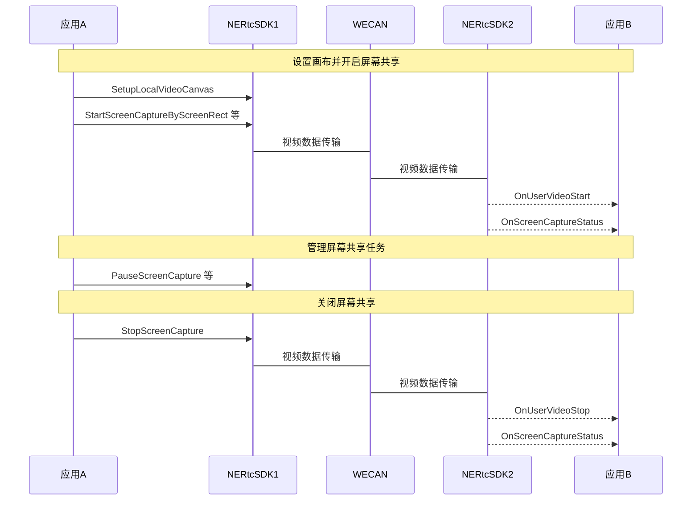
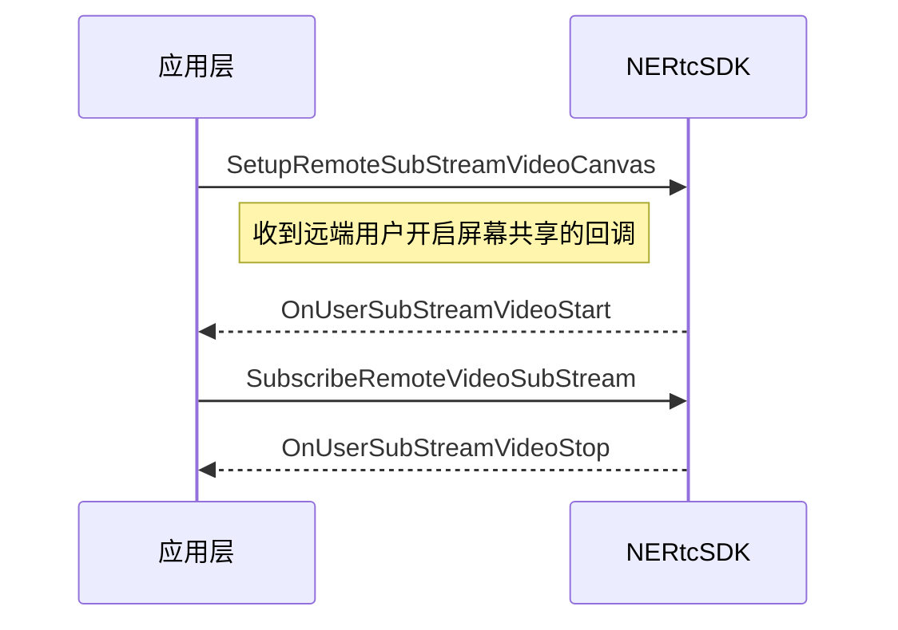

<!--- keywords:实时音视频,屏幕共享,窗口列表 -->

在大型会议或在线教育等场景中，为了满足提升沟通效率的需求，主讲人或老师需要将本端的屏幕内容分享给远端参会者或在线学生观看。NERTC 支持屏幕共享功能，帮助您实时分享本端设备的屏幕内容。

## 功能介绍

通过 NERTC SDK 可以在视频通话或互动直播过程中实现屏幕共享，主播或连麦者可以将自己的屏幕内容，以视频的方式分享给远端参会者或在线观众观看，从而提升沟通效率，一般适用于多人视频聊天、在线会议以及在线教育场景。

- 视频会议场景中，参会者可以在会议中将本地的文件、数据、网页、PPT 等画面分享给其他与会者，让其他与会者更加直观的了解讨论的内容和主题。

- 在线课堂场景中，老师可以通过屏幕共享将课件、笔记、教学内容等画面展示给远端的其他学生观看，降低传统教学模式下的沟通成本，提升教育场景的用户体验。

NERTC SDK 以辅流的形式实现屏幕共享，即单独为屏幕共享开启一路上行的视频流，摄像头的视频流作为主流，屏幕共享的视频流作为辅流，两路视频流并行，主播同时上行摄像头画面和屏幕画面两路画面。

::: note note
此外 NERTC SDK 还支持在共享屏幕的同时，也共享本地播放的系统背景音。具体请参考[音频共享](https://doc.yunxin.163.com/nertc/guide/jc5OTI1NjY?platform=unity)。
:::

## 注意事项

- NERTC Unity SDK 的屏幕共享功能**仅支持 Windows、macOS 平台**，移动端平台敬请期待后续版本。
- 在实现屏幕共享功能前，请确保开发环境满足如下要求：
    - Visual Studio 2013 及以上版本。
    - Windows7、Windows8、Windows10 或以上版本。
- NERTC Android、iOS、Windows 和 macOS SDK V3.9.0 及以上版本，Web SDK V4.1.0 及以上版本支持通过辅流实现屏幕共享。如果使用辅流的屏幕共享方案，请保证房间内所有成员均升级到支持版本以上，否则互相通信时会因同时发送主流和辅流造成通话异常等问题。
- 如果您的 App 无法针对所有端进行强制升级，屏幕共享场景中仅部分端使用 V3.9.0 及以上版本，为避免上述通话异常问题，必须保证通话过程中单人同时只有一路上行视频流。当需要将视频流切换为屏幕共享流时，请先通过 <a href="https://doc.yunxin.163.com/nertc/api-refer/unity/doxygen/Latest/zh/html/classnertc_1_1_i_rtc_engine.html#ad6d3e215a57f74960760a15aca5b73e5" target="_blank">`EnableLocalVideo`</a> 关闭视频流，再通过 <a href="https://doc.yunxin.163.com/nertc/api-refer/unity/doxygen/Latest/zh/html/classnertc_1_1_i_rtc_engine.html#ada31148e26605df3523550d3a0d9806f" target="_blank">`StartScreenCaptureByScreenRect`</a> 或其他屏幕共享相关接口启动屏幕共享流。反向切换同理。
- 对于 V5.4.0 及之后版本，如果当前正在使用本地视频辅流通道进行本地摄像头采集或者外部自定义视频输入，调用 <a href="https://doc.yunxin.163.com/nertc/api-refer/unity/doxygen/Latest/zh/html/classnertc_1_1_i_rtc_engine.html#ada31148e26605df3523550d3a0d9806f" target="_blank">`StartScreenCaptureByScreenRect`</a> 或 <a href="https://doc.yunxin.163.com/nertc/api-refer/unity/doxygen/Latest/zh/html/classnertc_1_1_i_rtc_engine.html#ac9607a5c0fa24324ca141caae01502bb" target="_blank">`StartScreenCaptureByWindowId`</a> 开启屏幕共享时，需要先调用[`EnableLocalVideo`](https://doc.yunxin.163.com/nertc/api-refer/unity/doxygen/Latest/zh/html/classnertc_1_1_i_rtc_engine.html#ad6d3e215a57f74960760a15aca5b73e5)停止辅流。如果当前正在屏幕共享，调用 [`EnableLocalVideo`](https://doc.yunxin.163.com/nertc/api-refer/unity/doxygen/Latest/zh/html/classnertc_1_1_i_rtc_engine.html#ad6d3e215a57f74960760a15aca5b73e5) 开启辅流时，需要调用 [`StopScreenCapture`](https://doc.yunxin.163.com/nertc/api-refer/unity/doxygen/Latest/zh/html/classnertc_1_1_i_rtc_engine.html#a354dcbf8427771c61b59b6f94473c09e) 先停止屏幕共享。
## 本端共享屏幕

### API 调用时序



  
### 实现方法

1. <span id="Rectangle"> 获取指定的待共享区域在整个显示器屏幕中的 Rectangle 坐标。

2. 设置屏幕共享辅流画布。
    
    初始化后通过 <a href="https://doc.yunxin.163.com/nertc/api-refer/unity/doxygen/Latest/zh/html/classnertc_1_1_i_rtc_engine.html#a6f2f039898628360da86ca0536307103" target="_blank">`SetupLocalVideoCanvas`</a> 设置本端的辅流视频回放画布。
    
3. 开启屏幕共享。

    加入房间后，根据需求开启屏幕共享并设置屏幕共享的方式，屏幕共享内容以辅流形式发送。
    - <a href="https://doc.yunxin.163.com/nertc/api-refer/unity/doxygen/Latest/zh/html/classnertc_1_1_i_rtc_engine.html#ada31148e26605df3523550d3a0d9806f" target="_blank">`StartScreenCaptureByScreenRect`</a>：开启屏幕共享，共享范围为指定屏幕的指定区域。
    - <a href="https://doc.yunxin.163.com/nertc/api-refer/unity/doxygen/Latest/zh/html/classnertc_1_1_i_rtc_engine.html#ac9607a5c0fa24324ca141caae01502bb" target="_blank">`StartScreenCaptureByWindowId`</a>：开启屏幕共享，共享范围为指定窗口的指定区域。
    
    
    ::: note note
    
    对于 V5.4.0 及之后版本：
    - 如果当前正在使用本地视频辅流通道进行本地摄像头采集或者外部自定义视频输入，调用 <a href="https://doc.yunxin.163.com/nertc/api-refer/unity/doxygen/Latest/zh/html/classnertc_1_1_i_rtc_engine.html#ada31148e26605df3523550d3a0d9806f" target="_blank">`StartScreenCaptureByScreenRect`</a> 或 <a href="https://doc.yunxin.163.com/nertc/api-refer/unity/doxygen/Latest/zh/html/classnertc_1_1_i_rtc_engine.html#ac9607a5c0fa24324ca141caae01502bb" target="_blank">`StartScreenCaptureByWindowId`</a> 开启屏幕共享时，需要先调用[`EnableLocalVideo`](https://doc.yunxin.163.com/nertc/api-refer/unity/doxygen/Latest/zh/html/classnertc_1_1_i_rtc_engine.html#ad6d3e215a57f74960760a15aca5b73e5)停止辅流。
    - 如果当前正在屏幕共享，调用 [`EnableLocalVideo`](https://doc.yunxin.163.com/nertc/api-refer/unity/doxygen/Latest/zh/html/classnertc_1_1_i_rtc_engine.html#ad6d3e215a57f74960760a15aca5b73e5) 开启辅流时，需要调用 [`StopScreenCapture`](https://doc.yunxin.163.com/nertc/api-refer/unity/doxygen/Latest/zh/html/classnertc_1_1_i_rtc_engine.html#a354dcbf8427771c61b59b6f94473c09e) 先停止屏幕共享。
    :::


    您需要设置 `captureParams` 配置屏幕共享的编码参数，其 [`RtcScreenCaptureParameters `](https://doc.yunxin.163.com/nertc/api-refer/unity/doxygen/Latest/zh/html/classnertc_1_1_rtc_screen_capture_parameters.html) 结构体的参数说明如下表所示。
    <table>
    <tr>
        <th width="30%">参数</th>
        <th width="70%">参数说明</th>
    </tr>
        <tr>
        <td>prefer</td>
        <td>屏幕共享编码策略倾向：<ul><li><code>kNERtcSubStreamContentPreferMotion</code>（默认）：内容类型为动画。当用户共享的内容是视频、电影或游戏等动态画面时，推荐选择此枚举值；此时 <code>frameRate</code> 参数完全按照您的设置处理。<li><code>kNERtcSubStreamContentPreferDetails</code>：内容类型为细节。当用户共享的内容是图片、文字或 PPT 等静态画面时，推荐选择此枚举值；此时 <code>frameRate</code> 参数最高可设置为 10 帧。</td>
    </tr>
        <tr>
        <td>profile</td>
        <td>视频编码的分辨率。<br>具体请参考 <a href="https://doc.yunxin.163.com/nertc/api-refer/unity/doxygen/Latest/zh/html/namespacenertc.html#a55ac6bf24881b8c9f31c7dedd1fa8738" target="_blank"><code>NERtcScreenProfileType</code></a>。<note type="notice"><ul><li>建议直接设置为 <code>kNERtcScreenProfileCustom</code>，以确保所有设置符合您的真实业务场景。<li>若您需要使用自定义的尺寸（<code>dimensions</code>）和帧率（<code>frameRate</code>），请务必设置此参数为 <code>kNERtcScreenProfileCustom</code>。<li>若设置 <code>profile</code> 为 <code>kNERtcScreenProfileCustom</code> 之外的值，尺寸 <code>dimensions</code> 会自动对应为 <code>profile</code> 指定的大小，帧率 <code>frameRate</code> 固定为 5 fps。</td>
    </tr>
        <tr>
        <td>dimensions</td>
        <td>视频编码的最大像素值，可以设置视频尺寸的宽、高。<note type="notice">此参数仅当 <code>profile</code> 参数设置为 <code>kNERtcScreenProfileCustom</code> 有效。</td>
    </tr>
        <tr>
        <td>frameRate</td>
        <td>视频编码的帧率。<br>单位为 fps，默认值为 5，建议此参数的值不要超过 15。</td>
    </tr>
    <tr>
        <td>bitrate</td>
        <td>视频编码的码率，单位为 Kbps。<br>若设置的码率为 0 或超出合理范围，SDK 会自行计算出合理区间处理码率。</td>
    </tr>
        <tr>
        <td>excludedWindowList</td>
        <td>待屏蔽窗口的列表。</td>
    </tr>
        <tr>
        <td>captureMouseCursor</td>
        <td>是否采集鼠标用于屏幕共享。</td>
    </tr>
    </table>

    此外，网易云信提供一些常见场景下的参数推荐搭配值，供您参考，具体如下表所示。
    <table>
    <tr>
        <th width="30%">参数名称</th>
        <th width="30%">共享视频</th>
        <th width="30%">共享 PPT</th>
    </tr>
        <tr>
        <td>prefer</td>
        <td>kNERtcSubStreamContentPreferMotion</td>
        <td>kNERtcSubStreamContentPreferDetails</td>
    </tr>
        <tr>
        <td>profile</td>
        <td>kNERtcScreenProfileCustom</td>
        <td>kNERtcScreenProfileCustom</td>
    </tr>
        <tr>
        <td>dimensions</td>
        <td>{1920, 1080}</td>
        <td>{1920, 1080}</td>
    </tr>
        <tr>
        <td>frameRate</td>
        <td>15</td>
        <td>5</td>
    </tr>
    </table>

    ::: note note
    - `regionRect` 参数的坐标值请通过[步骤一](#Rectangle)获取，具体如何设置请参考[设置屏幕共享的窗口范围](#设置屏幕共享的窗口范围)和[枚举屏幕列表或窗口列表](#枚举屏幕列表或窗口列表)。
    - 开启屏幕共享之后，远端会触发 <a href="https://doc.yunxin.163.com/nertc/api-refer/unity/doxygen/Latest/zh/html/namespacenertc.html#a6dd6b0b7e82c1e6d0d76ce10365f390c" target="_blank">`OnUserSubStreamVideoStart`</a> 和 <a href="https://doc.yunxin.163.com/nertc/api-refer/unity/doxygen/Latest/zh/html/namespacenertc.html#a4d30def502a9d3fe18c1cf37b9f84f2b" target="_blank">`OnScreenCaptureStatusChanged`</a> 回调。
    :::
    
4. 管理屏幕共享任务。
    - [`UpdateScreenCaptureParameters`](https://doc.yunxin.163.com/nertc/api-refer/unity/doxygen/Latest/zh/html/classnertc_1_1_i_rtc_engine.html#a1d91ebbe41d90adc49370565863f6bdf)：更新屏幕共享参数。
    - <a href="https://doc.yunxin.163.com/nertc/api-refer/unity/doxygen/Latest/zh/html/classnertc_1_1_i_rtc_engine.html#a3cd3945641ccd3a2f1fa8cd8c0c04a92" target="_blank">`PauseScreenCapture`</a>：暂停屏幕共享。
    - <a href="https://doc.yunxin.163.com/nertc/api-refer/unity/doxygen/Latest/zh/html/classnertc_1_1_i_rtc_engine.html#ad0065d5e02af43213fd0342b288c588e" target="_blank">`ResumeScreenCapture`</a>：恢复屏幕共享。
    - <a href="https://doc.yunxin.163.com/nertc/api-refer/unity/doxygen/Latest/zh/html/classnertc_1_1_i_rtc_engine.html#abcbaffe6fc3d35b9bdf0417930d09ce9" target="_blank">`UpdateScreenCaptureRegion`</a>：更新屏幕共享区域。
    - <a href="https://doc.yunxin.163.com/nertc/api-refer/unity/doxygen/Latest/zh/html/classnertc_1_1_i_rtc_engine.html#a86295f6e298b5294c53a98fcab65eb66" target="_blank">`SetExcludeWindowList`</a>：设置共享指定屏幕区域时，需要屏蔽的窗口列表。
    - [`SetScreenCaptureMouseCursor`](https://doc.yunxin.163.com/nertc/api-refer/unity/doxygen/Latest/zh/html/classnertc_1_1_i_rtc_engine.html#a1dfa8f54bce9f495bd046ff853c80633)：设置屏幕共享时是否显示鼠标。
5. 关闭屏幕共享。

    通过 <a href="https://doc.yunxin.163.com/nertc/api-refer/unity/doxygen/Latest/zh/html/classnertc_1_1_i_rtc_engine.html#a354dcbf8427771c61b59b6f94473c09e" target="_blank">`StopScreenCapture`</a> 关闭辅流形式的屏幕共享。此时远端会触发 <a href="https://doc.yunxin.163.com/nertc/api-refer/unity/doxygen/Latest/zh/html/namespacenertc.html#ac9b6f27c1def9a71fd662a52b0a90603" target="_blank">`onUserSubStreamVideoStop`</a>回调，本端触发 <a href="https://doc.yunxin.163.com/nertc/api-refer/unity/doxygen/Latest/zh/html/namespacenertc.html#a4d30def502a9d3fe18c1cf37b9f84f2b" target="_blank">`OnScreenCaptureStatusChanged`</a> 回调。

::: note note 
若您在屏幕共享过程中，SDK 触发 `kScreenCaptureStatusAbort` 回调，这是由于当前共享的窗口被关闭、进程崩溃等原因导致目标窗口无效。您需要在此事件的响应函数中调用 <a href="https://doc.yunxin.163.com/nertc/api-refer/unity/doxygen/Latest/zh/html/classnertc_1_1_i_rtc_engine.html#a354dcbf8427771c61b59b6f94473c09e" target="_blank">`StopScreenCapture`</a> 结束屏幕共享进程。
:::

### <span id="示例代码">示例代码</span>

```C#
//纹理对象回调处理
public void OnTexture2DSubVideoFrame(ulong uid, Texture2D texture, RtcVideoRotation rotation)
{
    //uid为0时代表是本人的视频数据回调
}
//设置本地辅流画布
private void SetupLocalSubstreamVideoCanvas()
{
    var userCanvas = new RtcVideoCanvas();
    userCanvas.callback = new VideoFrameCallback(OnTexture2DSubVideoFrame);
    int result = rtcEngine.SetupLocalVideoCanvas(RtcVideoStreamType.kNERTCVideoStreamSub,userCanvas);
    if (result != (int)RtcErrorCode.kNERtcNoError)
    {
        //失败
    }
}
//开始屏幕共享
private void StartScreenCapture()
{
    //开始屏幕共享前，需要先设置本地视频辅流的画布
    //需要获取显示器的实际区域。
    var screenRect = new RtcRectangle
    {
        x = screenTop,
        y = screenLeft,
        width = screenWidth,
        height = screenHeight
    };

    //设置想要分享的屏幕区域，如果全部设置为0，则表示取全屏。
    var regionRect = new RtcRectangle
    {
        x = 0,
        y = 0,
        width = 0,
        height = 0
    };
    //设置参数，按需设置，看结构体说明填写
    var screenParams = new RtcScreenCaptureParameters
    {
        profile = RtcScreenProfileType.kNERtcScreenProfileCustom,
        dimensions = new RtcVideoDimensions{ width = 1920, height = 1080 },
        frameRate = 10,// 细节模式最高支持10fps
        bitrate = 0,
        captureMouseCursor = true,
        windowFocus = true,
        prefer =RtcSubStreamContentPrefer.kNERtcSubStreamContentPreferDetails,
    };
    int result = rtcEngine.StartScreenCaptureByScreenRect(screenRect, regionRect, screenParams);
    if (result != (int)RtcErrorCode.kNERtcNoError)
    {
        //失败
    }
}
//停止分享屏幕
private void StopScreenCapture()
{
    int result = rtcEngine.StopScreenCapture();
    if (result != (int)RtcErrorCode.kNERtcNoError)
    {
        //失败
    }
}
//删除辅流画布
private void RemoveRemoteVideoCanvas(ulong uid)
{
    //删除本地画布
    rtcEngine.SetupLocalVideoCanvas(RtcVideoStreamType.kNERTCVideoStreamSub,null);
    //删除远端画布
    rtcEngine.SetupRemoteVideoCanvas(uid, RtcVideoStreamType.kNERTCVideoStreamSub,null);
}
```

## 观看远端屏幕共享

### <span id="API 调用时序">API 调用时序</span>



  
### 实现方法

1. 设置远端辅流画布。
    1. 远端用户加入房间时，可以通过 `onUserJoined` 事件获取远端用户 ID，并通过 <a href="https://doc.yunxin.163.com/nertc/api-refer/unity/doxygen/Latest/zh/html/classnertc_1_1_i_rtc_engine.html#abcceaa6ba8af9b93937c0820b24a32fa" target="_blank">`SetupRemoteSubStreamVideoCanvas`</a> 设置指定远端用户的的辅流视频画布。
    2. （可选）通过 <a href="https://doc.yunxin.163.com/nertc/api-refer/unity/doxygen/Latest/zh/html/classnertc_1_1_i_rtc_engine.html#a845ce4b7015fe30322edd53f5665d95e" target="_blank">`SetRemoteSubSteamRenderMode`</a> 设置远端的屏幕共享辅流视频渲染缩放模式。
2. 订阅远端用户的屏幕共享流。
    1. 收到 <a href="https://doc.yunxin.163.com/nertc/api-refer/unity/doxygen/Latest/zh/html/namespacenertc.html#a6dd6b0b7e82c1e6d0d76ce10365f390c" target="_blank">`OnUserSubStreamVideoStart`</a> 远端用户开启屏幕共享辅流通道的回调。
    2. 通过 <a href="https://doc.yunxin.163.com/nertc/api-refer/unity/doxygen/Latest/zh/html/classnertc_1_1_i_rtc_engine.html#aa1e7889582419289f7a2ac9226f7e8ac" target="_blank">`SubscribeRemoteVideoSubStream`</a> 订阅远端的屏幕共享辅流视频，订阅之后才能接收远端的辅流视频数据。
3. 结束屏幕共享。

    收到 <a href="https://doc.yunxin.163.com/nertc/api-refer/unity/doxygen/Latest/zh/html/namespacenertc.html#ac9b6f27c1def9a71fd662a52b0a90603" target="_blank">`OnUserSubStreamVideoStop`</a> 其他用户关闭辅流的回调，结束屏幕共享。
    
### <span id="示例代码">示例代码</span>

```C#
//设置远端辅流画布
private void SetupRemoteSubstreamVideoCanvas(long uid) {
    var userCanvas = new RtcVideoCanvas();
    userCanvas.callback = new VideoFrameCallback(OnTexture2DSubVideoFrame);
    int result = rtcEngine.SetupRemoteVideoCanvas(uid, RtcVideoStreamType.kNERTCVideoStreamSub,userCanvas);
    if(result != RtcErrorCode.kNERtcNoError) {
      //失败
    }
}
private void onUserVideoStart(RtcVideoStreamType type, ulong uid, RtcVideoProfileType maxProfile) {
    // 订阅视频辅流
    // type == RtcVideoStreamType.kNERTCVideoStreamSub时为辅流
    SetupRemoteSubStreamVideoCanvas(uid,false);
    int result = rtcEngine.SubscribeRemoteVideoStream(uid,
                                                    type,
                                                    RtcRemoteVideoStreamType.kNERtcRemoteVideoStreamTypeHigh,
                                                    true);
    if(result != RtcErrorCode.kNERtcNoError) {
      //失败
    }
}
private void onUserVideoStop(RtcVideoStreamType type, ulong uid {
    // 取消订阅视频辅流
    //type == RtcVideoStreamType.kNERTCVideoStreamSub时为辅流
    int result = rtcEngine.SubscribeRemoteVideoStream(uid,
                                                    type,
                                                    RtcRemoteVideoStreamType.kNERtcRemoteVideoStreamTypeHigh,
                                                    false);
    if(result != RtcErrorCode.kNERtcNoError) {
      //失败
    }
}
```

## <span id="设置屏幕共享的窗口范围">设置屏幕共享的窗口范围</span>

屏幕共享时，您可能需要限制共享屏幕的窗口范围，例如部分涉及敏感信息的窗口区域不进行屏幕共享。NERTC SDK 支持设置共享屏幕的区域范围，目前可通过以下方式实现：
- 开启屏幕共享时，仅共享指定窗口的部分区域。
    
    通过 `StartScreenCaptureByWindowId` 开启窗口维度的屏幕共享，并通过参数 `regionRect` 指定共享的窗口范围。
- 开启屏幕共享时，仅共享指定屏幕的部分区域，并排除部分窗口。
    
    通过 `StartScreenCaptureByScreenRect` 开启屏幕维度的屏幕共享，并通过参数 `regionRect` 指定共享的屏幕范围、通过 `RtcScreenCaptureParameters` 设置需要过滤的窗口列表。 

- 屏幕共享过程中，动态调整需要屏蔽的窗口列表。
    
    共享整个屏幕时，您可以通过 <a href="https://doc.yunxin.163.com/nertc/api-refer/unity/doxygen/Latest/zh/html/classnertc_1_1_i_rtc_engine.html#a86295f6e298b5294c53a98fcab65eb66" target="_blank">`SetExcludeWindowList`</a> 设置窗口过滤，将一个或多个需要过滤的窗口或应用排除出共享范围，其他观看端只能看到整个屏幕中指定窗口以外的其他内容。

