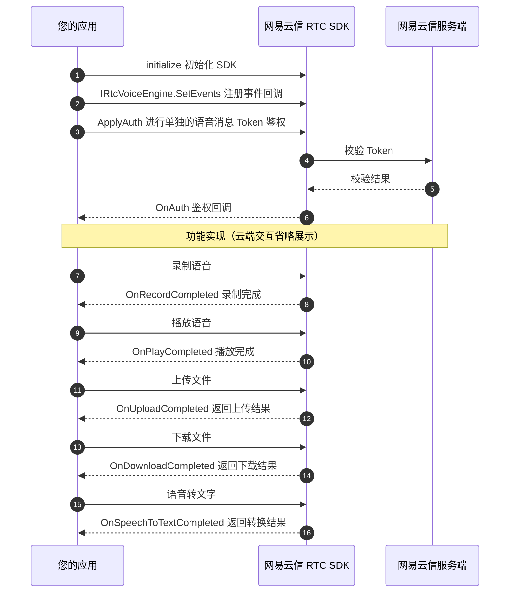

本文介绍了网易云信音视频通话 RTC SDK 中，**语音消息** 功能的相应使用示例代码，根据本文这些示例代码，您可以完成应用中语音消息的开发。

## 功能说明

网易云信音视频通话 RTC SDK 支持 **语音消息** 功能，方便 Unity 开发者基于游戏多媒体引擎客户端 API 调试和接入。通过实现客户端内的实时语音消息、语音转文字等能力，丰富了玩家之间的沟通方式和游戏互动深度。例如：

- 在协作场景中，可以使用语音录制、语音上传、语音下载等能力，让玩家可以便捷地录制语音信息。
- 在游戏大世界场景中，可以使用语音转文字功能，加强游戏社交属性。

## 调用时序




## 实现功能

### 注册事件回调

语音消息功能通过 [`IRtcVoiceEngine.SetEvents`](https://doc.yunxin.163.com/nertc/references/unity/doxygen/Latest/zh/audioOnly/html/classnertc_1_1_i_rtc_voice_engine.html#a15c7c6a3635bd05d8f8ac4c868358393) 注册事件回调，您可以继承 [`IVoiceEngineCallback`](https://doc.yunxin.163.com/nertc/references/unity/doxygen/Latest/zh/audioOnly/html/interfacenertc_1_1_i_voice_engine_callback.html) 实现相应的方法来接收事件通知。

<!-- 示例代码里的Todo是啥 -->

**示例代码**：

```C#
public class MyVoiceEventsHandler : IVoiceEngineCallback
{

    public void OnAuth(RtcErrorCode errorCode)
    {
        
    }

    public void OnRecordCompleted(RtcErrorCode errorCode, string filePath)
    {
        
    }

    public void OnPlayCompleted(RtcErrorCode errorCode, string filePath)
    {
        
    }

    public void OnUploadCompleted(RtcErrorCode errorCode, string filePath, string fileID)
    {

    }

    public void OnDownloadCompleted(RtcErrorCode errorCode, string filePath, string fileID)
    {

    }

    public void OnSpeechToTextCompleted(RtcErrorCode errorCode, string fileID, string text)
    {
       
    }

    public void OnRecordingVolume(int volume)
    {
        
    }

    public void OnPlayingVolume(int volume)
    {
        
    }
}

IRtcEngine rtcEngine = IRtcEngine.GetInstance();
void SetEvents(){
    var voiceEngine = rtcEngine.VoiceEngine;

    //监听事件
    var voiceHandler = MyVoiceEventsHandler();//请自行保证对象的生命周期。
    voiceEngine.SetEvent(voiceHandler);

    //取消事件监听
    voiceEngine.SetEvent(null);
}
```

### 鉴权

语音消息功能需要独立的 Token 鉴权。调用 [`IRtcVoiceEngine.ApplyAuth`](https://doc.yunxin.163.com/nertc/references/unity/doxygen/Latest/zh/audioOnly/html/classnertc_1_1_i_rtc_voice_engine.html#afbf27f8c895fdc7eaa294d5645153239) 接口实现鉴权功能，并由 [`IVoiceEngineCallback.OnAuth`](https://doc.yunxin.163.com/nertc/references/unity/doxygen/Latest/zh/audioOnly/html/interfacenertc_1_1_i_voice_engine_callback.html#a68df2db896be8929bb6b419b8df1a89d) 事件通知。

本地的录制和播放不依赖此鉴权，但是上传文件、下载文件、语音转文字等服务依赖此鉴权，若鉴权没有成功，则上述功能将不可用。

<!--当前版本是指哪个版本？要明确给客户，不然在未来也叫做当前版本-->

::: note note
不支持在 **调试模式** 下使用语音消息功能，即 Token 不能为空。如需接入 SDK 进行测试，请 [提交工单](https://app.yunxin.163.com/global/service/ticket/create) 联系网易云信技术支持工程师。
:::

**示例代码**：

```C#
IRtcEngine rtcEngine = IRtcEngine.GetInstance();
void Auth(){
    var voiceEngine = rtcEngine.VoiceEngine;

    long uid = 123456; //your user id
    string token = "YOUR TOKEN";
    voiceEngine.ApplyAuth(uid,token);
}
```

### 录制语音

语音消息录制仅支持 `.aac` 文件格式。因为 RTC SDK 不会自动创建文件夹，指定的录制文件所在的文件路径必须要保证已存在。

语音录制的相关接口为：

-  [`IRtcVoiceEngine.StartRecording`](https://doc.yunxin.163.com/nertc/references/unity/doxygen/Latest/zh/audioOnly/html/classnertc_1_1_i_rtc_voice_engine.html#ad5b36aa5513a9f399d10c5664422b00d)：开始录制
-  [`IRtcVoiceEngine.StopRecording`](https://doc.yunxin.163.com/nertc/references/unity/doxygen/Latest/zh/audioOnly/html/classnertc_1_1_i_rtc_voice_engine.html#aa27b830c7269aebdaee5eb504b6b78de)：完成录制

    正常完成录制都会通过 [`IVoiceEngineCallback.OnRecordCompleted`](https://doc.yunxin.163.com/nertc/references/unity/doxygen/Latest/zh/audioOnly/html/interfacenertc_1_1_i_voice_engine_callback.html#a187b84cbbdd65798af5cc3b3b6f29bc4) 事件通知。

-  [`IRtcVoiceEngine.PauseRecording`](https://doc.yunxin.163.com/nertc/references/unity/doxygen/Latest/zh/audioOnly/html/classnertc_1_1_i_rtc_voice_engine.html#a7e517a4afbc2384bf853af6fff388911):：暂停录制
-  [`IRtcVoiceEngine.ResumeRecording`](https://doc.yunxin.163.com/nertc/references/unity/doxygen/Latest/zh/audioOnly/html/classnertc_1_1_i_rtc_voice_engine.html#a12004900774665475ad829b26bcc62cf)：恢复录制
-  [`IRtcVoiceEngine.CancelRecording`](https://doc.yunxin.163.com/nertc/references/unity/doxygen/Latest/zh/audioOnly/html/classnertc_1_1_i_rtc_voice_engine.html#af875a03b809a84541769451feb79024a)：取消录制

    如果取消了本次录制，[`IVoiceEngineCallback.OnRecordCompleted`](https://doc.yunxin.163.com/nertc/references/unity/doxygen/Latest/zh/audioOnly/html/interfacenertc_1_1_i_voice_engine_callback.html#a187b84cbbdd65798af5cc3b3b6f29bc4) 事件将不再被通知。

语音消息的长度默认是 60 秒，您可以通过 [`IRtcVoiceEngine.SetMaxMessageLength`](https://doc.yunxin.163.com/nertc/references/unity/doxygen/Latest/zh/audioOnly/html/classnertc_1_1_i_rtc_voice_engine.html#a3cc6e4d84662a8c2a0285bd085b42bda) 接口设置最大的录制时长。

:::note note
同时开启录制和播放时，请不要使用同一个文件。
:::

**示例代码**：

```C#

IRtcEngine rtcEngine = IRtcEngine.GetInstance();
void AudioFileRecord(){
    var voiceEngine = rtcEngine.VoiceEngine;

    //开始录制
    string recordFile = "xxxxx/xxx.aac"; //您的录制文件存放路径
    voiceEngine.StartRecording(recordFile);

    //结束录制
    voiceEngine.StopRecording();
}
```

### 播放语音

语音录制的相关接口为：
- [`IRtcVoiceEngine.PlayRecordedFile`](https://doc.yunxin.163.com/nertc/references/unity/doxygen/Latest/zh/audioOnly/html/classnertc_1_1_i_rtc_voice_engine.html#a7ff059fe301986679537c596a723f9c6)：播放录制语音文件。
- [`IRtcVoiceEngine.StopPlayFile`](https://doc.yunxin.163.com/nertc/references/unity/doxygen/Latest/zh/audioOnly/html/classnertc_1_1_i_rtc_voice_engine.html#a4d9c21d17a18828c240282b55ac45df7)：停止播放录制录音文件。

如果您需要监听事件通知，则可以监听：

- 播放结束由 [`IVoiceEngineCallback.OnPlayCompleted`](https://doc.yunxin.163.com/nertc/references/unity/doxygen/Latest/zh/audioOnly/html/interfacenertc_1_1_i_voice_engine_callback.html#a9ddbcbe2e85cbd6beca69a8cd15eee72) 事件通知。
- 音量变化由 [`IVoiceEngineCallback.OnPlayingVolume`](https://doc.yunxin.163.com/nertc/references/unity/doxygen/Latest/zh/audioOnly/html/interfacenertc_1_1_i_voice_engine_callback.html#a360ddb4fe2f033af2ee50b31710d61c8) 事件通知。

    ::: note note
    如果您通过 [`IRtcVoiceEngine.SetSpeakerVolume`](https://doc.yunxin.163.com/nertc/references/unity/doxygen/Latest/zh/audioOnly/html/classnertc_1_1_i_rtc_voice_engine.html#abb0c6f274f0f4a9f44be1899ef0460e7) 接口设置播放音量为 0，则 [`IVoiceEngineCallback.OnPlayingVolume`](https://doc.yunxin.163.com/nertc/references/unity/doxygen/Latest/zh/audioOnly/html/interfacenertc_1_1_i_voice_engine_callback.html#a360ddb4fe2f033af2ee50b31710d61c8) 回调的音量将一直是 0。
    :::

**示例代码**：

```C#

IRtcEngine rtcEngine = IRtcEngine.GetInstance();
void AudioFilePlay(){
    var voiceEngine = rtcEngine.VoiceEngine;

    //开始播放
    string recordFile = "xxxxx/xxx.aac"; //您的录制文件存放路径
    voiceEngine.PlayRecordedFile(recordFile);

    //结束播放
    voiceEngine.StopPlayFile();
}
```

### 上传文件

使用 [`IRtcVoiceEngine.UploadRecordedFile`](https://doc.yunxin.163.com/nertc/references/unity/doxygen/Latest/zh/audioOnly/html/classnertc_1_1_i_rtc_voice_engine.html#a7a63cc1a3ac00a9f11c788f8c482eb46) 上传语音消息文件，上传成功或者失败，都会通过 [`IVoiceEngineCallback.OnUploadCompleted`](https://doc.yunxin.163.com/nertc/references/unity/doxygen/Latest/zh/audioOnly/html/interfacenertc_1_1_i_voice_engine_callback.html#a68a5d31ca92cbc903aca8e351a70c243) 事件通知。上传成功后，会返回 `file_id`，此文件 ID 用于文件下载以及语音识别等功能接口。

::: note note
上传语音消息前，请先使用 [`IRtcVoiceEngine.ApplyAuth`](https://doc.yunxin.163.com/nertc/references/unity/doxygen/Latest/zh/audioOnly/html/classnertc_1_1_i_rtc_voice_engine.html#afbf27f8c895fdc7eaa294d5645153239) 进行鉴权，否则会返回失败。
:::

**示例代码**：

```C#

IRtcEngine rtcEngine = IRtcEngine.GetInstance();
void AudioFileUpload(){
    var voiceEngine = rtcEngine.VoiceEngine;

    //上传
    string recordFile = "xxxxx/xxx.aac"; //您的录制文件存放路径
    voiceEngine.UploadRecordedFile(recordFile);
}

```

### 下载文件

使用 [`IRtcVoiceEngine.DownloadRecordedFile`](https://doc.yunxin.163.com/nertc/references/unity/doxygen/Latest/zh/audioOnly/html/classnertc_1_1_i_rtc_voice_engine.html#a5a70d5cdae1284ee8f06c59095b3526e) 进行文件下载前，请先使用 [`IRtcVoiceEngine.ApplyAuth`](https://doc.yunxin.163.com/nertc/references/unity/doxygen/Latest/zh/audioOnly/html/classnertc_1_1_i_rtc_voice_engine.html#afbf27f8c895fdc7eaa294d5645153239) 进行鉴权，否则会返回失败。

完成下载或者失败，会通过 [`IVoiceEngineCallback.OnDownloadCompleted`](https://doc.yunxin.163.com/nertc/references/unity/doxygen/Latest/zh/audioOnly/html/interfacenertc_1_1_i_voice_engine_callback.html#a7523cb694d0b2983b8fc84654d9c6e5a) 事件通知。

::: note note
上传语音消息前，请先使用 [`IRtcVoiceEngine.ApplyAuth`](https://doc.yunxin.163.com/nertc/references/unity/doxygen/Latest/zh/audioOnly/html/classnertc_1_1_i_rtc_voice_engine.html#afbf27f8c895fdc7eaa294d5645153239) 进行鉴权，否则会返回失败。
:::

**示例代码**：

```C#

IRtcEngine rtcEngine = IRtcEngine.GetInstance();
void AudioFileUpload(){
    var voiceEngine = rtcEngine.VoiceEngine;

    //下载
    string fileID = "xxxxx"; //通过上传接口获得此文件 ID
    string downloadFile = "xxxxx/xxx.aac"; //your file path
    voiceEngine.DownloadRecordedFile(fileID,downloadFile);
}
```

### 语音转文字

使用 [`IRtcVoiceEngine.SpeechToText`](https://doc.yunxin.163.com/nertc/references/unity/doxygen/Latest/zh/audioOnly/html/classnertc_1_1_i_rtc_voice_engine.html#a23ebb98579969180333b1fe2dc77a5d7) 进行语音转文字前，请先使用 [`IRtcVoiceEngine.ApplyAuth`](https://doc.yunxin.163.com/nertc/references/unity/doxygen/Latest/zh/audioOnly/html/classnertc_1_1_i_rtc_voice_engine.html#afbf27f8c895fdc7eaa294d5645153239) 进行鉴权，否则会返回失败。

完成语音转文字或者失败，会通过 [`IVoiceEngineCallback.OnSpeechToTextCompleted`](https://doc.yunxin.163.com/nertc/references/unity/doxygen/Latest/zh/audioOnly/html/interfacenertc_1_1_i_voice_engine_callback.html#a1f4e025122239d3a07c0ab3d6341fc48) 事件通知。

**示例代码**：

```C#));

IRtcEngine rtcEngine = IRtcEngine.GetInstance();
void AudioFileUpload(){
    var voiceEngine = rtcEngine.VoiceEngine;

    //语音转文字
    string fileID = "xxxxx"; //通过上传接口获得此文件 ID
    voiceEngine.SpeechToText(fileID);
}
```