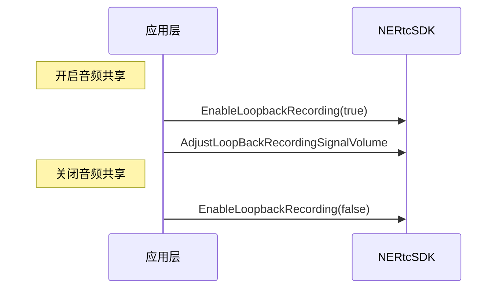

在屏幕分享或共享本地播放的音乐文件等场景中，用户常常需要将本地系统音频发送至远端。NERTC 提供了音频共享功能，帮助您在共享屏幕的同时也能播放本地背景音，或者共享本地视频文件或音乐文件的声音，为您规避播放在线音乐文件可能会遇到的版权问题。

## 功能介绍

通过 NERTC SDK 可以在视频通话或互动直播的过程中实现音频共享，主持人、主播或连麦者可以将本地播放的音频流分享给远端参会者或在线观众收听，从而提升视频通话体验。

音频共享适用于在线会议、在线教育以及互动直播等场景，具体场景说明如下。

- 视频会议场景中，参会者可以在会议中将本地的音频文件、PPT 背景音等所有系统声音分享给其他与会者，让其他与会者更加沉浸式地了解讨论的内容和主题。
- 在线课堂场景中，老师可以线上教学过程中在将课件、教学视频的背景音等所有系统声音分享给远端的学生，提升教育场景的用户体验。
- 互动直播场景中，主播可以在直播过程中将本地播放的音乐、视频背景音等所有系统声音分享给远端的观众，避免了因需要播放在线音乐而遇到的版权问题，同时丰富了场景体验。

## 注意事项

您不能同时使用音频自播放和音频共享功能。 否则会导致加入音视频通话房间后，无法听到对端用户的音频和本地共享音频的声音。 

## API 调用时序




## 实现方法

1. 在加入房间后调用 <a href="https://doc.yunxin.163.com/nertc/api-refer/unity/doxygen/Latest/zh/html/classnertc_1_1_i_rtc_engine.html#a973cf2b01d0c0aea1b9ad2783e622036" target="_blank">`EnableLoopbackRecording`</a> 方法开启音频共享。调用此方法时，您需要设置 `enabled` 参数为 true 开启音频共享。
    ::: note note
    由于 Windows 系统电脑的声卡支持系统音频采集，`deviceName` 参数传空字符即可。
    :::
2. 调用 <a href="https://doc.yunxin.163.com/nertc/api-refer/unity/doxygen/Latest/zh/html/classnertc_1_1_i_rtc_engine.html#ade3ca0dc60fba7adae9412d5e1c6aeec" target="_blank">`AdjustLoopBackRecordingSignalVolume`</a> 方法调整共享音频音量。调用该方法时，您需要设置 `volume` 参数指定采集信号量。该参数的取值范围为 0 ~ 100。
3. 需要结束音频共享时，调用 <a href="https://doc.yunxin.163.com/nertc/api-refer/unity/doxygen/Latest/zh/html/classnertc_1_1_i_rtc_engine.html#a973cf2b01d0c0aea1b9ad2783e622036" target="_blank">`EnableLoopBackRecording`</a> 方法并设置 `enabled` 参数为 false 停止音频共享。

## 示例代码

```C#
//开启音频共享
private void enableLoopbackRecording()
{
    int result = rtcEngine.EnableLoopbackRecording(true, null);
    if(result != (int)RtcErrorCode.kNERtcNoError)
    {
        //失败
    }
}
//调节音频共享音量
private void adjustLoopbackRecordingSignalVolume()
{
    uint volume = 90;
    int result = rtcEngine.AdjustLoopbackRecordingSignalVolume(volume);
    if (result != (int)RtcErrorCode.kNERtcNoError)
    {
        //失败
    }

}
```

## API 参考
| **方法** | **功能描述**|
|:--|:--|
|<a href="https://doc.yunxin.163.com/nertc/api-refer/unity/doxygen/Latest/zh/html/classnertc_1_1_i_rtc_engine.html#a973cf2b01d0c0aea1b9ad2783e622036" target="_blank">`EnableLoopBackRecording`</a>|开启或关闭音频共享|
|<a href="https://doc.yunxin.163.com/nertc/api-refer/unity/doxygen/Latest/zh/html/classnertc_1_1_i_rtc_engine.html#ade3ca0dc60fba7adae9412d5e1c6aeec" target="_blank">`AdjustLoopBackRecordingSignalVolume`</a>|调整音频共享音量|