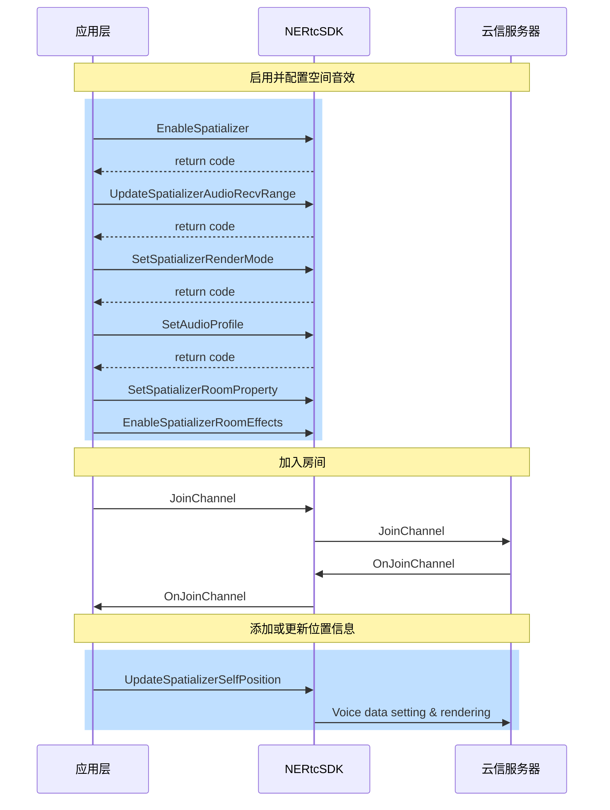

空间音效也称 3D 音效，是通过在音频信号中添加空间信息，使得听众可以感受到声音来自于特定的位置和空间环境。它可以增强音频的真实感和沉浸感，让听众感受到更加真实的声音效果。
::: note note
此文档为您介绍音视频 SDK 如何实现空间音效，若您集成的是纯音频 SDK，请参考[空间音效（纯音频版本）](/docs/jcyOTA0ODM/zY2MDU2MDI)。
:::


## 功能介绍


空间音效可以将实时语音渲染成具有空间方位的效果。同时，空间音效具有房间混响，距离衰减和范围语音等属性，综合使用相关属性可以提升空间音效的真实感和沉浸感。

例如，在游戏中模拟真实世界的空间音效，玩家可以感知说话者的 3D 空间方位。同时，空间音效可以根据双方距离的远近实现语音音量的衰减，使近处的声音更响亮，远处的声音更低。这样可以让玩家更清晰地感受到游戏中的环境和位置信息，增强游戏的沉浸感和真实感。此外，空间音效还可以应用于虚拟现实和增强现实等领域，让用户更真实地感受虚拟环境中的声音效果。

## 功能原理

空间音效涉及到音频源和接收者两个对象。在RTC场景下，开启空间音效时，发送端会在语音中包含自身的坐标信息，远端接收该音频信息时，会将其作为音频源。接收者会基于自身坐标、接收到的音频及其位置，将音频渲染到特定方位，然后进行播放。

空间音效利用头部相关转换函数（HRTF）和声波空间卷积模仿自然声波的传播，使其仿佛来自三维空间中的一个点。空间音效通过方向、距离和环境三个关键因素实现空间感的形成。

空间音效的距离衰减和语音范围如下图所示。


## 注意事项

需要用户佩戴**有线耳机**以体验空间音效功能，暂不支持蓝牙耳机。

## API 调用时序





## 实现方法

### 1. 启用空间音效

请在**引擎初始化之后（<a href="https://doc.yunxin.163.com/nertc/api-refer/unity/doxygen/Latest/zh/html/classnertc_1_1_i_rtc_engine.html#a1b6051f932c5b3b67cae576008d26bc0" target="_blank">`IRtcEngine.Initialize`</a>）**，**加入房间（<a href="https://doc.yunxin.163.com/nertc/api-refer/unity/doxygen/Latest/zh/html/classnertc_1_1_i_rtc_engine.html#a98904279325729c9a191f6ca454ae102" target="_blank">`IRtcEngine.JoinChannel`</a>）之前**调用 <a href="https://doc.yunxin.163.com/nertc/api-refer/unity/doxygen/Latest/zh/audioOnly/html/interface_n_e_r_t_c_1_1_i_rtc_engine.html#a24c81174b2b6e9dc9889be7698ae28b7" target="_blank">`EnableSpatializer`</a> 方法以启用音频空间化。

**示例代码**如下：
```
// 声明类成员
IRtcEngine rtcEngine = IRtcEngine.GetInstance();
//打开空间音效功能
void Enable3DAudio() {
    //需要在执行完`IRtcEngine.Initialize`接口之后调用
    rtcEngine.EnableSpatializer(true);

    //audio profile must be stereo,2 channels
#if (UNITY_IOS || UNITY_ANDROID) && !UNITY_EDITOR
    rtcEngine.SetAudioProfile(RtcAudioProfileType.kNERtcAudioProfileMiddleQualityStereo, RtcAudioScenarioType.kNERtcAudioScenarioChatroom);
#else
    rtcEngine.SetAudioProfile(RtcAudioProfileType.kNERtcAudioProfileMiddleQualityStereo, RtcAudioScenarioType.kNERtcAudioScenarioMusic);
#endif
}
```

### 2. 设置距离衰减和语音范围

在加入房间前，调用 <a href="https://doc.yunxin.163.com/nertc/api-refer/unity/doxygen/Latest/zh/html/classnertc_1_1_i_rtc_engine.html#aa35b5f10522a025d94971420237bcc12" target="_blank">`UpdateSpatializerAudioRecvRange`</a> 方法设置空间音效的距离衰减属性和语音范围，该属性可以让声音随着音源和听者之间距离的增加逐渐衰减音量。

::: note notice
- 距离衰减属性需要在加入房间之前设置，在通话过程中无法修改该属性，只有退出房间后才可重新设置。
- 空间音效房间内的本端成员和对端成员需要**都开启**空间音效（`EnableSpatializer`），本端才能听到对端声音的方位感。
- 通常在 3D 网络游戏开始后，都能获取地图上角色 GameObject 坐标，一般用坐标来计算空间距离，传给 `UpdateSpatializerAudioRecvRange` 接口。
:::

**参数描述**如下表所示：


| 参数 | 描述 | 
| ---- | -------------- | 
| audibleDistance | 监听器能接收到音频的最大距离，用户的声音在该范围内可被听见。在该范围内，声音将会随距离的增加而衰减，直至超出所设置的范围，则不再有声音。<br> 取值范围：[0,1000] ，默认值为 32。| 
| conversationalDistance | 监听器不对音频进行衰减的距离，在该距离范围内，扬声器音频保持其原始音量，超出该范围时，声音将会随距离的增加而衰减。默认值为 1。| 
| rollOff | 距离衰减模式。一共有三种：|\
|| - kNERtcDistanceRolloffLogarithmic（0）：指数衰减。|\
|| - kNERtcDistanceRolloffLinear（1）：线性衰减。|\
|| - kNERtcDistanceRolloffNone（2）：无衰减。|

**示例代码**如下：

```C#
// 设置接收范围和声音衰减模型
void Setup3DAudioRecvRange() {
    //需要在`EnableSpatializer`执行成功之后调用。
    rtcEngine.UpdateSpatializerAudioRecvRange(50, 1, RtcDistanceRolloffModel.kNERtcDistanceRolloffLinear); 
    // ...
}
```

### 3. 设置渲染模式

在加入房间前，调用 <a href="https://doc.yunxin.163.com/nertc/api-refer/unity/doxygen/Latest/zh/html/classnertc_1_1_i_rtc_engine.html#a76b5eb000e38338c9cc4b723db20fa1f" target="_blank">`SetSpatializerRenderMode`</a> 方法设置渲染模式，通过设置 `mode` 参数选择不同复杂程度的算法以实现不同的听觉效果。

其中 <a href="https://doc.yunxin.163.com/nertc/api-refer/unity/doxygen/Latest/zh/html/namespacenertc.html#a8937b89f1018f08d098671020eebf93f" target="_blank">`UpdateSpatializerAudioRecvRange`</a> 类型的各字段说明如下表所示。

| 字段| 描述 | 
| ---- | ---- |
| kNERtcSpatializerRenderStereoPanning | 立体声 PANNing 方法 | 
| kNERtcSpatializerRenderBinauralLowQuality | 低复杂度双耳渲染方法 | 
| kNERtcSpatializerRenderBinauralMediumQuality | 中复杂度双耳渲染方法 | 
| kNERtcSpatializerRenderBinauralHighQuality | 高复杂度双耳渲染方法(推荐) | 
| kNERtcSpatializerRenderRoomEffectsOnly | 仅房间混响 |

**示例代码**如下：

```C#
// 设置空间语音渲染模式
void Setup3DAudioRenderMode() {
    //需要在`EnableSpatializer`执行成功之后调用。

    rtcEngine.SetSpatializerRenderMode(RtcSpatializerRenderMode.kNERtcSpatializerRenderBinauralHighQuality); 
    // ...
}
```

### 4. 设置音频属性

在加入房间前，调用 <a href="https://doc.yunxin.163.com/nertc/api-refer/unity/doxygen/Latest/zh/html/classnertc_1_1_i_rtc_engine.html#a5eb61ba456845c3fd3755e82ff5c8f76" target="_blank">`SetAudioProfile`</a> 方法将音频类型（`RtcAudioProfileType`）设置为 `NERtcAudioProfileMiddleQualityStereo` 或者 `kNERtcAudioProfileHighQualityStereo`，并将音频场景（`RtcAudioScenarioType`）设置为 `kNERtcAudioScenarioMusic`。如果是移动端，音频场景需要设置为`kNERtcAudioScenarioChatroom`。

```C#
// 设置音频属性
void Setup3DAudioProfile() {
    //需要在`Initialize`执行成功之后,`JoinChannel`之前调用
#if (UNITY_IOS || UNITY_ANDROID) && !UNITY_EDITOR
    rtcEngine.SetAudioProfile(RtcAudioProfileType.kNERtcAudioProfileMiddleQualityStereo, RtcAudioScenarioType.kNERtcAudioScenarioChatroom);
#else
    rtcEngine.SetAudioProfile(RtcAudioProfileType.kNERtcAudioProfileMiddleQualityStereo, RtcAudioScenarioType.kNERtcAudioScenarioMusic);
#endif
    // ...
}
```

### 5. 设置房间混响属性（可选）

1. 调用 <a href="https://doc.yunxin.163.com/nertc/api-refer/unity/doxygen/Latest/zh/html/classnertc_1_1_i_rtc_engine.html#af67e91218dc99a24ac081a553cac73f6" target="_blank">`SetSpatializerRoomProperty`</a> 方法设置 `roomProperty` 参数预设的房间大小，混响时长，混响增益，音色亮度等参数，以调整房间混响效果。

其中 <a href="https://doc.yunxin.163.com/nertc/api-refer/unity/doxygen/Latest/zh/html/structnertc_1_1_rtc_spatializer_room_property.html" target="_blank">`RtcSpatializerRoomProperty`</a> 类型的各字段说明如下表所示。


| 参数 | 类型 | 描述 |
| ---- | ---- |---- |
| roomCapacity | RtcSpatializerRoomCapacity | 房间大小，默认值为 `kNERtcSpatializerRoomCapacitySmall`。<br> 房间大小的枚举值请参见[`NERtcSpatializerRoomCapacity`](https://doc.yunxin.163.com/nertc/api-refer/windows/doxygen/Latest/zh/html/namespacenertc.html#a18916b5c2b8a44173cc2d9289ae82ca2)|
|  material | NERtcSpatializerMaterialName | 房间材质，默认值为 `kNERtcSpatializerMaterialTransparent`。<br>更多的房间材质请参见[`NERtcSpatializerMaterialName`](https://doc.yunxin.163.com/nertc/api-refer/windows/doxygen/Latest/zh/html/namespacenertc.html#af35698c71bfecefe53bdfcd4020cebf0) |
| reflectionScalar | float | 混响反射比例因子，默认值为 1.0 |
| reverbGain |float| 混响增益比例因子，默认值为 1.0 |
| reverbTime |float| 混响时间比例因子，默认值为 1.0 |
| reverbBrightness |float| 混响音色亮度 |


2. 调用 <a href="https://doc.yunxin.163.com/nertc/api-refer/unity/doxygen/Latest/zh/html/classnertc_1_1_i_rtc_engine.html#a2fb3eee0a329cb5f04034ab91376ebd8" target="_blank">`EnableSpatializerRoomEffects`</a> 方法，设置 `enable` 参数为 `true` 或 `false` 以开启或关闭空间音效的房间混响效果。

3. 调用 <a href="https://doc.yunxin.163.com/nertc/api-refer/unity/doxygen/V5.4.5/zh/html/classnertc_1_1_i_rtc_engine.html#ab77afb991acdc53bb867835e13945521" target="_blank">`EnableSpatializer`</a> 方法，设置 `enable` 参数为 `true` 或 `false` 以开启或关闭 3D 音效。

    3D 音效可以让声音有 3D 空间感且按距离衰减。

### 6. 实现游戏空间音频定位特效

在加入房间后，调用 <a href="https://doc.yunxin.163.com/nertc/api-refer/unity/doxygen/Latest/zh/html/classnertc_1_1_i_rtc_engine.html#a81cd42f1301cc2beb0a1328994dcba5e" target="_blank">`UpdateSpatializerSelfPosition`</a> 方法并设置 `info` 参数，以更新音源或听者的空间位置信息 <a href="https://doc.yunxin.163.com/nertc/api-refer/unity/doxygen/Latest/zh/html/structnertc_1_1_rtc_spatializer_position_info.html" target="_blank">`RtcSpatializerPositionInfo`</a>，从而实现空间音频定位特效。
::: note note
- 通常在 3D 网络游戏开始后，都能获取地图上角色 `GameObject` 相互的坐标，此坐标即调用 `UpdateSpatializerSelfPosition` 方法时需要更新的角色坐标。
- 建议在一定间隔内更新角色位置信息，以保证画面和音频位置同步，推荐更新频率为 10 ~ 25次/秒。
:::

| 参数 | 描述 | 
| ---- | -------------- | 
| speakerPosition | 说话者的位置信息，三个值依次表示X、Y、Z的坐标值。默认值{0,0,0}| 
| speakerQuaternion | 说话者的旋转信息，通过四元组来表示，数据格式为{w, x, y, z}。默认值{0,0,0,0}  <note type="note">该参数设置的值暂时不起作用，保持默认值即可。</note>| 
| headPosition | 接收者的位置信息，三个值依次表示X、Y、Z的坐标值。默认值{0,0,0}|
| headQuaternion| 接收者的旋转信息，通过四元组来表示，数据格式为{w, x, y, z}。默认值{0,0,0,0}|


**示例代码**如下：

```C#
class Demo : MonoBehaviour { 
    
    // player or GameObject
    public GameObject selfGameObject;

    private void Start()
    {
        StartCoroutine(UpdateMySelfPosition());
    }

    //update my position in the game world
    private IEnumerator UpdateMySelfPosition()
    {
        while (true)
        {
            yield return new WaitForSeconds(0.2f);
            if (selfGameObject  != null)
            {
                /*headPosition、headQuaternion 是指听者的位置,speakerPosition、speakerQuaternion代表说话者的位置。
                *听者和说话者可只同一个人的位置，也可以在不同位置，比如说话者丢出去一个探听器来接收探听器所在区域的范围语音。
                */
                var info = new RtcSpatializerPositionInfo();
                info.headPosition = new float[3] { selfGameObject.transform.position.x, selfGameObject.transform.position.y, selfGameObject.transform.position.z };
                info.headQuaternion = new float[4] { selfGameObject.transform.rotation.x, selfGameObject.transform.rotation.y, selfGameObject.transform.rotation.z, selfGameObject.transform.rotation.w };
                info.speakerPosition = info.headPosition;
                info.speakerQuaternion = info.headQuaternion;
                int result = rtcEngine.UpdateSpatializerSelfPosition(info);
                if(result != (int)RtcErrorCode.kNERtcNoError)
                {
                    Debug.Log($"UpdateSpatializerSelfPosition Failed : {result}");
                }
            }
        }

    }

    private void OnDestroy()
    {
        Debug.Log("OnDestroy");
        StopAllCoroutines();
    }
}
```


