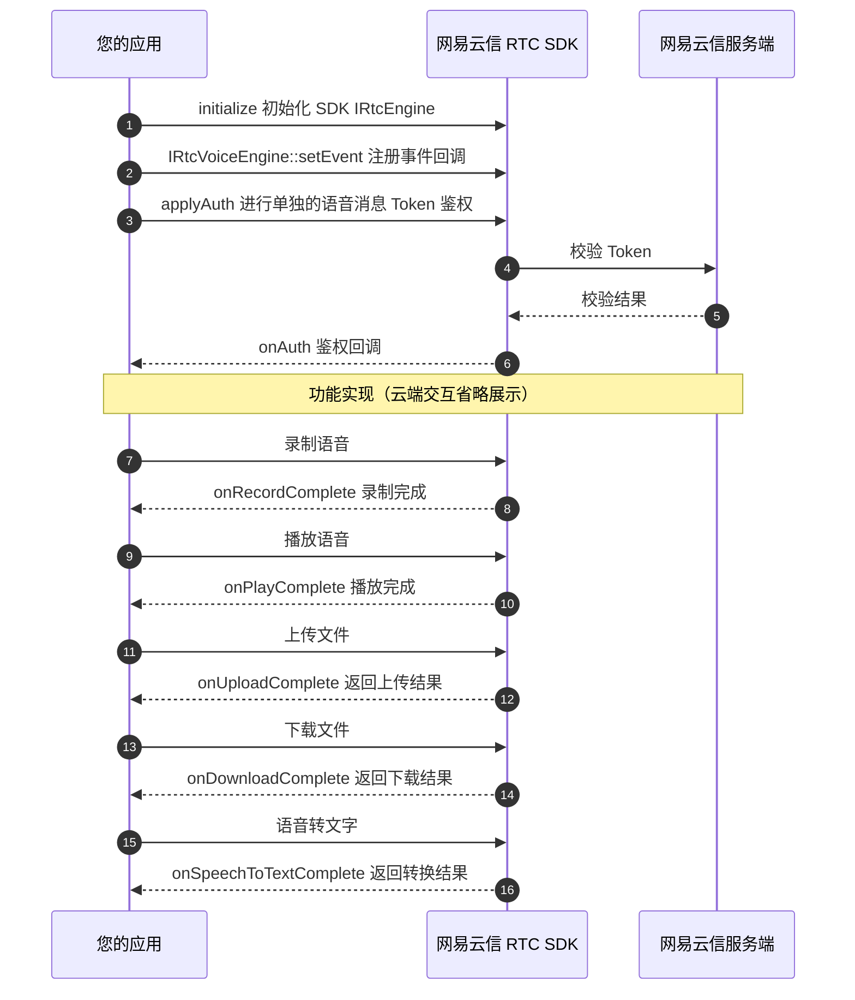

本文介绍了网易云信音视频通话 RTC SDK 中，**语音消息** 功能的相应使用示例代码，根据本文这些示例代码，您可以完成应用中语音消息的开发。

## 功能说明

网易云信音视频通话 RTC SDK 支持 **语音消息** 功能，方便 Unreal Engine 开发者基于游戏多媒体引擎客户端 API 调试和接入。通过实现客户端内的实时语音消息、语音转文字等能力，丰富了玩家之间的沟通方式和游戏互动深度。例如：

- 在协作场景中，可以使用语音录制、语音上传、语音下载等能力，让玩家可以便捷地录制语音信息。
- 在游戏大世界场景中，可以使用语音转文字功能，加强游戏社交属性。

## 调用时序



## 实现功能

### 注册事件回调

语音消息功能通过 [`IRtcVoiceEngine::setEvent`](https://doc.yunxin.163.com/docs/interface/nertc/UE/doxygen/Latest/zh/html/classnertc_1_1_i_rtc_voice_engine.html#ad8c99ee3d10c4829c9331e1a8ad86177) 注册事件回调，您可以继承 [`IRtcVoiceEngineEventHandler`](https://doc.yunxin.163.com/docs/interface/nertc/UE/doxygen/Latest/zh/html/classnertc_1_1_i_rtc_voice_engine_event_handler.html) 实现相应的方法来接收事件通知。

<!-- 示例代码里的Todo是啥 -->

**示例代码**：

```c++
class MyVoiceEventsHandler : public IRtcVoiceEngineEventHandler
{
public:
  void onAuth(int error_code) override {

  }

  //others
}
MyVoiceEventsHandler voiceHandler;//请自行保证对象的生命周期。

//监听事件
auto voiceEngine = nertc_engine_->getVoiceEngine();
voiceEngine->setEvent(&voiceHandler);

//取消事件监听
voiceEngine->setEvent(nullptr);
```

### 鉴权

语音消息功能需要独立的 Token 鉴权。调用 [`IRtcVoiceEngine::applyAuth`](https://doc.yunxin.163.com/docs/interface/nertc/UE/doxygen/Latest/zh/html/classnertc_1_1_i_rtc_voice_engine.html#ae4f240a951c4f52772f74c368638598e) 接口实现鉴权功能，并由 [`IRtcVoiceEngineEventHandler::onAuth`](https://doc.yunxin.163.com/docs/interface/nertc/UE/doxygen/Latest/zh/html/classnertc_1_1_i_rtc_voice_engine_event_handler.html#aa68f3fb7aa0ed3e193126ea7016d35a8) 事件通知。

本地的录制和播放不依赖此鉴权，但是上传文件、下载文件、语音转文字等服务依赖此鉴权，若鉴权没有成功，则上述功能将不可用。

<!--当前版本是指哪个版本？要明确给客户，不然在未来也叫做当前版本。就是5.4.124版本-->

::: note note
不支持在 **调试模式** 下使用语音消息功能，即 Token 不能为空。如需接入 SDK 进行测试，请 [提交工单](https://app.yunxin.163.com/global/service/ticket/create) 联系网易云信技术支持工程师。
:::

**示例代码**：

```c++
auto voiceEngine = nertc_engine_->getVoiceEngine();

uint64_t uid = 123456; //your user id
std::string token = "YOUR TOKEN";
voiceEngine->applyAuth(uid，token.c_str());
```

### 录制语音

语音消息录制仅支持 `.aac` 文件格式。因为 RTC SDK 不会自动创建文件夹，指定的录制文件所在的文件路径必须要保证已存在。

语音录制的相关接口为：

-  [`IRtcVoiceEngine::startRecording`](https://doc.yunxin.163.com/docs/interface/nertc/UE/doxygen/Latest/zh/html/classnertc_1_1_i_rtc_voice_engine.html#ac2a8760c1a4d4bb5f8d9437796e1a16f)：开始录制
-  [`IRtcVoiceEngine::stopRecording`](https://doc.yunxin.163.com/docs/interface/nertc/UE/doxygen/Latest/zh/html/classnertc_1_1_i_rtc_voice_engine.html#ae3af64c934a1ee4e8cfd0b06d85000e1)：完成录制

    正常完成录制都会通过 [`IRtcVoiceEngineEventHandler::onRecordComplete`](https://doc.yunxin.163.com/docs/interface/nertc/UE/doxygen/Latest/zh/html/classnertc_1_1_i_rtc_voice_engine_event_handler.html#a8cd07764cfaf08eeb3b01ae9027f11dd) 事件通知。
-  [`IRtcVoiceEngine::pauseRecording`](https://doc.yunxin.163.com/docs/interface/nertc/UE/doxygen/Latest/zh/html/classnertc_1_1_i_rtc_voice_engine.html#abd12b4574937089de7024d82ecdcbd5d)：暂停录制
-  [`IRtcVoiceEngine::resumeRecording`](https://doc.yunxin.163.com/docs/interface/nertc/UE/doxygen/Latest/zh/html/classnertc_1_1_i_rtc_voice_engine.html#ae7ce646b0ec5eefc0aab66c9e39071ee)：恢复录制
-  [`IRtcVoiceEngine::cancelRecording`](https://doc.yunxin.163.com/docs/interface/nertc/UE/doxygen/Latest/zh/html/classnertc_1_1_i_rtc_voice_engine.html#afeb555a66bf038cd1100ea4e0224f04e)：取消录制

    如果取消了本次录制，[`IRtcVoiceEngineEventHandler::onRecordComplete`](https://doc.yunxin.163.com/docs/interface/nertc/UE/doxygen/Latest/zh/html/classnertc_1_1_i_rtc_voice_engine_event_handler.html#a8cd07764cfaf08eeb3b01ae9027f11dd) 事件将不再被通知。

语音消息的长度默认是 60 秒，您可以通过 [`IRtcVoiceEngine::setMaxMessageLength`](https://doc.yunxin.163.com/docs/interface/nertc/UE/doxygen/Latest/zh/html/classnertc_1_1_i_rtc_voice_engine.html#a350f8277858df52c710605db0b5e6626) 接口设置最大的录制时长。

::: note note
同时开启录制和播放时，请不要使用同一个文件。
:::

**示例代码**：

```c++
auto voiceEngine = nertc_engine_->getVoiceEngine();

//开始录制
std::string recordFile = "xxxxx/xxx.aac"; //您的录制文件存放路径
voiceEngine->startRecording(recordFile.c_str());

//结束录制
voiceEngine->stopRecording();
```

### 播放语音

语音录制的相关接口为：
- [`IRtcVoiceEngine::playRecordedFile`](https://doc.yunxin.163.com/docs/interface/nertc/UE/doxygen/Latest/zh/html/classnertc_1_1_i_rtc_voice_engine.html#a95a00522307c96539f396465dce9d980)：播放录制语音文件。
- [`IRtcVoiceEngine::stopPlayFile`](https://doc.yunxin.163.com/docs/interface/nertc/UE/doxygen/Latest/zh/html/classnertc_1_1_i_rtc_voice_engine.html#add284347e4b8eef85b331e55d6fc396a)：停止播放录制录音文件。

如果您需要监听事件通知，则可以监听：

- 播放结束由 [`IRtcVoiceEngineEventHandler::onPlayComplete`](https://doc.yunxin.163.com/docs/interface/nertc/UE/doxygen/Latest/zh/html/classnertc_1_1_i_rtc_voice_engine_event_handler.html#a5ee89cbba95ce9c171cfe11b38111b7e) 事件通知。
- 音量变化由 [`IRtcVoiceEngineEventHandler::onPlayingVolume`](https://doc.yunxin.163.com/docs/interface/nertc/UE/doxygen/Latest/zh/html/classnertc_1_1_i_rtc_voice_engine_event_handler.html#a12671535bc170c594e70debc63222800) 事件通知。

    ::: note note
    如果您通过 [`IRtcVoiceEngine::setSpeakerVolume`](https://doc.yunxin.163.com/docs/interface/nertc/UE/doxygen/Latest/zh/html/classnertc_1_1_i_rtc_voice_engine.html#a97b57dc508cda086cfbe346abc5bb10b) 接口设置播放音量为 0，则 [`IRtcVoiceEngineEventHandler::onPlayingVolume`](https://doc.yunxin.163.com/docs/interface/nertc/UE/doxygen/Latest/zh/html/classnertc_1_1_i_rtc_voice_engine_event_handler.html#a12671535bc170c594e70debc63222800) 回调的音量将一直是 0。
    :::

**示例代码**：

```c++
auto voiceEngine = nertc_engine_->getVoiceEngine();

//播放
std::string recordFile = "xxxxx/xxx.aac"; //your file path
voiceEngine->playRecordedFile(recordFile.c_str());

//停止
voiceEngine->stopPlayFile();
```

### 上传文件

使用 [`IRtcVoiceEngine::uploadRecordedFile`](https://doc.yunxin.163.com/docs/interface/nertc/UE/doxygen/Latest/zh/html/classnertc_1_1_i_rtc_voice_engine.html#a676a0823efd9697f81f6bc054fb8bd12) 上传语音消息文件，上传成功或者失败，都会通过 [`IRtcVoiceEngineEventHandler::onUploadComplete`](https://doc.yunxin.163.com/docs/interface/nertc/UE/doxygen/Latest/zh/html/classnertc_1_1_i_rtc_voice_engine_event_handler.html#a4f974a0c12835231f9ea1baf134a8d60) 事件通知。上传成功后，会返回 `file_id`，此文件 ID 用于文件下载以及语音识别等功能接口。

::: note note
上传语音消息前，请先使用 [`IRtcVoiceEngine::applyAuth`](https://doc.yunxin.163.com/docs/interface/nertc/UE/doxygen/Latest/zh/html/classnertc_1_1_i_rtc_voice_engine.html#ae4f240a951c4f52772f74c368638598e) 进行鉴权，否则会返回失败。
:::

**示例代码**：

```c++
auto voiceEngine = nertc_engine_->getVoiceEngine();

//上传
std::string recordFile = "xxxxx/xxx.aac"; //your file path
voiceEngine->uploadRecordedFile(recordFile.c_str());
```

### 下载文件

使用 [`IRtcVoiceEngine::downloadRecordedFile`](https://doc.yunxin.163.com/docs/interface/nertc/UE/doxygen/Latest/zh/html/classnertc_1_1_i_rtc_voice_engine.html#a6ee2abb14b81b5e307dde53e263a80ff) 进行文件下载前，请先使用 [`IRtcVoiceEngine::applyAuth`](https://doc.yunxin.163.com/docs/interface/nertc/UE/doxygen/Latest/zh/html/classnertc_1_1_i_rtc_voice_engine.html#ae4f240a951c4f52772f74c368638598e) 进行鉴权，否则会返回失败。

完成下载或者失败，会通过 [`IRtcVoiceEngineEventHandler::onDownloadComplete`](https://doc.yunxin.163.com/docs/interface/nertc/UE/doxygen/Latest/zh/html/classnertc_1_1_i_rtc_voice_engine_event_handler.html#a4a52e659cc28c257079dc8ada70c502e) 事件通知。

::: note note
上传语音消息前，请先使用 [`IRtcVoiceEngine::applyAuth`](https://doc.yunxin.163.com/docs/interface/nertc/UE/doxygen/Latest/zh/html/classnertc_1_1_i_rtc_voice_engine.html#ae4f240a951c4f52772f74c368638598e) 进行鉴权，否则会返回失败。
:::

**示例代码**：

```c++
auto voiceEngine = nertc_engine_->getVoiceEngine();

//下载
std::string fileID = "xxxxx"; //通过上传接口获得此文件 ID
std::string downloadFile = "xxxxx/xxx.aac"; //your file path
voiceEngine->downloadRecordedFile(fileID.c_str(),downloadFile.c_str());
```

### 语音转文字

使用 [`IRtcVoiceEngine::speechToText`](https://doc.yunxin.163.com/docs/interface/nertc/UE/doxygen/Latest/zh/html/classnertc_1_1_i_rtc_voice_engine.html#a72b6b271e2e7f128cca805451d19eb07) 进行语音转文字前，请先使用 [`IRtcVoiceEngine::applyAuth`](https://doc.yunxin.163.com/docs/interface/nertc/UE/doxygen/Latest/zh/html/classnertc_1_1_i_rtc_voice_engine.html#ae4f240a951c4f52772f74c368638598e) 进行鉴权，否则会返回失败。

完成语音转文字或者失败，会通过 [`IRtcVoiceEngineEventHandler::onSpeechToTextComplete`](https://doc.yunxin.163.com/docs/interface/nertc/UE/doxygen/Latest/zh/html/classnertc_1_1_i_rtc_voice_engine_event_handler.html#a4d87a8aec204b221ebae51588407d736) 事件通知。

**示例代码**：

```c++
auto voiceEngine = nertc_engine_->getVoiceEngine();

//语音转文字
std::string fileID = "xxxxx"; //通过上传接口获得此文件 ID
voiceEngine->speechToText(fileID.c_str());
``` 