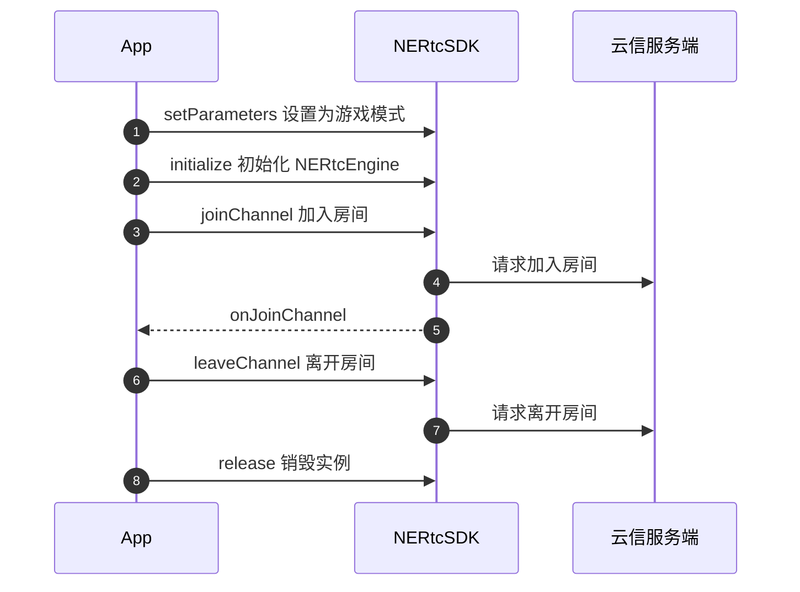

网易云信 RTC 提供高质量的实时语音通话。本文介绍语音通话的基本实现流程和示例代码。

## <span id="前提条件">前提条件</span>
请确认您已完成以下操作：

- <a href="https://doc.yunxin.163.com/console/guide/TIzMDE4NTA?platform=console" target="_blank">创建应用并获取 App Key</a>。
- <a href="https://doc.yunxin.163.com/nertc/quick-start/TYzODcyNjE" target="_blank">开通音视频通话 2.0 服务</a>。
- <a href="https://doc.yunxin.163.com/nertc/quick-start/zc5MTgxMTE" target="_blank">集成 SDK</a>

## <span id="示例代码">完整示例代码</span> 

网易云信为您提供完整的**实现基础语音通话**的示例代码作为参考，您可以直接拷贝用于运行测试。


::: details 实现语音通话的完整示例代码

在您工程的类的头文件中，添加以下代码
```
#include "INertcEngineEx.h"
#include "INertcEngineEventHandler.h"
#include "INertcAudioDeviceManager.h"


class YourProjectClass :public nertc::IRtcEngineEventHandler, public nertc::IRtcMediaStatsObserver
{
public: 
  void InitNertcEngine(FString yourAppkey, FString yourLogPath);
  //重写onJoinChannel虚函数，调用joinChannel后，SDK会自动调用该函数，通知结果
  void onJoinChannel(channel_id_t cid, nertc::uid_t uid, NERtcErrorCode result, uint64_t elapsed) override;
  //重写onConnectionStateChange虚函数，链接状态发生变更时，SDK会自动调用该函数
  void onConnectionStateChange(NERtcConnectionStateType state, NERtcReasonConnectionChangedType reason)override;
  //重写onLeaveChannel虚函数，离开房间后，SDK会自动调用该函数
  void onLeaveChannel(NERtcErrorCode result, uint64_t channel_id) override;
  //调用setStatsObserver之后，SDK会定期回调onRtcStats函数，将SDK内部数据，例如CPU使用率等，通知给您
  void onRtcStats(const NERtcStats& stats) override;

  。。。。//您还可以重写其他任意您感兴趣的虚函数

  private:
  //用来保存SDK引擎对象的指针
  nertc::IRtcEngineEx* nertc_engine_;
  //用来保存音频设备管理器的指针
  nertc::IAudioDeviceManager* audio_device_manager_;
}

```

在您工程的cpp文件中，添加以下代码
```
void YourProjectClass::InitNertcEngine(FString yourAappkey, FString yourLogPath) {
  nertc_engine_ = nertc::createNERtcEngine();

  if (!nertc_engine_)
    return;

  std::string appKey = TCHAR_TO_ANSI(*yourAappkey);
  std::string logPath = TCHAR_TO_ANSI(*yourLogPath);

  nertc::NERtcEngineContext context{};
  context.app_key = appKey.c_str();
  //设置引擎事件回调，确保YourProjectClass继承了IRtcEngineEventHandler
  context.event_handler = this;
  context.log_dir_path = logPath.c_str();
  context.log_level = kNERtcLogLevelInfo;

  auto ret = nertc_engine_->initialize(context);
  if (ret != 0) {
    return;
  }
  //设置游戏模式，获得更好的音频体验 （可选）
  nertc_engine_->setParameters("{\"sdk.enable.plugin.game.mode\":true}");

  //获取音频manager对象，用于操控音频设备 （可选）
  nertc_engine_->queryInterface(nertc::kNERtcIIDAudioDeviceManager, (void**)(&audio_device_manager_));
  if (!audio_device_manager_) {
    return;
  }

  //设置媒体状态回调，确保YourProjectClass继承了IRtcMediaStatsObserver （可选）
  nertc_engine_->setStatsObserver(this);
}

void YourProjectClass::onJoinChannel(channel_id_t cid, nertc::uid_t uid, NERtcErrorCode result, uint64_t elapsed) {
  Print("Join chennel event");
  //所有callback函数的代码运行在引擎的worker线程中，不能直接在这些函数中操作UI！
  ......
}

//重写IRtcMediaStatsObserver基类中的虚函数（可选）
void YourProjectClass::onRtcStats(const NERtcStats& stats) {
  ..... 显示SDK状态
}

```

在您的业务逻辑代码的合适时机处，进行SDK的初始化、入会、离会等操作
```
//初始化SDK
InitNertcEngine("your appkey", "your log path");
......

//对于安卓平台，需要主动申请下麦克风权限, 该方法会同步等待结果，然后才返回
nertc_engine_->acquireAndroidRecordingPermissions();

//加入房间
NERtcJoinChannelOptions option;
//如果您的appkey开通了非安全模式，则此处的“your_token”可以填空字符串
nertc_engine_->joinChannel("your_token", "your_channel_name", yourUid, option);

//joinChannel之后，SDK会调用 onJoinChannel函数将入会的结果通知给您，假如您想在onJoinChannel函数中更新UI，请注意线程问题：onJoinChannel函数并不运行在主线程，直接更新UI会有线程问题，请自行抛线程处理。

......

//结束通话
nertc_engine_->leaveChannel();
......

//程序即将退出时，释放SDK
nertc_engine_->release();
delete nertc_engine_;
nertc_engine_ = nullptr;
```
:::

## API 时序图

实现**语音通话**的 API 调用时序如下图所示。





## <span id="实现语音通话">实现语音通话</span>


### <span id="1.导入类">步骤一 导入类</span>

在您的工程中对应实现语音通话的 Activity 文件里添加如下代码先导入以下重要类：

```
#include "INertcEngineEx.h"
#include "INertcEngineEventHandler.h"
#include "INertcAudioDeviceManager.h"
```
 
### 步骤二 继承回调事件类

SDK通过回调来通知上层相应的事件，您需要在初始化时**注册回调指针**，请继承 **nertc::IRtcEngineEventHandler** 类，并按需重写其中的虚函数。初始化 SDK 时即可将YourProjectClass 指针传给 SDK，完成事件的注册。

```
class YourProjectClass :public nertc::IRtcEngineEventHandler, public nertc::IRtcMediaStatsObserver
{
public: 
  void InitNertcEngine(FString yourAappkey, FString yourLogPath);
  //重写onJoinChannel虚函数，调用joinChannel后，SDK会自动调用该函数，通知结果
  void onJoinChannel(channel_id_t cid, nertc::uid_t uid, NERtcErrorCode result, uint64_t elapsed) override;
  //重写onConnectionStateChange虚函数，链接状态发生变更时，SDK会自动调用该函数
  void onConnectionStateChange(NERtcConnectionStateType state, NERtcReasonConnectionChangedType reason)override;
  //重写onLeaveChannel虚函数，离开房间后，SDK会自动调用该函数
  void onLeaveChannel(NERtcErrorCode result, uint64_t channel_id) override;
  //调用setStatsObserver之后，SDK会定期回调onRtcStats函数，将SDK内部数据，例如CPU使用率等，通知给您
  void onRtcStats(const NERtcStats& stats) override;

  。。。。//您还可以重写其他任意您感兴趣的虚函数

  private:
  //用来保存SDK引擎对象的指针
  nertc::IRtcEngineEx* nertc_engine_;
  //用来保存音频设备管理器的指针
  nertc::IAudioDeviceManager* audio_device_manager_;
}
```

### <span id="3.初始化SDK">步骤三 创建并初始化 SDK</span>

1. 请调用 <a href="https://doc.yunxin.163.com/nertc/api-refer/UE/doxygen/Latest/zh/html/namespacenertc.html#aee475ff805efd441620eb39c45a415e6" target="_blank">`nertc::createNERtcEngine`</a> 方法创建 SDK 实例。

2. 请调用 <a href="https://doc.yunxin.163.com/nertc/api-refer/UE/doxygen/Latest/zh/html/classnertc_1_1_i_rtc_engine.html#a1e816fd56f1cc6953a263f6798d0f1d4" target="_blank">`initialize`</a> 方法完成初始化。


**示例代码**如下：

```
void YourProjectClass::InitNertcEngine(FString yourAappkey, FString yourLogPath) {
  nertc_engine_ = nertc::createNERtcEngine();

  if (!nertc_engine_)
    return;

  std::string appKey = TCHAR_TO_ANSI(*yourAappkey);
  std::string logPath = TCHAR_TO_ANSI(*yourLogPath);

  nertc::NERtcEngineContext context{};
  context.app_key = appKey.c_str();
  //设置引擎事件回调，确保YourProjectClass继承了IRtcEngineEventHandler
  context.event_handler = this;
  context.log_dir_path = logPath.c_str();
  context.log_level = kNERtcLogLevelInfo;

  auto ret = nertc_engine_->initialize(context);
  if (ret != 0) {
    return;
  }
  //设置游戏模式，获得更好的音频体验 （可选）
  nertc_engine_->setParameters("{\"sdk.enable.plugin.game.mode\":true}");

  //获取音频manager对象，用于操控音频设备 （可选）
  nertc_engine_->queryInterface(nertc::kNERtcIIDAudioDeviceManager, (void**)(&audio_device_manager_));
  if (!audio_device_manager_) {
    return;
  }

  //设置媒体状态回调，确保YourProjectClass继承了IRtcMediaStatsObserver （可选）
  nertc_engine_->setStatsObserver(this);
}

//在您的业务逻辑代码的合适时机处，进行SDK的初始化操作
InitNertcEngine("your_appkey", "your_log_path");
```


参数 | 类型 | 描述
---- | -------------- | ---------
Aappkey | String| 请替换为云信控制台上您的应用对应的 AppKey。获取 AppKey 的方法请参见[创建应用并获取 AppKey](https://doc.yunxin.163.com/console/guide/TIzMDE4NTA?platform=console#%E8%8E%B7%E5%8F%96-appkey)。
LogPath | String |请设置日志路径，必填<br>Windows 操作系统推荐使用 `%temp%` 目录或您的工程目录，只要是具有读写权限的目录即可。|

 

### <span id="4.加入房间">步骤四 加入房间</span>

调用 <a href="https://doc.yunxin.163.com/nertc/api-refer/UE/doxygen/Latest/zh/html/classnertc_1_1_i_rtc_engine.html#a2743157544274a0264cdf8f132161039" target="_blank">`joinChannel`</a> 方法加入房间。

::: note note
加入房间前，请确保已完成初始化相关事项。若您的业务中涉及呼叫邀请等机制，建议通过<a href="/docs/DA5MjI4NDY/DE2MTc5MTQ" target="_blank">信令</a>实现，总体实现流程请参见<a href="https://doc.yunxin.163.com/signaling/quick-start/DE2MTc5MTQ?platform=android#%E4%B8%80%E5%AF%B9%E4%B8%80%E4%BC%9A%E8%AF%9D%E6%93%8D%E4%BD%9C%E6%B5%81%E7%A8%8B" target="_blank">一对一会话操作流程</a>，具体呼叫邀请机制的实现请参见<a href="https://doc.yunxin.163.com/signaling/quick-start/zc3NDkzNDU?platform=android" target="_blank">邀请机制</a>。
:::

**示例代码**如下：
```
nertc_engine_->joinChannel("your_token", "your_channel_name", yourUid, option);
```

**参数说明**：

<table>
  <tr>
    <th width="30%"><b>参数</b></th>
    <th width="60%"><b>说明</b></th>
  </tr>
  <tr>
    <td>token</td>
    <td>安全认证签名（NERTC Token）。<br><ul><li>调试模式下：可设置为 null。产品默认为安全模式，您可以在网易云信控制台将鉴权模式修改为调试模式，具体请参见<a href="https://doc.yunxin.163.com/nertc/quick-start/TQ0MTI2ODQ?platform=android" target="_blank">Token 鉴权</a>。<br><b>调试模式的安全性不高，请在产品正式上线前修改为安全模式。</b><li>产品正式上线后：请设置为已获取的<a href="https://doc.yunxin.163.com/nertc/quick-start/TQ0MTI2ODQ?platform=android#%E7%94%B3%E8%AF%B7%20Token" target="_blank">NERTC Token</a>。安全模式下必须设置为获取到的 Token 。若未传入正确的 Token 将无法进入房间。<p><b>推荐使用安全模式</b>。</td>
  </tr>
    <tr>
    <td>channelName</td>
    <td>房间名称，长度为 1 ~ 64 字节。目前支持以下 89 个字符：a-z, A-Z, 0-9, space, !#$%&()+-:;≤.,>? @[]^_{|}~"。<br>设置相同房间名称的用户会进入同一个通话房间。<br><note type="note">您也可以在加入通道前，通过<a href="https://doc.yunxin.163.com/nertc/quick-start/jg3NjcyNTE" target="_blank">创建房间</a>接口创建房间。加入房间时，若传入的 {channelName} 未事先创建，则云信服务器内部将为其自动创建一个名为 {channelName} 的通话房间。</note></li></td>
  </tr>
    <tr>
    <td>uid</td>
    <td>用户的唯一标识 id，为数字串，房间内每个用户的 uid 必须是唯一的。<note type="notice">此 uid 为用户在您应用中的 ID，请在您的业务服务器上自行管理并维护。</note></td>
  </tr>
    <tr>
    <td>channelOptions</td>
    <td>加入房间时可以设置携带一些特定信息，包括高级权限密钥。若无需设置上述信息，请构造一个默认对象传入即可。具体请参考 <a href="https://doc.yunxin.163.com/nertc/api-refer/UE/doxygen/Latest/zh/html/structnertc_1_1_n_e_rtc_join_channel_options.html" target="_blank">NERtcJoinChannelOptions</a>。</td>
  </tr>
</table>

::: note note
- SDK 发起加入房间请求后，服务器会进行响应，您可以通过<a href="https://doc.yunxin.163.com/nertc/api-refer/UE/doxygen/Latest/zh/html/classnertc_1_1_i_rtc_engine_event_handler.html#a3f55353db4a1369d70ec3859e91c7337" target="_blank">`onJoinChannel`</a> 回调监听加入房间的结果，同时该回调会抛出当前通话房间的 **channelId** 与加入房间总耗时（毫秒）；其中 **channelId** 即语音通话的 ID，建议您在业务层保存该数据，以便于后续问题排查。

- 成功加入房间之后，您可以通过监听 [`onConnectionStateChange`](https://doc.yunxin.163.com/nertc/api-refer/UE/doxygen/Latest/zh/html/classnertc_1_1_i_rtc_engine_event_handler.html#acc3468170eeb2e05915fc1df964823f5) 回调实时监控自己在本房间内的连接状态。

- 您也可以调用 [`onUserJoined`](https://doc.yunxin.163.com/nertc/api-refer/UE/doxygen/Latest/zh/html/classnertc_1_1_i_rtc_engine_event_handler.html#afb07fa47ee6eeb06beda405f0bd37d9e) 回调监听其它用户加入房间的通知。
:::

### <span id="5.音频流">步骤五 发布、停止本地音频流（可选）</span>

在 NERTC SDK 中，本地音频的采集发布和远端音频订阅播放是默认启动的，正常情况下无需开发者主动干预。

您也可以调用 [`enableLocalAudio`](https://doc.yunxin.163.com/nertc/api-refer/UE/doxygen/Latest/zh/html/classnertc_1_1_i_rtc_engine.html#aad59ec2e1bb9983860d175b2a5dae0a6)方法开启或关闭音频设备，以控制本地音频流的发布。

```
nertc_engine_->enableLocalAudio(kNERtcAudioStreamTypeMain, true or false);
```

### <span id="6.退出通话房间">步骤六 离开房间</span>

调用 <a href="https://doc.yunxin.163.com/nertc/api-refer/UE/doxygen/Latest/zh/html/classnertc_1_1_i_rtc_engine.html#a6fbc54a71986a4a4a1c9c24d2c29e884" target="_blank">`leaveChannel`</a> 方法离开房间。

**示例代码**如下：
```
nertc_engine_->leaveChannel();
``` 

- 通过 <a href="https://doc.yunxin.163.com/nertc/api-refer/UE/doxygen/Latest/zh/html/classnertc_1_1_i_rtc_engine_event_handler.html#a93bc90bb928ddbec1adfb044958cfc07" target="_blank">`onLeaveChannel`</a> 回调可以监听当前用户退出房间的结果。
- 通过 [`onUserLeft`](https://doc.yunxin.163.com/nertc/api-refer/UE/doxygen/Latest/zh/html/classnertc_1_1_i_rtc_engine_event_handler.html#ae57dd9e45baa452c558bca2783d889a4) 回调可以监听远端用户离开房间的通知。

### <span id="7.销毁实例">步骤七 销毁实例</span>

当确定 App 短期内不再使用音视频通话实例时，可以调用 <a href="https://doc.yunxin.163.com/nertc/api-refer/UE/doxygen/Latest/zh/html/classnertc_1_1_i_rtc_engine.html#a0255f44d601ad7ae039d189845b07503" target="_blank">`release`</a> 方法释放对应的对象资源。


::: note note
当此接口调用成功之后，若您想再次使用 SDK，需要重新创建并初始化SDK。
:::

  
**示例代码**如下：

```
//程序即将退出时，释放SDK
nertc_engine_->release();
delete nertc_engine_;
nertc_engine_ = nullptr;
``` 