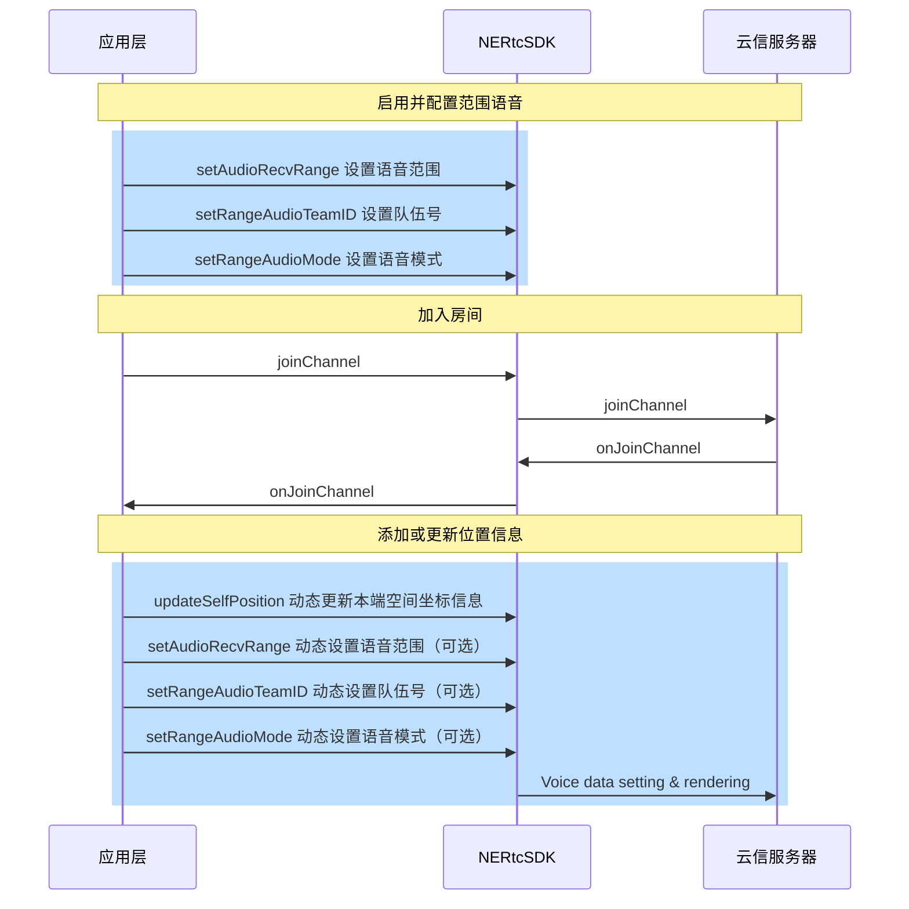

范围语音是指在一个 RTC 房间内，用户可以与一定距离内的其他用户进行实时语音通话。您可以调用 NERtc 客户端接口来更新声源方位，以告知服务器本端的位置，服务器根据**本端世界坐标+本端接收音频的范围**，与**其他端世界坐标 + 其他端接收音频的范围**进行判断，然后对玩家范围内的音频流进行转发。

## 应用场景

范围语音的应用场景举例如下：

| 应用场景 |说明  |  
| :-----| :----| 
| 大逃杀游戏 | 提供大逃杀类型游戏、生存射击类手游中特有的“仅小队”或“所有人”的语音模式。在游戏设置中，根据玩家选择:<ul><li> 仅小队：仅小队内的玩家可以进行语音通话。<li> 所有人：听见队伍中队友声音，以及一定范围内其他对局玩家说话的声音。 |

## 基本概念
使用范围语音功能，涉及到[**范围语音的模式**](#范围语音的模式)、[**语音接收范围**](#语音接收范围)以及 **[TeamID](#TeamID)** 这三个概念。

### 范围语音的模式

当进入范围语音房间时，有两种语音模式可供选择：

语音模式 | 参数名称 |  功能 |
:-----| :----|  :----| 
所有人 | kNERtcRangeAudioModeDefault  |<ul><li> 其他玩家在一定范围内可以听到该玩家说话，如范围内有其他玩家也选择了此模式，则它们可以进行互相通话。 <li> TeamID 相同的队友可以互相听到|
仅小队 | kNERtcRangeAudioModeTeam | 仅 TeamID 相同的队友可以互相听到。 |

::: note note
队友之间的通话不受距离以及语音模式的影响。
:::


### 语音接收范围


如果设置的语音模式为**所有人(kNERtcRangeAudioModeDefault)**，此时的语音接收范围受 `updateSelfPosition` 接口影响。

假设以下两个玩家 A 与 B 为不同的小队，且设置的语音模式为**所有人(kNERtcRangeAudioModeDefault)**：

玩家坐标 | 语音接收范围 |  与另一玩家声音可达情况 | 与队友声音可达情况 |
:-----| :----|  :----| :----|
A(0,0,0) | 10米  |可以听到玩家 B 的声音，因为 B 玩家距离 A 玩家在 10 米内|不影响同一小队成员相通话|
B(0,8,0) | 5米 | 不可以听到玩家 A 的声音，因为 A 玩家与 B 玩家距离超过 5 米 |不影响同一小队成员互相通话|


### TeamID

使用范围语音，需要调用 `setRangeAudioTeamID` 接口设置小队号 team_id，再调用 `setAudioRecvRange` 接口，之后调用 `joinChannel`  接口进入语音房间。

- 当进入语音房间时指定的 `team_id != 0` 时，将启用范围语音房间模式。如果某成员使用 `team_id = 1` 进入语音房间，当他设置语音模式为 `kNERtcRangeAudioModeTeam`，则只有 `team_id = 1` 的成员能听到他的声音；如果他设置的语音模式为 `kNERtcRangeAudioModeDefault`，则除了  team_id = 1 的成员，一定范围内的玩家也能听到他的声音。

    <table>
        <tr>
            <th>team_id 情况</th><th>语音模式</th><th>范围</th><th>声音可达情况</th>
        </tr>
        <tr>
            <td rowspan="2">team_id != 0，假设 team_id = 1 </td><td>kNERtcRangeAudioModeTeam </td><td>10米</td><td>声音只能和 team_id = 1 的成员互通</td>
        </tr>
        <tr>
            <td>kNERtcRangeAudioModeDefault </td><td>10米</td><td>声音能和 team_id = 1 的成员、以及语音模式设置为 kNERtcRangeAudioModeDefault  的同房间10米范围内成员互通</td>
        </tr>
    </table>

    - 如果某成员使用 team_id = 0 进入语音房间，将启用范围语音主持人模式。房间内所有人（不论范围语音的模式是所有人还是仅小队）都可以听到该成员的声音。

    <table>
        <tr>
            <th>team_id 情况</th><th>team_id 修改时机</th><th>范围</th><th>声音可达情况</th>
        </tr>
        <tr>
            <td >team_id = 0  </td><td>进房前 无论TeamID 是否为 0，以 team_id = 0 进入房间</td><td>10米</td><td>说话声音全房间成员（不论语音模式是所有人还是仅小队）都能听到
    <br>能与  team_id = 0  的成员互相沟通
    <br>不能听到房间内其他人说话声音
    </td>
        </tr>
    
    </table>

### 场景示例

- **大逃杀游戏:**  例如一个生存射击类型的游戏，每 4 个人为一个队伍，则这 4 个人需要设置一个小队号 TeamID，每 100 人为一个对局房间，一个对局共 25 个小队，则 25 个小队都进入一个语音房间。在对局中，如果某玩家想和 10 米范围内的陌生人沟通，则将语音距离范围设置为 10，将语音模式设置为 `kNERtcRangeAudioModeDefault` ，同时打开麦克风及扬声器。如果他只想和小队成员沟通，不和非小队的成员沟通，则只需要将语音模式设置为  `kNERtcRangeAudioModeTeam` 。
- **主持人模式：** 在游戏中例如虚拟桌游场景，主持人说话声音即要房间内所有人听见，也要听见范围内玩家说话的声音，可以让主持人先以 `team_id != 0` 的形式进入房间，进房后将 `team_id` 设置为 0，此时主持人说话全房间的人都能听见。


## API 调用时序


## 实现方法

### 步骤1 设置范围语音的距离范围

加入房间前，调用 [`setAudioRecvRange`](https://doc.yunxin.163.com/nertc/api-refer/UE/doxygen/Latest/zh/html/classnertc_1_1_i_rtc_engine_ex.html#aa2a512b95a1f7e63f7badbcee4bcf9c8) 接口设置语音范围。

**参数描述**如下表所示：

|参数 |类型 | 描述 | 
|---- | ------- | ----------- | 
|audibleDistance | Integer  | 监听器能接收到音频的最大距离，用户的声音在该范围内可被听见。在该范围内，声音将会随距离的增加而衰减，直至超出所设置的范围，则不再有声音。<br> 取值范围：[1, max int) ，无默认值。| 
|conversationalDistance | Integer  | <note type="note">该参数设置的值对范围语音不起作用，保持默认值即可。</note>监听器不对音频进行衰减的距离，在该距离范围内，扬声器音频保持其原始音量，超出该范围时，声音将会随距离的增加而衰减。默认值为 1。| 
rollOff | Integer |<note type="note">该参数设置的值对范围语音不起作用，保持默认值即可。</note>距离衰减模式。一共有三种：|\
||| - kNERtcDistanceRolloffLogarithmic（0）：指数衰减。|\
||| - kNERtcDistanceRolloffLinear（1）：线性衰减。|\
||| - kNERtcDistanceRolloffNone（2）：无衰减。|

::: note note
如果您只想要实现范围语音，不需要小队模式，您只需要调用`setAudioRecvRange` 接口设置语音的距离范围即可，不需要调用 `setRangeAudioTeamID` 和 `setRangeAudioMode`。
:::

### 步骤2 设置 TeamID
在加入房间前，调用 [`setRangeAudioTeamID`](https://doc.yunxin.163.com/nertc/api-refer/UE/doxygen/Latest/zh/html/classnertc_1_1_i_rtc_engine_ex.html#a59d6a3682f8caf0a269fbbadd98c490f) 接口设置队伍号。

::: note note
- 加入房间后，可通过此接口修改队伍号，设置后立即生效。
- 离开房间后，TeamID 失效，需要重新配置TeamID ，请在每次加入房间之前都调用此方法设置 TeamID。
- 如果离开房间后再加入房间，请在收到退房成功回调（`onLeaveChannel`）后，再调用设置队伍号接口。
- 您也可以在加入房间（[`joinChannel`](https://doc.yunxin.163.com/nertc/api-refer/UE/doxygen/Latest/zh/html/classnertc_1_1_i_rtc_engine.html#a2743157544274a0264cdf8f132161039)）时，设置小队ID（teamID）、范围语音的模式（mode）和范围语音的接收范围（audibleDistance）。
:::


### 步骤3 设置范围语音的模式

在加入房间前，调用 [`setRangeAudioMode`](https://doc.yunxin.163.com/nertc/api-refer/UE/doxygen/Latest/zh/html/classnertc_1_1_i_rtc_engine_ex.html#a07611bb7ed19996d07325c7a7f25c87f) 接口设置语音模式。

语音模式的参数说明如下表所示。

| 语音模式 | 参数名称 |  功能 |
| :-----| :----|  :----| 
|所有人 | kNERtcRangeAudioModeDefault  |<ul><li> 其他玩家在一定范围内可以听到该玩家说话，如果范围内有其他玩家也选择了此模式，则它们可以进行互相通话。 <li> TeamID 相同的队友可以互相听到。|
| 仅小队 | kNERtcRangeAudioModeTeam | 仅 TeamID 相同的队友可以互相听到。 |

::: note note
- 加入房间后，可以随时修改语音模式，并立即生效。
- 离开房间后，此参数不会自动重置为 `kNERtcRangeAudioModeDefault`，所以请在每次加入房间之前都调用此方法设置语音模式。
- 不同范围语音模式，发声者声音的可接收情况说明请参见[附录](#附录)。
:::


### 步骤4 更新声源方位
更新声源方位的目的是向服务器传达本端的位置，以便通过本端的世界坐标和接收范围，与其他端的世界坐标和接收范围进行比较，以实现范围语音的效果。

在加入房间后，每帧调用 [`updateSelfPosition`](https://doc.yunxin.163.com/nertc/api-refer/UE/doxygen/Latest/zh/html/classnertc_1_1_i_rtc_engine_ex.html#a7d1e68f02ce3128fd85837bd431cce1f) 方法并设置 info 参数，以更新音源或听者的空间位置信息。


| 参数 | 描述 | 
| ---- | -------------- | 
| speakerPosition | 说话者的位置信息，三个值依次表示X、Y、Z的坐标值。默认值{0,0,0}| 
| speakerQuaternion | 说话者的旋转信息，通过四元组来表示，数据格式为{w, x, y, z}。默认值{0,0,0,0}  <note type="note">该参数设置的值暂时不起作用，保持默认值即可。</note>| 
| headPosition | 接收者的位置信息，三个值依次表示X、Y、Z的坐标值。默认值{0,0,0}|
| headQuaternion| 接收者的旋转信息，通过四元组来表示，数据格式为{w, x, y, z}。默认值{0,0,0,0}|


## 示例代码

```c++
void EnableAudioRange() {
  
  //方式1：join前调用接口设置范围语音参数，启动范围语音
  nertc_engine_->setRangeAudioTeamID(YOUR_TERAM_ID);                  //设置小队ID
  nertc_engine_->setRangeAudioMode(kNERtcRangeAudioModeTeam);         //设置你的语音模式
  nertc_engine_->setAudioRecvRange(50, 1, kNERtcDistanceRolloffLinear);//设置接受距离与衰减模式
  ...
  NERtcJoinChannelOptions option;
  nertc_engine_->joinChannel("YOUR_TOKEN", "YOUR_CHANNEL_NAME", UID, option);
  
  //方式2：join时在option中携带范围语音参数，启动范围语音
  NERtcJoinChannelOptions option;
  option.team_id = YOUR_TERAM_ID;                                     //设置小队ID
  option.mode = kNERtcRangeAudioModeTeam;                             //设置你的语音模式
  option.audible_distance = 50;                                       //设置接受距离
  auto ret = nertc_engine_->joinChannel("YOUR_TOKEN", "YOUR_CHANNEL_NAME", UID, option);
}


//一般情况下，您需要在角色移动时不断调用UpdateMySelfPosition函数更新位置
void UpdateMySelfPosition(float posX, float posY, float posZ)
{
    /*NERtcPositionInfo结构体中head_position、head_quaternion是指听者的位置、角度, speaker_position、speaker_quaternion、角度。
    *听者和说话者可只同一个人的位置，也可以在不同位置，比如说话者丢出去一个探听器来接收探听器所在区域的范围语音。
    */     
    NERtcPositionInfo pos_info;
    pos_info.speaker_position[0] = posX;
    pos_info.speaker_position[1] = posY;
    pos_info.speaker_position[2] = posZ;
    
    pos_info.head_position[0] = posX;
    pos_info.head_position[1] = posY;
    pos_info.head_position[2] = posZ;
    
    auto ret = nertc_engine_->updateSelfPosition(pos_info);
}
```

## 附录
- 假设 A 玩家状态为“所有人”，对应 B 玩家在不同语音模式下声音可达情况：
<table>
    <tr>
        <th>是否同一小队</th><th>是否范围内</th><th>语音模式</th><th>A与B 是否能相互听到对方的声音</th>
    </tr>
    <tr>
    <td rowspan="4">同一小队 </td>
    <td rowspan="2">是 </td>
    <td> kNERtcRangeAudioModeDefault</td><td> 是 </td>
    <tr>
    <td> kNERtcRangeAudioModeTeam</td><td> 是 </td>
    </tr>
    <tr>
    <td rowspan="2"> 否</td>
    <td> kNERtcRangeAudioModeDefault </td><td> 是 </td>
    </tr>
    <tr>
    <td> kNERtcRangeAudioModeTeam</td><td>   是</td>
    </tr>
        <tr>
    <td rowspan="4">不同小队 </td>
    <td rowspan="2">是 </td>
    <td> kNERtcRangeAudioModeDefault</td><td> 是 </td>
    <tr>
    <td> kNERtcRangeAudioModeTeam</td><td> 否 </td>
    </tr>
    <tr>
    <td rowspan="2"> 否</td>
    <td> kNERtcRangeAudioModeDefault </td><td> 否 </td>
    </tr>
    <tr>
    <td> kNERtcRangeAudioModeTeam</td><td>否</td>
    </tr>
</table>

- 假设 A 玩家状态为“仅小队”，对应 B 玩家在不同语音模式下声音可达情况：

<table>
    <tr>
        <th>是否同一小队</th><th>是否范围内</th><th>语音模式</th><th>A与B 是否能相互听到对方的声音</th>
    </tr>
    <tr>
    <td rowspan="4">同一小队 </td>
    <td rowspan="2">是 </td>
    <td> kNERtcRangeAudioModeDefault</td><td> 是 </td>
    <tr>
    <td> kNERtcRangeAudioModeTeam</td><td> 是 </td>
    </tr>
    <tr>
    <td rowspan="2"> 否</td>
    <td> kNERtcRangeAudioModeDefault </td><td> 是 </td>
    </tr>
    <tr>
    <td> kNERtcRangeAudioModeTeam</td><td>   是</td>
    </tr>
        <tr>
    <td rowspan="4">不同小队 </td>
    <td rowspan="2">是 </td>
    <td> kNERtcRangeAudioModeDefault</td><td> 否 </td>
    <tr>
    <td> kNERtcRangeAudioModeTeam</td><td> 否 </td>
    </tr>
    <tr>
    <td rowspan="2"> 否</td>
    <td> kNERtcRangeAudioModeDefault </td><td> 否 </td>
    </tr>
    <tr>
    <td> kNERtcRangeAudioModeTeam</td><td>否</td>
    </tr>
</table>


