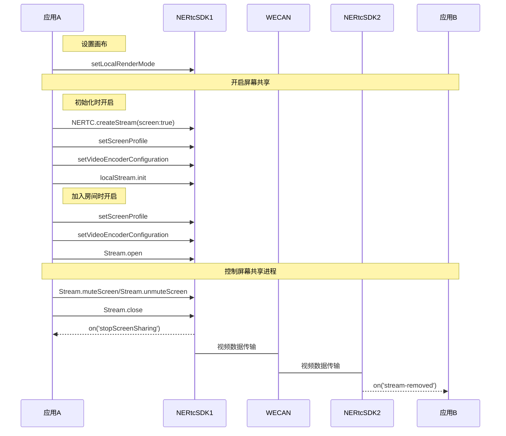
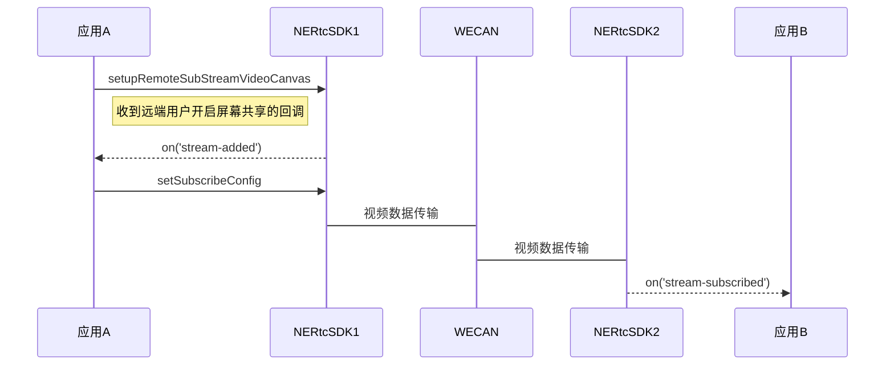

<!-- keywords: 屏幕共享,RTC,音视频通话 -->

通过 NERTC SDK 可以在视频通话或互动直播过程中实现屏幕共享，主播或连麦者可以将自己的屏幕内容，以视频的方式分享给远端参会者或在线观众观看，从而提升沟通效率，一般适用于多人视频聊天、在线会议以及在线教育场景。

- 视频会议场景中，参会者可以在会议中将本地的文件、数据、网页、PPT 等画面分享给其他与会者，让其他与会者更加直观的了解讨论的内容和主题。

- 在线课堂场景中，老师可以通过屏幕共享将课件、笔记、教学内容等画面展示给远端的其他学生观看，降低传统教学模式下的沟通成本，提升教育场景的用户体验。

NERTC SDK 以辅流的形式实现屏幕共享，即单独为屏幕共享开启一路上行的视频流，摄像头的视频流作为主流，屏幕共享的视频流作为辅流，两路视频流并行，主播同时上行摄像头画面和屏幕画面两路画面。

::: note note
此外 NERTC SDK 还支持在共享屏幕的同时，也共享本地播放的系统背景音。具体请参考<a href="/https://doc.yunxin.163.com/nertc/guide/TE4MzMzOTc" target="_blank">音频共享</a>。
:::

## 示例项目

网易云信在 GitHub 上提供设置屏幕共享的开源示例项目 <a href="https://github.com/netease-im/G2-API-Examples/tree/main/web/sampleCode-Vue/ScreenShare-Web-Vue" target="_blank">ScreenShare</a>，您可以前往下载体验，也可以<a href="https://app.yunxin.163.com/webdemo/g2web/index.html#/?path=screenShare" target="_blank">在线体验</a>此功能。

## <span id="注意事项">注意事项</span>

- NERTC Web SDK 自 V4.1.0 版本起，支持同时开启摄像头和屏幕共享，屏幕共享流以辅流形式发送。
- 屏幕共享功能支持 Chrome 72 及后续版本。
- NERTC Android、iOS、Windows 和 macOS SDK V3.9.0 及以上版本，Web SDK V4.1.0 及以上版本支持通过辅流实现屏幕共享。如果使用辅流的屏幕共享方案，请保证房间内所有成员均升级到支持版本以上，否则互相通信时会因同时发送主流和辅流造成通话异常等问题。
- 如果您的 App 无法针对所有端进行强制升级，屏幕共享场景中仅部分端使用上述支持的版本，为避免上述通话异常问题，必须保证通话过程中单人同时只有一路上行视频流。当需要将视频流切换为屏幕共享流时，请先通过关闭视频流，再启动屏幕共享流。反向切换同理。

## <span id="本端共享屏幕">本端共享屏幕</span>

### API 调用时序



  
### 实现方法

1. 设置屏幕共享辅流画布。

    通过 <a href="https://doc.yunxin.163.com/nertc/api-refer/web/typedoc/Latest/zh/html/interfaces/stream.stream-1.html#setlocalrendermode" target="_blank">`setLocalRenderMode`</a> 接口设置本端的屏幕共享画面大小。此方法可以设置屏幕共享画面的高度和宽度，在屏幕共享画面与自定义宽高不匹配时支持裁剪。

2. 开始屏幕共享。

    您可以在初始化之前配置屏幕共享，进入通话后会直接进入屏幕共享状态。进入通话时，默认订阅远端的屏幕共享流，所以可以直接接收到远端的屏幕共享流。

    您也可以根据场景需求，在通话过程中随时开启屏幕共享。
  
    - 初始化时开启屏幕共享。

        在调用 <a href="https://doc.yunxin.163.com/nertc/api-refer/web/typedoc/Latest/zh/html/modules/nertc.nertc-1.html#createstream" target="_blank">`createStream`</a> 方法创建音视频流时，把 `video` 字段设为 `true`，`screen` 字段设为 `true`，即可在初始化之前启动屏幕共享。

    - 通话过程中开启屏幕共享。

        加入房间之后，调用 <a href="https://doc.yunxin.163.com/nertc/api-refer/web/typedoc/Latest/zh/html/interfaces/stream.stream-1.html#open" target="_blank">`Stream.open`</a> 方法，并将 `type` 参数设置为 `screen`，可以随时启动屏幕共享。

3. 暂停或重新启动屏幕共享。

    在屏幕共享过程中，可以通过 <a href="https://doc.yunxin.163.com/nertc/api-refer/web/typedoc/Latest/zh/html/interfaces/stream.stream-1.html#mutescreen" target="_blank">`Stream.muteScreen`</a> 和 <a href="https://doc.yunxin.163.com/nertc/api-refer/web/typedoc/Latest/zh/html/interfaces/stream.stream-1.html#unmutescreen" target="_blank">`Stream.unmuteScreen`</a> 接口启动或暂停屏幕共享流。
    
    ::: note notice
    自 V4.1.0 版本起，原 muteVideo 和 unmuteVideo 接口不再对屏幕共享流有效。
    :::

4. 关闭屏幕共享。

    退出通话时，屏幕共享流会自动关闭。如果您在通话过程中需要关闭辅流形式的屏幕共享，可以通过 <a href="https://doc.yunxin.163.com/nertc/api-refer/web/typedoc/Latest/zh/html/interfaces/stream.stream-1.html#close" target="_blank">`Stream.close`</a> 接口关闭屏幕共享，并且停止发布屏幕共享流。

    此时本地会触发 <a href="https://doc.yunxin.163.com/nertc/api-refer/web/typedoc/Latest/zh/html/interfaces/client.client-1.html#on" target="_blank">`stopScreenSharing`</a> 回调，远端会收到 <a href="https://doc.yunxin.163.com/nertc/api-refer/web/typedoc/Latest/zh/html/interfaces/client.client-1.html#on" target="_blank">`stream-removed`</a> 回调。

### 示例代码
```js
let client = NERTC.createClient({
    appkey,
});
await client.join({
    channelName: "channel123",
    uid: 123123,
});
//创建本地流时，设置screen为true
let localStream = NERTC.createStream({
uid: 123123,
audio: true,
video: true,
screen: true,
});
try{
    await localStream.init()
    console.log('初始化本地流成功');
}catch(error){
    console.error('初始化本地流失败 ', error);
}
```

## <span id="设置屏幕共享属性">设置屏幕共享属性</span>

开启屏幕共享之前，您可以根据用户喜好设置屏幕共享流的相关属性，调整屏幕共享画面的清晰度，获得较高的用户体验。

- 通过 <a href="https://doc.yunxin.163.com/nertc/api-refer/web/typedoc/Latest/zh/html/interfaces/stream.stream-1.html#setscreenprofile" target="_blank">`setScreenProfile`</a> 接口设置屏幕共享的视频流属性，例如分辨率和帧率。

    ::: note notice
    若您选择在初始化时开启屏幕共享，`setScreenProfile` 需要在 <a href="https://doc.yunxin.163.com/nertc/api-refer/web/typedoc/Latest/zh/html/interfaces/stream.stream-1.html#init" target="_blank">`init`</a> 接口之前调用；若您选择在通话过程中开启屏幕共享，`setScreenProfile` 需要在 <a href="https://ip-10-246-152-16.wrtc.dev:4000/by-build/v4.6.20-dev-83-g8a133f53/api/interfaces/stream.stream-1.html#open" target="_blank">`localStream.open`</a> 接口之前调用。
    :::
    
    例如，您可以通过 `resolution` 参数设置屏幕共享视频流的分辨率，支持设置为：

    <table> 
    <tr> 
    <th width=20%><b>resolution可选值</b></th> 
    <th width=40%><b>类型</b></th>
    <th width=40%><b>说明</b></th> 
    </tr> 
    <tr> 
    <td>NERTC.VIDEO_QUALITY_480p</td> 
    <td>number</td>
    <td>屏幕共享低分辨率 640x480</td> 
    </tr> 
    <tr> 
    <td>NERTC.VIDEO_QUALITY_720p</td> 
    <td>number</td> 
    <td>屏幕共享中分辨率 1280x720</td> 
    </tr>
    <tr> 
    <td>NERTC.VIDEO_QUALITY_1080p</td> 
    <td>number</td> 
    <td>屏幕共享中分辨率 1920x1080</td> 
    </tr> 
    </table>

    **示例代码**如下：
    ```
    //设置屏幕共享视频流的分辨率为 1080p
    let resolution = NERTC.VIDEO_QUALITY_1080p
    localStream.setScreenProfile({resolution})
    ```

- 通过 <a href="" target="_blank">`setVideoEncoderConfiguration`</a> 接口设置屏幕共享偏好，以调整编码倾向。您可以通过 `contentHint` 参数设置屏幕共享内容为动画或细节。
    - `motion`：内容类型为动画。当共享的内容是视频、电影或游戏时，推荐选择该内容类型。当你设置内容类型为动画时，按您设置的帧率处理。
    - `detail`：内容类型为细节。当共享的内容是图片或文字时，推荐选择该内容类型。当您设置内容类型为细节时，最高帧率允许设置到 10 帧，设置超过 10 帧时，不生效，按 10 帧处理。
    
    **示例代码**如下：
    ```
    //设置内容类型为动画
    rtc.localStream = NERTC.createStream({screen: true})
    rtc.localStream.setVideoEncoderConfiguration({
      mediaType: "screen",
      streamType: "high",
      maxBitrate: 3_000_000,
      contentHint: "motion",
    })
    ```
## <span id="观看远端屏幕共享">观看远端屏幕共享</span>

### <span id="API 调用时序">API 调用时序</span>



  

### 实现方法

1. 设置远端辅流画布。
通过 <a href="https://doc.yunxin.163.com/nertc/api-refer/web/typedoc/Latest/zh/html/interfaces/stream.stream-1.html#setremoterendermode" target="_blank">`setRemoteRenderMode`</a> 接口设置远端的屏幕共享画面大小。此方法可以设置屏幕共享画面的高度和宽度，在屏幕共享画面与自定义宽高不匹配时支持裁剪。

2. 订阅远端用户的屏幕共享流。
接收端可以通过 <a href="https://doc.yunxin.163.com/nertc/api-refer/web/typedoc/Latest/zh/html/interfaces/stream.stream-1.html#setsubscribeconfig" target="_blank">`setSubscribeConfig`</a> 接口选择是否订阅发送端的屏幕共享：

    ```js
    client.on('stream-added', function(evt){
        // 只订阅远端音频，不订阅视频及屏幕共享
        evt.stream.setSubscribeConfig({
            audio: true,
            video: false,
            screen: false
        });
        client.subscribe(evt.stream);
    });
    ```

## API 参考
| **方法** | **功能描述**|
|:--|:--|
|<a href="https://doc.yunxin.163.com/nertc/api-refer/web/typedoc/Latest/zh/html/modules/nertc.nertc-1.html#createstream" target="_blank">`createStream`</a>|创建并返回音视频流对象。|
|<a href="https://doc.yunxin.163.com/nertc/api-refer/web/typedoc/Latest/zh/html/interfaces/stream.stream-1.html#open" target="_blank">`Stream.open`</a>|打开音视频输入设备，如屏幕共享，并发布出去。|
|<a href="https://doc.yunxin.163.com/nertc/api-refer/web/typedoc/Latest/zh/html/interfaces/stream.stream-1.html#close" target="_blank">`Stream.close`</a>|关闭音视频输入设备，如屏幕共享，并停止发布。|
|<a href="https://doc.yunxin.163.com/nertc/api-refer/web/typedoc/Latest/zh/html/interfaces/stream.stream-1.html#mutescreen" target="_blank">`Stream.muteScreen`</a>|暂停屏幕共享。|
|<a href="https://doc.yunxin.163.com/nertc/api-refer/web/typedoc/Latest/zh/html/interfaces/stream.stream-1.html#unmutescreen" target="_blank">`Stream.unmuteScreen`</a>|重新启动屏幕共享。|
|<a href="https://doc.yunxin.163.com/nertc/api-refer/web/typedoc/Latest/zh/html/interfaces/stream.stream-1.html#setscreenprofile" target="_blank">`setScreenProfile`</a> |设置视频流，如屏幕共享流的属性。|
|<a href="" target="_blank">`setVideoEncoderConfiguration`</a>|设置视频编码属性，如屏幕共享偏好。|
|<a href="https://doc.yunxin.163.com/nertc/api-refer/web/typedoc/Latest/zh/html/interfaces/stream.stream-1.html#setremoterendermode" target="_blank">`setRemoteRenderMode`</a>| 设置远端的屏幕共享画面大小。|
|<a href="https://doc.yunxin.163.com/nertc/api-refer/web/typedoc/Latest/zh/html/interfaces/stream.stream-1.html#setsubscribeconfig" target="_blank">`setSubscribeConfig`</a> |订阅远端的屏幕共享。|

## 常见问题

- [屏幕共享时提示 NotAllowedError Permission denied by system ？](https://doc.yunxin.163.com/nertc/guide/TcwNzk0MzA?platform=web#屏幕共享时提示-notallowederror-permission-denied-by-system)
- [Chrome 浏览器上屏幕共享黑屏](https://doc.yunxin.163.com/nertc/guide/TcwNzk0MzA?platform=web#chrome-浏览器上屏幕共享黑屏)
- [Mac 设备的 Safari 16 + 版本浏览器中，屏幕共享失败](https://doc.yunxin.163.com/nertc/guide/TcwNzk0MzA?platform=web#mac-设备的-safari-16-版本浏览器中屏幕共享失败)
- [Windows Chrome 111+ 浏览器屏幕共享可能出现鼠标重影、闪烁问题](https://doc.yunxin.163.com/nertc/guide/TcwNzk0MzA?platform=web#windows-chrome-111-浏览器屏幕共享可能出现鼠标重影-闪烁问题)