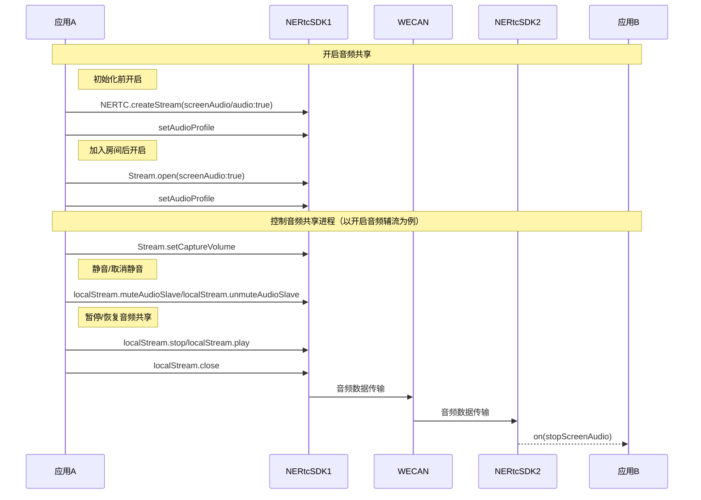
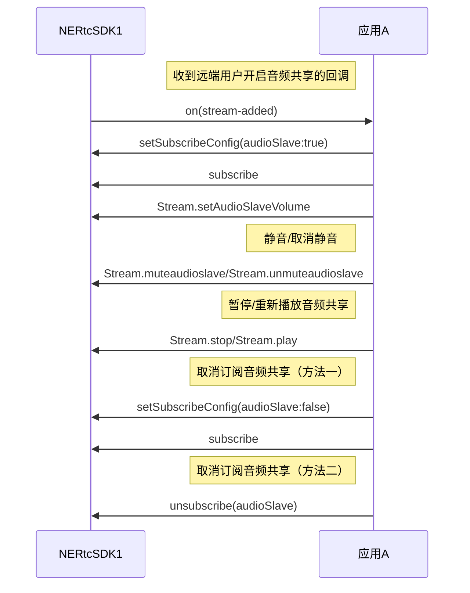

<!-- keywords: 音频共享,RTC,音视频通话 -->

在屏幕分享或共享本地播放的音乐文件等场景中，用户常常需要将本地系统音频发送至远端。NERTC 提供了音频共享功能，帮助您在共享屏幕的同时也能播放本地背景音，或者共享本地视频文件或音乐文件的声音，从而可以避免因需要播放在线音乐文件而遇到的版权问题。

## 功能介绍

通过 NERTC SDK 可以在视频通话或互动直播的过程中以音频**主流或辅流**的形式实现音频共享，主持人、主播或连麦者可以将本地播放的音频流分享给远端参会者或在线观众收听，从而提升视频通话体验。

音频共享适用于在线会议、在线教育以及互动直播等场景，具体场景说明如下。

- 视频会议场景中，参会者可以在会议中将本地的音频文件、PPT 背景音等所有系统声音分享给其他与会者，让其他与会者更加沉浸式地了解讨论的内容和主题。
- 在线课堂场景中，老师可以线上教学过程中在将课件、教学视频的背景音等所有系统声音分享给远端的学生，提升教育场景的用户体验。
- 互动直播场景中，主播可以在直播过程中将本地播放的音乐、视频背景音等所有系统声音分享给远端的观众，避免了因需要播放在线音乐而遇到的版权问题，同时丰富了场景体验。

## 注意事项

- 仅 **V4.0** 及之后版本的 NERTC Web SDK 支持音频共享，且该功能仅支持 Windows 和 macOS 平台的 Chrome 浏览器（**74+**）。
- macOS 平台的 Chrome 浏览器仅支持 Chrome 标签页（Chrome Tab）模式。
- 由于系统限制，分享当前的屏幕和页面时，无法将 SDK 接收到的声音再通过屏幕共享分享出去。
 
## 本端共享音频

### API 调用时序



  
### 实现方法

1. 开启音频共享。
    
    您可以在初始化之前配置屏幕共享背景音，进入通话后会直接进入屏幕共享状态。进入通话时，默认订阅远端的屏幕共享流和音频共享主辅流，所以可以直接接收到远端的屏幕共享流和音频共享主/辅流。您也可以根据场景需求，在通话过程中随时开启音频共享。

    1. **初始化前开启音频共享。**
        - 调用 <a href="https://doc.yunxin.163.com/nertc/api-refer/web/typedoc/Latest/zh/html/modules/nertc.nertc-1.html#createstream" target="_blank">`createStream`</a> 方法创建屏幕共享流，并设置 `screen` 字段和 `screenAudio` 字段为 `true` 。
        - 若您同时设置 `audio` 字段为 `true`，则输出的屏幕共享背景音为独立的音频辅流。主播可以在不影响麦克风采集音频的情况下，单独控制音频共享辅流的发布；连麦者也可以单独控制音频共享辅流的订阅和播放。
    
        ::: note note
        为保证良好的音频效果，建议在初始化之前调用 <a href="https://doc.yunxin.163.com/nertc/api-refer/web/typedoc/Latest/zh/html/interfaces/stream.stream-1.html#setaudioprofile" target="_blank">`Stream.setAudioProfile`</a> 方法设置音频属性为 `high_quality_stereo`（表示48 kHz 采样率，双声道，编码码率约 192 Kbps），具体请参考<a href="/https://doc.yunxin.163.com/nertc/guide/TA1NDQwODk" target="_blank">设置音频属性</a>。
        :::

    2. **通话过程中开启音频共享。** 调用 <a href="https://doc.yunxin.163.com/nertc/api-refer/web/typedoc/Latest/zh/html/interfaces/stream.stream-1.html#open">`Stream.open`</a> 方法打开音视频输入设备，并设置 `type` 字段为 `screen`，`screenAudio` 字段为 `true`，可以随时启动音频共享。
    
    配置完成后，在屏幕共享的弹出框中勾选**分享音频**（Share audio）。

    

2. 设置音频共享采集音量。

    调用 <a href="https://doc.yunxin.163.com/nertc/api-refer/web/typedoc/Latest/zh/html/interfaces/stream.stream-1.html#setcapturevolume" target="_blank">`Stream.setCaptureVolume`</a> 方法，并设置 `mediaTypeAudio` 字段为 `screenAudio` 设置音频共享采集音量。

3. （可选）静音或取消静音音频共享。

    若您以**辅流**的形式实现音频共享，可以调用 <a href="https://doc.yunxin.163.com/nertc/api-refer/web/typedoc/Latest/zh/html/interfaces/stream.stream-1.html#muteaudioslave" target="_blank">`localStream.muteAudioSlave`</a> 方法静音音频共享辅流，或调用 <a href="https://doc.yunxin.163.com/nertc/api-refer/web/typedoc/Latest/zh/html/interfaces/stream.stream-1.html#unmuteaudioslave" target="_blank">`localStream.unmuteAudioSlave`</a> 方法取消静音音频共享辅流。

4. （可选）暂停或重新启动音频共享。

    若您以**辅流**的形式实现音频共享，可以调用 <a href="https://doc.yunxin.163.com/nertc/api-refer/web/typedoc/Latest/zh/html/interfaces/stream.stream-1.html#stop" target="_blank">`localStream.stop`</a> 方法，并设置 `MediaType` 参数为 `audioSlave` 暂停音频共享辅流，或调用 <a href="https://doc.yunxin.163.com/nertc/api-refer/web/typedoc/Latest/zh/html/interfaces/stream.stream-1.html#play" target="_blank">`localStream.play`</a> 方法，并设置 `playOptions` 参数的 `audioSlave` 字段为 `true` 重新启动音频共享辅流。

5. 关闭音频共享。

    退出通话时，音频共享会自动关闭；若您需要在通话过程中关闭音频共享，请调用 <a href="https://doc.yunxin.163.com/nertc/api-refer/web/typedoc/Latest/zh/html/interfaces/stream.stream-1.html#close" target="_blank">`localStream.close`</a> 方法，并将 `type` 字段设置为 `screenAudio` 关闭音频共享。此时远端会触发 <a href="https://doc.yunxin.163.com/nertc/api-refer/web/typedoc/Latest/zh/html/interfaces/client.client-1.html#on" target="_blank">`on.stopScreenAudio`</a> 回调。

### 示例代码

```
let client = NERTC.createClient({
    appkey,
});
await client.join({
    channelName: "channel123",
    uid: 123123,
});

//创建本地流时，设置screen和screenAudio为true
let localStream = NERTC.createStream({
  uid: 123123,
  audio: false,//若您以辅流的形式实现音频共享，audio为true
  video: false,
  screen: true,
  screenAudio: true
});

//为保证良好的音频效果，建议设置音频profile为高音质立体声模式
let quality = 'high_quality_stereo'
localStream.setAudioProfile(quality)

try{
    await localStream.init()
    console.log('初始化本地流成功');
}catch(error){
    console.error('初始化本地流失败 ', error);
}

//如果createStream时，screen、screenAudio为false，想中途开启执行open()即可
rtc.localStream.open({
    type: 'screen',
    screenAudio: true,
}).then(async()=>{
    //本地预览屏幕共享
}).catch(err =>{
    console.log('打开屏幕共享 失败: ', err)
})

// 调用 setCaptureVolume 设置所有音效文件播放音量
rtc.localStream.setCaptureVolume(volume, 'screenAudio');

//mute音频共享辅流
await rtc.localStream.muteAudioSlave();
//unmute音频共享辅流
await rtc.localStream.unmuteAudioSlave();

//暂停音频共享辅流
rtc.localStream.stop('audioSlave');
//重新启动音频共享辅流
const playOptions = {audioSlave: true};
rtc.locaStream.play(null, playOptions);

//关闭并且停止发布屏幕共享音频
rtc.localStream.close({
    type: 'screenAudio'
}).then(()=>{
    console.log('关闭屏幕共享音频 success')
}).catch(err =>{
    console.log('关闭屏幕共享音频 失败: ', err)
})
```

## 订阅远端音频共享

### API 调用时序

以实现**辅流**形式的音频共享为例，API 调用时序如下图所示。



  
### 实现方法

1. 收到远端开启音频共享的 `on('stream-added')` 回调后，调用 <a href="https://doc.yunxin.163.com/nertc/api-refer/web/typedoc/Latest/zh/html/interfaces/stream.stream-1.html#setsubscribeconfig" target="_blank">`setSubscribeConfig`</a> 方法设置 `screen`（主流）或 `audioSlave`（辅流） 字段为 `true`，再调用 <a href="https://doc.yunxin.163.com/nertc/api-refer/web/typedoc/Latest/zh/html/interfaces/client.client-1.html#subscribe" target="_blank">`subscribe`</a>订阅发送端的音频共享。

2. 设置音频共享播放音量。

    若对端是以**辅流**的形式实现音频共享，可以调用 <a href="https://doc.yunxin.163.com/nertc/api-refer/web/typedoc/Latest/zh/html/interfaces/stream.stream-1.html#setaudioslavevolume" target="_blank">`Stream.setAudioSlaveVolume`</a> 方法设置音频共享播放音量。

3. （可选）静音或取消静音音频共享。

    若对端以**辅流**的形式实现音频共享，可以调用 <a href="https://doc.yunxin.163.com/nertc/api-refer/web/typedoc/Latest/zh/html/interfaces/stream.stream-1.html#muteaudioslave" target="_blank">`remoteStream.muteAudioSlave`</a> 方法静音音频共享辅流，或调用 <a href="https://doc.yunxin.163.com/nertc/api-refer/web/typedoc/Latest/zh/html/interfaces/stream.stream-1.html#unmuteaudioslave" target="_blank">`remoteStream.unmuteAudioSlave`</a> 方法取消静音音频共享辅流。

4. （可选）暂停或重新播放音频共享。

    若对端是以**辅流**的形式实现音频共享，可以调用 <a href="https://doc.yunxin.163.com/nertc/api-refer/web/typedoc/Latest/zh/html/interfaces/stream.stream-1.html#stop" target="_blank">`Stream.stop`</a> 方法，并设置 `MediaType` 参数为 `audioSlave` 暂停播放音频共享辅流，或调用 <a href="https://doc.yunxin.163.com/nertc/api-refer/web/typedoc/Latest/zh/html/interfaces/stream.stream-1.html#stream.play" target="_blank">`Stream.play`</a> 方法，并设置 `playOptions` 参数的 `audioSlave` 字段为 `true` 重新播放音频共享辅流。

5. 取消订阅远端的音频共享。
    - 调用 <a href="https://doc.yunxin.163.com/nertc/api-refer/web/typedoc/Latest/zh/html/interfaces/stream.stream-1.html#setsubscribeconfig" target="_blank">`setSubscribeConfig`</a> 方法设置`screen`（主流）或 `audioSlave`（辅流）字段为 `false`，再调用 <a href="https://doc.yunxin.163.com/nertc/api-refer/web/typedoc/Latest/zh/html/interfaces/client.client-1.html#subscribe" target="_blank">`subscribe`</a> 方法取消订阅发送端的音频共享。
    - 直接调用 <a href="https://doc.yunxin.163.com/nertc/api-refer/web/typedoc/Latest/zh/html/interfaces/client.client-1.html#unsubscribe" target="_blank">`unsubscribe`</a> 方法，并设置 `stream` 参数为 `screenAudio`（主流）或 `audioSlave`（辅流）取消订阅发送端的音频共享。
    
### 示例代码

```
client.on('stream-added', function({stream, mediaType}){
    console.log(`收到对端的媒体发布通知: ${stream.streamID} 发布了自己 ${mediaType}`)
    //mediaType的值为：audio、audioSlave、video、screen（audioSlave表示的是音频辅流）
};
//订阅音频共享主流
remoteStream.setSubscribeConfig({
    screen: true
});
rtc.client.subscribe(remoteStream);

//取消订阅音频共享主流
//方法1：
remoteStream.setSubscribeConfig({
    screen: false
})
rtc.client.subscribe(remoteStream)
//方法2：
rtc.client.unsubscribe(remoteStream, 'screenAudio')  
    
//订阅音频共享辅流
remoteStream.setSubscribeConfig({
    audioSlave: true
});
rtc.client.subscribe(remoteStream);

//设置音频辅流的音量
const colume = 100;
remoteStream.setAudioSlaveVolume(volume);

//mute音频辅流
await remoteStream.muteAudioSlave()
//unmute音频辅流
await remoteStream.unmuteAudioSlave()

//暂停音频共享辅流
stream.stop('audioSlave');
//重新启动音频共享辅流
const playOptions = {audioSlave: true};
await stream.play(null, playOptions);

//取消订阅音频辅流
//方法1：
remoteStream.setSubscribeConfig({
    audioSlave: false
})
rtc.client.subscribe(remoteStream)
//方法2：
rtc.client.unsubscribe(remoteStream, 'audioSlave')
```

## API 参考
| **方法** | **功能描述**|
|:--|:--|
|<a href="https://doc.yunxin.163.com/nertc/api-refer/web/typedoc/Latest/zh/html/modules/nertc.nertc-1.html#createstream" target="_blank">`createStream`</a>|创建并返回音视频流对象。|
|<a href="https://doc.yunxin.163.com/nertc/api-refer/web/typedoc/Latest/zh/html/interfaces/stream.stream-1.html#open">`Stream.open`</a>|打开音视频输入设备，如屏幕共享，并发布。|
|<a href="https://doc.yunxin.163.com/nertc/api-refer/web/typedoc/Latest/zh/html/interfaces/stream.stream-1.html#setcapturevolume" target="_blank">`Stream.setCaptureVolume`</a>|设置音频采集音量。|
|<a href="https://doc.yunxin.163.com/nertc/api-refer/web/typedoc/Latest/zh/html/interfaces/stream.stream-1.html#close" target="_blank">`Stream.close`</a>|关闭音视频输入设备，如屏幕共享，并停止发布。|
|<a href="https://doc.yunxin.163.com/nertc/api-refer/web/typedoc/Latest/zh/html/interfaces/stream.stream-1.html#muteaudioslave" target="_blank">`muteAudioSlave`</a>|静音本地音频辅流。|
|<a href="https://doc.yunxin.163.com/nertc/api-refer/web/typedoc/Latest/zh/html/interfaces/stream.stream-1.html#unmuteaudioslave" target="_blank">`unmuteAudioSlave`</a>|取消静音本地音频辅流。|
|<a href="https://doc.yunxin.163.com/nertc/api-refer/web/typedoc/Latest/zh/html/interfaces/stream.stream-1.html#stop" target="_blank">`stop`</a>|暂停音视频流，如音频共享。|
|<a href="https://doc.yunxin.163.com/nertc/api-refer/web/typedoc/Latest/zh/html/interfaces/stream.stream-1.html#play" target="_blank">`play`</a>|播放音视频流，如音频共享。|
|<a href="https://doc.yunxin.163.com/nertc/api-refer/web/typedoc/Latest/zh/html/interfaces/client.client-1.html#on" target="_blank">`on.stopScreenAudio`</a>|音频共享关闭回调。|
|<a href="https://doc.yunxin.163.com/nertc/api-refer/web/typedoc/Latest/zh/html/interfaces/stream.stream-1.html#setsubscribeconfig" target="_blank">`setSubscribeConfig`</a>|设置音视频订阅的参数。|
|<a href="https://doc.yunxin.163.com/nertc/api-refer/web/typedoc/Latest/zh/html/interfaces/client.client-1.html#subscribe" target="_blank">`subscribe`</a>|订阅远端音视频流。|
|<a href="https://doc.yunxin.163.com/nertc/api-refer/web/typedoc/Latest/zh/html/interfaces/client.client-1.html#unsubscribe" target="_blank">`unsubscribe`</a>|取消订阅远端音视频流。|