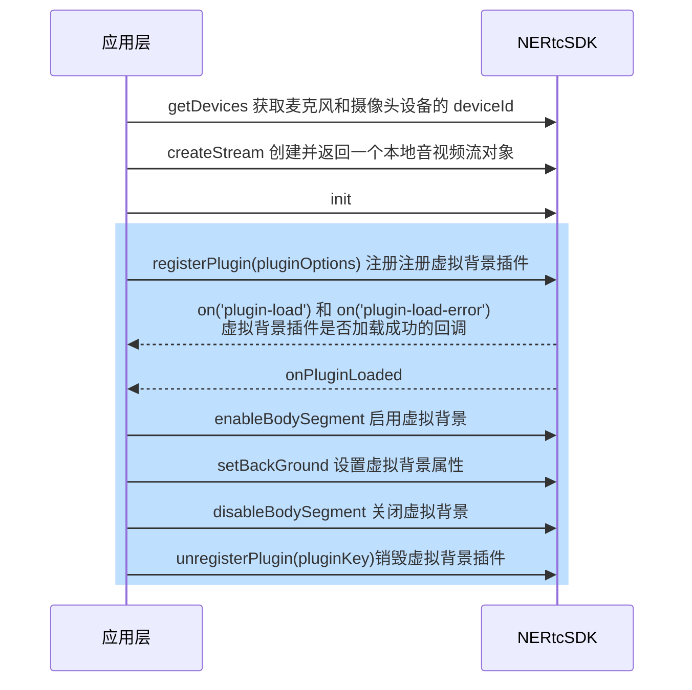

<!--- keywords:背景分割,虚拟背景 -->
在音视频会议或教育场景中，为了突出人像或者保护隐私，用户往往不希望将视窗的背景呈现出来。为了帮助用户隐藏周围的真实场景，NERTC SDK 支持开启背景分割，帮助开发者轻松实现虚拟背景功能，包括背景替换、背景虚化等。

## 功能介绍

网易云信提供虚拟背景插件 `VirtualBackground`，可以与核心 SDK 搭配使用。支持通过开启虚拟背景功能，将用户人像和背景分割开来，虚化用户周围的真实环境，或者以自定义背景色或背景图像替换真实背景。

::: note note
- 仅 v4.6.20 及之后版本的 NERTC Web SDK 支持此功能，请前往 <a href="https://doc.yunxin.163.com/nertc/resource?platform=all" target="_blank">网易云信 SDK 下载中心</a> 获取最新版本 SDK。
- 虚拟背景功能暂时为 beta 测试版，建议您先在测试环境中试用，效果满意再集成上线。
:::

## 示例项目

网易云信在 GitHub 上提供虚拟背景的开源示例项目 <a href="https://github.com/netease-im/G2-API-Examples/tree/main/web/sampleCode-Vue/Segment-Web-Vue" target="_blank">Segment</a>，您可以前往下载体验，也可以 <a href="https://app.yunxin.163.com/webdemo/g2web/index.html#/?path=segment" target="_blank">在线体验</a> 此功能。

## 前提条件

- V5.5.0 之前的版本，请 **联系网易云信技术支持，开通虚拟背景** 功能。
- V5.5.0 及之后版本，您可以 **直接使用虚拟背景功能，无需人工开通**。
- 在实现虚拟背景功能前，请确保已在您的项目中实现基本的实时音视频功能。

## 注意事项

- 该插件与核心 SDK 独立，在注册时需配置插件地址，注意插件版本需要与核心 SDK 版本匹配。
- 虚拟背景功能暂时仅支持桌面端 Chrome 浏览器和 Safari 浏览器（建议 15.4+），暂不兼容 Firefox 浏览器。
- 若您的开发环境中使用了 babel 插件，您需要在 `babel.config.js` 文件中增加 `exclude: /NIM_Web/`（通过 CDN 方式安装） 或 `exclude: /NERTC_Web_SDK/`（通过 NPM 方式安装）。
- 背景分割的计算和渲染处理属于实时计算密集型操作，此操作过程中存在较大的 GPU 和 CPU 开销，因此建议在配有 i5-8500 及以上高性能处理器的设备上使用此功能，且建议使用的分辨率为 640 * 480，帧率为 15 fps。若用户的设备使用了更高性能的 GPU，可以适当提高分辨率或帧率。但若用户的设备性能不足以支撑运算，可能会导致帧率下降等问题。
- 若同时启用屏幕共享与虚拟背景功能，会影响虚拟背景帧率，因此建议不要在较低性能的设备上同时开启。
- 建议您在满足以下条件的场景中使用虚拟背景功能：
    - 采用高清摄像设备，摄像头需 **直立摆放** 且避免遮挡。
    - 环境光线均匀，避免强光。
    - 捕获的视频场景中无冗余物件，用户人像尽量保持上半身在画面内且基本无遮挡。
    - 背景色单一且尽量不与用户着装颜色相同。
- 若用户需要立即开启虚拟背景，建议在虚拟背景插件加载后，即在收到 `on('plugin-load')` 事件回调后，在回调事件中调用 <a href="https://doc.yunxin.163.com/nertc/api-refer/web/typedoc/Latest/zh/html/interfaces/stream.stream-1.html#enablebodysegment" target="_blank">`enableBodySegment`</a> 方法。
- 该功能支持预设背景参数。配置方法为插件加载后先调用 <a href="https://doc.yunxin.163.com/nertc/api-refer/web/typedoc/Latest/zh/html/interfaces/stream.stream-1.html#setbackground" target="_blank">`setBackGround`</a> 方法设置背景参数，再调用 <a href="https://doc.yunxin.163.com/nertc/api-refer/web/typedoc/Latest/zh/html/interfaces/stream.stream-1.html#enablebodysegment" target="_blank">`enableBodySegment`</a> 方法启用背景分割，即开启虚拟背景功能。用户也可以在音视频通话过程中，实时调整相关参数。

## API 时序图



## 实现方法

1. 调用 <a href="https://doc.yunxin.163.com/nertc/api-refer/web/typedoc/Latest/zh/html/modules/nertc.nertc-1.html#createstream" target="_blank">`createStream`</a> 方法创建并返回一个本地音视频流对象。
    :::note notice
    调用 `createStream` 创建媒体流之前，需要通过 `getDevices` 方法获取麦克风和摄像头设备的 deviceId。详细说明请参考 <a href="/https://doc.yunxin.163.com/nertc/guide/zk3NjE3NTA" target="_blank">音视频设备检测</a>。
    :::

2. 调用 <a href="https://doc.yunxin.163.com/nertc/api-refer/web/typedoc/Latest/zh/html/interfaces/stream.stream-1.html#registerplugin" target="_blank">`registerPlugin`</a> 方法并配置 `pluginOptions` 参数注册虚拟背景插件，其中 `pluginOptions = {key: 'VirtualBackground', pluginUrl?: string, pluginObj?: Object, wasmUrl: string}`，相关字段的具体说明如下表所示。

    <div style="width:100px">参数</div> | 是否必选 | 描述
    ---- | ---- | ----
    `key` | 必选 | `VirtualBackground`，必填，表示虚拟背景插件。
    `pluginUrl` | 可选 | 插件的 CDN 地址，同 `pluginObj` 互斥。支持自定义 URL。 |
    `pluginObj` | 可选 | 插件对象，同 `pluginUrl` 互斥。请通过 NPM 方式安装，具体安装方式请参考下方 **说明**。 |
    `wasmUrl` | 必选 | 插件依赖的 wasm 文件地址。官网的 SDK 包以及 NPM 包均提供原文件，可以部署到您自己本地的服务器中。

    ::: note note
    - 虚拟背景插件提供 simd 版本和非 simd 版本，建议使用 simd 版本以体验更佳的性能。在不支持 smid 版本的浏览器中请使用非 smid 版本的插件，关于您的浏览器是否支持 simd 版本的插件，请参考 <a href="https://github.com/GoogleChromeLabs/wasm-feature-detect" target="_blank">`wasm-feature-detect`</a>。
    - 传入 `pluginUrl` 或者 `pluginObj` 的其中一项。
    - 安装 `pluginObj` 的代码如下：
        ```
        //第一步,安装 nertc-web-sdk
        npm install nertc-web-sdk
        //第二步，导入虚拟背景插件
        import VirtualBackground from 'nertc-web-sdk/NERTC_Web_SDK_VirtualBackground'
        ```
    - 若您选择通过 NPM 安装插件，您在安装后可在 `nertc-web-sdk/wasm` 路径下的文件夹中找到 `NERTC_Web_SDK_VirtualBackground_simd.wasm` 和 `NERTC_Web_SDK_VirtualBackground_nosimd.wasm` 文件，该文件可部署到您自己本地的服务器中，并将部署后的文件地址通过 `wasmUrl` 参数传递给 SDK。
    :::

3. 在本端监听 `on('plugin-load')` 和 `on('plugin-load-error')` 事件，以判断虚拟背景插件是否加载成功。
    ::: note note
    若因插件注册失败触发了 `on('plugin-load-error')` 回调，请关注返回的 `event` 结构里的 `msg` 详细字段：
    - `Load {wasmUrl} error`：wasm 加载失败，需要检查 URL 地址。
    - `unsupport plugin {key}`：不支持该插件，需要检查 `key` 参数和 `pluginUrl/pluginObj` 是否匹配。
    - `Load plugin ${pluginUrl} error`：pluginUrl 加载失败。
    :::
4. 在触发 `onPluginLoaded` 回调后，调用 <a href="https://doc.yunxin.163.com/nertc/api-refer/web/typedoc/Latest/zh/html/interfaces/stream.stream-1.html#enablebodysegment" target="_blank">`enableBodySegment`</a> 方法启用虚拟背景功能，并调用 <a href="https://doc.yunxin.163.com/nertc/api-refer/web/typedoc/Latest/zh/html/interfaces/stream.stream-1.html#setbackground" target="_blank">`setBackGround`</a> 方法通过 `backGround` 参数设置虚拟背景属性，相关字段的具体说明如下表所示。

    场景 | 配置说明
    ---- | ---- |
    设置背景图片为纯色图像（默认） | 设置 `type` 字段为 `color`。并设置 `color` 字段自定义图像颜色，该参数的取值范围为 #000000 ~ #FFFFFF，默认值为 #E7AD3C。
    设置背景图片为自定义图片 | 设置 `type` 字段为 `image`。并设置 `source` 字段为自定义背景图片的对象。<note type="note">source 字段支持 image 对象、url 和 base64 编码。<br>图片和视频分辨率不一致时，会沿中心进行等比例裁切。</note>
    设置背景虚化 | 设置 `type` 字段为 `blur`。并通过 `level` 字段设置虚化等级，该数值越高代表虚化程度越高，建议取值范围为 1 ~ 10。

5. 若您需要取消虚拟背景效果，请调用 <a href="https://doc.yunxin.163.com/nertc/api-refer/web/typedoc/Latest/zh/html/interfaces/stream.stream-1.html#disablebodysegment" target="_blank">`disableBodySegment`</a> 方法关闭背景分割进程。

6. 若您需要销毁虚拟背景插件，请调用 <a href="https://doc.yunxin.163.com/nertc/api-refer/web/typedoc/Latest/zh/html/interfaces/stream.stream-1.html#unregisterplugin" target="_blank">`unregisterPlugin(key)`</a> 方法销毁插件。

## 示例代码

使用虚拟背景 **CDN 插件** 的基础流程对应的示例代码如下：

```JavaScript
// 创建本端 stream 实例
rtc.localStream = NERTC.createStream({
    uid: uid,                      // 本端的 uid
    audio: true,                   // 是否从麦克风采集音频
    microphoneId: microphoneId,    // 麦克风设备 deviceId，通过 getMicrophones() 获取
    video: true,                   // 是否从摄像头采集视频
    cameraId: cameraId             // 摄像头设备 deviceId，通过 getCameras() 获取
});

const pluginOptions = {
    key: 'VirtualBackground', //插件名
    pluginUrl: '', //插件 NIM_Web_VirtualBackground.js 地址
    wasmUrl: '', //插件依赖的 NIM_Web_VirtualBackground.wasm 文件地址
}
//启动本地音视频流
rtc.localStream.init().then(()=>{
    //音视频初始化完成
    //v5.4.0 版本开始，需要在 localStream 初始化之后，注册开启虚拟背景
    //注册虚拟背景插件
    rtc.localStream.registerPlugin(pluginOptions)

})

//注册 plugin-load 事件，当插件初始化完成后回调 onPluginLoaded
rtc.localStream.on('plugin-load', onPluginLoaded);

//插件注册失败时触发，event 结构：{key: 插件名,msg: 详细信息}
rtc.localStream.on('plugin-load-error', event);//具体参考信息见上文配置步骤

async function onPluginLoaded(name: String) {
  if (name == 'VirtualBackground') {
    //打开虚拟背景
    await rtc.localStream.enableBodySegment()
    //设置虚拟背景参数
    let options = {type: 'color', color: '#ff0000'}
    rtc.localStream.setBackGround(options)
  }
}

//关闭虚拟背景
rtc.localStream.disableBodySegment()

//销毁插件，销毁之后如果需要使用插件则需再次注册
rtc.localStream.unregisterPlugin(pluginKey)
```

使用虚拟背景 **NPM 插件** 的基础流程对应的示例代码如下：

```JavaScript
import NERTC from 'nertc-web-sdk';
import VirtualBackground from 'nertc-web-sdk/NERTC_Web_SDK_VirtualBackground'

// 创建本端 stream 实例
rtc.localStream = NERTC.createStream({
    uid: uid,                      // 本端的 uid
    audio: true,                   // 是否从麦克风采集音频
    microphoneId: microphoneId,    // 麦克风设备 deviceId，通过 getMicrophones() 获取
    video: true,                   // 是否从摄像头采集视频
    cameraId: cameraId             // 摄像头设备 deviceId，通过 getCameras() 获取
});

const pluginOptions = {
    key: 'VirtualBackground', // 插件名
    pluginObj: VirtualBackground // VirtualBackground 对象
    wasmUrl: '', // 插件依赖的 NIM_Web_VirtualBackground.wasm 文件地址
}
//启动本地音视频流
rtc.localStream.init().then(()=>{
    //音视频初始化完成
    //v5.4.0 版本开始，需要在 localStream 初始化之后，注册开启虚拟背景
    //注册虚拟背景插件
    rtc.localStream.registerPlugin(pluginOptions)

})

//注册 plugin-load 事件，当插件初始化完成后回调 onPluginLoaded
rtc.localStream.on('plugin-load', onPluginLoaded);

//插件注册失败时触发，event 结构：{key: 插件名,msg: 详细信息}
rtc.localStream.on('plugin-load-error', event);//具体参考信息见上文配置步骤

async function onPluginLoaded(name: String) {
  if (name == 'VirtualBackground') {
    //打开虚拟背景
    await rtc.localStream.enableBodySegment()
    //设置虚拟背景参数
    let options = {type: 'color', color: '#ff0000'}
    rtc.localStream.setBackGround(options)
  }
}

//关闭虚拟背景
rtc.localStream.disableBodySegment()

//销毁插件，销毁之后如果需要使用插件则需再次注册
rtc.localStream.unregisterPlugin(pluginKey)
```

## API 参考

| **方法** | **功能描述** |
| :-- | :-- |
| <a href="https://doc.yunxin.163.com/nertc/api-refer/web/typedoc/Latest/zh/html/interfaces/stream.stream-1.html#registerplugin" target="_blank">`registerPlugin`</a> | 注册虚拟背景插件。 |
| <a href="https://doc.yunxin.163.com/nertc/api-refer/web/typedoc/Latest/zh/html/modules/nertc.nertc-1.html#createstream" target="_blank">`createStream`</a> | 创建并返回音视频流对象。 |
| <a href="https://doc.yunxin.163.com/nertc/api-refer/web/typedoc/Latest/zh/html/interfaces/stream.stream-1.html#enablebodysegment" target="_blank">`enableBodySegment`</a> | 初始化背景分割进程。 |
| <a href="https://doc.yunxin.163.com/nertc/api-refer/web/typedoc/Latest/zh/html/interfaces/stream.stream-1.html#setbackground" target="_blank">`setBackGround`</a> | 设置虚拟背景属性。 |
| <a href="https://doc.yunxin.163.com/nertc/api-refer/web/typedoc/Latest/zh/html/interfaces/stream.stream-1.html#disablebodysegment" target="_blank">`disableBodySegment`</a> | 关闭背景分割进程。 |
| <a href="https://doc.yunxin.163.com/nertc/api-refer/web/typedoc/Latest/zh/html/interfaces/stream.stream-1.html#unregisterplugin" target="_blank">`unregisterPlugin(key)`</a> | 销毁虚拟背景插件。 |