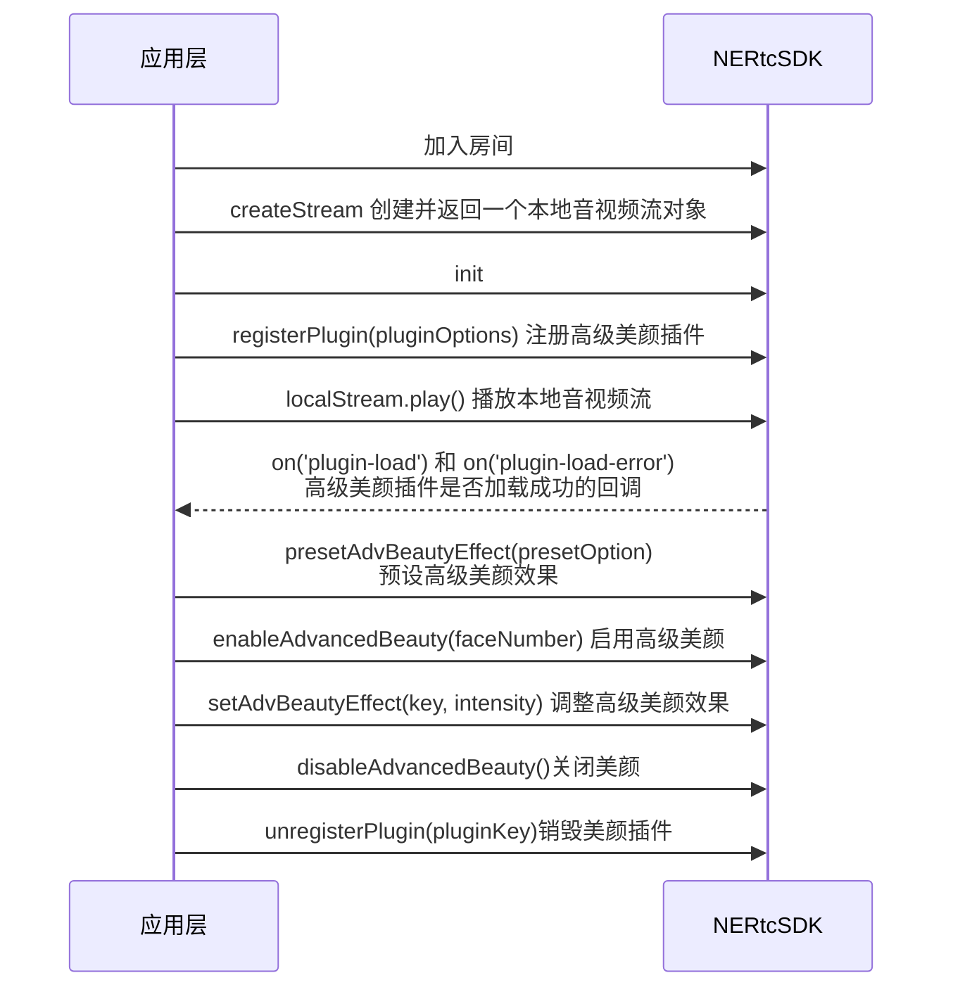

在音视频通话或互动直播场景中，用户往往希望通过美颜塑形效果呈现出良好的肌肤状态。NERTC SDK 提供高级美颜功能，可以精准识别优化面部细节，在逆光和暗角下仍能准确识别追踪人脸，打造自然贴肤的美颜效果。

## 功能描述

网易云信提供美颜插件 `AdvancedBeauty`，可以与核心 SDK 搭配使用。支持通过调整美颜相关参数，对人脸进行美肤、美型等美颜调整，帮助您轻松实现高级美颜功能。

::: note note
仅 v4.6.20 及之后版本的 NERTC Web SDK 支持高级美颜功能，请前往 <a href="https://doc.yunxin.163.com/nertc/resource?platform=all" target="_blank">网易云信 SDK 下载中心</a> 获取最新版本 SDK。
:::

## 示例项目

网易云信在 GitHub 上提供虚拟背景的开源示例项目 <a href="https://github.com/netease-im/G2-API-Examples/tree/main/web/sampleCode-Vue/Beauty-Web-Vue" target="_blank">Beauty</a>，您可以前往下载体验，也可以 <a href="https://app.yunxin.163.com/webdemo/g2web/index.html#/?path=beauty" target="_blank">在线体验</a> 此功能。

## 前提条件

- 在实现高级美颜功能前，请确保已在您的项目中实现基本的实时音视频功能。
- 高级美颜需要开通授权才能正式使用，未开通的高级美颜时，只能在调用高级美颜时体验 2 分钟高级美颜效果。请在 [网易云信控制台](https://app.yunxin.163.com/global/home) 开通高级美颜，具体请参考 [开通高级美颜](#开通高级美颜)。

## 注意事项

- 高级美颜插件与核心 SDK 独立，在注册时需配置高级美颜插件地址，注意插件版本需要与核心 SDK 版本匹配。
- 若您的开发环境中使用了 babel 插件，您需要在 `babel.config.js` 文件中增加 `exclude: /NIM_Web/`（通过 CDN 方式安装） 或 `exclude: /NERTC_Web_SDK/`（通过 NPM 方式安装）。
- **浏览器兼容性相关**：
    - 高级美颜功能暂时仅支持桌面端 Chrome 浏览器和 Safari 浏览器（建议 15.4+），暂不兼容 Firefox 浏览器。
    - 若您使用的是 Safari 浏览器，由于浏览器的限制，在您开启了美颜功能后，切后台时，SDK 会自动停止对视频的采集与播放，切回此页面后即可恢复。如果您需要保证在切后台时，视频可以正常播放，则需要 <a href="https://developer.mozilla.org/zh-CN/docs/web/api/document/visibilitychange_event" target="_blank">添加 visibilitychange 监听</a>，监听切换后台的动作。在切后台导致页面失活时，关闭高级美颜功能。并在切回页面时，自动开启高级美颜。
    - 若您使用的是 Safari 15 版本的浏览器，请注意此版本的浏览器有未修复的 <a href="https://bugs.webkit.org/show_bug.cgi?id=230617" target="_blank">bug</a>，会导致您开启高级美颜功能时出现黑屏，建议将浏览器更新到 Safari 最新版本。
- 高级美颜的计算和渲染处理属于实时计算密集型操作，此操作过程中存在较大的 GPU 和 CPU 开销，因此建议在配有 i5-8500 及以上高性能处理器的设备上使用此功能，且建议使用的分辨率为 640 * 480，帧率为 15 fps。若用户的设备使用了更高性能的 GPU，可以适当提高分辨率或帧率。但若用户的设备性能不足以支撑运算，可能会导致帧率下降等问题。
- 建议您在使用高级美颜功能时，将摄像头直立摆放，避免因人像倾斜而影响人脸识别效果。
- 该功能支持预设 **高级美颜** 参数。配置方法为插件加载后先调用 <a href="https://doc.yunxin.163.com/nertc/api-refer/web/typedoc/Latest/zh/html/interfaces/stream.stream-1.html#presetadvbeautyeffect" target="_blank">`presetAdvBeautyEffect`</a> 方法设置高级美颜参数，再调用 <a href="https://doc.yunxin.163.com/nertc/api-refer/web/typedoc/Latest/zh/html/interfaces/stream.stream-1.html#enableadvancedbeauty" target="_blank">`enableAdvancedBeauty`</a> 方法启用高级美颜。您也可以在音视频通话过程中，调用 <a href="https://doc.yunxin.163.com/nertc/api-refer/web/typedoc/Latest/zh/html/interfaces/stream.stream-1.html#setadvbeautyeffect" target="_blank">`setAdvBeautyEffect`</a> 实时调整高级美颜相关参数。
- 在启用高级美颜功能后，支持在关闭又开启摄像头或切换摄像头的情况下，保持美颜效果。

## 开通高级美颜

1. 登录 <a href="https://app.yunxin.163.com/index#/" target="_blank">网易云信控制台</a>。

2. 在首页单击指定应用名称。
3. 在 **产品总览** 区域，单击 **音视频通话 2.0** 产品选项卡中的 **功能配置**。

    

4. 单击 **高级功能** 页签，单击 **高级美颜** 的开关按钮，开启高级美颜。

    

5. 单击 **确定**。

## API 时序图



## 实现方法

1. 在成功加入房间后调用 <a href="https://doc.yunxin.163.com/nertc/api-refer/web/typedoc/Latest/zh/html/modules/nertc.nertc-1.html#createstream" target="_blank">`createStream`</a> 方法创建并返回一个本地音视频流对象。

    :::note notice
    调用 `createStream` 创建媒体流之前，需要通过 `getDevices` 方法获取麦克风和摄像头设备的 deviceId。详细说明请参考 <a href="/https://doc.yunxin.163.com/nertc/guide/zk3NjE3NTA" target="_blank">音视频设备检测</a>。
    :::

2. 调用 <a href="https://doc.yunxin.163.com/nertc/api-refer/web/typedoc/Latest/zh/html/interfaces/stream.stream-1.html#init" target="_blank">`init`</a> 方法启动本地音视频流后，调用 <a href="https://doc.yunxin.163.com/nertc/api-refer/web/typedoc/Latest/zh/html/interfaces/stream.stream-1.html#registerplugin" target="_blank">`registerPlugin`</a> 方法并配置 `pluginOptions` 参数注册高级美颜插件，其中 `pluginOptions = {key: 'AdvancedBeauty', pluginUrl?: string, pluginObj?: Object, wasmUrl: string}`，相关字段的具体说明如下：

    <div style="width:100px">参数</div> | 是否必选 | 描述
    ---- | ---- | ----
    `key` | 必选 | 请填写 `AdvancedBeauty`，表示高级美颜插件。
    `pluginUrl` | 可选 | 插件的 CDN 地址，同 pluginObj 互斥。支持自定义 URL。 |
    `pluginObj` | 可选 | 插件对象，同 pluginUrl 互斥,请通过 NPM 方式安装，具体安装方式请参考下方 **说明**。
    `wasmUrl` | 必选 | 插件依赖的 wasm 文件地址。官网的 SDK 包以及 NPM 包均提供原文件，可以部署到您自己本地的服务器中。 |

    ::: note note
    - 高级美颜插件提供 simd 版本和非 simd 版本，建议使用 simd 版本以体验更佳的性能。在不支持 smid 版本的浏览器中请使用非 smid 版本的插件，关于您的浏览器是否支持 simd 版本的插件，请参考 <a href="https://github.com/GoogleChromeLabs/wasm-feature-detect" target="_blank">`wasm-feature-detect`</a>。
    - 必须传入 `pluginUrl` 或 `pluginObj` 的其中一项。
    - 安装 `pluginObj` 的代码如下：
        ```NPM
        //第一步,安装 nertc-web-sdk
        npm install nertc-web-sdk
        //第二步，导入高级美颜插件
        import AdvancedBeauty from 'nertc-web-sdk/NERTC_Web_SDK_AdvancedBeauty'
        ```
    - 若您选择通过 NPM 安装插件，您在安装后可在 `nertc-web-sdk/wasm` 路径下的文件夹中找到 `NERTC_Web_SDK_AdvancedBeauty_simd.wasm` 和 `NERTC_Web_SDK_AdvancedBeauty_nosimd.wasm` 文件，该文件可部署到您自己本地的服务器中，并将部署后的文件地址通过 `wasmUrl` 参数传递给 SDK。
    :::

3. 调用 <a href="https://doc.yunxin.163.com/nertc/api-refer/web/typedoc/Latest/zh/html/interfaces/stream.stream-1.html#play" target="_blank">`localStream.play()`</a> 方法播放本地音视频流。

4. 在本端监听 `on('plugin-load')` 和 `on('plugin-load-error')` 事件，以判断高级美颜插件是否加载成功。

    ::: note note
    若因插件注册失败触发了 `on('plugin-load-error')` 回调，请关注返回的 `event` 结构里的 `msg` 详细字段：
    - `Load {wasmUrl} error`：wasm 加载失败，需要检查 URL 地址。
    - `unsupport plugin {key}`：不支持该插件，需要检查 `key` 参数和 `pluginUrl/pluginObj` 是否匹配。
    - `Load plugin ${pluginUrl} error`：pluginUrl 加载失败。
    :::

5. （可选）在收到 `onPluginLoaded` 回调后调用 <a href="https://doc.yunxin.163.com/nertc/api-refer/web/typedoc/Latest/zh/html/interfaces/stream.stream-1.html#presetadvbeautyeffect" target="_blank">`presetAdvBeautyEffect(presetOption)`</a> **预设** 高级美颜效果，并调整对应的效果强度，具体请参考 [高级美颜枚举值](#高级美颜枚举值)。

5. 在收到 `onPluginLoaded` 回调后，调用 <a href="https://doc.yunxin.163.com/nertc/api-refer/web/typedoc/Latest/zh/html/interfaces/stream.stream-1.html#enableadvancedbeauty" target="_blank">`enableAdvancedBeauty(faceNumber)`</a> 方法启用高级美颜功能，其中您可以通过 `faceNumber` 参数指定需要支持美颜的人脸数，**最多支持 5 张人脸**。

6. 调用 <a href="https://doc.yunxin.163.com/nertc/api-refer/web/typedoc/Latest/zh/html/interfaces/stream.stream-1.html#setadvbeautyeffect" target="_blank">`setAdvBeautyEffect`</a> 方法 **在通话过程中实时调整** 高级美颜效果，并调整对应的效果强度，具体请参考 [高级美颜枚举值](#高级美颜枚举值)。

   <div style="width:60px">参数</div> | <div style="width:100px">说明</div> |
   ---- | ----
    `key` | 指定美颜效果。目前支持瘦脸、大眼等多达 19 种美颜效果。<note type="note">此外您可以设置 `key` 参数为 `reset` 以重置美颜效果为默认。</note> |
    `intensity` | 指定美颜强度。取值范围为 [0,1]，各种美颜效果的默认值不同。取值越大，美颜强度越大，请根据业务需要自定义设置美颜强度。 |

7. 若您需要取消高级美颜效果，请调用 <a href="https://doc.yunxin.163.com/nertc/api-refer/web/typedoc/Latest/zh/html/interfaces/stream.stream-1.html#disableadvancedbeauty" target="_blank">`disableAdvancedBeauty`</a> 方法关闭美颜。

8. 若您需要销毁美颜插件，请调用 <a href="https://doc.yunxin.163.com/nertc/api-refer/web/typedoc/Latest/zh/html/interfaces/stream.stream-1.html#unregisterplugin" target="_blank">`unregisterPlugin(pluginKey)`</a> 方法并设置 `pluginKey` 参数为 `AdvancedBeauty` 销毁插件。

## <span id="高级美颜枚举值">高级美颜枚举值</span>

| 分类 | 项 | 枚举值 | 说明 |
| ---- | ---- | ---- | ---- |
| 脸型 | 瘦脸 | shrinkFace | 取值范围为 0 ~ 1，默认值为 0 |
| ^^ | V 脸 | vShapedFace | 取值范围为 0 ~ 1，默认值为 0 |
| ^^ | 窄脸 | narrowedFace | 取值范围为 0 ~ 1，默认值为 0 |
| ^^ | 小脸 | minifyFace | 取值范围为 0 ~ 1，默认值为 0 |
| ^^ | 短脸 | shortenFace | 取值范围为 0 ~ 1，默认值为 0 |
| 面部 | 瘦颧骨 | shrinkCheekbone | 取值范围为 0 ~ 1，默认值为 0 |
| ^^ | 瘦下颌 | shrinkUnderjaw | 取值范围为 0 ~ 1，默认值为 0 |
| ^^ | 瘦下巴 | lengthenJaw | 取值范围为 0 ~ 1，默认值为 0 |
| ^^ | 人中调整 | adjustPhiltrum | 取值范围为 0 ~ 1，默认值为 0.50 |
| 眼睛 | 大眼 | enlargeEye | 取值范围为 0 ~ 1，默认值为 0 |
| ^^ | 圆眼 | roundedEye | 取值范围为 0 ~ 1，默认值为 0 |
| ^^ | 亮眼      | brightenEye | 取值范围为 0 ~ 1，默认值为 0 |
| ^^ | 开眼角 | openCanthus | 取值范围为 0 ~ 1，默认值为 0 |
| ^^ | 眼距调整 | eyeDistance | 取值范围为 0 ~ 1，默认值为 0.50 |
| ^^ | 眼角调整 | eyeAngle | 取值范围为 0 ~ 1，默认值为 0.50 |
| 鼻子 | 小鼻 | shrinkNose | 取值范围为 0 ~ 1，默认值为 0 |
| ^^ | 鼻长调整 | lengthenNose | 取值范围为 0 ~ 1，默认值为 0.50 |
| 嘴巴 | 美牙 | whitenTeeth | 取值范围为 0 ~ 1，默认值为 0.50 |
| ^^ | 嘴角调整 | mouthCorners | 取值范围为 0 ~ 1，默认值为 0.50 |
| ^^ | 嘴型调整 | shrinkMouth | 取值范围为 0 ~ 1，默认值为 0.50 |
| ^^ | 嘴宽调整 | widenMouth | 取值范围为 0 ~ 1，默认值为 0.50 |
| 美肤 | 祛抬头纹 | fadeHeadWrinkle | 取值范围为 0 ~ 1，默认值为 0 |
| ^^ | 祛黑眼圈 | fadeEyeRim | 取值范围为 0 ~ 1，默认值为 0 |
| ^^ | 祛法令纹 | fadeNoseLine | 取值范围为 0 ~ 1，默认值为 0 |
| 重置 | - | resest | - |

## 示例代码

使用 **CDN 插件**

```JavaScript
// 创建本端 stream 实例
rtc.localStream = NERTC.createStream({
    uid: uid,                      // 本端的 uid
    audio: true,                   // 是否从麦克风采集音频
    microphoneId: microphoneId,    // 麦克风设备 deviceId，通过 getMicrophones() 获取
    video: true,                   // 是否从摄像头采集视频
    cameraId: cameraId             // 摄像头设备 deviceId，通过 getCameras() 获取
});

const pluginOptions = {
    key: 'AdvancedBeauty', //插件名
    pluginUrl: '', //插件 NIM_Web_AdvancedBeauty.js 地址
    wasmUrl: '', //插件依赖的 NIM_Web_AdvancedBeauty.wasm 文件地址
}

//启动本地音视频流
rtc.localStream.init().then(()=>{
    //音视频初始化完成
    //v5.4.0 版本开始，需要在 localStream 初始化之后，注册开启高级美颜
    //注册美颜插件
    rtc.localStream.registerPlugin(pluginOptions);

    let div = document.getElementById('local-container')
    //开始播放本地视频流
    rtc.localStream.play(div)
});

//注册 plugin-load 事件，当插件初始化完成后回调 onPluginLoaded
rtc.localStream.on('plugin-load', onPluginLoaded);

//插件注册失败时触发，event 结构：{key: 插件名,msg: 详细信息}
rtc.localStream.on('plugin-load-error', event);//具体参考信息见上文配置步骤

async function onPluginLoaded(name: String) {
  if (name == 'AdvancedBeauty') {
    // 高级美颜注册成功
    //预设高级美颜参数（可选）
    rtc.localStream.presetAdvBeautyEffect({
        enlargeEye: 0.25, // 大眼
        roundedEye: 0.5, // 圆眼
        narrowedFace: 0.25, // 窄脸
        shrinkFace: 0.15, // 瘦脸
        vShapedFace: 0.33, // v 脸
        minifyFace: 0.15, // 小脸
        brightenEye: 0.75, // 亮眼
        whitenTeeth: 0.75, // 美牙
    });
    //开启高级美颜功能，faceNumber 为人脸识别数，最多支持同时识别 5 张人脸，取值范围为 1～5。
    await rtc.localStream.enableAdvancedBeauty(faceNumber);
  }
}

//实时调整高级美颜参数
rtc.localStream.setAdvBeautyEffect('enlargeEye',0.5);

//关闭高级美颜功能
rtc.localStream.disableAdvancedBeauty();

//销毁美颜插件，销毁之后如果需要使用插件则需再次注册
rtc.localStream.unregisterPlugin('AdvancedBeauty');
```

使用 **NPM 插件**

```JavaScript
import NERTC from 'nertc-web-sdk';
import AdvancedBeauty from 'nertc-web-sdk/NERTC_Web_SDK_AdvancedBeauty'

// 创建本端 stream 实例
rtc.localStream = NERTC.createStream({
    uid: uid,                      // 本端的 uid
    audio: true,                   // 是否从麦克风采集音频
    microphoneId: microphoneId,    // 麦克风设备 deviceId，通过 getMicrophones() 获取
    video: true,                   // 是否从摄像头采集视频
    cameraId: cameraId             // 摄像头设备 deviceId，通过 getCameras() 获取
});

const pluginOptions = {
    key: 'AdvancedBeauty', //插件名
    pluginObj: AdvancedBeauty, // 高级美颜对象
    wasmUrl: '', //插件依赖的 NIM_Web_AdvancedBeauty.wasm 文件地址
}

//启动本地音视频流
rtc.localStream.init().then(()=>{
    //音视频初始化完成
    //v5.4.0 版本开始，需要在 localStream 初始化之后，注册开启高级美颜
    //注册美颜插件
    rtc.localStream.registerPlugin(pluginOptions);

    let div = document.getElementById('local-container')
    //开始播放本地视频流
    rtc.localStream.play(div)
});

//注册 plugin-load 事件，当插件初始化完成后回调 onPluginLoaded
rtc.localStream.on('plugin-load', onPluginLoaded);

//插件注册失败时触发，event 结构：{key: 插件名,msg: 详细信息}
rtc.localStream.on('plugin-load-error', event);//具体参考信息见上文配置步骤

async function onPluginLoaded(name: String) {
  if (name == 'AdvancedBeauty') {
    // 高级美颜注册成功
    //预设高级美颜参数（可选）
    rtc.localStream.presetAdvBeautyEffect({
        enlargeEye: 0.25, // 大眼
        roundedEye: 0.5, // 圆眼
        narrowedFace: 0.25, // 窄脸
        shrinkFace: 0.15, // 瘦脸
        vShapedFace: 0.33, // v 脸
        minifyFace: 0.15, // 小脸
        brightenEye: 0.75, // 亮眼
        whitenTeeth: 0.75, // 美牙
    });
    //开启高级美颜功能，faceNumber 为人脸识别数，最多支持同时识别 5 张人脸，取值范围为 1～5。
    await rtc.localStream.enableAdvancedBeauty(faceNumber);
  }
}

//实时调整高级美颜参数
rtc.localStream.setAdvBeautyEffect('enlargeEye',0.5);

//关闭高级美颜功能
rtc.localStream.disableAdvancedBeauty();

//销毁美颜插件，销毁之后如果需要使用插件则需再次注册
rtc.localStream.unregisterPlugin('AdvancedBeauty');
```

## API 参考

| **方法** | **功能描述** |
| :-- | :-- |
| <a href="https://doc.yunxin.163.com/nertc/api-refer/web/typedoc/Latest/zh/html/interfaces/stream.stream-1.html#registerplugin" target="_blank">`registerPlugin`</a> | 注册高级美颜插件。 |
| <a href="https://doc.yunxin.163.com/nertc/api-refer/web/typedoc/Latest/zh/html/modules/nertc.nertc-1.html#createstream" target="_blank">`createStream`</a> | 创建并返回音视频流对象。 |
| <a href="https://doc.yunxin.163.com/nertc/api-refer/web/typedoc/Latest/zh/html/interfaces/stream.stream-1.html#init" target="_blank">`init`</a> | 启动本地音视频流。 |
| <a href="https://doc.yunxin.163.com/nertc/api-refer/web/typedoc/Latest/zh/html/interfaces/stream.stream-1.html#play" target="_blank">`play`</a> | 播放本地音视频流。 |
| <a href="https://doc.yunxin.163.com/nertc/api-refer/web/typedoc/Latest/zh/html/interfaces/stream.stream-1.html#presetadvbeautyeffect" target="_blank">`presetAdvBeautyEffect(presetOption)`</a> | 预设高级美颜效果。 |
| <a href="https://doc.yunxin.163.com/nertc/api-refer/web/typedoc/Latest/zh/html/interfaces/stream.stream-1.html#enableadvancedbeauty" target="_blank">`enableAdvancedBeauty(faceNumber)`</a> | 启用高级美颜功能。 |
| <a href="https://doc.yunxin.163.com/nertc/api-refer/web/typedoc/Latest/zh/html/interfaces/stream.stream-1.html#setadvbeautyeffect" target="_blank">`setAdvBeautyEffect`</a> | 调整高级美颜效果。 |
| <a href="https://doc.yunxin.163.com/nertc/api-refer/web/typedoc/Latest/zh/html/interfaces/stream.stream-1.html#disableadvancedbeauty" target="_blank">`disableAdvancedBeauty`</a> | 关闭美颜功能。 |
| <a href="https://doc.yunxin.163.com/nertc/api-refer/web/typedoc/Latest/zh/html/interfaces/stream.stream-1.html#unregisterplugin" target="_blank">`unregisterPlugin(pluginKey)`</a> | 销毁高级美颜插件。 |