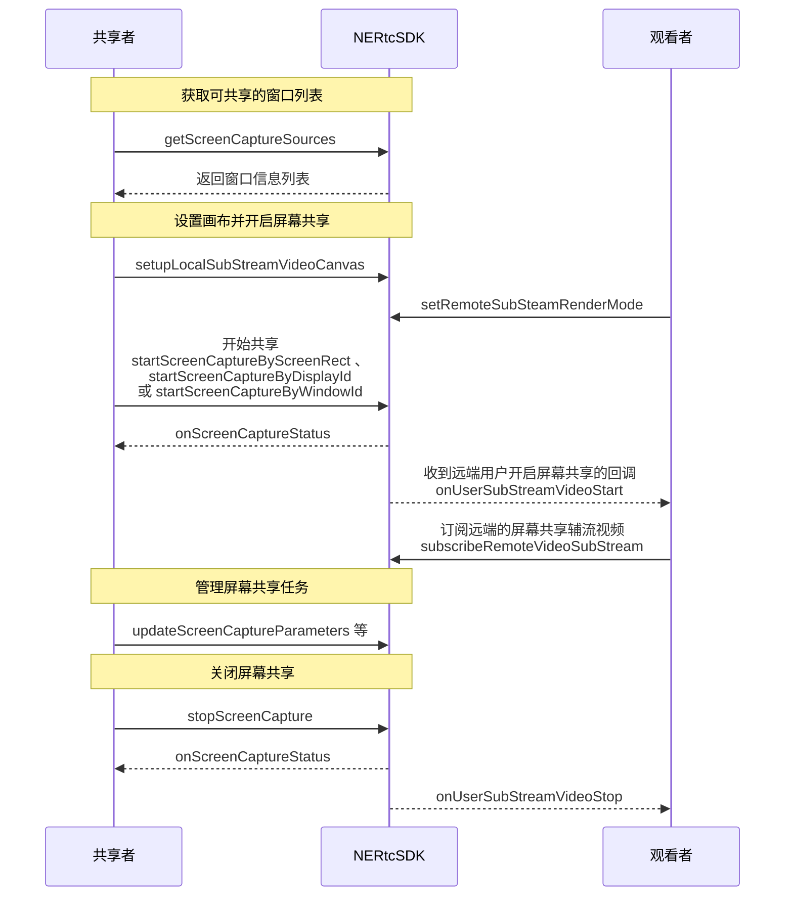

<!--- keywords:实时音视频,屏幕共享,窗口列表 -->

在大型会议或在线教育等场景中，主讲人或老师可以将本端的屏幕内容分享给远端参会者或在线学生观看，从而提升沟通效率。NERTC 支持屏幕共享功能，用户可以实时分享本端设备的屏幕内容。

## 功能介绍

NERTC SDK 以辅流的形式实现屏幕共享，即单独为屏幕共享开启一路上行的视频流，摄像头的视频流作为主流，屏幕共享的视频流作为辅流，两路视频流并行，主播同时上行摄像头画面和屏幕画面两路画面。


通过网易云信 NERTC SDK 的屏幕共享功能，您可以快速实现如下功能：

- **共享整个屏幕**

    共享整个屏幕，包括屏幕中的所有信息。

    

- **共享 App 窗口**

    共享已打开的某个 App 的窗口。

- **共享指定区域**

    支持用户设置共享屏幕画面中的一部分固定区域，例如应用窗口中的部分画面，特定幻灯片内容区域等。
- **高亮显示共享窗口的边框**

    支持开启高亮显示共享窗口的边框，方便共享者快速识别当前正在共享的窗口。界面效果类似下图所示。


    


- **屏蔽指定 App 窗口**


    支持设置屏蔽指定应用程序窗口，以便在共享屏幕时保护敏感信息和隐私。

- **重新共享新的窗口** 

    支持在屏幕共享过程中快速切换共享的窗口。

共享屏幕的应用场景包括：

场景 | 描述
---- | -------------- | 
视频会议| 参会者可以在会议中将本地的文件、数据、网页、PPT 等画面分享给其他与会者，让其他与会者更加直观的了解讨论的内容和主题。
在线教育|老师可以通过屏幕共享将课件、笔记、教学内容等画面展示给远端的其他学生观看，降低传统教学模式下的沟通成本，提升教育场景的用户体验。


::: note note
此外 NERTC SDK 还支持在共享屏幕的同时，也共享本地播放的系统背景音。具体请参考[音频共享](https://doc.yunxin.163.com/nertc/guide/jE5NjQ3ODk?platform=windows)。
:::

## 示例项目
网易云信提供 [ScreenShare](https://github.com/netease-im/Advanced-Video/tree/master/ScreenShare/ScreenShare-Win-Mac-QT) 示例项目源码，您可以参考该源码实现屏幕共享。

## 注意事项

- 在实现屏幕共享功能前，请先确保以下开发环境：
    - Visual Studio 2013 及以上版本。
    - Windows7、Windows8、Windows10 或以上版本。


- 对于 V5.3.0 及之后版本，如果当前正在使用本地视频辅流通道进行本地摄像头采集或者外部自定义视频输入，调用 <a href="https://doc.yunxin.163.com/nertc/api-refer/windows/doxygen/V5.4.10/zh/html/classnertc_1_1_i_rtc_engine_ex.html#a1c10c8522dc6715388ffe62f165beed7" target="_blank">`startScreenCaptureByScreenRect`</a> 或 <a href="https://doc.yunxin.163.com/nertc/api-refer/windows/doxygen/V5.4.10/zh/html/classnertc_1_1_i_rtc_engine_ex.html#a8eab357982a5fa500e4e5d5eadb42923" target="_blank">`startScreenCaptureByWindowId`</a> 开启屏幕共享时，需要先调用[`enableLocalVideo`](https://doc.yunxin.163.com/nertc/api-refer/windows/doxygen/V5.4.10/zh/html/classnertc_1_1_i_rtc_channel.html#a5c336b19e3c9b0db9a73b9515d7108d7)停止辅流。如果当前正在屏幕共享，调用 [`enableLocalVideo`](https://doc.yunxin.163.com/nertc/api-refer/windows/doxygen/V5.4.10/zh/html/classnertc_1_1_i_rtc_channel.html#a5c336b19e3c9b0db9a73b9515d7108d7) 开启辅流时，需要调用 [`stopScreenCapture`](https://doc.yunxin.163.com/nertc/api-refer/windows/doxygen/V5.4.10/zh/html/classnertc_1_1_i_rtc_engine_ex.html#a722c1bb960536c104fd3560479f86d72) 先停止屏幕共享。


## API 调用时序




## 本端共享屏幕

  
### 1. 获取可共享的窗口列表

调用 [`getScreenCaptureSources`](https://doc.yunxin.163.com/nertc/api-refer/windows/doxygen/V5.4.10/zh/html/classnertc_1_1_i_rtc_engine_ex.html#a10585dd4a762ccebd06addbb7c57c096) 接口，获取可共享窗口和屏幕的列表，列表中包含窗口 ID 和屏幕 ID 等重要信息。

根据获取到的窗口信息，您可以实现一个缩略图列表页面，方便用户通过列表中的缩略图选择共享某个显示器的屏幕或某个窗口。页面效果类似如下图所示。


示例代码如下：


```
int count = 0;
NERtcSize thumb_size = nertc::NERtcSize(128, 72);
NERtcSize icon_size = nertc::NERtcSize(32, 32); 
bool include_screen = true;
auto source_list = nrtc_engine_->getScreenCaptureSources(thumb_size, icon_size, include_screen);
if (source_list) {
    count = source_list->getCount();
}

for (int index = 0; index < count; index++) {
    NERtcScreenCaptureSourceInfo info = source_list->getSourceInfo(index);
    // 使用 info 做app层 UI 的上信息的展示
}
if (source_list) {
    source_list->release();
}
```

::: note note
V5.4.10 版本开始支持获取窗口列表。
:::


### 2. 获取共享区域的坐标

<span id="Rectangle"> 获取指定的待共享区域在整个显示器屏幕中的 Rectangle 坐标。如果要共享整个显示器，那么这个可以直接传 nertc::NERtcRectangle(0,0,0,0)。

**示例代码**如下：
```
bool NRTCEngine::startMonitorShare(const uint32_t &screenIndex)
{
    auto screens = QGuiApplication::screens();
    auto screen =  screens.at(screenIndex);

    nertc::NERtcRectangle sourceRectangle;
    sourceRectangle.x = screen->geometry().x();
    sourceRectangle.y = screen->geometry().y();
    sourceRectangle.width = screen->geometry().width() * screen->devicePixelRatio();
    sourceRectangle.height = screen->geometry().height() * screen->devicePixelRatio();

    nertc::NERtcRectangle regionRectangle = { 0, 0, 0, 0 };

    nertc::NERtcScreenCaptureParameters params;
    params.bitrate = 0;
    params.frame_rate = 5;
    params.profile = nertc::kNERtcScreenProfileMAX;
    params.capture_mouse_cursor = true;
    params.dimensions.width = sourceRectangle.width - sourceRectangle.x;
    params.dimensions.height = sourceRectangle.height - sourceRectangle.y;
    
}
```


### 3. 开启屏幕共享。

1. 初始化后通过 <a href="https://doc.yunxin.163.com/nertc/api-refer/windows/doxygen/V5.4.10/zh/html/classnertc_1_1_i_rtc_engine_ex.html#a9abf36ee67a86d2c14d38fbea19764bf" target="_blank">`setupLocalSubStreamVideoCanvas`</a> 设置本端的视频辅流画布。
2. （可选）通过 <a href="https://doc.yunxin.163.com/nertc/api-refer/windows/doxygen/V5.4.10/zh/html/classnertc_1_1_i_rtc_engine_ex.html#af9e39bd89d979683ebe4926fce8f15d0" target="_blank">`setLocalSubStreamRenderMode`</a> 修改本端的辅流渲染缩放模式。

3. 加入房间后，开启屏幕共享并设置屏幕共享的方式，屏幕共享内容以辅流形式发送。

::: note notice
对于 V5.3.0 及之后版本：

- 如果当前正在使用本地视频辅流通道进行本地摄像头采集或者外部自定义视频输入，调用 <a href="https://doc.yunxin.163.com/nertc/api-refer/windows/doxygen/V5.4.10/zh/html/classnertc_1_1_i_rtc_engine_ex.html#a1c10c8522dc6715388ffe62f165beed7" target="_blank">`startScreenCaptureByScreenRect`</a> 、[`startScreenCaptureByDisplayId`](https://doc.yunxin.163.com/nertc/api-refer/windows/doxygen/V5.4.10/zh/html/classnertc_1_1_i_rtc_engine_ex.html#a5cb1422adb8f08cb30ca70cc0822db89)或 <a href="https://doc.yunxin.163.com/nertc/api-refer/windows/doxygen/V5.4.10/zh/html/classnertc_1_1_i_rtc_engine_ex.html#a8eab357982a5fa500e4e5d5eadb42923" target="_blank">`startScreenCaptureByWindowId`</a> 开启屏幕共享时，需要先调用[`enableLocalVideo`](https://doc.yunxin.163.com/nertc/api-refer/windows/doxygen/V5.4.10/zh/html/classnertc_1_1_i_rtc_channel.html#a5c336b19e3c9b0db9a73b9515d7108d7)停止辅流。
- 如果当前正在屏幕共享，调用 [`enableLocalVideo`](https://doc.yunxin.163.com/nertc/api-refer/windows/doxygen/V5.4.10/zh/html/classnertc_1_1_i_rtc_channel.html#a5c336b19e3c9b0db9a73b9515d7108d7) 开启辅流时，需要调用 [`stopScreenCapture`](https://doc.yunxin.163.com/nertc/api-refer/windows/doxygen/V5.4.10/zh/html/classnertc_1_1_i_rtc_engine_ex.html#a722c1bb960536c104fd3560479f86d72) 先停止屏幕共享。
:::

场景 | 接口 | 关键参数配置
---- | -------------- | ---------
**共享整个屏幕** |[`startScreenCaptureByDisplayId`](https://doc.yunxin.163.com/nertc/api-refer/windows/doxygen/V5.4.10/zh/html/classnertc_1_1_i_rtc_engine_ex.html#a5cb1422adb8f08cb30ca70cc0822db89) | <ul><li>`display_id` 设置为`getScreenCaptureSources`返回的屏幕 ID。<li>`region_rect` 设置为{0,0,0,0}，表示采集整个屏幕大小。
**共享整个 App 窗口** | <a href="https://doc.yunxin.163.com/nertc/api-refer/windows/doxygen/V5.4.10/zh/html/classnertc_1_1_i_rtc_engine_ex.html#a8eab357982a5fa500e4e5d5eadb42923" target="_blank">`startScreenCaptureByWindowId`</a> |<ul><li>`window_id` 设置为`getScreenCaptureSources`返回的窗口 ID。<li>`region_rect` 设置为{0,0,0,0}，表示采集整个窗口大小。 |
**共享指定区域** |<a href="https://doc.yunxin.163.com/nertc/api-refer/windows/doxygen/V5.4.10/zh/html/classnertc_1_1_i_rtc_engine_ex.html#a1c10c8522dc6715388ffe62f165beed7" target="_blank">`startScreenCaptureByScreenRect`</a> | <ul><li>`screen_rect`设置为目标显示器的桌面坐标范围。 <li>`region_rect` 参数的坐标值请通过[步骤2](#Rectangle)获取，具体如何设置请参考[设置屏幕共享的窗口范围](#设置屏幕共享的窗口范围)。 |
^^| <a href="https://doc.yunxin.163.com/nertc/api-refer/windows/doxygen/V5.4.10/zh/html/classnertc_1_1_i_rtc_engine_ex.html#a8eab357982a5fa500e4e5d5eadb42923" target="_blank">`startScreenCaptureByWindowId`</a>  |<ul> <li> `window_id` 设置为`getScreenCaptureSources`返回的窗口 ID。<li>`region_rect` 参数的坐标值请通过[步骤2](#Rectangle)获取，具体如何设置请参考[设置屏幕共享的窗口范围](#设置屏幕共享的窗口范围)。  |
^^|[`startScreenCaptureByDisplayId`](https://doc.yunxin.163.com/nertc/api-refer/windows/doxygen/V5.4.10/zh/html/classnertc_1_1_i_rtc_engine_ex.html#a5cb1422adb8f08cb30ca70cc0822db89) | <ul><li>`display_id` 设置为`getScreenCaptureSources`返回的屏幕 ID。<li>`region_rect` 参数的坐标值请通过[步骤2](#Rectangle)获取，具体如何设置请参考[设置屏幕共享的窗口范围](#设置屏幕共享的窗口范围)。 |

其中  [`capture_params`](https://doc.yunxin.163.com/nertc/api-refer/windows/doxygen/V5.4.10/zh/html/structnertc_1_1_n_e_rtc_screen_capture_parameters.html) 参数的说明如下表所示。

::: details capture_params 参数说明

<table>
<tr>
    <th width="30%">参数</th>
    <th width="70%">参数说明</th>
</tr>
    <tr>
    <td>prefer</td>
    <td>屏幕共享编码策略倾向：<ul><li><code>kNERtcSubStreamContentPreferMotion</code>（默认）：内容类型为动画。当用户共享的内容是视频、电影或游戏等动态画面时，推荐选择此枚举值；此时 <code>frame_rate</code> 参数完全按照您的设置处理。<li><code>kNERtcSubStreamContentPreferDetails</code>：内容类型为细节。当用户共享的内容是图片、文字或 PPT 等静态画面时，推荐选择此枚举值；此时 <code>frame_rate</code> 参数最高可设置为 10 帧。</td>
</tr>
    <tr>
    <td>profile</td>
    <td>视频编码的分辨率。<br>具体请参考 <a href="https://doc.yunxin.163.com/nertc/api-refer/windows/doxygen/V5.4.10/zh/html/namespacenertc.html#a9d8a390691745f9c5f2c1979baf0dad7" target="_blank"><code>NERtcScreenProfileType</code></a>。<note type="notice"><ul><li>建议直接设置为 <code>kNERtcScreenProfileCustom</code>，以确保所有设置符合您的真实业务场景。<li>若您需要使用自定义的尺寸（<code>dimensions</code>）和帧率（<code>frame_rate</code>），请务必设置此参数为 <code>kNERtcScreenProfileCustom</code>。<li>若设置 <code>profile</code> 为 <code>kNERtcScreenProfileCustom</code> 之外的值，尺寸 <code>dimensions</code> 会自动对应为 <code>profile</code> 指定的大小，帧率 <code>frame_rate</code> 固定为 5 fps。</td>
</tr>
    <tr>
    <td>dimensions</td>
    <td>视频编码的最大像素值，可以设置视频尺寸的宽、高。<note type="notice">此参数仅当 <code>profile</code> 参数设置为 <code>kNERtcScreenProfileCustom</code> 有效。</td>
</tr>
    <tr>
    <td>frame_rate</td>
    <td>视频编码的帧率。<br>单位为 fps，默认值为 5，建议此参数的值不要超过 15。</td>
</tr>
    <tr>
    <td>min_framerate</td>
    <td>视频编码的最小帧率。<br>默认值为 0，表示使用默认的最小帧率。</td>
</tr>
    <tr>
    <td>bitrate</td>
    <td>视频编码的码率，单位为 Kbps。<br>若设置的码率为 0 或超出合理范围，SDK 会自行计算出合理区间处理码率，具体请参考<a href="https://doc.yunxin.163.com/nertc/guide/zYwMTQyNzE?platform=windows#%E5%88%86%E8%BE%A8%E7%8E%87%E3%80%81%E5%B8%A7%E7%8E%87%E5%92%8C%E7%A0%81%E7%8E%87%E6%8E%A8%E8%8D%90%E8%A1%A8" target="_blank">分辨率、帧率、码率参照表</a>。</td>
</tr>
    <tr>
    <td>min_bitrate</td>
    <td>视频编码的最小码率，单位为 Kbps。</td>
</tr>
    <tr>
    <td>excluded_window_count</td>
    <td>待屏蔽窗口的数量。<note type="notice">待屏蔽窗口数量建议不要超过 10 个，最好是小于 4 个。如果要屏蔽的窗口数量太多，您可以多次调用 `setExcludeWindowList` 接口。</note></td>
</tr>
    <tr>
    <td>excluded_window_list</td>
    <td>待屏蔽窗口的列表。</td>
</tr>
    <tr>
    <td>capture_mouse_cursor</td>
    <td>屏幕共享时是否采集鼠标。</td>
</tr>
</tr>
    <tr>
    <td>window_focus</td>
    <td>调用 <code>startScreenCaptureByWindowId</code> 方法共享窗口时，是否将该窗口前置。</td>
</tr>
</tr>
    <tr>
    <td>degradation_preference</td>
    <td>带宽受限时的视频编码降级偏好。详细信息请参考 <a href="https://doc.yunxin.163.com/nertc/api-refer/windows/doxygen/V5.4.10/zh/html/namespacenertc.html#a41cbc2850e52d1bcd3ba36dc3aff7eb1" target="_blank">NERtcDegradationPreference</a>。</td>
</tr>
</tr>
    <tr>
    <td>enable_high_performance</td>
    <td>是否开启高性能模式（只在分享屏幕时会生效），开启后屏幕采集性能最佳，但无法过滤远端的高亮边框，默认为 true。<note type="notice">目前仅针对macOS生效。</td>
</tr>
</tr>
</table>
:::
  


**常见场景的参数推荐搭配如下表所示**。
<table>
<tr>
    <th width="30%">参数名称</th>
    <th width="30%">共享视频</th>
    <th width="30%">共享 PPT</th>
</tr>
    <tr>
    <td>prefer</td>
    <td>kNERtcSubStreamContentPreferMotion</td>
    <td>kNERtcSubStreamContentPreferDetails</td>
</tr>
    <tr>
    <td>profile</td>
    <td>kNERtcScreenProfileCustom</td>
    <td>kNERtcScreenProfileCustom</td>
</tr>
    <tr>
    <td>dimensions</td>
    <td>{1920, 1080}</td>
    <td>{1920, 1080}</td>
</tr>
    <tr>
    <td>frame_rate</td>
    <td>15</td>
    <td>5</td>
</tr>
</table>


开启屏幕共享之后，本地会触发 <a href="https://doc.yunxin.163.com/nertc/api-refer/windows/doxygen/V5.4.10/zh/html/classnertc_1_1_i_rtc_engine_event_handler_ex.html#a7649a71ffa815cecde17836facd0834a" target="_blank">`onScreenCaptureStatus`</a> 回调，远端会触发 <a href="https://doc.yunxin.163.com/nertc/api-refer/windows/doxygen/V5.4.10/zh/html/classnertc_1_1_i_rtc_engine_event_handler_ex.html#a48f88b74beb1db6d8ccbca5f079912ee" target="_blank">`onUserSubStreamVideoStart`</a> 回调。


### <span id="设置屏幕共享的窗口范围">4. （可选）设置屏幕共享的窗口范围</span>

屏幕共享时，您可能需要限制共享屏幕的窗口范围，例如部分涉及敏感信息的窗口区域不进行屏幕共享。NERTC SDK 支持设置共享屏幕的区域范围，目前可通过以下方式实现：
- 开启屏幕共享时，仅共享指定窗口的部分区域。
    
    通过 `startScreenCaptureByWindowId` 开启窗口维度的屏幕共享，并通过参数 `region_rect` 指定共享的窗口范围。
- 开启屏幕共享时，仅共享指定屏幕的部分区域，并排除部分窗口。
    
    通过 `startScreenCaptureByScreenRect` 开启屏幕维度的屏幕共享，并通过参数 `region_rect` 指定共享的屏幕范围、通过 `NERtcScreenCaptureParameters` 设置需要过滤的窗口列表。 
- 屏幕共享过程中，动态调整需要屏蔽的窗口列表。
    
    共享整个屏幕时，您可以通过 [`setExcludeWindowList`](https://doc.yunxin.163.com/nertc/api-refer/windows/doxygen/V5.4.10/zh/html/classnertc_1_1_i_rtc_engine_ex.html#af8f973d982c661f15c306758f5cc7bbb) 设置窗口过滤，将一个或多个需要过滤的窗口或应用排除出共享范围，其他观看端只能看到整个屏幕中指定窗口以外的其他内容。
 

### 5. （可选）高亮显示共享窗口的边框

您可以开启高亮显示共享窗口的边框，方便共享者快速识别当前正在共享的窗口。界面效果类似下图所示。


::: note note
V5.4.10 版本开始支持该功能。
:::

在调用 <a href="https://doc.yunxin.163.com/nertc/api-refer/windows/doxygen/V5.4.10/zh/html/classnertc_1_1_i_rtc_engine_ex.html#a1c10c8522dc6715388ffe62f165beed7" target="_blank">`startScreenCaptureByScreenRect`</a> 、[`startScreenCaptureByDisplayId`](https://doc.yunxin.163.com/nertc/api-refer/windows/doxygen/V5.4.10/zh/html/classnertc_1_1_i_rtc_engine_ex.html#a5cb1422adb8f08cb30ca70cc0822db89)或 <a href="https://doc.yunxin.163.com/nertc/api-refer/windows/doxygen/V5.4.10/zh/html/classnertc_1_1_i_rtc_engine_ex.html#a8eab357982a5fa500e4e5d5eadb42923" target="_blank">`startScreenCaptureByWindowId`</a> 开启屏幕共享时，将 [`capture_params`](https://doc.yunxin.163.com/nertc/api-refer/windows/doxygen/V5.4.10/zh/html/structnertc_1_1_n_e_rtc_screen_capture_parameters.html) 中的 `enable_high_light` 设置为 `true`，开启共享屏幕边框高亮显示。并设置 `high_light_width`、`high_light_color` 和 `high_light_length`。


::: note note
屏幕分享过程中，不支持通过 `updateScreenCaptureParameters` 动态修改高亮边框的参数。

推荐使用 SDK 提供的接口实现高亮边框。如果您的应用想要自行实现自定义高亮边框，请将 `enable_high_light` 设置为 `false`，此时会有 `onScreenCaptureSourceDataUpdate` 回调。

:::


参数说明如下表所示。

参数 | 参数说明
---- | -------------- | ---------
enable_high_light | 是否开启共享窗口的边框高亮显示，本场景中请设置为  `true`，默认为 `false`。 | 
high_light_width |高亮边框的线条宽度，单位为 px，默认为 6 px。|
high_light_color | 高亮边框的颜色，使用`0xAABBGGRR`格式，默认值是 0xFF7EDE00 | 
high_light_length | 高亮边框的线条长度，从窗口的任何一个角（共4个角）作为原点，到相邻两边延伸的长度。单位为 px，默认为 120 px。<br>设置为 -1 表示全包围的高亮框。 | 


### 5. 管理屏幕共享任务

- <a href="https://doc.yunxin.163.com/nertc/api-refer/windows/doxygen/V5.4.10/zh/html/classnertc_1_1_i_rtc_engine_ex.html#a62d647ee76d11d5790f314e652030878" target="_blank">`updateScreenCaptureParameters`</a>：更新屏幕共享参数。
- <a href="https://doc.yunxin.163.com/nertc/api-refer/windows/doxygen/V5.4.10/zh/html/classnertc_1_1_i_rtc_engine_ex.html#a797d351e31ec5eecbe434564b7f4d326" target="_blank">`pauseScreenCapture`</a>：暂停屏幕共享。
- <a href="https://doc.yunxin.163.com/nertc/api-refer/windows/doxygen/V5.4.10/zh/html/classnertc_1_1_i_rtc_engine_ex.html#a7323b3f9e0eee581a0dc67354df4e092" target="_blank">`resumeScreenCapture`</a>：恢复屏幕共享。
- <a href="https://doc.yunxin.163.com/nertc/api-refer/windows/doxygen/V5.4.10/zh/html/classnertc_1_1_i_rtc_engine_ex.html#a53d4152c3770a262e244752dfaf19801" target="_blank">`updateScreenCaptureRegion`</a>：更新屏幕共享区域。
- <a href="https://doc.yunxin.163.com/nertc/api-refer/windows/doxygen/V5.4.10/zh/html/classnertc_1_1_i_rtc_engine_ex.html#af8f973d982c661f15c306758f5cc7bbb" target="_blank">`setExcludeWindowList`</a>：设置共享指定屏幕区域时，需要屏蔽的窗口列表。
- <a href="https://doc.yunxin.163.com/nertc/api-refer/windows/doxygen/V5.4.10/zh/html/classnertc_1_1_i_rtc_engine_ex.html#a05fddbeddc5f4d542bf4213cd9f08a06" target="_blank">`setScreenCaptureMouseCursor`</a>：设置屏幕共享时是否显示鼠标。

- [`setScreenCaptureSource`](https://doc.yunxin.163.com/nertc/api-refer/windows/doxygen/V5.4.10/zh/html/classnertc_1_1_i_rtc_engine_ex.html#a39f8b8e9b6aa1c428ce225beacb8896d)：在屏幕共享过程中快速切换共享的窗口。

### 6. 关闭屏幕共享

通过 <a href="https://doc.yunxin.163.com/nertc/api-refer/windows/doxygen/V5.4.10/zh/html/classnertc_1_1_i_rtc_engine_ex.html#a722c1bb960536c104fd3560479f86d72" target="_blank">`stopScreenCapture`</a> 关闭辅流形式的屏幕共享。此时本地会触发 <a href="https://doc.yunxin.163.com/nertc/api-refer/windows/doxygen/V5.4.10/zh/html/classnertc_1_1_i_rtc_engine_event_handler_ex.html#a7649a71ffa815cecde17836facd0834a" target="_blank">`onScreenCaptureStatus`</a> 回调，远端会触发 <a href="https://doc.yunxin.163.com/nertc/api-refer/windows/doxygen/V5.4.10/zh/html/classnertc_1_1_i_rtc_engine_event_handler_ex.html#abf09442bb44e42d300bcae8a1b21aaa3" target="_blank">`onUserSubStreamVideoStop`</a> 回调。

::: note note 
若您在屏幕共享过程中，SDK 触发 `kScreenCaptureStatusAbort` 回调，这是由于当前共享的窗口被关闭、进程崩溃等原因导致目标窗口无效。您需要在此事件的响应函数中调用 <a href="https://doc.yunxin.163.com/nertc/api-refer/windows/doxygen/V5.4.10/zh/html/classnertc_1_1_i_rtc_engine_ex.html#a722c1bb960536c104fd3560479f86d72" target="_blank">`stopScreenCapture`</a> 结束屏幕共享进程。
:::

### <span id="示例代码">示例代码</span>


```cpp
// 获取当前可共享的采集源
int count = 0;
NERtcSize thumb_size = nertc::NERtcSize(128, 72); // 设置缩略图尺寸
NERtcSize icon_size = nertc::NERtcSize(32, 32);  // 设置图标尺寸
bool include_screen = true; // 设置获取到的采集源中是否包含显示器，默认为 `true`。
auto source_list = nrtc_engine_->getScreenCaptureSources(thumb_size, icon_size, include_screen);
if (source_list) {
    count = source_list->getCount();
}

for (int index = 0; index < count; index++) {
    NERtcScreenCaptureSourceInfo info = source_list->getSourceInfo(index);
    // 使用 info 做app层 UI 的上信息的展示，参考后面选择启动屏幕分享的代码中，关于 `info` 的使用方法
}


// 设置本地辅流画布 

nertc::NERtcVideoCanvas canvas; 
canvas.cb = nullptr; 
canvas.user_data = nullptr; 
canvas.window = window; 
canvas.scaling_mode = nertc::kNERtcVideoScaleFit; 
rtc_engine_->setupLocalSubStreamVideoCanvas(&canvas); 

// 更新辅流画布缩放模式 
rtc_engine_->setLocalSubStreamRenderMode(nertc::kNERtcVideoScaleCropFill); 
 
// 获取本地辅流启动参数，下面举了两种类型的例子：动画模式和细节模式
// case 1: 动画模式 （流畅度优先），共享视频等高帧率场景
nertc::NERtcScreenCaptureParameters capture_params;
capture_params.profile = nertc::kNERtcScreenProfileCustom; // 建议全部使用custom模式，不要使用预置的profile。
capture_params.dimensions = {1920, 1080};
capture_params.frame_rate = 15; // 动画模式最高支持30fps，具体设置多少帧，可参考实际业务和测试效果
capture_params.bitrate = 0;
capture_params.capture_mouse_cursor = true;
capture_params.window_focus = true;
// 设置过滤窗口，这里假设exclude_wnd_list_中保存了客户代码中设置的过滤窗口列表
HWND* wnd_list = nullptr;
int index = 0;
if (!exclude_wnd_list_.empty()) {
    // 记得在调用了 startScreenCaptureBy*** 系列函数之后，释放内存 wnd_list
    wnd_list = new HWND[exclude_wnd_list_.size()]; 
    for (auto e : exclude_wnd_list_) {
     *(wnd_list + index++) = e;
    }
}
capture_params.excluded_window_list = (nertc::source_id_t*)wnd_list;
capture_params.excluded_window_count = exclude_wnd_list_.size();   //指定排除窗口的个数
capture_params.prefer = nertc::kNERtcSubStreamContentPreferMotion; //  设置动画模式

// case 2: 细节模式 （清晰度优先）共享文档/ppt推荐
nertc::NERtcScreenCaptureParameters capture_params;
capture_params.profile = nertc::kNERtcScreenProfileCustom;
capture_params.dimensions = {1920, 1080};
capture_params.frame_rate = 5; // 细节模式最高支持10fps
capture_params.bitrate = 0;
capture_params.capture_mouse_cursor = true;
capture_params.window_focus = true;
// 设置过滤窗口，这里假设exclude_wnd_list_中保存了客户代码中设置的过滤窗口列表
HWND* wnd_list = nullptr;
int index = 0;
if (!exclude_wnd_list_.empty()) {
    // 记得在调用了 startScreenCaptureBy*** 系列函数之后，释放内存 wnd_list
    wnd_list = new HWND[exclude_wnd_list_.size()]; 
    for (auto e : exclude_wnd_list_) {
     *(wnd_list + index++) = e;
    }
}
capture_params.excluded_window_list = (nertc::source_id_t*)wnd_list;
capture_params.excluded_window_count = exclude_wnd_list_.size();   //指定排除窗口的个数
capture_params.prefer = nertc::kNERtcSubStreamContentPreferDetails;// 设置细节模式

// 高亮框设置，目前不支持通过 `updateScreenCaptureParameters` 来更新。
capture_params.enable_high_light = true; // 使用SDK内置的高亮框方案
capture_params.high_light_length = 120; // 默认尺寸，如果想要设置全包围高亮框，可以设置为 -1.
capture_params.high_light_color = 0xFF7EDE00; // 颜色格式为 0xAABBGGRR。
capture_params.high_light_width = 6; // 默认高亮框宽度

// 启动辅流 case 1：根据指定区域选择某一个屏幕的分享
// 比如当前系统接入了 2 台显示器，坐标分别是 display1: {x=0, y=0, width=1920, height=1080}, display2: {x=1920, y=0, width=1920, height=1080}
// 当 screen_rect 设置为 {0,0,0,0} 是表示选择整个虚拟桌面，即采集范围是 {x=0,y=0,width=3840,height=1080}；如果电脑连接了多屏，那么不推荐这么设置，目前采集整个虚拟桌面的场景不适合大多数产品。
// 当 screen_rect 设置为 {0,0,1920,1080} ，则表示选择display1；同理，设置为 {1920,0,1920,1080}就表示采集display2
// 当 region_rect 设置为 {0,0,0,0} 时，表示采集范围时整个指定的 screen_rect 大小；如果设置了某一个范围，比如 {x=200,y=30, width=800, height=600}，则表示在 screen_rect 内，采集 左下角坐标为 {x=200, y=30}，大小为 {width=800, height=600} 的范围。
// 采集显示器 case 1. 仅限于Windows系统，通过 `startScreenCaptureByScreenRect` 结合display1的整个区域来开启屏幕分享。`5.4.10` 版本之后不再推荐使用.
// 以共享 display1 的整个区域为例
nrtc_engine_->startScreenCaptureByScreenRect({ 0,0,1920,1080 }, { 0,0,0,0 }, capture_params);
// 以共享 display1 的部分区域为例
nrtc_engine_->startScreenCaptureByScreenRect({ 0,0,1920,1080 }, { 200, 30, 800, 600 }, capture_params);
// 采集显示器 case 2. 适用于Windows和macOS。通过 `startScreenCaptureByDisplayId` 结合 `getScreenCaptureSources` 返回的数据，得到 `nertc::NERtcScreenCaptureSourceInfo` 类型对象，
// 假定用户选中采集源为 `info`，其类型为显示器 `nertc::kScreen`。 推荐使用这个方法。
nrtc_engine_->startScreenCaptureByDisplayId(info.source_id, { 0,0,0,0 }, capture_params);


// 启动辅流 case 2：根据特定窗口句柄，选择应用窗口分享
// 当 region_rect 设置为 {0,0,0,0} 时，表示采集整个窗口大小。当设置了一个范围，则表示仅分享设定范围内的窗口画面
// 假定用户选中采集源为 `info`，其类型为显示器 `nertc::kWindow`。
nrtc_engine_->startScreenCaptureByWindowId(info.source_id, { 0,0,0,0 }, capture_params); 

// 如果设置了过滤窗口，那么这里可能是一个比较好的释放内存的地方
if (wnd_list) {
    delete[] wnd_list;
    wnd_list = nullptr;
}

// 开启屏幕分享之后，就可以释放 source_list.
if (source_list) {
    source_list->release();
}

//更新屏幕共享参数
nrtc_engine_->updateScreenCaptureParameters(captureParams); 

// 暂停屏幕共享 
nrtc_engine_->pauseScreenCapture(); 
 
// 恢复屏幕共享 
nrtc_engine_->resumeScreenCapture(); 
 
// 更新取屏区域 
nrtc_engine_->updateScreenCaptureRegion({ 0,0,640,480 }); 

// 更新屏幕共享时的鼠标显示状态
nrtc_engine_->setScreenCaptureMouseCursor(true); 

// 如果想在共享的过程中切换其他采集源，可以通过 `getScreenCaptureSources` 获取到的数据，得到新的采集源 `info`，然后按照下面的方法做快速切换，效果上等同于先调用 `stopScreenCapture`，然后再调用 `startScreenCaptureByXXX`。
nrtc_engine_->setScreenCaptureSource(info, {0,0,0,0}, capture_params);
 
// 停止屏幕共享 
nrtc_engine_->stopScreenCapture();
```


## 观看远端屏幕共享


### 实现方法

1. 设置远端辅流画布。
    1. 远端用户加入房间时，可以通过 `onUserJoined` 事件获取远端用户 ID，并通过 <a href="https://doc.yunxin.163.com/nertc/api-refer/windows/doxygen/V5.4.10/zh/html/classnertc_1_1_i_rtc_engine_ex.html#a72a28c34a25ae241c75045dc83e84388" target="_blank">`setupRemoteSubStreamVideoCanvas`</a> 设置指定远端用户的的辅流视频画布。
    2. （可选）通过 <a href="https://doc.yunxin.163.com/nertc/api-refer/windows/doxygen/V5.4.10/zh/html/classnertc_1_1_i_rtc_engine_ex.html#a3d817c3e5743ad0ef7680e22a93c974e" target="_blank">`setRemoteSubSteamRenderMode`</a> 设置远端的屏幕共享辅流视频渲染缩放模式。
2. 订阅远端用户的屏幕共享流。
    1. 收到 <a href="https://doc.yunxin.163.com/nertc/api-refer/windows/doxygen/V5.4.10/zh/html/classnertc_1_1_i_rtc_engine_event_handler_ex.html#a48f88b74beb1db6d8ccbca5f079912ee" target="_blank">`onUserSubStreamVideoStart`</a> 远端用户开启屏幕共享辅流通道的回调。
    2. 通过 <a href="https://doc.yunxin.163.com/nertc/api-refer/windows/doxygen/V5.4.10/zh/html/classnertc_1_1_i_rtc_engine_ex.html#a210b788405ba94697dfefdd501bac078" target="_blank">`subscribeRemoteVideoSubStream`</a> 订阅远端的屏幕共享辅流视频，订阅之后才能接收远端的辅流视频数据。
3. 结束屏幕共享。

    收到 <a href="https://doc.yunxin.163.com/nertc/api-refer/windows/doxygen/V5.4.10/zh/html/classnertc_1_1_i_rtc_engine_event_handler_ex.html#abf09442bb44e42d300bcae8a1b21aaa3" target="_blank">`onUserSubStreamVideoStop`</a> 其他用户关闭辅流的回调，结束屏幕共享。
    
### <span id="示例代码">示例代码</span>

```cpp
// 远端辅流处理------------------------------------------- 
// 设置远端辅流画布 
nertc::NERtcVideoCanvas canvas; 
canvas.cb = nullptr; 
canvas.user_data = nullptr; 
canvas.window = window; 
canvas.scaling_mode = nertc::kNERtcVideoScaleFit; 
rtc_engine_->setupRemoteSubStreamVideoCanvas(uid, &canvas); 
// 更新远端辅流画布缩放模式 
rtc_engine_->setRemoteSubSteamRenderMode(uid, nertc::kNERtcVideoScaleCropFill); 
 
// 监听远端辅流开启 
void onUserSubStreamVideoStart(nertc::uid_t uid, nertc::NERtcVideoProfileType max_profile) override{ 
        //订阅远端辅流 
        rtc_engine_->subscribeRemoteVideoSubStream(uid, true); 
        //取消订阅远端辅流 
        rtc_engine_->subscribeRemoteVideoSubStream(uid, false); 
} 
 
//监听远端辅流停止 
void onUserSubStreamVideoStop(uid_t uid) override{ 
        // 取消远端辅流画布 
        rtc_engine_->setupRemoteSubStreamVideoCanvas(uid, nullptr); 
}
```

## <span id="枚举屏幕列表或窗口列表">（可选）枚举屏幕列表或窗口列表</span>

对于 V5.4.10 之前版本，NERTC SDK 不支持枚举屏幕列表或窗口列表，您需要在应用层自行实现枚举屏幕的方法。

V5.4.10 及之后版本不需要该操作，直接调用 SDK 接口获取屏幕列表和窗口列表。

如果您基于 Qt 来开发音视频能力，请注意 Qt 中通过 QWidget::winId() 得到的 WId 类型的值在不同平台上有差异：
- Qt 在 Windows 平台上的实现返回的是窗口的句柄 HWND，即窗口 ID，可以直接用于通过 SDK 调用 `startScreenCaptureByWindowId` 等方法时设置 window_id 参数。
- Qt 在 macOS 平台上的实现返回的是 NSView 对象指针，而非窗口 ID，调用 SDK 方法需要的是 NSWindow 窗口的 ID，即成员 windowNumber。若您需要通过 WId 类型的值获取 macOS 平台窗口的 ID，可以参考以下代码。

```
/////// file: macx_helper.h
#ifndef HIDETITLEBAR_H
#define HIDETITLEBAR_H

#include <QQuickWindow>
#include <QScreen>
#include <QGuiApplication>

class MacXHelpers : public QObject
{
    Q_OBJECT
public:
    MacXHelpers() {}

public slots:
    int getWindowId(WId wid);
};

#endif // HIDETITLEBAR_H

/////// file: macx_helper.mm
#include "macx_helpers.h"

#import <AppKit/AppKit.h>

int MacXHelpers::getWindowId(WId wid)
{
    NSView *nativeView = reinterpret_cast<NSView *>(wid);
    NSWindow* nativeWindow = nativeView.window;
    if (nativeWindow)
    {
        return nativeWindow.windowNumber;
    }

    return 0;
}
```

## 常见问题

<a href="https://doc.yunxin.163.com/nertc/guide/zc1Mjc4Nzc?platformId=50136#共享屏幕画面卡顿" target="_blank">共享屏幕时画面卡顿</a>