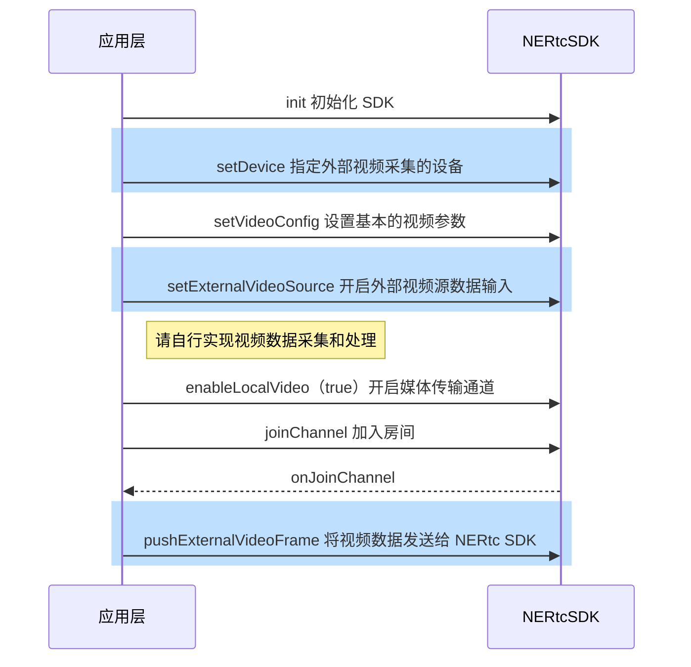

<!--keywords:自定义视频采集,外部视频输入-->

NERTC SDK 提供自定义视频采集功能，帮助您向 SDK 提供自定义的视频输入源数据，并由 SDK 进行编码推流。本文档为您介绍如何通过 <a href="https://doc.yunxin.163.com/nertc/api-refer/windows/doxygen/Latest/zh/html/classnertc_1_1_i_rtc_engine_ex.html#a63fc96049bcae9967ae548d92dc388f0" target="_blank">`setExternalVideoSource`</a> 和 <a href="https://doc.yunxin.163.com/nertc/api-refer/windows/doxygen/Latest/zh/html/classnertc_1_1_i_rtc_engine_ex.html#aa76b020f35b3623642f210cb291915e7" target="_blank">`pushExternalVideoFrame`</a> 方法实现自定义视频采集功能。

## <span id="功能描述">功能描述</span>

一般情况下，App 采用默认设备采集视频数据，通常是本设备的摄像头模块。但在部分场景下可能需要使用自定义的视频源，例如：

- 由第三方美颜 SDK 负责视频数据采集和视频数据的前处理，NERTC 负责视频数据编码和云端推流。
- 某些视频采集设备被系统独占。为避免与其它业务产生冲突，需要灵活的设备管理策略。例如，直播过程中需要录制短视频。
- 需要使用外部视频源，即非摄像头采集的数据，例如播放本地视频文件、屏幕共享、游戏直播等。

基于以上场景，NERTC SDK 支持使用自定义的视频源，以实现您在实际业务场景中的相关需求。

V5.3.0 及之后版本，子房间支持调用 `IRtcChannel#setExternalVideoSource` 和 `IRtcChannel#pushExternalVideoFrame` 设置外部视频输入。

## 技术原理

NERTC SDK 目前提供 Push 数据源的方式实现自定义的视频源。外部视频输入的场景中，NERTC SDK 会根据 `setVideoConfig` 中设置的`max_profile`或 `height`/ `width` 值，调整画面比例，并对数据源进行裁剪或缩放。视频的帧率由数据源自身控制。

在 Push 模式下进行视频源自定义时，视频数据的传输过程如下图所示。


## <span id="注意事项">注意事项</span>

- 自定义视频采集场景中，您需要自行实现视频数据的采集和处理。

- 若您需要开启外部视频采集，建议在创建外部视频输入源之前调用 <a href="https://doc.yunxin.163.com/nertc/api-refer/windows/doxygen/Latest/zh/html/classnertc_1_1_i_rtc_engine.html#ad958fcb663c93a8c84d516effc50e863" target="_blank">`enableLocalVideo`</a> 方法关闭本地视频设备采集（若未打开则无需关心），再在创建外部视频输入源之后再次调用 <a href="https://doc.yunxin.163.com/nertc/api-refer/windows/doxygen/Latest/zh/html/classnertc_1_1_i_rtc_engine.html#ad958fcb663c93a8c84d516effc50e863" target="_blank">`enableLocalVideo`</a> 方法开启媒体传输通道。
- 请先开启外部视频输入（<a href="https://doc.yunxin.163.com/nertc/api-refer/windows/doxygen/Latest/zh/html/classnertc_1_1_i_rtc_engine_ex.html#a63fc96049bcae9967ae548d92dc388f0" target="_blank">`setExternalVideoSource`</a>），再开启本地视频预览（[NERtc#startVideoPreview](https://doc.yunxin.163.com/nertc/api-refer/windows/doxygen/Latest/zh/html/classnertc_1_1_i_rtc_engine_ex.html#aff8e53ae30f5c65263a70fd813c960cf) ）或开启媒体传输通道（<a href="https://doc.yunxin.163.com/nertc/api-refer/windows/doxygen/Latest/zh/html/classnertc_1_1_i_rtc_engine.html#ad958fcb663c93a8c84d516effc50e863" target="_blank">`enableLocalVideo`</a> ）。
- 当外部视频源输入作为主流或辅流时，内部引擎为启用状态，在切换房间（switchChannel）、主动离开房间（leaveChannel）、断网重连失败（onDisconnect）或重新加入房间（onReJoinChannel）后仍然有效。如果需要关闭该功能，请在下次通话前调用接口关闭该功能。

- 视频主流和辅流通道分别只能传输一个视频输入源，例如：
    - 若您已经开启了屏幕共享（使用辅流通道），则外部输入的视频源只能使用主流通道。
    - 若您在 <a href="https://doc.yunxin.163.com/nertc/api-refer/windows/doxygen/Latest/zh/html/classnertc_1_1_i_rtc_engine.html#ad958fcb663c93a8c84d516effc50e863" target="_blank">`enableLocalVideo`</a> 中已通过主流传输本设备的摄像头数据，则外部输入的视频源只能使用辅流通道。

- 对于 V5.3.0 及之后版本，如果当前正在使用本地视频辅流通道进行本地摄像头采集或者外部自定义视频输入，调用 <a href="https://doc.yunxin.163.com/nertc/api-refer/macOS/doxygen/Latest/zh/html/classnertc_1_1_i_rtc_engine_ex.html#a1c10c8522dc6715388ffe62f165beed7" target="_blank">`startScreenCaptureByScreenRect`</a> 或 <a href="https://doc.yunxin.163.com/nertc/api-refer/macOS/doxygen/Latest/zh/html/classnertc_1_1_i_rtc_engine_ex.html#a8eab357982a5fa500e4e5d5eadb42923" target="_blank">`startScreenCaptureByWindowId`</a> 开启屏幕共享时，需要先调用[`enableLocalVideo`](https://doc.yunxin.163.com/nertc/api-refer/macOS/doxygen/Latest/zh/html/classnertc_1_1_i_rtc_channel.html#a5c336b19e3c9b0db9a73b9515d7108d7)停止辅流。如果当前正在屏幕共享，调用 [`enableLocalVideo`](https://doc.yunxin.163.com/nertc/api-refer/macOS/doxygen/Latest/zh/html/classnertc_1_1_i_rtc_channel.html#a5c336b19e3c9b0db9a73b9515d7108d7) 开启辅流时，需要调用 [`stopScreenCapture`](https://doc.yunxin.163.com/nertc/api-refer/macOS/doxygen/Latest/zh/html/classnertc_1_1_i_rtc_engine_ex.html#a722c1bb960536c104fd3560479f86d72) 先停止屏幕共享。


## **API 调用时序**




## <span id="实现方法">实现方法</span>


参考如下步骤，在您的项目中通过 Push 方式实现自定义视频源功能：

1.  指定外部视频采集的设备。

    调用 <a href="https://doc.yunxin.163.com/nertc/api-refer/windows/doxygen/Latest/zh/html/classnertc_1_1_i_video_device_manager.html#a8da8a94bec7110acc5fc0416a4b812f6" target="_blank">`setDevice`</a> 方法，设置 `device_id` 参数为待采集视频的设备 ID，并设置 `type` 为 `kNERTCVideoStreamMain`（主流） 或 `kNERtcVideoStreamSub`（辅流）。
    ::: note note
    视频采集设备 ID 可以通过 <a href="https://doc.yunxin.163.com/nertc/api-refer/windows/doxygen/Latest/zh/html/classnertc_1_1_i_video_device_manager.html#a463765ebb44c0b0bfbec39f41081c6c1" target="_blank">`enumerateCaptureDevices`</a> 获取。
    :::
2. 设置基本的视频参数。

    调用 [`setVideoConfig`](https://doc.yunxin.163.com/nertc/api-refer/windows/doxygen/Latest/zh/html/classnertc_1_1_i_rtc_engine_ex.html#a0f80132a269b2a7b8fca1a9dd2ca31cb) 方法，设置基本的视频参数，特别是 `width`、`height`、`frameRate` 三个重要参数，要与真实的外部输入一致，否则会影响视频质量。

3. 开启外部视频源数据输入。

    调用 <a href="https://doc.yunxin.163.com/nertc/api-refer/windows/doxygen/Latest/zh/html/classnertc_1_1_i_rtc_engine_ex.html#a63fc96049bcae9967ae548d92dc388f0" target="_blank">`setExternalVideoSource`</a> 方法，设置 `enable` 参数为 `true`，并设置 `type` 为 `kNERTCVideoStreamMain`（主流） 或 `kNERtcVideoStreamSub`（辅流）。
4. 开启媒体传输通道。

    调用 <a href="https://doc.yunxin.163.com/nertc/api-refer/windows/doxygen/Latest/zh/html/classnertc_1_1_i_rtc_engine.html#ad958fcb663c93a8c84d516effc50e863" target="_blank">`enableLocalVideo`</a> 方法，设置 `enable` 参数为 `true`，并设置 `type` 为 `kNERTCVideoStreamMain`（主流） 或 `kNERtcVideoStreamSub`（辅流）。


    ::: note note
    如果已经开启了本地视频采集，会自动切换到外部设备采集，不需要再次调用 <a href="https://doc.yunxin.163.com/nertc/api-refer/windows/doxygen/Latest/zh/html/classnertc_1_1_i_rtc_engine.html#ad958fcb663c93a8c84d516effc50e863" target="_blank">`enableLocalVideo`</a> 方法。

    对于 V5.3.0 及之后版本：

    - 如果当前正在屏幕共享，调用 [`enableLocalVideo`](https://doc.yunxin.163.com/nertc/api-refer/windows/doxygen/Latest/zh/html/classnertc_1_1_i_rtc_channel.html#a5c336b19e3c9b0db9a73b9515d7108d7) 开启辅流时，需要调用 [`stopScreenCapture`](https://doc.yunxin.163.com/nertc/api-refer/windows/doxygen/Latest/zh/html/classnertc_1_1_i_rtc_engine_ex.html#a722c1bb960536c104fd3560479f86d72) 先停止屏幕共享。    
    - 如果当前正在使用本地视频辅流通道进行本地摄像头采集或者外部自定义视频输入，调用 <a href="https://doc.yunxin.163.com/nertc/api-refer/windows/doxygen/Latest/zh/html/classnertc_1_1_i_rtc_engine_ex.html#a1c10c8522dc6715388ffe62f165beed7" target="_blank">`startScreenCaptureByScreenRect`</a> 或 <a href="https://doc.yunxin.163.com/nertc/api-refer/windows/doxygen/Latest/zh/html/classnertc_1_1_i_rtc_engine_ex.html#a8eab357982a5fa500e4e5d5eadb42923" target="_blank">`startScreenCaptureByWindowId`</a> 开启屏幕共享时，需要先调用[`enableLocalVideo`](https://doc.yunxin.163.com/nertc/api-refer/windows/doxygen/Latest/zh/html/classnertc_1_1_i_rtc_channel.html#a5c336b19e3c9b0db9a73b9515d7108d7)停止辅流。

    :::
5. 指定外部采集设备后，您需要自行管理视频数据采集和处理，具体实现方法请参考 [ExternalVideo 示例项目源码](https://github.com/netease-im/Advanced-Video/tree/master/ExternalVideo/ExternalVideo-Win-Mac-QT)。

6. （可选）设置视频旋转方向。

    当设备方向变化后，您可以通过如下方式实现横竖屏切换：
    
    
    在将视频数据发送给 NERTC SDK 前，通过 <a href="https://doc.yunxin.163.com/nertc/api-refer/windows/doxygen/Latest/zh/html/structnertc_1_1_n_e_rtc_video_frame.html">NERtcVideoFrame</a> 设置视频的方向。例如，设置 `rotation` 为 90，使视频帧顺时针旋转 90 度。

7. 将外部视频帧的数据发送给 NERTC SDK。

    完成视频数据处理后，调用 <a href="https://doc.yunxin.163.com/nertc/api-refer/windows/doxygen/Latest/zh/html/classnertc_1_1_i_rtc_engine_ex.html#aa76b020f35b3623642f210cb291915e7" target="_blank">`pushExternalVideoFrame`</a> 方法将视频数据发送给 SDK 进行后续操作；调用此方法时，您需要通过 `frame` 参数传入外部视频帧的数据信息，并设置 `type` 为 `kNERTCVideoStreamMain`（主流） 或 `kNERTCVideoStreamSub`（辅流）。

    ::: note note
    - <a href="https://doc.yunxin.163.com/nertc/api-refer/windows/doxygen/Latest/zh/html/classnertc_1_1_i_video_device_manager.html#a8da8a94bec7110acc5fc0416a4b812f6" target="_blank">`setDevice`</a>、<a href="https://doc.yunxin.163.com/nertc/api-refer/windows/doxygen/Latest/zh/html/classnertc_1_1_i_rtc_engine_ex.html#a63fc96049bcae9967ae548d92dc388f0" target="_blank">`setExternalVideoSource`</a> 、<a href="https://doc.yunxin.163.com/nertc/api-refer/windows/doxygen/Latest/zh/html/classnertc_1_1_i_rtc_engine.html#ad958fcb663c93a8c84d516effc50e863" target="_blank">`enableLocalVideo`</a> 和 <a href="https://doc.yunxin.163.com/nertc/api-refer/windows/doxygen/Latest/zh/html/classnertc_1_1_i_rtc_engine_ex.html#aa76b020f35b3623642f210cb291915e7" target="_blank">`pushExternalVideoFrame`</a> 4 个接口中设置的视频通道 `Type` 必须一致，同为主流或辅流，否则 NERTC SDK 会报错。
    
 
    - 当 <a href="https://doc.yunxin.163.com/nertc/api-refer/windows/doxygen/Latest/zh/html/structnertc_1_1_n_e_rtc_video_frame.html">NERtcVideoFrame</a>  格式为 `NERtcVideoFrame.Format.TEXTURE_OES` 时，请先调用 `pushExternalVideoFrame` 的线程完成 `eglMakeCurrent` 调用。 可以使用 `GLHelper.initGLContext` 完成初始化。
    - <a href="https://doc.yunxin.163.com/nertc/api-refer/windows/doxygen/Latest/zh/html/structnertc_1_1_n_e_rtc_video_frame.html">NERtcVideoFrame</a>中的 `width`、`height`、`format` 三个参数的值，要与外部输入的视频的实际值保持一致，否则会影响视频质量。
    - 如果设置的分辨率太高，可能会影响计费，请根据场景，合理设置 <a href="https://doc.yunxin.163.com/nertc/api-refer/windows/doxygen/Latest/zh/html/structnertc_1_1_n_e_rtc_video_frame.html">NERtcVideoFrame</a> 中的 `height` 和 `width` 值。典型场景的推荐参数请参见[音视频参数配置推荐](https://doc.yunxin.163.com/nertc/guide/TM5NzQwMTg?platform=windows)。
    :::


## 示例项目源码

网易云信提供 [ExternalVideo 示例项目源码](https://github.com/netease-im/Advanced-Video/tree/master/ExternalVideo/ExternalVideo-Win-Mac-QT)，您可以参考该源码实现自定义视频采集。    


## <span id="示例代码">示例代码</span>


```C++
//以开启主流外部视频输入为例
//设置主流画布
nertc::NERtcVideoCanvas canvas;
canvas.cb = nullptr;
canvas.user_data = nullptr;
canvas.window = window; //渲染窗口句柄
canvas.scaling_mode = nertc::kNERtcVideoScaleFullFill; //设置视频缩放模式
rtc_engine->setupLocalVideoCanvas(&canvas);

vdm->setDevice(nertc::kNERtcExternalSubVideoDeviceID, nertc::kNERTCVideoStreamMain);//设置为外部设备采集
rtc_engine->setExternalVideoSource(nertc::kNERTCVideoStreamMain, true);//开启外部视频源数据输入
rtc_engine->enableLocalVideo(nertc::kNERTCVideoStreamMain, true);//开始视频（如果原先已经开启了视频，则不需要调用）
rtc_engine->pushExternalVideoEncodedFrame(nertc::kNERTCVideoStreamMain, encoded_frame);//推送自定义数据,需要定时循环调用

//切换回摄像头采集
rtc_engine_->setExternalVideoSource(nertc::kNERTCVideoStreamMain, false); //关闭外部视频源数据输入
video_device_manager->setDevice(cameraDeviceID); //设置选择的设备，可通过enumerateCaptureDevices获取视频设备信息
```

## API 参考
| **方法** | **功能描述**|
|:--|:--|
|<a href="https://doc.yunxin.163.com/nertc/api-refer/windows/doxygen/Latest/zh/html/classnertc_1_1_i_video_device_manager.html#a8da8a94bec7110acc5fc0416a4b812f6" target="_blank">`setDevice`</a> |指定特定外部视频采集设备。|
|<a href="https://doc.yunxin.163.com/nertc/api-refer/windows/doxygen/Latest/zh/html/classnertc_1_1_i_rtc_engine.html#ad958fcb663c93a8c84d516effc50e863" target="_blank">`enableLocalVideo`</a>|开启或关闭本地视频采集。|
|<a href="https://doc.yunxin.163.com/nertc/api-refer/windows/doxygen/Latest/zh/html/classnertc_1_1_i_rtc_engine_ex.html#a63fc96049bcae9967ae548d92dc388f0" target="_blank">`setExternalVideoSource`</a> |开启外部视频源数据输入。|
|<a href="https://doc.yunxin.163.com/nertc/api-refer/windows/doxygen/Latest/zh/html/classnertc_1_1_i_rtc_engine_ex.html#aa76b020f35b3623642f210cb291915e7" target="_blank">`pushExternalVideoFrame`</a> |推送外部视频数据帧。|

## 常见问题

- **自定义视频源支持哪些数据格式？**

    自定义视频源的数据格式支持 I420、NV21、RGBA、TEXTURE_OES 和 TEXTURE_RGB。


- **自定义视频采集的分辨率和`setLocalVideoConfig`中设置的视频分辨率不一致时，以哪个分辨率为准**

    当<a href="https://doc.yunxin.163.com/nertc/api-refer/windows/doxygen/Latest/zh/html/classnertc_1_1_i_rtc_engine_ex.html#aa76b020f35b3623642f210cb291915e7" target="_blank">`pushExternalVideoFrame`</a>  输入的视频分辨率和 [`setVideoConfig`](https://doc.yunxin.163.com/nertc/api-refer/windows/doxygen/Latest/zh/html/classnertc_1_1_i_rtc_engine_ex.html#a0f80132a269b2a7b8fca1a9dd2ca31cb) 中设置的分辨率、画布比例不一致时，例如`pushExternalVideoFrame`的分辨率为640 x 480（4：3）、`setLocalVideoConfig`的分辨率为1280 x 720（16：9），NERTC SDK 的推流视频处理逻辑如下：
    1. 画布比例采用 [`setVideoConfig`](https://doc.yunxin.163.com/nertc/api-refer/windows/doxygen/Latest/zh/html/classnertc_1_1_i_rtc_engine_ex.html#a0f80132a269b2a7b8fca1a9dd2ca31cb) 中设置的画布比例，本示例中为 16：9。
    2. 将自定义视频采集的分辨率（本示例中为 640 x 480）按照[`setVideoConfig`](https://doc.yunxin.163.com/nertc/api-refer/windows/doxygen/Latest/zh/html/classnertc_1_1_i_rtc_engine_ex.html#a0f80132a269b2a7b8fca1a9dd2ca31cb) 中设置的画布比例（本示例中为 16：9）进行裁剪，得到一个新的分辨率（640 x 360）。
    3. 根据上一步得到的新分辨率和[`setVideoConfig`](https://doc.yunxin.163.com/nertc/api-refer/windows/doxygen/Latest/zh/html/classnertc_1_1_i_rtc_engine_ex.html#a0f80132a269b2a7b8fca1a9dd2ca31cb) 中的分辨率，取两者中较小的分辨率作为推流分辨率。因此，本示例中最终的视频分辨率为 640 x 360。
