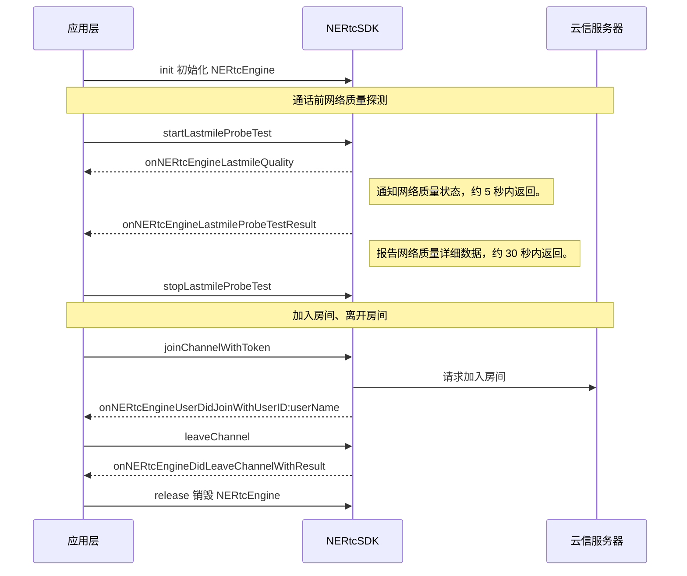

<!--- keywords:通话前网络质量探测,网络延时,上行,下行 -->

在网络会议、重要直播等对音视频通话质量等要求较高的场景下，需要在通话前进行调试，例如检测上下行网络质量，以提前识别网络问题或判断当前网络环境下适合的音视频流码率。NERTC SDK 支持网络测速功能，帮助您保证高质量的音视频通话体验。

## 功能介绍

自 V4.5.0 起，NERTC SDK 提供通话前网络探测相关接口与回调方法，用户在加入房间前可以探测当前设备到网易云信边缘服务器的网络状态，即上下行 last mile 的网络质量，包括带宽、丢包率、网络抖动和往返时延等数据，以判断或预测本端当前的网络状况。

网络质量探测的基本原理是 NERTC SDK 向网易云信边缘服务器节点发送一批网络探测数据包，然后分析返回数据包的质量，通过回调以数据报告的形式返回给客户端。

**基本原理图**如下：


- 当上行测速结果显示丢包率较高时，推荐使用降低分辨率或降低帧率等方法降低推流码率，以保证正常推流。
- 当下行测速结果显示丢包率较高时，推荐使用[视频流回退](https://doc.yunxin.163.com/nertc/guide/TUxNjY4OTk?platform=iOS)功能指定远端拉取低码率的流，以保证正常拉流。</font>

## 注意事项
- 请在**加入房间前**使用网络质量探测功能，即 [`startLastmileProbeTest`](https://doc.yunxin.163.com/nertc/api-refer/iOS/doxygen/Latest/zh/html/protocol_i_n_e_rtc_engine_ex-p.html#a75b32704fc26f390f82fc600e0765f0b) 需要在 [`joinChannelWithToken`](https://doc.yunxin.163.com/nertc/api-refer/iOS/doxygen/Latest/zh/html/protocol_i_n_e_rtc_engine-p.html#a4876b67191a8e51488fc0d0ef14fc724) 之前调用。
- 调用 [`startLastmileProbeTest`](https://doc.yunxin.163.com/nertc/api-refer/iOS/doxygen/Latest/zh/html/protocol_i_n_e_rtc_engine_ex-p.html#a75b32704fc26f390f82fc600e0765f0b) 进行通话前网络质量探测时，会消耗一定的网络流量。因此调用方法后，建议在收到 [`onNERtcEngineLastmileProbeTestResult`](https://doc.yunxin.163.com/nertc/api-refer/iOS/doxygen/Latest/zh/html/protocol_n_e_rtc_engine_delegate_ex-p.html#a57869f640f8b1277af6dbac8f7492141) 回调之前不要调用其他方法，避免因 API 操作过于频繁导致其他方法无法执行。
- 开启网络测试后，NERTC SDK 会根据当前设置的视频分辨率自动调整探测码率。
- 视频通话期间请勿测试，以免影响通话质量。

## 示例项目源码
网易云信提供 [通话前网络质量检测的示例项目源码 SpeedTest](https://github.com/netease-im/G2-API-Examples/tree/main/ios/Advanced/SpeedTest)，您可以参考该源码实现通话前网络质量检测。

## API 调用时序



## 实现方法

1. 注册探测回调监听。

    - [`onNERtcEngineLastmileQuality`](https://doc.yunxin.163.com/nertc/api-refer/iOS/doxygen/Latest/zh/html/protocol_n_e_rtc_engine_delegate_ex-p.html#a59da1dac407fa2c9bd63420f55e45a89)：描述本端用户在加入频道前的 last mile 网络探测的结果，以打分形式描述上下行网络质量的主观体验，您可以通过该回调预估本地用户在音视频通话中的网络体验。该回调视网络情况在约 5 秒内返回。
    - [`onNERtcEngineLastmileProbeTestResult`](https://doc.yunxin.163.com/nertc/api-refer/iOS/doxygen/Latest/zh/html/protocol_n_e_rtc_engine_delegate_ex-p.html#a57869f640f8b1277af6dbac8f7492141)：描述本地用户在加入频道前的 last mile 网络探测详细报告，报告中通过客观数据反馈上下行网络质量，包括网络抖动、丢包率等数据。您可以通过该回调客观预测本地用户在音视频通话中的网络状态。该回调视网络情况在约 30 秒内返回。

    **示例代码**如下：
    
    ```
    //在遵循 NERtcEngineDelegateEx 协议的对象中实现如下回调，监听通话前网络上下行 last mile 质量状态回调
    - (void)onNERtcEngineLastmileQuality:(NERtcNetworkQuality)quality {
    //根据实际的业务场景向用户展示以打分的主观形式评估的网络上下行质量
    }

    - (void)onNERtcEngineLastmileProbeTestResult:(NERtcLastmileProbeResult *)result {
    //根据实际的业务场景向用户展示上下行网络质量的实际探测数据
    }
    ```

2. 在加入房间前，调用 [`startLastmileProbeTest`](https://doc.yunxin.163.com/nertc/api-refer/iOS/doxygen/Latest/zh/html/protocol_i_n_e_rtc_engine_ex-p.html#a75b32704fc26f390f82fc600e0765f0b) 方法进行网络质量探测，并通过 [`NERtcLastmileProbeConfig`](https://doc.yunxin.163.com/nertc/api-refer/iOS/doxygen/Latest/zh/html/interface_n_e_rtc_lastmile_probe_config.html) 结构体设置是否探测上行或下行网络以及对应的期望码率，相关参数的说明如下表所示。

    <table>
    <tr>
        <th width="30%">参数</th>
        <th width="70%">参数说明</th>
    </tr>
        <tr>
        <td>expectedUplinkBitrate</td>
        <td>本端期望的最高发送码率。单位为 bps，取值范围为 100000 ~ 5000000。<note type="note">推荐参考 <a href="https://doc.yunxin.163.com/nertc/api-refer/iOS/doxygen/Latest/zh/html/protocol_i_n_e_rtc_engine-p.html#a96eeaa48e5900c00f408182b38c56b58" target="_blank"><code>setLocalVideoConfig</code></a> 中的视频编码码率设置该参数的值。</note></td>
    </tr>
        <tr>
        <td>expectedDownlinkBitrate</td>
        <td>本端期望的最高接收码率。单位为 bps，取值范围为 100000 ~ 5000000。</td>
    </tr>
        <tr>
        <td>probeUplink</td>
        <td>是否探测上行网络。<ul><li>YES：探测上行网络。<li>NO：不探测上行网络。<note type="note">不发流的用户，例如直播房间中的普通观众，无需进行上行网络探测。</note></td>
    </tr>
        <tr>
        <td>probeDownlink</td>
        <td>是否探测下行网络。<ul><li>YES：探测下行网络。<li>NO：不探测下行网络。</td>
    </tr>
    </table>

    **示例代码**如下：
    ```
    NERtcLastmileProbeConfig *probeConfig = [[NERtcLastmileProbeConfig alloc] init];
    probeConfig.probeUplink = //是否开启上行探测;
    probeConfig.probeDownlink = //是否开启下行探测;
    probeConfig.expectedUplinkBitrate = //预期最高发送探测码率;
    probeConfig.expectedDownlinkBitrate = //预期最高接收码率;
    [[NERtcEngine sharedEngine] startLastmileProbeTest:probeConfig];
    ```

3. 成功调用探测方法后，测速结果将在 [`onNERtcEngineLastmileQuality`](https://doc.yunxin.163.com/nertc/api-refer/iOS/doxygen/Latest/zh/html/protocol_n_e_rtc_engine_delegate_ex-p.html#a59da1dac407fa2c9bd63420f55e45a89) 和 [`onNERtcEngineLastmileProbeTestResult`](https://doc.yunxin.163.com/nertc/api-refer/iOS/doxygen/Latest/zh/html/protocol_n_e_rtc_engine_delegate_ex-p.html#a57869f640f8b1277af6dbac8f7492141) 回调中返回。

    - `onNERtcEngineLastmileQuality` 的 [`quality`](https://doc.yunxin.163.com/nertc/api-refer/iOS/doxygen/Latest/zh/html/_n_e_rtc_engine_enum_8h.html#ab1fedbf7174dc3a0030263f81b167c7f) 参数**以打分的主观形式**评估网络上下行质量，具体枚举值说明如下表所示。

    <table>
    <tr>
        <th width="30%">枚举值</th>
        <th width="70%">说明</th>
    </tr>
        <tr>
        <td>kNERtcNetworkQualityUnknown</td>
        <td>质量未知</td>
    </tr>
        <tr>
        <td>kNERtcNetworkQualityExcellent</td>
        <td>质量极好</note></td>
    </tr>
        <tr>
        <td>kNERtcNetworkQualityGood</td>
        <td>用户主观体验相当于极好，但码率可能略低。</td>
    </tr>
        <tr>
        <td>kNERtcNetworkQualityPoor</td>
        <td>用户主观体验有瑕疵，但不影响沟通。</td>
    </tr>
        <tr>
        <td>kNERtcNetworkQualityBad</td>
        <td>勉强能沟通，但不顺畅。</td>
    </tr>
        <tr>
        <td>kNERtcNetworkQualityVeryBad</td>
        <td>网络质量非常差，基本不能沟通。</td>
    </tr>
        <tr>
        <td>kNERtcNetworkQualityDown</td>
        <td>完全无法沟通。</td>
    </tr>
    </table>

    - `onNERtcEngineLastmileProbeTestResult` 通过 [`NERtcLastmileProbeResult`](https://doc.yunxin.163.com/nertc/api-refer/iOS/doxygen/Latest/zh/html/interface_n_e_rtc_lastmile_probe_result.html) **提供客观数据**反馈上下行网络质量，具体参数说明如下表所示。

    <table>
    <tr>
        <th width="30%">参数</th>
        <th width="70%">参数说明</th>
    </tr>
        <tr>
        <td>state</td>
        <td>反映本次网络质量探测结果的状态：<ul><li>kNERtcLastmileProbeResultComplete：本次进行了完整的网络质量探测。<li>kNERtcLastmileProbeResultIncompleteNoBwe：本次未进行完整的网络质量探测，缺少带宽预测，通常因为测试资源暂时受限。<li>kNERtcLastmileProbeResultUnavailable：本次未进行网络质量探测，通常因为网络连接中断。</td>
    </tr>
        <tr>
        <td>rtt</td>
        <td>网络延时，单位为毫秒（ms）。</td>
    </tr>
        <tr>
        <td>uplinkReport</td>
        <td>上行网络质量探测结果报告。</note></td>
    </tr>
        <tr>
        <td>downlinkReport</td>
        <td>下行网络质量探测结果报告。</td>
    </tr>
    </table>

    其中网络质量探测结果报告中包括以下数据：

    <table>
    <tr>
        <th width="30%">参数</th>
        <th width="70%">参数说明</th>
    </tr>
        <tr>
        <td>availableBandwidth</td>
        <td>可用网络带宽预估，单位为 Kbps。</td>
    </tr>
        <tr>
        <td>jitter</td>
        <td>网络抖动，单位为毫秒 (ms)。</td>
    </tr>
        <tr>
        <td>packetLossRate</td>
        <td>丢包率。</td>
    </tr>
    </table>


4. 停止探测。

    探测过程中，若您需要停止探测，可以随时调用 [`stopLastmileProbeTest`](https://doc.yunxin.163.com/nertc/api-refer/iOS/doxygen/Latest/zh/html/protocol_i_n_e_rtc_engine_ex-p.html#a82c8f4b7d9915a532dead3b4c5fad4f3) 方法停止通话前网络质量探测。

    **示例代码**如下：
    ```
    [[NERtcEngine sharedEngine] stopLastmileProbeTest];
    ```

## API 参考

| **方法** | **功能描述**|
|:--|:--|
|[`startLastmileProbeTest`](https://doc.yunxin.163.com/nertc/api-refer/iOS/doxygen/Latest/zh/html/protocol_i_n_e_rtc_engine_ex-p.html#a75b32704fc26f390f82fc600e0765f0b)|开始网络质量探测。|
|[`stopLastmileProbeTest`](https://doc.yunxin.163.com/nertc/api-refer/iOS/doxygen/Latest/zh/html/protocol_i_n_e_rtc_engine_ex-p.html#a82c8f4b7d9915a532dead3b4c5fad4f3)|停止网络质量探测。|


| **事件** | **事件描述**|
|:--|:--|
|[`onNERtcEngineLastmileQuality`](https://doc.yunxin.163.com/nertc/api-refer/iOS/doxygen/Latest/zh/html/protocol_n_e_rtc_engine_delegate_ex-p.html#a59da1dac407fa2c9bd63420f55e45a89)|网络质量探测打分结果。|
|[`onNERtcEngineLastmileProbeTestResult`](https://doc.yunxin.163.com/nertc/api-refer/iOS/doxygen/Latest/zh/html/protocol_n_e_rtc_engine_delegate_ex-p.html#a57869f640f8b1277af6dbac8f7492141)|网络质量探测报告。|

