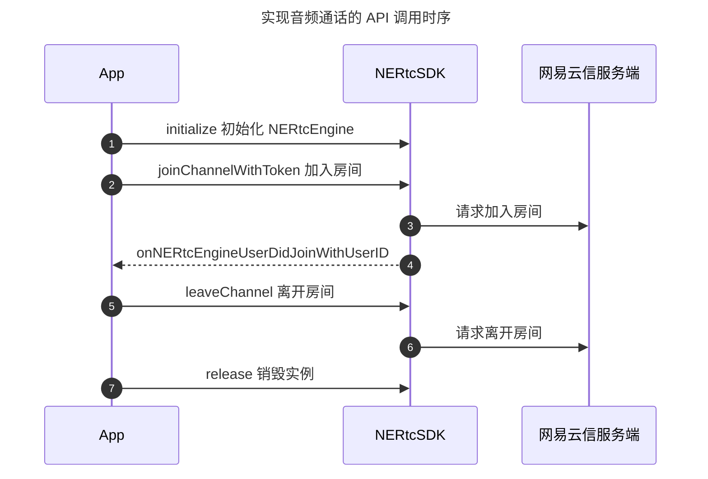
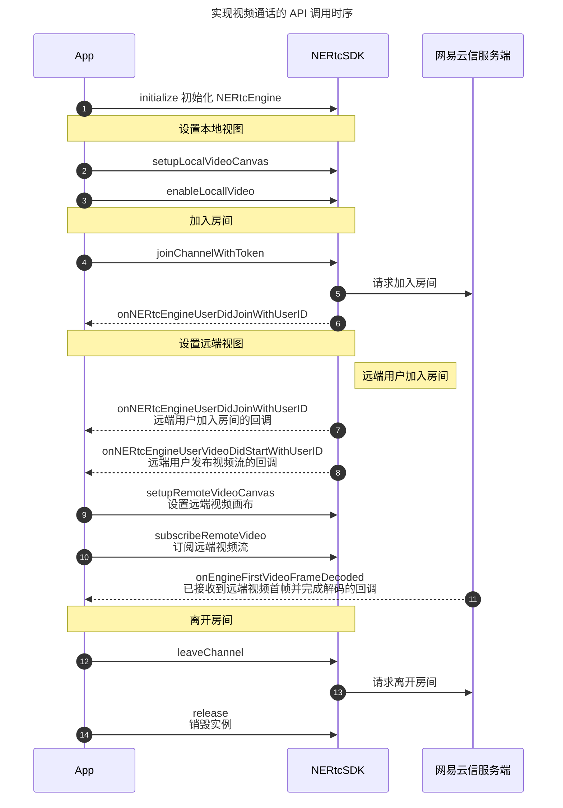

<!--和互动直播对应文档步骤不一致，请勿直接替换。相比互动直播文档，增加跑通示例代码、删除部分推流步骤-->

网易云信音视频通话产品的基本功能包括高质量的实时音视频通话。当您成功初始化 SDK 之后，您可以简单体验本产品的基本业务流程。本文为您展示音视频通话提供的基本业务流程。

## <span id="前提条件">准备工作</span>

请确认您已完成以下操作：

- [创建应用并获取 App Key](https://doc.yunxin.163.com/console/guide/TIzMDE4NTA?platform=console)。
- [开通音视频通话 2.0 服务](https://doc.yunxin.163.com/nertc/quick-start/TYzODcyNjE)。
- [集成 SDK（iOS）](https://doc.yunxin.163.com/nertc/quick-start/jYwNjM5ODA)，其中需要 **设置签名** 并 **添加媒体设备权限**。

## <span id="示例代码">示例代码</span>

网易云信为您提供完整的 **实现基础音视频通话** 的示例代码作为参考，您可以直接拷贝用于运行测试。

::: details 单击展开查看实现音视频通话的完整示例 Objective-C 代码。

```Objective-C
// 初始化 SDK
- (void)setupRTCEngine {
    // 默认情况下日志会存储在 App 沙盒的 Documents 目录下
    NERtcLogSetting *logSetting = [[NERtcLogSetting alloc] init];
#if DEBUG
    logSetting.logLevel = kNERtcLogLevelInfo;
#else
    logSetting.logLevel = kNERtcLogLevelWarning;
#endif

    NERtcEngineContext *context = [[NERtcEngineContext alloc] init];
    context.engineDelegate = self;
    context.appKey = AppKey;
    context.logSetting = logSetting;
    [[NERtcEngine sharedEngine] setupEngineWithContext:context];
}

// 释放 SDK 资源
- (void)destroyRTCEngineWithCompletion:(void(^)(void))completion {
    dispatch_async(dispatch_get_global_queue(DISPATCH_QUEUE_PRIORITY_HIGH, 0), ^{
        [NERtcEngine destroyEngine];

        if (completion) {
            completion();
        }
    });
}

//加入房间
- (void)joinChannelWithRoomId:(NSString *)roomId
                       userId:(uint64_t)userId {
    NERtcEngine *coreEngine = [NERtcEngine sharedEngine];

    //1v1 音视频通话场景的视频推荐配置
    //其他场景下请联系网易云信技术支持获取配置
    NERtcVideoEncodeConfiguration *config = [[NERtcVideoEncodeConfiguration alloc] init];
    config.width = 640;
    config.height = 360;
    config.frameRate = kNERtcVideoFrameRateFps15;
    [coreEngine setLocalVideoConfig:config];

    //1v1 音视频通话场景的音频推荐配置
    //其他场景下请联系网易云信技术支持获取配置
    [coreEngine setAudioProfile:kNERtcAudioProfileStandard
                       scenario:kNERtcAudioScenarioSpeech];

    [coreEngine enableLocalAudio:YES];
    [coreEngine enableLocalVideo:YES];

    __weak typeof(self) weakSelf = self;
    [coreEngine joinChannelWithToken:@""
                         channelName:roomId
                               myUid:userId
                          completion:^(NSError * _Nullable error, uint64_t channelId, uint64_t elapesd) {
        if (error) {
            //加入失败，弹框之后退出当前页面
            NSString *message = [NSString stringWithFormat:@"join channel fail.code:%@", @(error.code)];
            [weakSelf showDismissAlertWithMessage:message actionBlock:^{
                [weakSelf destroyRTCEngineWithCompletion:^{
                    dispatch_async(dispatch_get_main_queue(), ^{
                        [weakSelf.navigationController popViewControllerAnimated:YES];
                    });
                }];
            }];
        } else {
            //加入成功，建立本地 canvas 渲染本地视图
            NERtcVideoCanvas *canvas = [weakSelf setupLocalCanvas];
            [coreEngine setupLocalVideoCanvas:canvas];
        }
    }];
}

#pragma mark - SDK 回调（含义请参考 NERtcEngineDelegateEx 定义）
- (void)onNERtcEngineDidError:(NERtcError)errCode {
    NSString *message = [NSString stringWithFormat:@"nertc engine did error.code:%@", @(errCode)];
    [self showDismissAlertWithMessage:message actionBlock:^{
        [[NERtcEngine sharedEngine] leaveChannel];
    }];
}

- (void)onNERtcEngineUserDidJoinWithUserID:(uint64_t)userID
                                  userName:(NSString *)userName {
    // 如果已经 setup 了一个远端的 canvas，则不需要再建立了
    if (_remoteCanvas != nil) {
        return;
    }

    // 建立远端 canvas，用来渲染远端画面
    NERtcVideoCanvas *canvas = [self setupRemoteCanvasWithUid:userID];
    [NERtcEngine.sharedEngine setupRemoteVideoCanvas:canvas
                                           forUserID:userID];
}

- (void)onNERtcEngineUserVideoDidStartWithUserID:(uint64_t)userID videoProfile:(NERtcVideoProfileType)profile {
    // 如果已经订阅过远端视频流，则不需要再订阅了
    if (_remoteCanvas.subscribedVideo) {
        return;
    }

    // 订阅远端视频流
    _remoteCanvas.subscribedVideo = YES;
    [NERtcEngine.sharedEngine subscribeRemoteVideo:YES forUserID:userID streamType:kNERtcRemoteVideoStreamTypeHigh];
}

- (void)onNERtcEngineUserVideoDidStop:(uint64_t)userID {
    if (userID == _remoteCanvas.uid) {
        _remoteStatLab.hidden = YES;
    }
}

- (void)onNERtcEngineUserDidLeaveWithUserID:(uint64_t)userID
                                     reason:(NERtcSessionLeaveReason)reason {
    // 如果远端的人离开了，重置远端模型和 UI
    if (userID == _remoteCanvas.uid) {
        _remoteStatLab.hidden = NO;
        [_remoteCanvas resetCanvas];
        _remoteCanvas = nil;
    }
}

- (void)onNERtcEngineDidDisconnectWithReason:(NERtcError)reason {
    // 网络连接中断时会触发该回调，触发之后的操作则由开发者按需实现
    // 此时已与房间断开连接，如果需要重新加入房间，必须再次调用 join 接口
}

- (void)onNERtcEngineDidLeaveChannelWithResult:(NERtcError)result {
    // 调用 leaveChannel 之后，若需要释放 SDK 资源，建议在收到该回调之后，再调用 destroyEngine
    [self destroyRTCEngineWithCompletion:^{
        dispatch_async(dispatch_get_main_queue(), ^{
            [self.navigationController popViewControllerAnimated:YES];
        });
    }];
}
```
:::

## <span id="实现流程">实现流程</span>

实现 **音频通话** 的 API 调用时序如下图所示。



实现 **视频通话** 的 API 调用时序如下图所示。



<span id="实现方法"></span>

## 第一步：创建音视频通话界面

::: details 您可以参考此步骤根据业务场景创建相应的音视频通话界面，若您已实现相应界面，请忽略该步骤。

实现基础的音视频通话，建议您参考 [SampleCode](https://github.com/netease-im/Basic-Video-Call/tree/master/One-to-One-Video/NERtcSample-1to1-iOS-Objective-C) 中的 `Main.storyboard` 文件在界面上添加以下控件。

- 本端视频窗口
- 远端视频窗口
- 麦克风按钮
- 摄像头按钮
- 结束通话按钮

效果图如下图所示。


:::

## <span id="2.导入类">第二步：导入类</span>

在项目中导入 `NERtcSDK` 类：

```Objective-C
#import <NERtcSDK/NERtcSDK.h>
```

## <span id="3.初始化">第三步：初始化</span>

调用 [`setupEngineWithContext`](https://doc.yunxin.163.com/nertc/api-refer/iOS/doxygen/Latest/zh/html/protocol_i_n_e_rtc_engine-p.html#aa0b59418e236407489b3a5cb7abdd9e1) 方法完成初始化。

::: note notice
您需要将 `AppKey` 替换为您的应用对应的 App Key。
:::

**示例代码** 如下：

```Objective-C
@interface Myapp ()<NERtcEngineDelegateEx>
...
NERtcEngine *coreEngine = [NERtcEngine sharedEngine];
NERtcEngineContext *context = [[NERtcEngineContext alloc] init];
// 设置通话相关信息的回调
context.engineDelegate = self;
// 设置当前应用的 App Key
context.appKey = AppKey;//请替换为您自己的 App Key
[coreEngine setupEngineWithContext:context];
```

为了实现标准音视频通话业务，您还需要在初始化时 **注册相关必要回调**，建议您请在初始化方法中传入原型为 **NERtcEngineDelegate / NERtcEngineDelegateEx** 的以下回调：

```Objective-C
//本端用户连接中断通知，收到回调后，表示已从房间内断开。
- (void)onNERtcEngineDidDisconnectWithReason:(NERtcError)reason {
}
//远端用户加入房间通知回调，建议在收到此回调后再进行设置远端视图等的操作
- (void)onNERtcEngineUserDidJoinWithUserID:(uint64_t)userID
                                  userName:(NSString *)userName {
                              {
    }
}
//远端用户退出房间通知回调
- (void)onNERtcEngineUserDidLeaveWithUserID:(uint64_t)userID
                                     reason:(NERtcSessionLeaveReason)reason {
                                     {
    }
}
//远端用户推流/停止推流通知回调，建议在收到此回调后再进行订阅或取消订阅音视频流的操作
- (void)onNERtcEngineUserVideoDidStartWithUserID:(uint64_t)userID
                                    videoProfile:(NERtcVideoProfileType)profile {
                                       {
    }
}
- (void)onNERtcEngineUserVideoDidStop:(uint64_t)userID {
                                     {
    }
}
```

## <span id="4.设置本地视图">第四步：设置本地视图</span>

初始化成功后，可以设置本地视图，来预览本地图像。您可以根据业务需要实现加入房间之前预览或加入房间后预览。

::: note note
- 若您想调整摄像头的相关参数，请参考 [视频设备管理](https://doc.yunxin.163.com/nertc/quick-start/DIwNzU4NTc?platform=iOS) 进行设置。
- 在加入房间前，默认预览分辨率为 640*480，您可以通过 [`setLocalVideoConfig`](https://doc.yunxin.163.com/nertc/api-refer/iOS/doxygen/Latest/zh/html/protocol_i_n_e_rtc_engine-p.html#a96eeaa48e5900c00f408182b38c56b58) 接口的 `width ` 和 `height` 参数调整采集分辨率。
:::

- 实现加入房间前预览。

  1. 调用 [`setupLocalVideoCanvas`](https://doc.yunxin.163.com/nertc/api-refer/iOS/doxygen/Latest/zh/html/protocol_i_n_e_rtc_engine-p.html#a461d8173cd13f4370f7eff01bb48d9dc) 方法设置本地视图，可以通过 [`renderMode`](https://doc.yunxin.163.com/nertc/api-refer/iOS/doxygen/Latest/zh/html/_n_e_rtc_engine_enum_8h.html#aed93801676e293da4cc95b382a6d05d1) 和 [`mirrorMode`](https://doc.yunxin.163.com/nertc/api-refer/iOS/doxygen/Latest/zh/html/_n_e_rtc_engine_enum_8h.html#ace09d403332c4b627de8997354b3cd7c) 参数设置视频的渲染模式和镜像模式。再调用 [`startPreview(streamType)`](https://doc.yunxin.163.com/nertc/api-refer/iOS/doxygen/Latest/zh/html/protocol_i_n_e_rtc_engine_ex-p.html#a39334f2aeb02faba230d81afcda1e807) 方法预览本地图像。

       **示例代码** 如下：

      ```Objective-C
      //设置本地视频画布，以适应区域模式、开启镜像为例
      UIView *localUserView = [[UIView alloc] initWithFrame:CGRectMake(0, 0, 200, 200)];
      NERtcVideoCanvas *canvas = [[NERtcVideoCanvas alloc] init];
      canvas.container = localUserView;
      canvas.renderMode = kNERtcVideoRenderScaleCropFill;
      canvas.mirrorMode = kNERtcVideoMirrorModeEnabled;
      [[NERtcEngine sharedEngine] setupLocalVideoCanvas:canvas];

      //以开启本地视频主流预览为例
      [[NERtcEngine sharedEngine] startPreview:kNERtcStreamChannelTypeMainStream];
      ```

  2. 若要结束预览，或者准备加入房间时，调用 [`stopPreview(streamType)`](https://doc.yunxin.163.com/nertc/api-refer/iOS/doxygen/Latest/zh/html/protocol_i_n_e_rtc_engine_ex-p.html#a1b29417a16144da5894cb606bfef47cb) 方法停止预览。

      ::: note note
      [`stopPreview(streamType)`](https://doc.yunxin.163.com/nertc/api-refer/iOS/doxygen/Latest/zh/html/protocol_i_n_e_rtc_engine_ex-p.html#a1b29417a16144da5894cb606bfef47cb) 的 `streamType` 参数请与 [`startPreview(streamType)`](https://doc.yunxin.163.com/nertc/api-refer/iOS/doxygen/Latest/zh/html/protocol_i_n_e_rtc_engine_ex-p.html#a39334f2aeb02faba230d81afcda1e807) 的保持一致，即同为主流或辅流的开启和停止预览。
      :::

- 实现加入房间后预览。

    在成功加入房间后，调用 [`setupLocalVideoCanvas`](https://doc.yunxin.163.com/nertc/api-refer/iOS/doxygen/Latest/zh/html/protocol_i_n_e_rtc_engine-p.html#a461d8173cd13f4370f7eff01bb48d9dc) 方法设置本地视图，可以通过 [`renderMode`](https://doc.yunxin.163.com/nertc/api-refer/iOS/doxygen/Latest/zh/html/_n_e_rtc_engine_enum_8h.html#aed93801676e293da4cc95b382a6d05d1) 和 [`mirrorMode`](https://doc.yunxin.163.com/nertc/api-refer/iOS/doxygen/Latest/zh/html/_n_e_rtc_engine_enum_8h.html#ace09d403332c4b627de8997354b3cd7c) 参数设置视频的渲染模式和镜像模式。再调用 [`enableLocalVideo`](https://doc.yunxin.163.com/nertc/api-refer/iOS/doxygen/Latest/zh/html/protocol_i_n_e_rtc_engine-p.html#a9f13beb56a8b9fdfbc856d304c0d10cb) 方法进行视频的采集发送与预览。成功加入房间后，即可预览本地图像。

    **示例代码** 如下：

    ```Objective-C
    //设置本地视频画布，以适应区域模式、开启镜像为例
    UIView *localUserView = [[UIView alloc] initWithFrame:CGRectMake(0, 0, 200, 200)];
    NERtcVideoCanvas *canvas = [[NERtcVideoCanvas alloc] init];
    canvas.container = localUserView;
    canvas.renderMode = kNERtcVideoRenderScaleCropFill;
    canvas.mirrorMode = kNERtcVideoMirrorModeEnabled;
    [[NERtcEngine sharedEngine] setupLocalVideoCanvas:canvas];
    //以开启本地视频主流采集并发送为例
    [NERtcEngine.sharedEngine enableLocalVideo:YES,kNERtcStreamChannelTypeMainStream];
    ```

## <span id="5.加入房间">第五步：加入房间</span>

加入房间前，请确保已完成初始化相关事项。若您的业务中涉及呼叫邀请等机制，建议通过 [信令](/docs/DA5MjI4NDY/zc5ODk2MDI) 实现，总体实现流程请参考 [一对一会话操作流程](https://doc.yunxin.163.com/signaling/quick-start/zc5ODk2MDI?platform=iOS#%E4%B8%80%E5%AF%B9%E4%B8%80%E4%BC%9A%E8%AF%9D%E6%93%8D%E4%BD%9C%E6%B5%81%E7%A8%8B)，具体呼叫邀请机制的实现请参考 [邀请机制](https://doc.yunxin.163.com/signaling/quick-start/jc3NDg3ODE?platform=iOS)。

调用 [`joinChannelWithToken:channelName:myUid:channelOptions:completion:`](https://doc.yunxin.163.com/nertc/api-refer/iOS/doxygen/Latest/zh/html/protocol_i_n_e_rtc_engine-p.html#adf60d9392e4b50ff73872138965f022f) 方法加入房间。

```Objective-C
[NERtcEngine.sharedEngine joinChannelWithToken:@"Your Token"
                                    channelName: Your roomId
                                          myUid:Your userId
                                channelOptions:NERtcJoinChannelOptions
                                    completion:^(NSError * _Nullable error, uint64_t channelId, uint64_t elapesd) {
                                                        if (error) {
                                                            //加入失败
                                                        } else {
                                                            //加入成功
                                                        }
                                      }];
```

**参数说明**

  <table>
  <tr>
    <th width="30%"><b>参数</b></th>
    <th width="60%"><b>说明</b></th>
  </tr>
  <tr>
    <td>Token</td>
    <td>安全认证签名（NERTC Token）。<ul><li>调试模式下：可设置为 null。产品默认为安全模式，您可以在网易云信控制台将鉴权模式修改为调试模式，具体请参考 <a href="https://doc.yunxin.163.com/nertc/server-apis/TcxNDAxMTI?platform=server">Token 鉴权</a>。<br><b>调试模式的安全性不高，请在产品正式上线前修改为安全模式。</b><li>产品正式上线后：请设置为已获取的 <a href="https://doc.yunxin.163.com/nertc/server-apis/TcxNDAxMTI?platform=server#%E6%96%B9%E5%BC%8F%E4%BA%8C%E7%94%B3%E8%AF%B7-nertc-token">NERTC Token</a>。安全模式下必须设置为获取到的 Token。若未传入正确的 Token 将无法进入房间。<p><b>推荐使用安全模式</b>。</td>
  </tr>
    <tr>
    <td>channelName</td>
    <td>房间名称，长度为 1 ~ 64 字节。目前支持以下 89 个字符：a-z, A-Z, 0-9, space, !#$%&()+-:;≤.,>? @[]^_{|}~"。<br>设置相同房间名称的用户会进入同一个通话房间。<br><note type="note">您也可以在加入通道前，通过 <a href="https://doc.yunxin.163.com/nertc/quick-start/jg3NjcyNTE" target="_blank">创建房间</a> 接口创建房间。加入房间时，若传入的 {channelName} 未事先创建，则网易云信服务器内部将为其自动创建一个名为 {channelName} 的通话房间。</note></li></td>
  </tr>
    <tr>
    <td>myUid</td>
    <td>用户的唯一标识 ID，为数字串，房间内每个用户的 uid 必须是唯一的。<note type="notice">此 uid 为用户在您应用中的 ID，请在您的业务服务器上自行管理并维护。</note></td>
  </tr>
    <tr>
    <td>completion</td>
    <td>操作完成的 block 回调，返回 <b>channelId</b> 和 uid（未指定 uid 时），其中 <b>channelId</b> 即音视频通话的 ID，建议您在业务层保存该数据，以便于后续问题排查。</note></td>
  </tr>
    <tr>
    <td>channelOptions</td>
    <td>加入房间时可以设置携带一些特定信息。默认值为 nil，具体请参考 <a href="https://doc.yunxin.163.com/nertc/api-refer/iOS/doxygen/Latest/zh/html/interface_n_e_rtc_join_channel_options.html" target="_blank">`NERtcJoinChannelOptions`</a>。</td>
  </tr>
</table>

::: note note
成功加入房间之后，您可以通过监听 [`onNERtcEngineConnectionStateChangeWithState:reason:`](https://doc.yunxin.163.com/nertc/api-refer/iOS/doxygen/Latest/zh/html/protocol_n_e_rtc_engine_delegate-p.html#afec9bad19bbc5109c7cf1f161d246907) 回调实时监控自己在本房间内的连接状态。
:::

## <span id="6.设置远端视图并发起订阅">第六步：设置远端视图并发起订阅</span>

音视频通话过程中，除了要显示本地的视频画面，通常也要显示参与互动的其他连麦者/主播的远端视频画面。

1. 监听远端用户进出频道。

    [`NERtcEngineDelegate`](https://doc.yunxin.163.com/nertc/api-refer/iOS/doxygen/Latest/zh/html/protocol_n_e_rtc_engine_delegate-p.html#details) 通过以下回调获取相关信息：

    - **[`onNERtcEngineUserDidJoinWithUserID:userName`](https://doc.yunxin.163.com/nertc/api-refer/iOS/doxygen/Latest/zh/html/protocol_n_e_rtc_engine_delegate-p.html#a7e47ea04b33f9dc7746ede6a0d53a6eb)**：监听远端用户加入通话房间的事件，并抛出对方的 uid。当本端加入房间后，也会通过此回调抛出通话房间内已有的其他用户。

    - **[`onNERtcEngineUserVideoDidStartWithUserID:videoProfile`](https://doc.yunxin.163.com/nertc/api-refer/iOS/doxygen/Latest/zh/html/protocol_n_e_rtc_engine_delegate-p.html#af6c2cb5c852c8890728389b98d1f0f3e)**：监听远端用户发布视频流的事件，回调中携带对方的 uid 与发布的视频分辨率。

2. 设置远端视频画布。

    在监听到远端用户加入房间或发布视频流后，本端可以调用 [`setupRemoteVideoCanvas:forUserID:`](https://doc.yunxin.163.com/nertc/api-refer/iOS/doxygen/Latest/zh/html/protocol_i_n_e_rtc_engine-p.html#ad437566a4dd9a7fd48f9648f0cc15740) 方法设置远端用户视频画布，用于显示其视频画面。

    **示例代码** 如下：

    ```Objective-C
    - (void)onNERtcEngineUserDidJoinWithUserID:(uint64_t)userID userName:(NSString *)userName {
        // 如果已经 setup 了一个远端的 canvas，则不需要再建立了
        ...
        if (_remoteCanvas != nil) {
            return;
        }

        // 建立远端 canvas，用来渲染远端画面
        NERtcVideoCanvas *canvas = [[NERtcVideoCanvas alloc] init];
        canvas.container = _remoteCanvas;
        [NERtcEngine.sharedEngine setupRemoteVideoCanvas:canvas forUserID:userID];
    }

    - (void)onNERtcEngineUserDidLeaveWithUserID:(uint64_t)userID reason:(NERtcSessionLeaveReason)reason {
        // 如果远端的人离开了，重置远端模型和 UI
        ...
        [NERtcEngine.sharedEngine setupRemoteVideoCanvas:nil forUserID:userID];
        ...
    }
    ```

3. 监听远端视频流发布。

    当房间中的其他用户发布视频流时，本端会触发 [`onNERtcEngineUserVideoDidStartWithUserID:`](https://doc.yunxin.163.com/nertc/api-refer/iOS/doxygen/Latest/zh/html/protocol_n_e_rtc_engine_delegate-p.html#af6c2cb5c852c8890728389b98d1f0f3e) 回调：

    ```Objective-C
    @protocol NERtcEngineDelegate <NSObject>
    /**
    其他用户打开视频的回调

    @param userID 用户 ID
    @param profile 用户发送视频的最大分辨率类型
    */
    - (void)onNERtcEngineUserVideoDidStartWithUserID:(uint64_t)userID videoProfile:(NERtcVideoProfileType)profile;
    ```

4. 订阅远端视频流。

    在设置完远端视频画布后，且监听到远端用户有视频发布时，本端可以调用 [`subscribeRemoteVideo:forUserID:streamType:`](https://doc.yunxin.163.com/nertc/api-refer/iOS/doxygen/Latest/zh/html/protocol_i_n_e_rtc_engine_ex-p.html#a93b8bf74c51be46e6ed1f901a65cebfb) 方法订阅远端用户的视频流。

    **示例代码** 如下：

    ```Objective-C
    // 监听到远端用户有视频流发布
    - (void)onNERtcEngineUserVideoDidStartWithUserID:(uint64_t)userID
                                        videoProfile:(NERtcVideoProfileType)profile {
        // 如果已经订阅过远端视频流，则不需要再订阅了
        ...
        if (_remoteCanvas.subscribedVideo) {
            return;
        }

        // 订阅远端视频流
        _remoteCanvas.subscribedVideo = YES;
        [NERtcEngine.sharedEngine subscribeRemoteVideo:YES
                                        forUserID:userID
                                        streamType:kNERtcRemoteVideoStreamTypeHigh];
        ...
    }
    ```

5. 监听远端用户离开房间或停止发布视频。

    - **[`onNERtcEngineUserDidLeaveWithUserID:reason`]()**：远端用户离开房间回调。

    - **[`onNERtcEngineUserVideoDidStop`](https://doc.yunxin.163.com/nertc/api-refer/iOS/doxygen/Latest/zh/html/protocol_n_e_rtc_engine_delegate-p.html#af5cd7800ed2f5b57944dedaa296dbed8)**：远端用户关闭视频功能回调。

        **示例代码** 如下：

        ```Objective-C
        // 监听到远端用户停止视频流发布
        - (void)onNERtcEngineUserVideoDidStop:(uint64_t)userID {
            if (userID == _remoteCanvas.uid) {
                // 收到此回调后，SDK 内部会取消对应的视频流订阅，无需开发者主动取消订阅。
                ...
                _remoteStatLab.hidden = YES;
                ...
            }
        }
        ```

## <span id="7.音频流">第七步：音频流</span>

本地音频的采集发布和远端音频订阅播放是默认启动的，正常情况下无需开发者主动干预。

## <span id="8.退出通话房间">第八步：退出通话房间</span>

调用 [`leaveChannel`](https://doc.yunxin.163.com/nertc/api-refer/iOS/doxygen/Latest/zh/html/protocol_i_n_e_rtc_channel-p.html#a2dc58957c2aaec792558ec411a2eb238) 方法退出通话房间。

**示例代码** 如下：

```Objective-C
//UI 挂断按钮事件
- (IBAction)onHungupAction:(UIButton *)sender {
    [NERtcEngine.sharedEngine leaveChannel];
    [self dismiss];
}
```

执行完 [`leaveChannel`](https://doc.yunxin.163.com/nertc/api-refer/iOS/doxygen/Latest/zh/html/protocol_i_n_e_rtc_channel-p.html#a2dc58957c2aaec792558ec411a2eb238) 方法后，SDK 会触发离开房间回调 [`onNERtcEngineDidLeaveChannelWithResult`](https://doc.yunxin.163.com/nertc/api-refer/iOS/doxygen/Latest/zh/html/protocol_n_e_rtc_engine_delegate-p.html#a1ba9968da680d14f496b2b16a78c6ad8)，通知当前用户退出房间的结果。

**示例代码** 如下：

```Objective-C
- (void)onNERtcEngineDidLeaveChannelWithResult:(NERtcError)result{
    // 进行业务数据清理
}
```

## <span id="9.销毁实例">第九步：销毁音视频实例</span>

当确定 App 短期内不再使用音视频通话实例时，可以调用 [`destroyEngine`](https://doc.yunxin.163.com/nertc/api-refer/iOS/doxygen/Latest/zh/html/interface_n_e_rtc_engine.html#a48ce64655a2033a6e0d25f7308a7f0cc) 方法释放对应的对象资源。

::: note notice
释放资源需要在子线程中进行。
:::

**示例代码** 如下：

```Objective-C
dispatch_async(dispatch_get_global_queue(DISPATCH_QUEUE_PRIORITY_HIGH, 0), ^{
    // 开始销毁
    [NERtcEngine destroyEngine];
    // 到这里表示销毁完成
});
```

## 常见问题

**如何设置画布的缩放模式**

设置画布缩放模式接口 [`setLocalRenderScaleMode`](https://doc.yunxin.163.com/nertc/api-refer/iOS/doxygen/Latest/zh/html/protocol_i_n_e_rtc_channel-p.html#ade23688425ac543bee53e64e63d97f32)/[`setRemoteRenderScaleMode`](https://doc.yunxin.163.com/nertc/api-refer/iOS/doxygen/Latest/zh/html/protocol_i_n_e_rtc_channel-p.html#a29a87b34823ca7d9f70d4308a365fc9e)和设置画布接口[`setupLocalVideoCanvas`](https://doc.yunxin.163.com/nertc/api-refer/iOS/doxygen/Latest/zh/html/protocol_i_n_e_rtc_channel-p.html#a8563cf11b4be079a21d7854b2369c94b)/[`setupRemoteVideoCanvas`](https://doc.yunxin.163.com/nertc/api-refer/iOS/doxygen/Latest/zh/html/protocol_i_n_e_rtc_channel-p.html#a075252ab6d8eb1776e7206c235a72ca8) 都能修改缩放模式，两者的调用时机不一样，对应的集成建议说明如下：

- 设置画布前无需设置画布缩放模式。
- 设置画布时可以通过 [`setupLocalVideoCanvas`](https://doc.yunxin.163.com/nertc/api-refer/iOS/doxygen/Latest/zh/html/protocol_i_n_e_rtc_channel-p.html#a8563cf11b4be079a21d7854b2369c94b)/[`setupRemoteVideoCanvas`](https://doc.yunxin.163.com/nertc/api-refer/iOS/doxygen/Latest/zh/html/protocol_i_n_e_rtc_channel-p.html#a075252ab6d8eb1776e7206c235a72ca8) 接口设置缩放模式。
- 设置画布后可以再通过 [`setLocalRenderScaleMode`](https://doc.yunxin.163.com/nertc/api-refer/iOS/doxygen/Latest/zh/html/protocol_i_n_e_rtc_channel-p.html#ade23688425ac543bee53e64e63d97f32) /[`setRemoteRenderScaleMode`](https://doc.yunxin.163.com/nertc/api-refer/iOS/doxygen/Latest/zh/html/protocol_i_n_e_rtc_channel-p.html#a29a87b34823ca7d9f70d4308a365fc9e) 接口更新缩放模式。