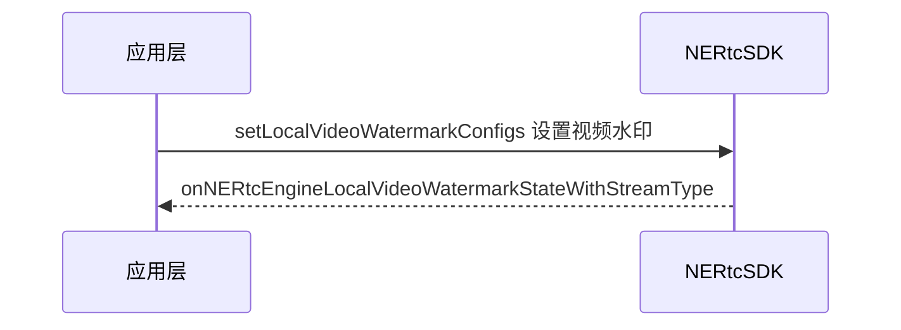

<!--- keywords：实时音视频,水印,文字水印,图片水印,时间戳 -->

出于信息安全、版权声明、防伪、宣传等目的，您可以为视频流画面添加编码水印，例如添加公司名称、标语等文字水印、录制时间等时间戳水印、以及 logo 等图片水印。

在教育场景中，视频水印功能可以为教学课件设置版权方 Logo 等各种类型的水印；在金融场景中，为了保证业务员的操作规范性和服务质量、信息存档，需要对业务办理的全过程进行实时录制，并相应打上水印标识以实现防伪、记录等目的。

## 功能介绍

NERTC SDK 支持以下三种视频水印设置：

- 静态图片水印：使用图片作为水印。
- 文字水印：使用一段文字信息作为水印，支持设置字体和字号。
- 动态时间戳水印：使用当前时间戳作为水印，显示格式为 “yyyy-MM-dd HH:mm:ss"。

## 前提条件
- V5.5.0 之前的版本，请**联系网易云信技术支持，开通视频水印**功能。
- V5.5.0 及之后版本，您可以**直接使用视频水印功能，无需人工开通**。

## 注意事项

- 视频水印相关方法作用于发布的视频流，并非画布；当画布被移除时，水印也不会自动移除。因此，对视频流截图时，图片里显示水印。
- 每次仅支持设置单个视频水印，再次调用 [`setLocalVideoWatermarkConfigs`](https://doc.yunxin.163.com/nertc/api-refer/iOS/doxygen/Latest/zh/html/protocol_i_n_e_rtc_engine_ex-p.html#aee1888b44bee053175ac294d2db758dd) 方法设置视频水印时，会覆盖之前的水印设置。
- 设置镜像模式时，水印不受镜像效果影响。
- V5.3.0 版本开始不再支持画布水印相关接口（ [`setLocalCanvasWatermarkConfigs`](https://doc.yunxin.163.com/nertc/api-refer/iOS/doxygen/Latest/zh/html/protocol_i_n_e_rtc_engine_ex-p.html#a2e832fd67add8c0357f84938dcb4ec17) 和 [`setRemoteCanvasWatermarkConfigs`](https://doc.yunxin.163.com/nertc/api-refer/iOS/doxygen/Latest/zh/html/protocol_i_n_e_rtc_engine_ex-p.html#aad46550d78cf02e6de362009f87f5588) ），建议您使用本文中的编码水印，编码水印可以从源头保证数据的真实性。

## API时序图



## <span id="图片水印">**设置图片水印**</span>

1. 调用 [`setLocalVideoWatermarkConfigs`](https://doc.yunxin.163.com/nertc/api-refer/iOS/doxygen/Latest/zh/html/protocol_i_n_e_rtc_engine_ex-p.html#aee1888b44bee053175ac294d2db758dd) 方法设置视频水印，水印在本地视频预览与视频通话过程中均生效。调用此方法时，您需要设置 `type` 和 `config` 参数，相关参数的说明如下表所示。

|<div style="width:50px">参数</div> | 描述
|---- | -------------- 
|type | 设置显示水印的视频流类型，可以设置为主流（`kNERtcStreamChannelTypeMainStream`）或辅流（`kNERtcStreamChannelTypeSubStream`）。
|config| 设置视频水印的类型，图片水印的参数设置如下：<br>|\
| |设置 [`watermarkType`](https://doc.yunxin.163.com/nertc/api-refer/iOS/doxygen/Latest/zh/html/interface_n_e_rtc_video_watermark_config.html)  参数为 **`kNERtcVideoWatermarkTypeImage`**，并通过 `imageWaterMark` 参数配置图片水印。|

图片水印 `imageWaterMark` 详细的参数说明如下表所示。


| 参数 	| 参数说明 	|
|---	|---	|
| fps 	| 播放帧率。 <br>取值范围为 0 ~ 30，默认值为 0，表示不自动切换图片。 <note type="note">若您设置的播放帧率高于视频流的帧率，则按照视频流帧率切换图片。</note>	|
| loop 	| 是否设置循环。 <br>默认值为 true，表示循环。若设置为 false ，则水印图片组播放完毕后消失。 	|
| imagePaths 	| 图片绝对路径。<note type="note">如果图片读取需要权限，请先向系统申请相关权限。</note> <br>支持 PNG 和 JPG 格式的图片，支持设置最多 10 张图片。 	|
| wmAlpha 	| 整体水印透明度。 <br>取值范围为 0.0 ~ 1.0，默认值为 1.0，表示不透明。 	|
| wmWidth 	| 水印框的宽度。 <br>单位为像素（pixel），默认值为 0，表示按原始图宽。 <note type="note"><ul><li>若您设置了水印框的宽度和高度，图片将缩放至水印框的宽高尺寸。<li>若您未设置水印框的宽高，图片将按原始尺寸展示，但当原始尺寸大于视频画面尺寸时，图片将缩放至视频画面尺寸。</note> 	|
| wmHeight 	| 水印框的高度。 <br>单位为像素（pixel），默认值为 0，表示按原始图高。 	|
| offsetX 	| 图片左上角与视频画布左上角的水平距离。<br>单位为像素（pixel），默认值为 0。 详细说明请参考<a href="#设置水印位置">设置水印位置</a>。	|
| offsetY 	| 图片左上角与视频画布左上角的垂直距离。<br>单位为像素（pixel），默认值为 0。 	|


::: note note
- 此接口设置在通话结束后仍然有效，直至销毁 SDK。
- 图片水印的图片大小不能超过 640*360 px。
- 设置 config 为 nil 时，表示取消水印。
- 若您成功设置水印后再次调整水印参数，但出现传参错误，SDK 会取消上一次水印并返回 [`onNERtcEngineLocalVideoWatermarkStateWithStreamType`](https://doc.yunxin.163.com/nertc/api-refer/iOS/doxygen/Latest/zh/html/protocol_n_e_rtc_engine_delegate_ex-p.html#a01bc56d2f70ea66e00391e698937a131) 水印状态回调。
- 设置添加图片水印后，若 SDK 返回 30003，可能有以下原因：
    - 没有传入任何图片或者图片张数大于 10。
    - wmAlpha 参数（整体透明度）的值小于 0 或大于 1。
:::

2. 启用该方法后，SDK 会触发水印启用成功与否的 [`onNERtcEngineLocalVideoWatermarkStateWithStreamType`](https://doc.yunxin.163.com/nertc/api-refer/iOS/doxygen/Latest/zh/html/protocol_n_e_rtc_engine_delegate_ex-p.html#a01bc56d2f70ea66e00391e698937a131)  回调，并提供相关错误原因说明，具体请参考 <a href="https://doc.yunxin.163.com/nertc/api-refer/iOS/doxygen/Latest/zh/html/_n_e_rtc_engine_enum_8h.html#a5d593c05e30a0eb42c784e00feb62424" target="_blank">` NERtcLocalVideoWatermarkState`</a>。


    ::: note note
    如果状态码提示设备不支持，请联系网易云信技术支持获取帮助。
    :::


**示例代码**

```
//图片水印
NERtcStreamChannelType streamType = kNERtcStreamChannelTypeMainStream;

NERtcVideoWatermarkConfig *watermarkConfig = [[NERtcVideoWatermarkConfig alloc] init];
NERtcVideoWatermarkImageConfig *imageConfig = [[NERtcVideoWatermarkImageConfig alloc] init];
imageConfig.wmAlpha = 1;
imageConfig.wmWidth = 0;
imageConfig.wmHeight = 0;
imageConfig.offsetX = 0;
imageConfig.offsetY = 0;
imageConfig.imagePaths = @[@"water1.png", @"water2.png"];
imageConfig.fps = 0;
imageConfig.loop = YES;

watermarkConfig.watermarkType = kNERtcVideoWatermarkTypeImage;
watermarkConfig.imageWatermark = imageConfig;
[[NERtcEngine sharedEngine] setLocalVideoWatermarkConfigs:watermarkConfig withStreamType:streamType];
```

## <span id="文字水印">**设置文字水印**</span>

::: note important
只能添加 1 个文字水印。
:::


1. 调用 [`setLocalVideoWatermarkConfigs`](https://doc.yunxin.163.com/nertc/api-refer/iOS/doxygen/Latest/zh/html/protocol_i_n_e_rtc_engine_ex-p.html#aee1888b44bee053175ac294d2db758dd) 方法设置视频水印，水印在本地视频预览与视频通话过程中均生效。调用此方法时，您需要设置 `type` 和 `config` 参数，相关参数的说明如下表所示。

|<div style="width:50px">参数</div> | 描述
|---- | -------------- 
|type | 设置显示水印的视频流类型，可以设置为主流（`kNERtcStreamChannelTypeMainStream`）或辅流（`kNERtcStreamChannelTypeSubStream`）。
|config| 设置视频水印的类型，文字水印的参数设置如下：<br>|\
| | 设置 [`watermarkType`](https://doc.yunxin.163.com/nertc/api-refer/iOS/doxygen/Latest/zh/html/interface_n_e_rtc_video_watermark_config.html)  参数为 **`kNERtcVideoWatermarkTypeText`**，并通过 `textWaterMark` 参数配置文字水印。|


`textWatermark`的参数说明如下表所示。

| 参数 	| 参数说明 	|
|---	|---	|
| content 	| 指定文字水印内容。<br>设置为空时，表示不添加文字水印。 <note type="note"><ul><li> 文字水印的字符串长度没有限制。最终显示受字体大小和水印框大小的影响，超出水印框的部分不显示。<li>文字水印支持自动换行，当文字内容长度超过水印框宽度时，会自动换行。<note>	|
| fontName 	| 字体文件的名称。 如果系统或应用中未安装该字体，则使用系统默认字体。	|
| fontSize 	| 字体大小。<br>单位为像素（pixel），默认值为 15。 	|
| fontColor 	| 字体颜色。<br>格式为 ARGB，默认值为 0xFFFFFFFF，即白色。 	|
| wmAlpha 	| 整体水印透明度。 <br>取值范围为 0.0 ~ 1.0，默认值为 1.0，表示不透明。 	|
| wmWidth 	| 水印框的宽度。 <br>单位为像素（pixel），默认值为 0，表示没有水印框。 	|
| wmHeight 	| 水印框的高度。 <br>单位为像素（pixel），默认值为 0，表示没有水印框。 	|
| wmColor 	| 水印框内背景颜色。 <br>仅支持 ARGB 格式，默认值为 0x88888888，即灰色。支持透明度设置。 	|
| offsetX 	| 水印框左上角与视频画布左上角的水平距离。 <br>单位为像素（pixel），默认值为 0。 	|
| offsetY 	| 水印框左上角与视频画布左上角的垂直距离。 <br>单位为像素（pixel），默认值为 0。 	|


::: note note
- 此接口设置在通话结束后仍然有效，直至销毁 SDK。
- 设置 config 为 nil 时，表示取消水印。
- 若您成功设置水印后再次调整水印参数，但出现传参错误，SDK 会取消上一次水印并返回 [`onNERtcEngineLocalVideoWatermarkStateWithStreamType`](https://doc.yunxin.163.com/nertc/api-refer/iOS/doxygen/Latest/zh/html/protocol_n_e_rtc_engine_delegate_ex-p.html#a01bc56d2f70ea66e00391e698937a131) 水印状态回调。
- 设置添加文字水印后，若 SDK 返回 30003，可能有以下原因：
    - 文字水印内容为空。
    - 字体文件的路径为空。
    - wmAlpha 参数（整体透明度）的值小于 0 或大于 1。
:::


2. 启用该方法后，SDK 会触发水印启用成功与否的 [`onNERtcEngineLocalVideoWatermarkStateWithStreamType`](https://doc.yunxin.163.com/nertc/api-refer/iOS/doxygen/Latest/zh/html/protocol_n_e_rtc_engine_delegate_ex-p.html#a01bc56d2f70ea66e00391e698937a131)  回调，并提供相关错误原因说明，具体请参考 <a href="https://doc.yunxin.163.com/nertc/api-refer/iOS/doxygen/Latest/zh/html/_n_e_rtc_engine_enum_8h.html#a5d593c05e30a0eb42c784e00feb62424" target="_blank">` NERtcLocalVideoWatermarkState`</a>。


    ::: note note
    如果状态码提示设备不支持，请联系网易云信技术支持获取帮助。
    :::


**示例代码**
```
//文字水印
NERtcStreamChannelType streamType = kNERtcStreamChannelTypeMainStream;

NERtcVideoWatermarkConfig *watermarkConfig = [[NERtcVideoWatermarkConfig alloc] init];
NERtcVideoWatermarkTextConfig *textConfig = [[NERtcVideoWatermarkTextConfig alloc] init];
textConfig.content = @"content";
textConfig.fontName = @"font.ttf";
textConfig.fontColor = 0xFFFFFFFF;
textConfig.fontSize = 15;
textConfig.wmAlpha = 1;
textConfig.wmColor = 0x88888888;
textConfig.wmWidth = 0;
textConfig.wmHeight = 0;
textConfig.offsetX = 0;
textConfig.offsetY = 0;

watermarkConfig.watermarkType = kNERtcVideoWatermarkTypeText;
watermarkConfig.textWatermark = textConfig;
[[NERtcEngine sharedEngine] setLocalVideoWatermarkConfigs:watermarkConfig withStreamType:streamType];
```

## <span id="时间戳水印">**设置时间戳水印**</span>

::: note important
- 只能添加 1 个时间戳水印。
- 时间戳水印的时间和当前时间相同，且实时变化。
:::


1. 调用 [`setLocalVideoWatermarkConfigs`](https://doc.yunxin.163.com/nertc/api-refer/iOS/doxygen/Latest/zh/html/protocol_i_n_e_rtc_engine_ex-p.html#aee1888b44bee053175ac294d2db758dd) 方法设置视频水印，水印在本地视频预览与视频通话过程中均生效。调用此方法时，您需要设置 `type` 和 `config` 参数，相关参数的说明如下表所示。

|<div style="width:50px">参数</div> | 描述
|---- | -------------- 
|type | 设置显示水印的视频流类型，可以设置为主流（`kNERtcStreamChannelTypeMainStream`）或辅流（`kNERtcStreamChannelTypeSubStream`）。
|config| 设置视频水印的类型，时间戳水印的参数设置如下：<br>|\
| | 设置 [`watermarkType`](https://doc.yunxin.163.com/nertc/api-refer/iOS/doxygen/Latest/zh/html/interface_n_e_rtc_video_watermark_config.html)  参数为 **`kNERtcVideoWatermarkTypeTimeStamp`**，并通过 `timestampWaterMark` 参数配置时间戳水印。

`timestampWaterMark` 参数说明如下表所示。


| 参数 	| 说明 	|
|---	|---	|
| fontName 	| 字体文件的名称。如果系统或应用中未安装该字体，则使用系统默认字体。 	|
| fontSize 	| 字体大小。 <br>单位为像素（pixel），默认值为 15。 	|
| fontColor 	| 字体颜色。 <br>默认值为 0xFFFFFFFF，即白色。 	|
| wmAlpha 	| 整体水印透明度。 <br>取值范围为 0.0 ~ 1.0，默认值为 1.0，表示不透明。 	|
| wmWidth 	| 水印框的宽度。 <br>单位为像素（pixel），默认值为 0 表示没有水印框。 	|
| wmHeight 	| 水印框的高度。 <br>单位为像素（pixel），默认值为 0 表示没有水印框。 	|
| wmColor 	| 水印框内背景颜色。 <br>仅支持 ARGB 格式，默认值为 0x88888888，即灰色。支持透明度设置。 	|
| offsetX 	| 水印框左上角与视频画布左上角的水平距离。 <br>单位为像素（pixel），默认值为 0。<br>详细说明请参考<a href="#设置水印位置">设置水印位置</a>。 	|
| offsetY 	| 水印框左上角与视频画布左上角的垂直距离。 <br>单位为像素（pixel），默认值为 0。 	|


::: note note
- 此接口设置在通话结束后仍然有效，直至销毁 SDK。
- 设置 config 为 nil 时，表示取消水印。
- 若您成功设置水印后再次调整水印参数，但出现传参错误，SDK 会取消上一次水印并返回 [`onNERtcEngineLocalVideoWatermarkStateWithStreamType`](https://doc.yunxin.163.com/nertc/api-refer/iOS/doxygen/Latest/zh/html/protocol_n_e_rtc_engine_delegate_ex-p.html#a01bc56d2f70ea66e00391e698937a131) 水印状态回调。
- 设置添加时间戳水印后，若 SDK 返回 30003，可能有以下原因：
    - 字体文件的路径为空。
    - wmAlpha 参数（整体透明度）的值小于 0 或大于 1。
:::


2. 启用该方法后，SDK 会触发水印启用成功与否的 [`onNERtcEngineLocalVideoWatermarkStateWithStreamType`](https://doc.yunxin.163.com/nertc/api-refer/iOS/doxygen/Latest/zh/html/protocol_n_e_rtc_engine_delegate_ex-p.html#a01bc56d2f70ea66e00391e698937a131)  回调，并提供相关错误原因说明，具体请参考 <a href="https://doc.yunxin.163.com/nertc/api-refer/iOS/doxygen/Latest/zh/html/_n_e_rtc_engine_enum_8h.html#a5d593c05e30a0eb42c784e00feb62424" target="_blank">` NERtcLocalVideoWatermarkState`</a>。


    ::: note note
    如果状态码提示设备不支持，请联系网易云信技术支持获取帮助。
    :::

**示例代码**
```
//时间戳水印
NERtcStreamChannelType streamType = kNERtcStreamChannelTypeMainStream;

NERtcVideoWatermarkConfig *watermarkConfig = [[NERtcVideoWatermarkConfig alloc] init];
NERtcVideoWatermarkTimestampConfig *timeStampConfig = [[NERtcVideoWatermarkTimestampConfig alloc] init];
timeStampConfig.fontName = @"font.ttf";
timeStampConfig.fontColor = 0xFFFFFFFF;
timeStampConfig.fontSize = 15;
timeStampConfig.wmAlpha = 1;
timeStampConfig.wmColor = 0x88888888;
timeStampConfig.wmWidth = 0;
timeStampConfig.wmHeight = 0;
timeStampConfig.offsetX = 0;
timeStampConfig.offsetY = 0;

watermarkConfig.watermarkType = kNERtcVideoWatermarkTypeTimeStamp;            
watermarkConfig.timestampWatermark = timeStampConfig;
[[NERtcEngine sharedEngine] setLocalVideoWatermarkConfigs:watermarkConfig withStreamType:streamType];
```

## 相关参考

### <span id="设置水印位置">设置水印位置</span>

添加水印时，可以通过 offsetX、offsetY、wmWidth 和 wmHeight 设置水印的位置和区域大小。


### API 参考

| **方法** | **功能描述**|
|:--|:--|
|[`setLocalVideoWatermarkConfigs`](https://doc.yunxin.163.com/nertc/api-refer/iOS/doxygen/Latest/zh/html/protocol_i_n_e_rtc_engine_ex-p.html#aee1888b44bee053175ac294d2db758dd)|设置水印|
|[`onNERtcEngineLocalVideoWatermarkStateWithStreamType`](https://doc.yunxin.163.com/nertc/api-refer/iOS/doxygen/Latest/zh/html/protocol_n_e_rtc_engine_delegate_ex-p.html#a01bc56d2f70ea66e00391e698937a131)|是否成功设置水印的回调通知|
