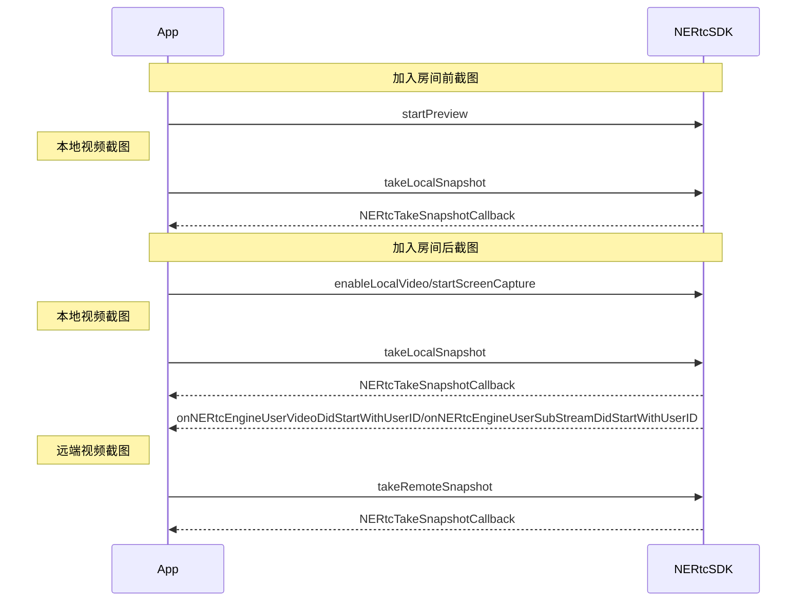

<!--keywords:音视频通话,视频截图-->

在音视频通话场景中，部分用户希望可以通过视频截图功能截取实时视频流画面，以便后续的存档分析、事件备忘、证据留存等等。NERTC SDK 提供视频截图功能，本文档为您介绍如何通过 <a href="https://doc.yunxin.163.com/nertc/api-refer/iOS/doxygen/Latest/zh/html/protocol_i_n_e_rtc_engine_ex-p.html#a893c16a3792b3a694c7317860c994aa8" target="_blank">`takeLocalSnapshot`</a> 和 <a href="https://doc.yunxin.163.com/nertc/api-refer/iOS/doxygen/Latest/zh/html/protocol_i_n_e_rtc_engine_ex-p.html#a2e239c92b90284905d103a601419fa6c" target="_blank">`takeRemoteSnapshot`</a> 方法进行实时截图。

## 功能介绍

NERTC SDK 支持针对实时视频流进行截图，包括本地主流和辅流画面、远端主流和辅流画面。
<br>视频截图适用于在线教育以及主播直播等场景中，具体场景说明如下。
- 在线课堂场景中，学生对课件或板书内容进行截图，截图作为笔记保存；
- 互动直播场景中，可以通过截图对直播画面进行内容安全审核。

## 注意事项
- 视频截图功能只截取实时视频流数据，截图中**不包含画布水印**信息，但可以<b>包含<a href="/docs/jcyOTA0ODM/Tc1MjY0Njc" target="_blank">编码水印</a></b>信息。
- 截图相关接口调用时机如下，如果在其他时机调用截图相关接口，会报 30005 错误码，表示当前不支持该操作。

## 实现方法

### API 调用时序



### 配置步骤

1. 根据需求调用截图相关接口，实现视频流截图。

- 本地视频主流截图：

    - 加入房间前，在调用 <a href="https://doc.yunxin.163.com/nertc/api-refer/iOS/doxygen/Latest/zh/html/protocol_i_n_e_rtc_engine_ex-p.html#a39334f2aeb02faba230d81afcda1e807" target="_blank">`startPreview(kNERtcStreamChannelTypeMainStream)`</a> 方法开启视频预览后，调用 <a href="https://doc.yunxin.163.com/nertc/api-refer/iOS/doxygen/Latest/zh/html/protocol_i_n_e_rtc_engine_ex-p.html#a893c16a3792b3a694c7317860c994aa8" target="_blank">`takeLocalSnapshot`</a>  方法，并设置 `NERtcStreamChannelType` 为 `kNERtcStreamChannelTypeMainStream` 截取本地主流画面。

    ::: note note
    - V5.3.1 及之后版本支持加入房间前，对本地视频进行截图。
    - V5.3 之前版本只支持加入房间后，对本地视频进行截图。
    :::


  
    - 加入房间后，调用 <a href="https://doc.yunxin.163.com/nertc/api-refer/iOS/doxygen/Latest/zh/html/protocol_i_n_e_rtc_engine-p.html#a9f13beb56a8b9fdfbc856d304c0d10cb" target="_blank">`enableLocalVideo(kNERtcStreamChannelTypeMainStream)`</a> 开启本地摄像头采集后，调用 <a href="https://doc.yunxin.163.com/nertc/api-refer/iOS/doxygen/Latest/zh/html/protocol_i_n_e_rtc_engine_ex-p.html#a893c16a3792b3a694c7317860c994aa8" target="_blank">`takeLocalSnapshot`</a> 方法，并设置 `NERtcStreamChannelType` 为 `kNERtcStreamChannelTypeMainStream` 截取本地主流画面。

- 本地视频辅流截图：
    - 加入房间前，在调用 <a href="https://doc.yunxin.163.com/nertc/api-refer/iOS/doxygen/Latest/zh/html/protocol_i_n_e_rtc_engine_ex-p.html#a39334f2aeb02faba230d81afcda1e807" target="_blank">`startPreview(kNERtcStreamChannelTypeSubStream)`</a> 方法开启视频预览后，调用 <a href="https://doc.yunxin.163.com/nertc/api-refer/iOS/doxygen/Latest/zh/html/protocol_i_n_e_rtc_engine_ex-p.html#a893c16a3792b3a694c7317860c994aa8" target="_blank">`takeLocalSnapshot`</a>  方法，并设置 `NERtcStreamChannelType` 为 `kNERtcStreamChannelTypeSubStream` 截取本地辅流画面。
    ::: note note
    - V5.3.1 及之后版本支持加入房间前，对本地视频进行截图。
    - V5.3 之前版本只支持加入房间后，对本地视频进行截图。
    :::

    - 加入房间后，在调用 <a href="https://doc.yunxin.163.com/nertc/api-refer/iOS/doxygen/Latest/zh/html/protocol_i_n_e_rtc_engine-p.html#a9f13beb56a8b9fdfbc856d304c0d10cb" target="_blank">`enableLocalVideo(kNERtcStreamChannelTypeSubStream)`</a> 开启本地摄像头采集后，调用 <a href="https://doc.yunxin.163.com/nertc/api-refer/iOS/doxygen/Latest/zh/html/protocol_i_n_e_rtc_engine_ex-p.html#a893c16a3792b3a694c7317860c994aa8" target="_blank">`takeLocalSnapshot`</a> 方法，并设置 `NERtcStreamChannelType` 为 `kNERtcStreamChannelTypeSubStream` 截取本地辅流画面。

    - 加入房间后，在调用 <a href="https://doc.yunxin.163.com/nertc/api-refer/iOS/doxygen/Latest/zh/html/protocol_i_n_e_rtc_engine_ex-p.html#a25c7be1553ff31a7a79d8ac314834601" target="_blank">`startScreenCapture`</a> 方法启用屏幕共享后，调用 <a href="https://doc.yunxin.163.com/nertc/api-refer/iOS/doxygen/Latest/zh/html/protocol_i_n_e_rtc_engine_ex-p.html#a893c16a3792b3a694c7317860c994aa8" target="_blank">`takeLocalSnapshot`</a> 方法，并设置 `NERtcStreamChannelType` 为 `kNERtcStreamChannelTypeSubStream` 截取本地辅流画面。

- 远端视频主/辅流截图：

    在分别收到 <a href="https://doc.yunxin.163.com/nertc/api-refer/iOS/doxygen/Latest/zh/html/protocol_n_e_rtc_engine_delegate-p.html#af6c2cb5c852c8890728389b98d1f0f3e" target="_blank">`onNERtcEngineUserVideoDidStartWithUserID`</a> 与 <a href="https://doc.yunxin.163.com/nertc/api-refer/iOS/doxygen/Latest/zh/html/protocol_n_e_rtc_engine_delegate-p.html#a9f9cad3c1f480fd1a8ecc1f8b8e0c15b" target="_blank">`onNERtcEngineUserSubStreamDidStartWithUserID`</a> 回调后，调用 <a href="https://doc.yunxin.163.com/nertc/api-refer/iOS/doxygen/Latest/zh/html/protocol_i_n_e_rtc_engine_ex-p.html#a2e239c92b90284905d103a601419fa6c" target="_blank">`takeRemoteSnapshot`</a> 方法截取远端视频流画面，截图时可以通过 `NERtcStreamChannelType` 指定截取的视频流是主流还是辅流。

2. 通过回调的方式获取截图文件。

    截图画面数据以 UIImage 形式通过 <a href="https://doc.yunxin.163.com/nertc/api-refer/iOS/doxygen/Latest/zh/html/_i_n_e_rtc_engine_8h.html#a4d01dc68f1e86926b02ab167122e4fb1" target="_blank">`NERtcTakeSnapshotCallback`</a> 回调返回。

## 示例代码

```
  //本地画面截图
  [[NERtcEngine sharedEngine] takeLocalSnapshot:streamType callback:^(int errorCode, UIImage * _Nullable image) {
    if (image) {
      [NTESPhotoAlbumHelper saveImage:image];
    }
  }];
  
  //远端画面截图
  [[NERtcEngine sharedEngine] takeRemoteSnapshot:(NERtcStreamChannelType)streamType forUserID:user.userID callback:^(int errorCode, UIImage * _Nullable image) {
    if (image) {
     [NTESPhotoAlbumHelper saveImage:image];
    }
  }];       
```       

## API 参考
| **方法** | **功能描述**|
|:--|:--|
|<a href="" target="_blank">`enableLocalVideo`</a>|开启或关闭本地视频采集。|
|<a href="https://doc.yunxin.163.com/nertc/api-refer/iOS/doxygen/Latest/zh/html/protocol_i_n_e_rtc_engine_ex-p.html#a893c16a3792b3a694c7317860c994aa8" target="_blank">`takeLocalSnapshot`</a> |截取本地视频流画面|
|<a href="https://doc.yunxin.163.com/nertc/api-refer/iOS/doxygen/Latest/zh/html/protocol_i_n_e_rtc_engine_ex-p.html#a2e239c92b90284905d103a601419fa6c" target="_blank">`takeRemoteSnapshot`</a> |截取远端视频流画面|
|<a href="https://doc.yunxin.163.com/nertc/api-refer/iOS/doxygen/Latest/zh/html/_i_n_e_rtc_engine_8h.html#a4d01dc68f1e86926b02ab167122e4fb1" target="_blank">`NERtcTakeSnapshotCallback`</a>|截图结果 block 回调|

