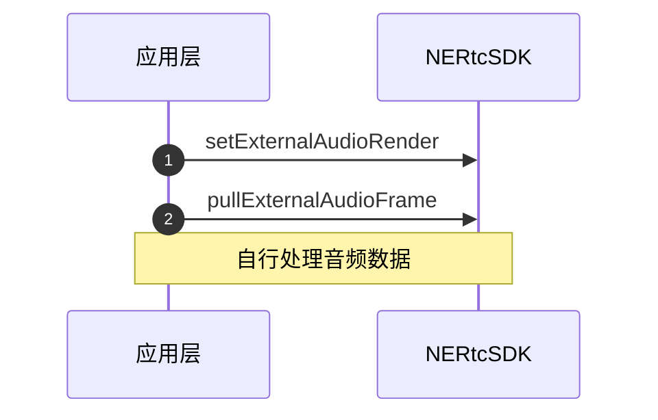

<!--keywords:音视频通话,自定义音频采集,自定义音频渲染,音频辅流 -->

在合唱或直播场景中，用户往往需要共享非麦克风采集的外部音频源，比如希望在合唱过程中使用自定义的音乐文件。为了支持用户使用自定义音频源， NERTC SDK 为用户提供传输通道，并进行编码推流。

## 功能介绍
NERTC SDK 支持自定义音频采集与渲染功能，可以向 NERTC SDK 提供自定义的音频输入源数据，使用自定义的渲染器，并由 NERTC SDK 进行编码推流。
<br>一般情况下，App 通过本设备的内置麦克风采集音频数据。但在部分场景下可能需要使用自定义的音频源，例如：
- 需要使用自定义的音效、美声库或前处理库。
- 需要使用外部音频源或外接设备进行音频数据采集，例如在音视频通话或互动直播中播放自定义的音频文件。
- App 无法获取音频采集设备的控制权限，例如音频采集设备已被其他业务占用，或硬件设备的默认音频采集模块损坏等场景下。
<br>基于以上场景，NERTC SDK 支持使用自定义的音频源或渲染器，以实现业务场景中的相关需求。

## 注意事项

- 自定义音频采集场景中，您需要自行管理音频数据的采集和处理；自定义音频渲染场景中，您需要自行管理音频数据的处理和播放。在两种场景下，音频处理 3A 算法（AEC、ANS 和 AGC）均为关闭状态，不可手动开启。
- 若您需要开启外部音频采集，建议在创建外部音频输入源之前调用 <a href="https://doc.yunxin.163.com/nertc/api-refer/iOS/doxygen/Latest/zh/html/protocol_i_n_e_rtc_engine-p.html#a1370eda8c43b36f5764cb96ed927f98d" target="_blank">`enableLocalAudio`</a> 或 <a href="https://doc.yunxin.163.com/nertc/api-refer/iOS/doxygen/Latest/zh/html/protocol_i_n_e_rtc_engine_ex-p.html#adaba86b871e0740fd1316b9011c998a1" target="_blank">`enableLocalSubStreamAudio`</a> 方法关闭本地音频设备采集（若未打开则无需关心），再在创建外部音频输入源之后再次调用 <a href="https://doc.yunxin.163.com/nertc/api-refer/iOS/doxygen/Latest/zh/html/protocol_i_n_e_rtc_engine-p.html#a1370eda8c43b36f5764cb96ed927f98d" target="_blank">`enableLocalAudio`</a> 或 <a href="https://doc.yunxin.163.com/nertc/api-refer/iOS/doxygen/Latest/zh/html/protocol_i_n_e_rtc_engine_ex-p.html#adaba86b871e0740fd1316b9011c998a1" target="_blank">`enableLocalSubStreamAudio`</a> 方法开启媒体传输通道。
- 通过 <a href="https://doc.yunxin.163.com/nertc/api-refer/iOS/doxygen/Latest/zh/html/protocol_i_n_e_rtc_engine_ex-p.html#a85c7c1e75142c80c4cbae5d2c4049d49" target="_blank">`pushExternalAudioFrame`</a> 或 <a href="https://doc.yunxin.163.com/nertc/api-refer/iOS/doxygen/Latest/zh/html/protocol_i_n_e_rtc_engine_ex-p.html#a5176e4b9526c8a928c900bc98df585cb" target="_blank">`pushExternalSubStreamAudioFrame`</a> 接口向 SDK 投送的数据必须是 PCM 格式的未经压缩的音频裸数据，不支持其他压缩格式。
- 若您需要开启外部音频渲染，请在加入房间前调用 <a href="https://doc.yunxin.163.com/nertc/api-refer/iOS/doxygen/Latest/zh/html/protocol_i_n_e_rtc_engine_ex-p.html#a551f4e3cc45976cc1a599275cd89e6d7" target="_blank">`setExternalAudioRender`</a> 方法，此设置在通话结束后自动恢复至默认值。
- 建议同时使用自定义音频采集和音频渲染功能，此时您需要自行维护 AVAudioSession 的设置，即通过 <a href="https://doc.yunxin.163.com/nertc/api-refer/iOS/doxygen/Latest/zh/html/protocol_i_n_e_rtc_engine_ex-p.html#a037df8f9a46eb2687a2699fcebfd5d92" target="_blank">`setAudioSessionOperationRestriction`</a> 设置 SDK 对 AVAudioSession 的操作权限为 `kNERtcAudioSessionOperationRestrictionAll`。

## 自定义音频采集

### **技术原理**


### **API 调用时序**

  ```mermaid
  sequenceDiagram
      autonumber
      participant 应用层
      participant NERtcSDK

      
      应用层->>NERtcSDK: setExternalAudioSource/setExternalSubStreamAudioSource
      应用层->>NERtcSDK: enableLocalAudio/enableLocalSubStreamAudio
      Note over 应用层, NERtcSDK: 自行处理音频数据
      应用层->>NERtcSDK:pushExternalAudioFrame/pushExternalSubStreamAudioFrame

  ```


### **配置步骤**
1. 在加入房间前，调用 <a href="https://doc.yunxin.163.com/nertc/api-refer/iOS/doxygen/Latest/zh/html/protocol_i_n_e_rtc_engine_ex-p.html#a06cdc885059f44ed69d5133739b11e20" target="_blank">`setExternalAudioSource`</a> 方法开启外部音频主流输入或调用 <a href="https://doc.yunxin.163.com/nertc/api-refer/iOS/doxygen/Latest/zh/html/protocol_i_n_e_rtc_engine_ex-p.html#a5711b8888f59a172dd1dae5ecac9f210" target="_blank">`setExternalSubStreamAudioSource`</a> 方法开启外部音频辅流输入，并设置外部音频采集参数，相关参数说明如下：
    - enabled：是否开启外部音频输入，默认关闭。
    - sample_rate：外部音频源的数据采样率，单位为赫兹（Hz）。
    - channels：外部音频源的数据声道数，可设置为单声道（1）或双声道（2）。
    ::: note note
    - 自定义外部音频采集接口支持在通话过程中动态调用，接口设置在通话结束后仍然有效；若您需要关闭该功能，请在下次通话前再次调用此方法关闭自定义音频采集。
    - 暂不支持同时开启外部音频主、辅流输入。
    :::
2. 调用 <a href="https://doc.yunxin.163.com/nertc/api-refer/iOS/doxygen/Latest/zh/html/protocol_i_n_e_rtc_engine-p.html#a1370eda8c43b36f5764cb96ed927f98d" target="_blank">`enableLocalAudio`</a> 或 <a href="https://doc.yunxin.163.com/nertc/api-refer/iOS/doxygen/Latest/zh/html/protocol_i_n_e_rtc_engine_ex-p.html#adaba86b871e0740fd1316b9011c998a1" target="_blank">`enableLocalSubStreamAudio`</a> 方法开启媒体传输通道。 
    ::: note notice
    若您开启的是外部音频主流输入，请开启对应的媒体主流传输通道，辅流同理。
    :::
3. 成功加入房间之后，使用自采集模块采集音频数据。您需要自行管理音频数据采集和处理逻辑。
4. 完成音频数据处理后，调用 <a href="https://doc.yunxin.163.com/nertc/api-refer/iOS/doxygen/Latest/zh/html/protocol_i_n_e_rtc_engine_ex-p.html#a85c7c1e75142c80c4cbae5d2c4049d49" target="_blank">`pushExternalAudioFrame`</a> 方法将外部音频主流数据帧推送给 NERTC SDK，或调用 <a href="https://doc.yunxin.163.com/nertc/api-refer/iOS/doxygen/Latest/zh/html/protocol_i_n_e_rtc_engine_ex-p.html#a5176e4b9526c8a928c900bc98df585cb" target="_blank">`pushExternalSubStreamAudioFrame`</a> 推送外部音频辅流数据帧，并设置外部音频格式。
    ::: note note
    - 建议推送的音频数据帧时长至少为 10 ms。
    - `samplesPerChannel` 指单通道的采样点个数，计算公式为 sampleRate * （time）/ 1000，其中 time 是推送给 SDK 的音频数据的时间间隔，比如一次是 20ms 的数据，则 time = 20。
    :::

### **示例代码**

```
//开启自定义音频主流采集
[NERtcEngine sharedEngine] setExternalAudioSource:YES sampleRate:48000 channels:1];
NERtcAudioFrame *frame = [[NERtcAudioFrame alloc] init];
NERtcAudioFormat *format = [[NERtcAudioFormat alloc] init];
frame.data = data;                  //音频裸数据
frame.format = format;              //音频格式
frame.syncTimeStamp = -1;           //同步音频主辅流时间戳
format.type = kNERtcAudioTypePCM16; //音频 PCM 类型
format.bytesPerSample = 2;          //每个采样点的字节数
format.channels = 1;                //音频声道数
format.sampleRate = 48000;          //音频采样率
format.samplesPerChannel = format.sampleRate / (1000 / 10); //单声道的采样点个数，假设采样周期是10 ms
[[NERtcEngine sharedEngine] pushExternalAudioFrame:frame];

//开启自定义音频辅流采集
[NERtcEngine sharedEngine] setExternalSubStreamAudioSource:YES sampleRate:48000 channels:1];
NERtcAudioFrame *frame = [[NERtcAudioFrame alloc] init];
NERtcAudioFormat *format = [[NERtcAudioFormat alloc] init];
frame.data = data;                  //音频裸数据
frame.format = format;              //音频格式
frame.syncTimeStamp = -1;           //同步音频主辅流时间戳
format.type = kNERtcAudioTypePCM16; //音频 PCM 类型
format.bytesPerSample = 2;          //每个采样点的字节数
format.channels = 1;                //音频声道数
format.sampleRate = 48000;          //音频采样率
format.samplesPerChannel = format.sampleRate / (1000 / 10); //单声道的采样点个数，假设采样周期是10 ms
[[NERtcEngine sharedEngine] pushExternalSubStreamAudioFrame:frame];
```

### <span id="API 参考">API 参考</span>

| **方法** | **功能描述**|
|:--|:--|
|<a href="https://doc.yunxin.163.com/nertc/api-refer/iOS/doxygen/Latest/zh/html/protocol_i_n_e_rtc_engine_ex-p.html#adaba86b871e0740fd1316b9011c998a1" target="_blank">`enableLocalSubStreamAudio`</a>|开启音频辅流|
|<a href="https://doc.yunxin.163.com/nertc/api-refer/iOS/doxygen/Latest/zh/html/protocol_i_n_e_rtc_engine_ex-p.html#a06cdc885059f44ed69d5133739b11e20" target="_blank">`setExternalAudioSource`</a>|开启自定义音频主流采集|
|<a href="https://doc.yunxin.163.com/nertc/api-refer/iOS/doxygen/Latest/zh/html/protocol_i_n_e_rtc_engine_ex-p.html#a5711b8888f59a172dd1dae5ecac9f210" target="_blank">`setExternalSubStreamAudioSource`</a>|开启自定义音频辅流采集|
|<a href="https://doc.yunxin.163.com/nertc/api-refer/iOS/doxygen/Latest/zh/html/protocol_i_n_e_rtc_engine_ex-p.html#a85c7c1e75142c80c4cbae5d2c4049d49" target="_blank">`pushExternalAudioFrame`</a>|将外部音频主流数据帧推送给 NERTC SDK|
|<a href="https://doc.yunxin.163.com/nertc/api-refer/iOS/doxygen/Latest/zh/html/protocol_i_n_e_rtc_engine_ex-p.html#a5176e4b9526c8a928c900bc98df585cb" target="_blank">`pushExternalSubStreamAudioFrame`</a>|将外部音频辅流数据帧推送给 NERTC SDK|

## 自定义音频渲染

### **API 调用时序**


  
### **配置步骤**

1. 在加入房间前，调用 <a href="https://doc.yunxin.163.com/nertc/api-refer/iOS/doxygen/Latest/zh/html/protocol_i_n_e_rtc_engine_ex-p.html#a551f4e3cc45976cc1a599275cd89e6d7" target="_blank">`setExternalAudioRender`</a> 方法开启外部音频渲染，并设置外部音频渲染参数，相关参数的说明如下：
    - enabled：是否开启外部音频输入，默认关闭。
    - sample_rate：外部音频源的数据采样率，单位为赫兹（Hz）。
    - channels：外部音频源的数据声道数，可设置为单声道（1）或双声道（2）。
    ::: note note
    此接口设置在通话结束后恢复至默认。
    :::
2. 成功加入房间后，调用 <a href="https://doc.yunxin.163.com/nertc/api-refer/iOS/doxygen/Latest/zh/html/protocol_i_n_e_rtc_engine_ex-p.html#a1499571dfbbd8505bc1353517d6b1536" target="_blank">`pullExternalAudioFrame`</a> 方法拉取远端发送的外部音频数据帧，相关参数的说明如下：
    - data：数据指针。
    - len：待拉取音频数据的字节数。该参数的单位为 byte，数据长度不能超过 7680 字节。
          <br>计算公式为： len = sampleRate/1000 × 2 × channels × 音频数据时长（ms）。
    ::: note note
    - 建议推送的音频数据帧时长至少为 10 ms。
    - 音频渲染设备关闭后，调用此方法时会返回空数据。例如在通话结束或通话前扬声器设备测试关闭等情况下，该设置不再生效。
    :::
3. 您需要自行渲染并播放拉取到的音频数据。

### **示例代码**

```
//开关自定义音频渲染，设置想要的数据采样率和声道，需加入房间前设置
//返回值succ为0则操作成功，否则操作失败
BOOL succ = [[NERtcEngine sharedEngine] setExternalAudioRender:enable sampleRate:48000 channels:1];
if(!succ) {
    //操作成功
}else {
    //操作失败，需要用户处理
}

//拉取音频数据
int audioDataSize = 1024;//申请的实际内存长度，用户根据采样数和声道，自行设置，建议稍大一点防止溢出
void *audioData = malloc(audioDataSize);
int succ = [[NERtcEngine sharedEngine] pullExternalAudioFrame:audioData length:audioDataSize];
if(succ != 0) {
    //拉取音频数据失败，建议填充静音数据
    memset(audioData, 0, audioDataSize);
}
```

### <span id="API 参考">API 参考</span>

| **方法** | **功能描述**|
|:--|:--|
|<a href="https://doc.yunxin.163.com/nertc/api-refer/iOS/doxygen/Latest/zh/html/protocol_i_n_e_rtc_engine_ex-p.html#a551f4e3cc45976cc1a599275cd89e6d7" target="_blank">`setExternalAudioRender`</a>|开启外部音频渲染|
|<a href="https://doc.yunxin.163.com/nertc/api-refer/iOS/doxygen/Latest/zh/html/protocol_i_n_e_rtc_engine_ex-p.html#a1499571dfbbd8505bc1353517d6b1536" target="_blank">`pullExternalAudioFrame`</a>|拉取远端发送的外部音频数据帧|