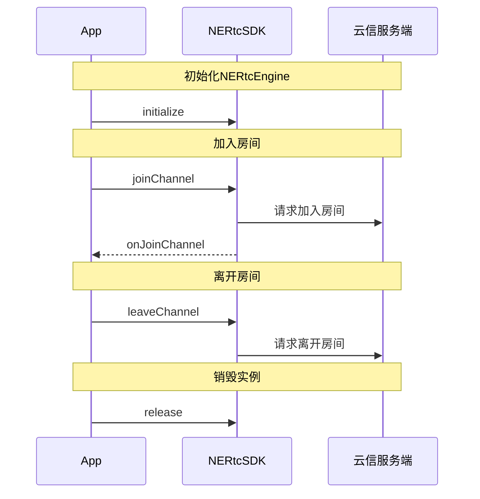
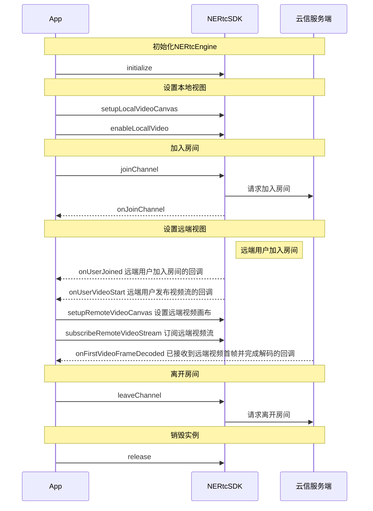

<!--和互动直播对应文档步骤不一致，请勿直接替换。相比互动直播文档，增加跑通示例代码、删除部分推流步骤-->

网易云信音视频通话产品的基本功能包括高质量的实时音视频通话。当您成功初始化 SDK 之后，您可以简单体验本产品的基本业务流程。本文档为您展示音视频通话提供的基本业务流程。

## <span id="前提条件">前提条件</span>
请确认您已完成以下操作：

- <a href="https://doc.yunxin.163.com/console/guide/TIzMDE4NTA?platform=console" target="_blank">创建应用并获取 App Key</a>。
- <a href="https://doc.yunxin.163.com/nertc/quick-start/zg3MTgwOTc" target="_blank">开通音视频通话 2.0 服务</a>。
- <a href="https://doc.yunxin.163.com/nertc/quick-start/DI3NDEyNDI" target="_blank">集成 SDK（macOS）</a>。


## 示例代码
::: details 实现音视频通话的示例代码

```
#ifndef NEENGINEMANAGER_H
#define NEENGINEMANAGER_H

#include <QObject>
#include "nertc_audio_device_manager.h"
#include "nertc_engine_defines.h"
#include "nertc_engine_ex.h"
#include "nertc_video_device_manager.h"

//using namespace nertc;
class NEEngineManager : public QObject,
public nertc::IRtcEngineEventHandlerEx//接口类用于向应用程序发送扩展回调通知
{
    Q_OBJECT
    
public:
    NEEngineManager(QObject* parent = nullptr);
    ~NEEngineManager();
    
public:
    nertc::IRtcEngineEx* coreEngine;//IRtcEngineEx 是 NERTC SDK 的扩展接口类。创建一个 IRtcEngine 对象并调用这个对象的方法可以激活 NERTC SDK 的通信功能
    
    int initialize();
    void cleanup();
    int joinChannel(const char* token, const char* channel_name, uint64_t uid);
    int leaveChannel();
    int setupLocalVideo(void* window, nertc::NERtcVideoScalingMode scaling_mode = nertc::kNERtcVideoScaleFit);
    int setupLocalSubVideo(void* hWnd, nertc::NERtcVideoScalingMode scaling_mode = nertc::kNERtcVideoScaleFit);
    int setupRemoteVideo(const uint64_t& uid,
                         void* window,
                         nertc::NERtcVideoScalingMode scaling_mode = nertc::kNERtcVideoScaleFit);
    int setupRemoteSubVideo(const uint64_t& uid,
                            void* hWnd,
                            nertc::NERtcVideoScalingMode scaling_mode = nertc::kNERtcVideoScaleFit);
    
    nertc::IAudioDeviceManager* audioDeviceManager();//接口类提供用于管理音频设备的相关接口。可通过实例化 IAudioDeviceManager 类来获取 IAudioDeviceManager 接口。
    nertc::IVideoDeviceManager* videoDeviceManager();//接口类提供用于管理视频设备的相关接口。可通过实例化 IVideoDeviceManager 类来获取 IVideoDeviceManager 接口。
    void setupVideoDevice();
    
    void onJoinChannel(nertc::channel_id_t cid,
                       nertc::uid_t uid,
                       nertc::NERtcErrorCode result,
                       uint64_t elapsed) override;
    void onLeaveChannel(nertc::NERtcErrorCode result) override;
    void onUserJoined(nertc::uid_t uid, const char* user_name) override;
    void onUserLeft(nertc::uid_t uid, nertc::NERtcSessionLeaveReason reason) override;
    void onUserVideoStart(nertc::uid_t uid, nertc::NERtcVideoProfileType max_profile) override;
    void onUserVideoStop(nertc::uid_t uid) override;
    void onUserSubStreamVideoStart(nertc::uid_t uid, nertc::NERtcVideoProfileType max_profile) override;
    void onUserSubStreamVideoStop(nertc::uid_t uid) override;
    void onScreenCaptureStatus(nertc::NERtcScreenCaptureStatus status) override;
    ////需要加的接口
    
    // Q_SIGNALS:
signals:
    // 加入频道结果
    void signal_onJoinChannel(const unsigned long long cid, const unsigned long long uid, const int result);
    void signal_onLeaveChannel(const int result);
    void signal_onUserJoined(const unsigned long long uid, const char* user_name);
    void signal_onUserLeft(const unsigned long long uid, const int& reason);
    void signal_onUserVideoStart(const unsigned long long uid, const int max_profile);
    void signal_onUserVideoStop(const unsigned long long uid);
    void signal_onUserSubVideoStarted(const unsigned long long uid, const int max_profile);
    void signal_onUserSubVideoStopped(const unsigned long long uid);
    void signal_onScreenCaptureStatus(const int& status);
};

#endif  // NEENGINEMANAGER_H


#include "ne_engine_manager.h"
#include "enginemanager.h"
#include <QCoreApplication>
#include <QDebug>
#include <QDir>
#include <QFile>
#include <QStandardPaths>
#include <QImage>

#define NERtcCheckCoreEngine \
    if (coreEngine == nullptr) { \
        return 0; \
    }

NEEngineManager::NEEngineManager(QObject* parent)
    : QObject(parent) {
    coreEngine = nullptr;
}

NEEngineManager::~NEEngineManager() {
    qDebug() << "NEEngineManager::~NEEngineManager";
}

int NEEngineManager::initialize() {
    nertc::NERtcEngineContext engine_context;
    memset(&engine_context, 0, sizeof(nertc::NERtcEngineContext));
    engine_context.app_key = Config::sharedInstance().appKey.c_str();
    
    QString app_dir = QStandardPaths::writableLocation(QStandardPaths::AppDataLocation);
    QByteArray byte_array_dir = app_dir.toUtf8();

    engine_context.log_dir_path = byte_array_dir.data();
    engine_context.log_level = nertc::kNERtcLogLevelInfo;
    engine_context.event_handler = this;
    engine_context.video_use_exnternal_render = false;

    qDebug() << "initialize log_level=" << engine_context.log_level << ", log_dir_path=" << engine_context.log_dir_path;

    if (coreEngine == nullptr) {
        coreEngine = (nertc::IRtcEngineEx*)createNERtcEngine();
    }

    int ret = coreEngine->initialize(engine_context);
    if (nertc::kNERtcNoError != ret) {
        qDebug() << "ERROR: Failed to initialize NERtc Engine";
    }

    return ret;
}

void NEEngineManager::cleanup() {
    if (coreEngine != nullptr) {
        coreEngine->release();
        void* engine = (void*)coreEngine;
        destroyNERtcEngine(engine);
        coreEngine = nullptr;
    }
}

int NEEngineManager::joinChannel(const char* token, const char* channel_name, uint64_t uid) {
    NERtcCheckCoreEngine
    int ret = coreEngine->joinChannel(token, channel_name, uid);
    return ret;
}

int NEEngineManager::leaveChannel() {
    NERtcCheckCoreEngine
    int ret = coreEngine->leaveChannel();
    return ret;
}

int NEEngineManager::setupLocalVideo(void* window, nertc::NERtcVideoScalingMode scaling_mode) {
    NERtcCheckCoreEngine
    nertc::NERtcVideoCanvas canvas;
    canvas.cb = nullptr;
    canvas.user_data = nullptr;
    canvas.window = window;
    canvas.scaling_mode = scaling_mode;

    int ret = coreEngine->setupLocalVideoCanvas(&canvas);
    if (ret) {
        qDebug() << "ERROR: Can not setup local video canvas! ERROR CODE:" << ret;
    }

    return ret;
}

int NEEngineManager::setupLocalSubVideo(void* hWnd, nertc::NERtcVideoScalingMode scaling_mode) {
    NERtcCheckCoreEngine
    nertc::NERtcVideoCanvas canvas;
    canvas.cb = nullptr;
    canvas.user_data = nullptr;
    canvas.window = hWnd;
    canvas.scaling_mode = scaling_mode;

    int ret = coreEngine->setupLocalSubStreamVideoCanvas(&canvas);
    if (ret) {
        qDebug() << "ERROR: Can not setup local sub video canvas! ERROR CODE:" << ret;
    }

    return ret;
}

int NEEngineManager::setupRemoteVideo(const uint64_t& uid, void* window, nertc::NERtcVideoScalingMode scaling_mode) {
    NERtcCheckCoreEngine
    nertc::NERtcVideoCanvas canvas;
    canvas.cb = nullptr;
    canvas.user_data = nullptr;
    canvas.window = window;
    canvas.scaling_mode = scaling_mode;

    int ret = coreEngine->setupRemoteVideoCanvas(uid, &canvas);
    if (ret) {
        qDebug() << "ERROR: Can not setup remote video canvas! ERROR CODE:" << ret;
    }

    return ret;
}

int NEEngineManager::setupRemoteSubVideo(const uint64_t& uid, void* hWnd, nertc::NERtcVideoScalingMode scaling_mode) {
    NERtcCheckCoreEngine
    nertc::NERtcVideoCanvas canvas;
    canvas.cb = nullptr;
    canvas.user_data = nullptr;
    canvas.window = hWnd;
    canvas.scaling_mode = scaling_mode;

    int ret = coreEngine->setupRemoteSubStreamVideoCanvas(uid, &canvas);
    if (ret) {
        qDebug() << "ERROR: Can not setup remote sub video canvas! ERROR CODE:" << ret;
    }

    return ret;
}

nertc::IAudioDeviceManager* NEEngineManager::audioDeviceManager() {
    NERtcCheckCoreEngine
    void* manager = nullptr;

    int errcode = coreEngine->queryInterface(nertc::kNERtcIIDAudioDeviceManager, &manager);//获取设备管理员对象的指针
    if (errcode != nertc::kNERtcNoError) {
        qDebug() << "ERROR: NEEngineManager::audioDeviceManager queryInterface error:" << errcode;
    }

    return (nertc::IAudioDeviceManager*)manager;
}

nertc::IVideoDeviceManager* NEEngineManager::videoDeviceManager() {
    NERtcCheckCoreEngine
    void* manager = nullptr;

    int errcode = coreEngine->queryInterface(nertc::kNERtcIIDVideoDeviceManager, &manager);
    if (errcode != nertc::kNERtcNoError) {
        qDebug() << "ERROR: NEEngineManager::videoDeviceManager queryInterface error:" << errcode;
    }

    return (nertc::IVideoDeviceManager*)manager;
}

void NEEngineManager::setupVideoDevice()
{
    if (!videoDeviceManager()) {
        return;
    }
    //IDeviceCollection 设备相关方法。此接口类获取设备相关的信息。
    nertc::IDeviceCollection * collection = videoDeviceManager()->enumerateCaptureDevices();//获取系统中所有的视频采集设备列表。该方法返回一个 IDeviceCollection 对象，包含系统中所有的音频采集设备。通过IDeviceCollection 对象，App 可以枚举视频采集设备。
    if (!collection) {
        //方法调用失败：NULL 。
        return;
    }
    
    if(collection->getCount() <= 0) {
        return;
    }
    
    char deviceID[kNERtcMaxDeviceIDLength] = {0};
    char deviceName[kNERtcMaxDeviceNameLength] = {0};
    nertc::NERtcErrorCode errCode = (nertc::NERtcErrorCode)collection->getDevice(0, deviceName, deviceID);//获取指定 index 的设备信息。
    if (errCode != nertc::kNERtcNoError) {
        return;
    }
    
    videoDeviceManager()->setDevice(deviceID);
}

//信令回调
void NEEngineManager::onJoinChannel(nertc::channel_id_t cid,
    nertc::uid_t uid,
    nertc::NERtcErrorCode result,
    uint64_t elapsed) {
    qDebug() << "NEEngineManager::onJoinChannel";
    emit signal_onJoinChannel(cid, uid, (int)result);
}

void NEEngineManager::onLeaveChannel(nertc::NERtcErrorCode result) {
    qDebug() << "NEEngineManager::onLeaveChannel";
    emit signal_onLeaveChannel((int)result);
}

void NEEngineManager::onUserJoined(nertc::uid_t uid, const char* user_name) {
    qDebug() << "[NEEngineManager] user joined: " << uid << ", user_name: " << user_name;
    emit signal_onUserJoined(uid, user_name);
}

void NEEngineManager::onUserLeft(nertc::uid_t uid, nertc::NERtcSessionLeaveReason reason) {
    qDebug() << "[NEEngineManager] user left: " << uid << ", reason: " << reason;
    emit signal_onUserLeft(uid, (int)reason);
}

void NEEngineManager::onUserVideoStart(nertc::uid_t uid, nertc::NERtcVideoProfileType max_profile) {
    qDebug() << "[NEEngineManager] user video start: " << uid << ", max_profile: " << max_profile;
    emit signal_onUserVideoStart(uid, (int)max_profile);
}

void NEEngineManager::onUserVideoStop(nertc::uid_t uid) {
    qDebug() << "[NEEngineManager] user video stop: " << uid;
    emit signal_onUserVideoStop(uid);
}

void NEEngineManager::onUserSubStreamVideoStart(nertc::uid_t uid, nertc::NERtcVideoProfileType max_profile) {
    qDebug() << "NEEngineManager::onUserSubStreamVideoStart";
    Q_EMIT signal_onUserSubVideoStarted(uid, max_profile);
}

void NEEngineManager::onUserSubStreamVideoStop(nertc::uid_t uid) {
    qDebug() << "NEEngineManager::onUserSubStreamVideoStop";
    Q_EMIT signal_onUserSubVideoStopped(uid);
}

void NEEngineManager::onScreenCaptureStatus(nertc::NERtcScreenCaptureStatus status) {
    qDebug() << "NEEngineManager::onScreenCaptureStatus: " << status;
    Q_EMIT signal_onScreenCaptureStatus(status);
}

```
:::

## 实现流程
实现**音频通话**的 API 时序图如下图所示。



  


实现**视频通话**的 API 时序图如下图所示。



  


## <span id="实现音视频通话">实现音视频通话</span>

### 步骤一 创建音视频通话的界面

请根据您的业务场景，创建相应的音视频通话界面。若您已实现相应界面，请跳过此步骤。

实现基础的音视频通话，建议您在界面上添加如下控件：

- 房间 ID
- 用户昵称
- 本端视频窗口
- 远端视频窗口
- 麦克风按钮
- 摄像头按钮
- 结束通话按钮


### <span id="1.引用头文件">步骤二 引用头文件</span>

在您的工程中对应的文件里添加如下代码引入头文件：

```cpp
  #include "nrtc_engine_ex.h"
```

### <span id="2.初始化">步骤三 初始化</span>

在操作 SDK 其他接口前，需要先完成初始化。

1. 调用 <a href="https://doc.yunxin.163.com/nertc/api-refer/macOS/doxygen/Latest/zh/html/group__create_n_e_rtc_engine.html#ga9477c0383866743973deeda15365a16c" target="_blank">`createNERtcEngine`</a> 方法创建一个 NERtcEngine 实例。
2. 调用 <a href="https://doc.yunxin.163.com/nertc/api-refer/macOS/doxygen/Latest/zh/html/classnertc_1_1_i_rtc_engine.html#a1e816fd56f1cc6953a263f6798d0f1d4" target="_blank">`initialize`</a> 方法完成初始化。
3. 根据 App 的应用场景，调用[setChannelProfile](https://doc.yunxin.163.com/nertc/api-refer/macOS/doxygen/Latest/zh/html/classnertc_1_1_i_rtc_engine.html#a6195db00acf739ca2cb183015abffd5b)设置房间的场景属性，不同场景的推荐配置请参见[音视频参数配置推荐](https://doc.yunxin.163.com/nertc/quick-start/TA1MzgzNDU?platform=windows)。
4. 通过初始化接口中注册 `IRtcEngineEventHandlerEx` 子类，监听事件。您需要重点关注的事件类型请参见[常用的回调](#常用的回调)。

**示例代码**如下：

```cpp
    // 创建 RTC 引擎对象并返回指针。
    nertc::IRtcEngineEx *rtc_engine_ = (IRtcEngineEx *)createNERtcEngine();
    // 设置已开通音视频功能的云信应用的AppKey。
    rtc_engine_context_.app_key = app_key_.c_str();
    // 设置日志目录的完整路径，采用UTF-8 编码。可选。
    rtc_engine_context_.log_dir_path = log_dir_path_.c_str();
    // 设置日志级别，默认级别为 kNERtcLogLevelInfo。
    rtc_engine_context_.log_level = log_level;
    // 指定 SDK 输出日志文件的大小上限，单位为 KB。如果设置为 0，则默认为 20 M。
    rtc_engine_context_.log_file_max_size_KBytes = log_file_max_size_KBytes;
    // 设置SDK向应用发送回调事件的通知。
    rtc_engine_context_.event_handler = this;
    // 初始化 NERTC SDK 服务。
    if (kNERtcNoError != rtc_engine_->initialize(rtc_engine_context_))
    {
        //获取音频管理指针
        rtc_engine_->queryInterface(nertc::kNERtcIIDAudioDeviceManager, (void **)&_adm);
        //获取视频管理指针
        rtc_engine_->queryInterface(nertc::kNERtcIIDVideoDeviceManager, (void **)&_vdm);
        //设置房间场景
        rtc_engine_->setChannelProfile(nertc::kNERtcChannelProfileCommunication);
        //设置用户角色
        rtc_engine_->setClientRole(nertc::kNERtcClientRoleBroadcaster);
    }
```


### <span id="3.设置本地视图">步骤四 设置本地视图</span>

初始化成功后，可以设置本地视图，来预览本地图像。您可以在加入房间之前预览，或在加入房间后预览。

::: note note
在加入房间前，默认预览分辨率为 640*480，您可以通过 [`setVideoConfig`](https://doc.yunxin.163.com/nertc/api-refer/windows/doxygen/Latest/zh/html/classnertc_1_1_i_rtc_engine_ex.html#a0f80132a269b2a7b8fca1a9dd2ca31cb) 接口的 `width` 和 `height` 参数调整采集分辨率。
:::

- 实现加入房间前预览。

  1. 调用 <a href="https://doc.yunxin.163.com/nertc/api-refer/macOS/doxygen/Latest/zh/html/classnertc_1_1_i_rtc_engine.html#ad7306ae7edc1cadedceb6c2cde8df279" target="_blank">`setupLocalVideoCanvas`</a> 与 <a href="https://doc.yunxin.163.com/nertc/api-refer/macOS/doxygen/Latest/zh/html/classnertc_1_1_i_rtc_engine_ex.html#aff8e53ae30f5c65263a70fd813c960cf" target="_blank">`startVideoPreview(type)`</a> 方法，在加入房间前设置本地视图，预览本地图像。

        **示例代码**如下：

    ```cpp
        NERtcVideoCanvas canvas;
        canvas.cb = nullptr;
        canvas.user_data = nullptr;
        canvas.window = window;
        //设置视频缩放模式。
        canvas.scaling_mode = mode;
        //设置本地视频画布
        rtc_engine_->setupLocalVideoCanvas(&canvas);
        //以开启本地视频主流预览为例
        rtc_engine_->startVideoPreview(kNERTCVideoStreamMain);
    ```

  2. 若要结束预览，或者准备加入房间时，调用 <a href="https://doc.yunxin.163.com/nertc/api-refer/macOS/doxygen/Latest/zh/html/classnertc_1_1_i_rtc_engine_ex.html#ae24f563744d3de79d1d012493ba0fac7" target="_blank">`stopVideoPreview(type)`</a> 方法停止预览。

    ::: note note
    <a href="https://doc.yunxin.163.com/nertc/api-refer/macOS/doxygen/Latest/zh/html/classnertc_1_1_i_rtc_engine_ex.html#ae24f563744d3de79d1d012493ba0fac7" target="_blank">`stopVideoPreview(type)`</a> 的 `type` 参数请与 <a href="https://doc.yunxin.163.com/nertc/api-refer/macOS/doxygen/Latest/zh/html/classnertc_1_1_i_rtc_engine_ex.html#aff8e53ae30f5c65263a70fd813c960cf" target="_blank">`startVideoPreview(type)`</a> 的保持一致，即同为主流或辅流的开启和停止预览。
    :::

- 实现加入房间后预览。

  调用 <a href="https://doc.yunxin.163.com/nertc/api-refer/macOS/doxygen/Latest/zh/html/classnertc_1_1_i_rtc_engine.html#ad958fcb663c93a8c84d516effc50e863" target="_blank">`enableLocalVideo`</a> 方法进行视频的采集发送与预览。成功加入房间后，即可预览本地图像。

  **示例代码**如下：

  ```cpp
    NERtcVideoCanvas canvas;
    canvas.cb = nullptr;
    canvas.user_data = nullptr;
    canvas.window = window;
    //设置视频缩放模式。
    canvas.scaling_mode = mode;
    //设置本地视频画布
    rtc_engine_->setupLocalVideoCanvas(&canvas);
    bool enabled = true;
    //以开启本地视频主流采集并发送为例
    rtc_engine_->enableLocalVideo(enabled,kNERTCVideoStreamMain);
  ```

### <span id="4.加入房间">步骤五 加入房间</span>

加入房间前，请确保已完成初始化相关事项。若您的业务中涉及呼叫邀请等机制，建议通过<a href="/docs/DA5MjI4NDY/DIwNTkxMDk" target="_blank">信令</a>实现，总体实现流程请参见<a href="https://doc.yunxin.163.com/signaling/quick-start/jY2MDcyNTQ?platform=pc#%E4%B8%80%E5%AF%B9%E4%B8%80%E4%BC%9A%E8%AF%9D%E6%93%8D%E4%BD%9C%E6%B5%81%E7%A8%8B" target="_blank">一对一会话操作流程</a>，具体呼叫邀请机制的实现请参见<a href="https://doc.yunxin.163.com/signaling/quick-start/DYxNTc5NjY?platform=pc" target="_blank">邀请机制</a>。

调用 <a href="https://doc.yunxin.163.com/nertc/api-refer/macOS/doxygen/Latest/zh/html/classnertc_1_1_i_rtc_engine.html#acc3f404cee7cd1b56b5019776dbb660a" target="_blank">`joinChannel`</a> 方法加入房间。

**示例代码**如下：

```cpp
  rtc_engine_->joinChannel(token, channel_name, uid);
```

**重要参数说明**

<table>
  <tr>
    <th width="30%"><b>参数</b></th>
    <th width="60%"><b>说明</b></th>
  </tr>
  <tr>
    <td>token</td>
    <td>安全认证签名（NERTC Token）。<br><ul><li>调试模式下：可设置为 null。产品默认为安全模式，您可以在网易云信控制台将鉴权模式修改为调试模式，具体请参见<a href="https://doc.yunxin.163.com/nertc/quick-start/TUxMjYzODc?platformId=50136" target="_blank">Token 鉴权</a>。<br><b>调试模式的安全性不高，请在产品正式上线前修改为安全模式。</b><li>产品正式上线后：请设置为已获取的<a href="https://doc.yunxin.163.com/nertc/quick-start/TUxMjYzODc?platformId=50136#%E7%94%B3%E8%AF%B7%20Token" target="_blank">NERTC Token</a>。安全模式下必须设置为获取到的 Token 。若未传入正确的 Token 将无法进入房间。<p><b>推荐使用安全模式</b>。</td>
  </tr>
    <tr>
    <td>channel_name</td>
    <td>房间名称，设置相同房间名称的用户会进入同一个通话房间。<br>长度为 1 ~ 64 字节。支持以下字符类型：<ul><li>英文大小写<li>数字<li>空格<li>特殊字符!#$%&()+-:;≤.,>? @[]^_{|}~"<br><note type="note"><ul><li>加入房间时，若房间名称不存在，则云信服务器内部将自动创建一个名为 {channel_name} 的通话房间。<li>您也可以在加入房间前，通过<a href="https://doc.yunxin.163.com/nertc/quick-start/jg3NjcyNTE" target="_blank">创建房间</a>接口创建房间。</note></td>
  </tr>
    <tr>
    <td>uid</td>
    <td>用户的唯一标识 id，房间内每个用户的 uid 必须是唯一的。<note type="notice">此 uid 为用户在您应用中的 ID，请在您的业务服务器上自行管理并维护。</note></td>
  </tr>
  </table>

  SDK 发起加入房间请求后，服务器会进行响应，您可以通过初始化时设置的 <a href="https://doc.yunxin.163.com/nertc/api-refer/macOS/doxygen/Latest/zh/html/classnertc_1_1_i_rtc_engine_event_handler.html" target="_blank">`rtc_engine_context_.event_handler`</a> 的 <a href="https://doc.yunxin.163.com/nertc/api-refer/macOS/doxygen/Latest/zh/html/classnertc_1_1_i_rtc_engine_event_handler.html#a3f55353db4a1369d70ec3859e91c7337" target="_blank">`onJoinChannel`</a> 回调监听加入房间的结果，同时该回调会抛出当前通话房间的 **channelId** 与加入房间总耗时（毫秒）；其中 **channelId** 即音视频通话的 ID，建议您在业务层保存该数据，以便于后续问题排查。


### <span id="5.设置远端视图">步骤五 设置远端视图</span>

音视频通话过程中，除了要显示本地的视频画面，通常也要显示参与互动的其他连麦者/主播的远端视频画面。

1. 监听远端用户进出频道。

    <a href="https://doc.yunxin.163.com/nertc/api-refer/macOS/doxygen/Latest/zh/html/classnertc_1_1_i_rtc_engine_event_handler.html" target="_blank">`IRtcEngineEventHandler`</a> 通过以下回调获取相关信息：

      - <a href="https://doc.yunxin.163.com/nertc/api-refer/macOS/doxygen/Latest/zh/html/classnertc_1_1_i_rtc_engine_event_handler.html#a84a5b3eb47d7f0465082db4bd4bd4989" target="_blank">`onUserJoined`</a>：监听远端用户加入通话房间的事件，并抛出对方的 uid。当本端加入房间后，也会通过此回调抛出通话房间内已有的其他用户。

      - <a href="https://doc.yunxin.163.com/nertc/api-refer/macOS/doxygen/Latest/zh/html/classnertc_1_1_i_rtc_engine_event_handler.html#a0b84dd2fcc3a6f5fe03f36c9cc4911ad" target="_blank">`onUserVideoStart`</a>：监听远端用户发布视频流的事件，回调中携带对方的 uid 与发布的视频分辨率。

2. 设置远端视频画布。
  
    在监听到远端用户加入房间或发布视频流后，本端可以调用 <a href="https://doc.yunxin.163.com/docs/interface/NERTC_SDK/Latest/iOS/html/protocol_i_n_e_rtc_engine-p.html#ad437566a4dd9a7fd48f9648f0cc15740" target="_blank">`setupRemoteVideoCanvas:forUserID:`</a> 方法设置远端用户视频画布，用于显示其视频画面。

    <b>示例代码</b>如下：

    ```cpp
    // 示例
    NERtcVideoCanvas canvas;
    canvas.cb = nullptr;
    canvas.user_data = nullptr;
    canvas.window = window;
    // 设置视频缩放模式。
    canvas.scaling_mode = mode;
    rtc_engine_->setupRemoteVideoCanvas(uid, &canvas);
    ```

3. 监听远端视频流发布。

    当房间中的其他用户发布视频流时，本端会触发 <a href="https://doc.yunxin.163.com/nertc/api-refer/macOS/doxygen/Latest/zh/html/classnertc_1_1_i_rtc_engine_event_handler.html#a0b84dd2fcc3a6f5fe03f36c9cc4911ad" target="_blank">`onUserVideoStart`</a> 回调。

4. 订阅远端视频流。

    在设置完远端视频画布后，且监听到远端用户发布视频流时，本端可以调用 <a href="https://doc.yunxin.163.com/nertc/api-refer/macOS/doxygen/Latest/zh/html/classnertc_1_1_i_rtc_engine.html#a385748f3ea0003ec0eb49f925774ddac" target="_blank">`subscribeRemoteVideoStream`</a> 方法对其发起视频流的订阅，来将对方的视频流渲染到视频画布上。

    <b>示例代码</b>如下：

    ```cpp
    //以订阅指定远端用户的视频主流为例
    void NRTCEngine::subscribeRemoteUserVideoStream(nertc::uid_t uid) {
        int ret_temp = rtc_engine_->subscribeRemoteVideoStream(uid, kNERtcRemoteVideoStreamTypeHigh, true);
        if (ret_temp) {
            qDebug("[ERROR] can not subscribe remote video stream! ERROR CODE: %d", ret_temp);
        }
    } 
    ```

5. 监听远端用户离开房间或停止发布视频。

    - <a href="https://doc.yunxin.163.com/nertc/api-refer/macOS/doxygen/Latest/zh/html/classnertc_1_1_i_rtc_engine_event_handler.html#ac1f8466195da1eb0cc2be9916d9912be" target="_blank">`onLeaveChannel`</a>：远端用户离开房间回调。

    - <a href="https://doc.yunxin.163.com/nertc/api-refer/macOS/doxygen/Latest/zh/html/classnertc_1_1_i_rtc_engine_event_handler.html#ac1dfb8ff38201681140c8ff7e2323bc7" target="_blank">`onUserVideoStop`</a>：远端用户关闭视频功能回调。

### <span id="6.音频流">步骤六 音频流</span>

本地音频的采集发布和远端音频订阅播放默认启动，正常情况下无需开发者主动干预。

### <span id="7.退出通话房间">步骤七 退出通话房间</span>

调用 <a href="https://doc.yunxin.163.com/nertc/api-refer/macOS/doxygen/Latest/zh/html/classnertc_1_1_i_rtc_engine.html#a6fbc54a71986a4a4a1c9c24d2c29e884" target="_blank">`leaveChannel`</a> 方法退出通话房间。

**示例代码**如下：

```cpp
  rtc_engine_->leaveChannel();
```

真正退出房间后，SDK 会走入初始化时设置的 **rtc_engine_context_.event_handler** 回调事件通知中的 <a href="https://doc.yunxin.163.com/nertc/api-refer/macOS/doxygen/Latest/zh/html/classnertc_1_1_i_rtc_engine_event_handler.html#ac1f8466195da1eb0cc2be9916d9912be" target="_blank">`onLeaveChannel`</a>。

### <span id="8.销毁实例">步骤八 销毁实例</span>

当确定短期内不再使用音视频通话实例时，可以释放对应的对象资源。

**示例代码**如下：

```cpp
  // 同步销毁 IRtcEngine 对象
  rtc_engine_->release(true);
  // 销毁 RTC 引擎对象
  destroyNERtcEngine((void*&)rtc_engine_);
  rtc_engine_ = nullptr;
```

:::note notice
建议您在调用 <a href="https://doc.yunxin.163.com/nertc/api-refer/macOS/doxygen/Latest/zh/html/classnertc_1_1_i_rtc_engine.html#ac16ff6b3517d45a9cbc1504a94770b70" target="_blank">`release`</a> 和 <a href="https://doc.yunxin.163.com/nertc/api-refer/macOS/doxygen/Latest/zh/html/group__create_n_e_rtc_engine.html#ga85f37bd2b9f86d5aa94943981892329a" target="_blank">`destroyNERtcEngine`</a> 方法彻底销毁 NERtc 实例后再卸载库，否则可能会导致异常崩溃。
:::

## 常用的回调

```
//nertc_event_handler.h
#pragma once
#include "nertc_engine_event_handler_ex.h"
#include "nertc_engine_media_stats_observer.h"

//用户继承nertc::IRtcEngineEventHandlerEx，根据实际业务场景重写相关回调即可
class NertcEventHandler: public nertc::IRtcEngineEventHandlerEx,
	                  public nertc::IRtcMediaStatsObserver
{
public:
	NertcEventHandler();
	~NertcEventHandler();

public:
	virtual void onError(int error_code, const char* msg) override;
	virtual void onWarning(int warn_code, const char* msg) override;
	virtual void onJoinChannel(nertc::channel_id_t cid, nertc::uid_t uid, nertc::NERtcErrorCode result, uint64_t elapsed) override;
	virtual void onConnectionStateChange(nertc::NERtcConnectionStateType state, nertc::NERtcReasonConnectionChangedType reason) override;
	virtual void onLeaveChannel(nertc::NERtcErrorCode result) override;
	virtual void onUserJoined(nertc::uid_t uid, const char * user_name) override;
	virtual void onUserLeft(nertc::uid_t uid, nertc::NERtcSessionLeaveReason reason) override;
	virtual void onUserAudioStart(nertc::uid_t uid) override;
	virtual void onUserAudioStop(nertc::uid_t uid) override;
	virtual void onUserVideoStart(nertc::uid_t uid, nertc::NERtcVideoProfileType max_profile) override;
	virtual void onUserVideoStop(nertc::uid_t uid) override;
	virtual void onUserSubStreamVideoStart(nertc::uid_t uid, nertc::NERtcVideoProfileType max_profile) override;
	virtual void onUserSubStreamVideoStop(nertc::uid_t uid) override;
	virtual void onUserAudioMute(nertc::uid_t uid, bool mute) override;
	virtual void onUserVideoMute(nertc::uid_t uid, bool mute) override;
	virtual void onNetworkQuality(const nertc::NERtcNetworkQualityInfo *infos, unsigned int user_count) override;
};

//nertc_event_handler.cpp
#include "nertc_event_impl.h"

NertcEventHandler::NertcEventHandler()
{
}

NertcEventHandler::~NertcEventHandler()
{
}

void NertcEventHandler::onError(int error_code, const char* msg)
{
	//错误信息回调
}

void NertcEventHandler::onWarning(int warn_code, const char* msg)
{
	//警告信息回调
}

void NertcEventHandler::onJoinChannel(nertc::channel_id_t cid, nertc::uid_t uid, nertc::NERtcErrorCode code, uint64_t elapsed)
{
	//本端用户成功加入房间通知回调，建议在收到此回调后再进行推拉流或订阅的操作
}

void NertcEventHandler::onConnectionStateChange(nertc::NERtcConnectionStateType state, nertc::NERtcReasonConnectionChangedType reason)
{
	//房间连接状态改变通知回调
}

void NertcEventHandler::onLeaveChannel(nertc::NERtcErrorCode result)
{
	//本端用户成功退出房间通知回调
}

void NertcEventHandler::onUserJoined(nertc::uid_t uid, const char * user_name)
{
	//远端用户加入房间通知回调，建议在收到此回调后再进行设置远端视图等的操作
}

void NertcEventHandler::onUserLeft(nertc::uid_t uid, nertc::NERtcSessionLeaveReason reason)
{
	//本端用户成功退出房间通知回调
}

void NertcEventHandler::onUserAudioStart(nertc::uid_t uid)
{
	//远端用户推音频流通知回调，建议在收到此回调后再进行订阅音频流的操作
}

void NertcEventHandler::onUserAudioStop(nertc::uid_t uid)
{
	//远端用户停止推音频流通知回调，建议在收到此回调后再进行取消订阅音频流的操作
}

void NertcEventHandler::onUserVideoStart(nertc::uid_t uid, nertc::NERtcVideoProfileType max_profile)
{
	//远端用户推视频流通知回调，建议在收到此回调后再进行订阅视频流的操作
}

void NertcEventHandler::onUserVideoStop(nertc::uid_t uid)
{
	//远端用户停止推视频流通知回调，建议在收到此回调后再进行取消订阅视频流的操作
}

void NertcEventHandler::onUserSubStreamVideoStart(nertc::uid_t uid, nertc::NERtcVideoProfileType max_profile)
{
	//远端用户开启屏幕共享回调，建议在收到此回调后再进行设置视频辅流画布设置及订阅操作
}

void NertcEventHandler::onUserSubStreamVideoStop(nertc::uid_t uid)
{
	//远端用户停止屏幕共享回调，建议在收到此回调后再取消订阅视频辅流及清空画布

}

void NertcEventHandler::onUserAudioMute(nertc::uid_t uid, bool mute)
{
	// 远端用户是否静音回调，感知并刷新界面展示远端用户麦克风状态
}

void NertcEventHandler::onUserVideoMute(nertc::uid_t uid, bool mute)
{
	//远端用户暂停/恢复发送视频流回调，感知并刷新界面，展示远端用户摄像头状态
}

void NertcEventHandler::onNetworkQuality(const nertc::NERtcNetworkQualityInfo *infos, unsigned int user_count)
{
	//用户网络质量回调，感知并提示用户当前网络状态
}
```