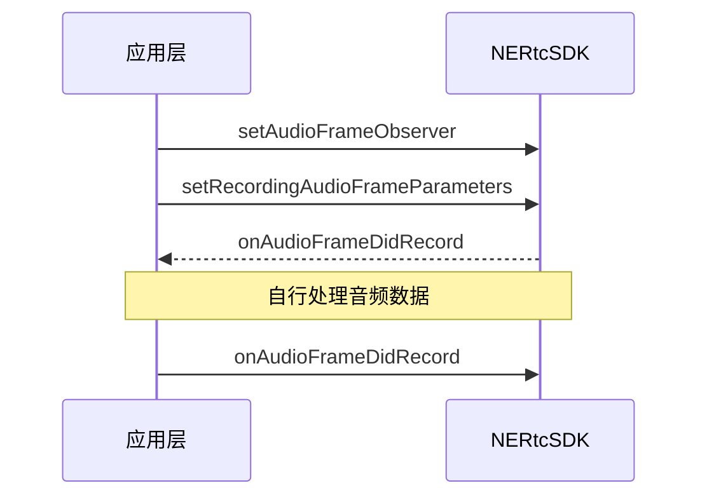

<!-- 实时音视频,原始音频数据,前处理,后处理 -->

NERTC SDK 的音频模块会严格控制声音设备的采集和播放逻辑，同时支持对采集到的音视频原始数据进行自定义的前处理和后处理，获取想要的播放效果。适用于非标设备接入、自定义音频效果、语音处理、语音识别等场景。

- 前处理：在音频数据发送到编码器前获取原始的音频数据进行修改，主要针对本地麦克风采集到的音频数据或自定义外部音频流。
- 后处理：即在音频数据发送给解码器后获取原始的音频数据进行修改，主要针对接收到的远端用户音频数据。

NERTC SDK 通过提供 `NERtcAudioFrameObserver` 类，实现采集、修改原始音频数据功能。

## <span id="Windows/macOS注意事项">注意事项</span>

- 采集回调 <a href="https://doc.yunxin.163.com/nertc/api-refer/macOS/doxygen/Latest/zh/html/classnertc_1_1_i_n_e_rtc_audio_frame_observer.html#a57ed3873927be905309a17f1b91451c3" target="_blank">`onAudioFrameDidRecord`</a>、播放回调 <a href="https://doc.yunxin.163.com/nertc/api-refer/macOS/doxygen/Latest/zh/html/classnertc_1_1_i_n_e_rtc_audio_frame_observer.html#ae771c686ba30e2360dfea38f1dd10b91" target="_blank">`onAudioFrameWillPlayback`</a> 中的原始音频数据可进行处理，例如美声变声。
- 混音回调 <a href="https://doc.yunxin.163.com/nertc/api-refer/macOS/doxygen/Latest/zh/html/classnertc_1_1_i_n_e_rtc_audio_frame_observer.html#a3a333c92b704c3733d3c943a0ce1aadb" target="_blank">`onMixedAudioFrame`</a> 和某一用户的播放回调 <a href="https://doc.yunxin.163.com/nertc/api-refer/macOS/doxygen/Latest/zh/html/classnertc_1_1_i_n_e_rtc_audio_frame_observer.html#aca7dbc83c24716955c4d64b8cd5206f7" target="_blank">`onPlaybackAudioFrameBeforeMixing`</a> 中的原始音频数据不能进行处理。

## 前提条件

在使用原始数据处理功能前，请确保您已在项目中实现基本的实时音视频功能。

## 技术原理


## <span id="Windows/macOS实现方法">实现方法</span>

### **API 调用时序**

以实现修改采集音频的音频数据为例，API 调用时序如下图所示。



### **配置步骤**

1. 加入房间前基于 <a href="https://doc.yunxin.163.com/nertc/api-refer/macOS/doxygen/Latest/zh/html/classnertc_1_1_i_rtc_engine_ex.html#ab9adc2e53fa43ee428dcb5ae2fc7a6f8" target="_blank">`INERtcAudioFrameObserver`</a> 接口类实现一个 **NERtcAudioFrameObserver** 类，并调用 <a href="https://doc.yunxin.163.com/nertc/api-refer/macOS/doxygen/Latest/zh/html/classnertc_1_1_i_rtc_engine_ex.html#ab9adc2e53fa43ee428dcb5ae2fc7a6f8" target="_blank">`setAudioFrameObserver`</a> 方法注册语音观测器。

2. 设置回调的音频采样率。

    - 调用 <a href="https://doc.yunxin.163.com/nertc/api-refer/macOS/doxygen/Latest/zh/html/classnertc_1_1_i_rtc_engine_ex.html#ae3f5b17aade8c9fe8ff5a6fef6383d9e" target="_blank">`setRecordingAudioFrameParameters`</a> 方法修改回调的采集音频采样率，并将回调的音频数据设置为只读模式或读写模式。
    - 调用 <a href="https://doc.yunxin.163.com/nertc/api-refer/macOS/doxygen/Latest/zh/html/classnertc_1_1_i_rtc_engine_ex.html#ad7ca758649f591b089e43c68f5b00875" target="_blank">`setPlaybackAudioFrameParameters`</a> 方法修改回调的播放音频采样率，并将回调的音频数据设置为只读模式或读写模式。
    - 调用 <a href="https://doc.yunxin.163.com/nertc/api-refer/macOS/doxygen/Latest/zh/html/classnertc_1_1_i_rtc_engine_ex.html#a83e4fbdea5fff4015275bdc31095a2ad" target="_blank">`setMixedAudioFrameParameters`</a> 方法，设置 <a href="https://doc.yunxin.163.com/nertc/api-refer/macOS/doxygen/Latest/zh/html/classnertc_1_1_i_n_e_rtc_audio_frame_observer.html#a3a333c92b704c3733d3c943a0ce1aadb" target="_blank">`onMixedAudioFrame`</a> 回调中的混音音频采样率。

3. SDK 返回回调。

    - SDK 收到输入的采集数据和播放的音频数据时，返回 <a href="https://doc.yunxin.163.com/nertc/api-refer/macOS/doxygen/Latest/zh/html/classnertc_1_1_i_n_e_rtc_audio_frame_observer.html#a57ed3873927be905309a17f1b91451c3">`onAudioFrameDidRecord`</a> 和 <a href="https://doc.yunxin.163.com/nertc/api-refer/macOS/doxygen/Latest/zh/html/classnertc_1_1_i_n_e_rtc_audio_frame_observer.html#ae771c686ba30e2360dfea38f1dd10b91" target="_blank">`onAudioFrameWillPlayback`</a> 回调。
    - SDK 收到音频采集与播放混合后数据帧时，返回 <a href="https://doc.yunxin.163.com/nertc/api-refer/macOS/doxygen/Latest/zh/html/classnertc_1_1_i_n_e_rtc_audio_frame_observer.html#a3a333c92b704c3733d3c943a0ce1aadb" target="_blank">`onMixedAudioFrame`</a> 回调；SDK 收到某一远端用户播放的音频数据时，返回 <a href="https://doc.yunxin.163.com/nertc/api-refer/macOS/doxygen/Latest/zh/html/classnertc_1_1_i_n_e_rtc_audio_frame_observer.html#aca7dbc83c24716955c4d64b8cd5206f7" target="_blank">`onPlaybackAudioFrameBeforeMixing`</a> 回调。

4. 用户拿到音频数据后，需要根据场景自行进行处理。
5. 完成音频数据处理后，您可以直接进行自播放，或根据场景需求再通过 <a href="https://doc.yunxin.163.com/nertc/api-refer/macOS/doxygen/Latest/zh/html/classnertc_1_1_i_n_e_rtc_audio_frame_observer.html#a57ed3873927be905309a17f1b91451c3">`onAudioFrameDidRecord`</a> 和 <a href="https://doc.yunxin.163.com/nertc/api-refer/macOS/doxygen/Latest/zh/html/classnertc_1_1_i_n_e_rtc_audio_frame_observer.html#ae771c686ba30e2360dfea38f1dd10b91" target="_blank">`onAudioFrameWillPlayback`</a> 回调发送给 SDK。

### <span id="Windows/macOS示例代码">**示例代码**</span>
你可以参考下面的示例代码片段，在项目中实现音频原始数据功能：

```
class AudioFrameObserver : public INERtcAudioFrameObserver
{
public:
    void onAudioFrameDidRecord(NERtcAudioFrame *frame) {
        FILE *fd = getFileDescr("Record", frame->format);
        
        if (NULL != fd) {
            fwrite(frame->data, frame->format.bytes_per_sample * frame->format.channels,
                   frame->format.samples_per_channel, fd);
        }
    }

    void onAudioFrameWillPlayback(NERtcAudioFrame *frame) {
        FILE *fd = getFileDescr("Playback", frame->format);

        if (NULL != fd) {
            fwrite(frame->data, frame->format.bytes_per_sample * frame->format.channels,
                   frame->format.samples_per_channel, fd);
        }
    }

    void onMixedAudioFrame(nertc::NERtcAudioFrame *frame) {
        FILE *fd = getFileDescr("Mixed", frame->format);

        if (NULL != fd) {
            fwrite(frame->data, frame->format.bytes_per_sample * frame->format.channels,
                   frame->format.samples_per_channel, fd);
        }
    }

    void onPlaybackAudioFrameBeforeMixing(nertc::uid_t uid, nertc::NERtcAudioFrame *frame) {
        FILE *fd = getFileDescr(std::to_string(uid), frame->format);

        if (NULL != fd) {
            fwrite(frame->data, frame->format.bytes_per_sample * frame->format.channels,
                   frame->format.samples_per_channel, fd);
        }
    }

    AudioFrameObserver(const std::string &record_file_dir) : m_record_file_dir(record_file_dir) {}

    virtual ~AudioFrameObserver()
    {
        for (auto &fd : m_fds)
        {
            fclose(fd.second.fd);
            fd.second.fd = NULL;
        }
        m_fds.clear();
    }

private:
    struct file_descr {
        FILE *fd;
        nertc::NERtcAudioFormat fmt;
    };

    FILE *getFileDescr(const std::string &id, const nertc::NERtcAudioFormat &fmt) {
        if (m_fds.end() == m_fds.find(id)) {
            m_fds[id] = file_descr();
            m_fds[id].fd = NULL;
        } else if ((m_fds[id].fmt.sample_rate != fmt.sample_rate) ||
                   (m_fds[id].fmt.channels != fmt.channels) ||
                   (m_fds[id].fmt.type != fmt.type)) {
            if (NULL != m_fds[id].fd) {
                fclose(m_fds[id].fd);
                m_fds[id].fd = NULL;
            }
        }

        if (NULL == m_fds[id].fd) {
            time_t now = time(0);
            tm *ltm = localtime(&now);
            std::ostringstream oss;
            oss << m_record_file_dir << "/audio-frame-" << id << "-" << fmt.sample_rate << "-ch" << fmt.channels;
            oss << "-" << ltm->tm_year + 1900;
            oss << std::setfill('0') << std::setw(2) << ltm->tm_mon + 1;
            oss << std::setfill('0') << std::setw(2) << ltm->tm_mday;
            oss << std::setfill('0') << std::setw(2) << ltm->tm_hour;
            oss << std::setfill('0') << std::setw(2) << ltm->tm_min;
            oss << std::setfill('0') << std::setw(2) << ltm->tm_sec;
            oss << ".pcm";

            m_fds[id].fd = fopen(oss.str().c_str(), "wb");
            m_fds[id].fmt = fmt;
        }

        return m_fds[id].fd;
    }

    std::map<std::string /*id*/, file_descr> m_fds;
    std::string m_record_file_dir;
};

AudioFrameObserver *audioFrameObserver = new AudioFrameObserver("/dir/for/recor_file");
rtc_engine_->setAudioFrameObserver(audioFrameObserver);
```

## API 参考
| **方法** | **功能描述**|
|:--|:--|
|<a href="https://doc.yunxin.163.com/nertc/api-refer/macOS/doxygen/Latest/zh/html/classnertc_1_1_i_rtc_engine_ex.html#ae3f5b17aade8c9fe8ff5a6fef6383d9e" target="_blank">`setRecordingAudioFrameParameters`</a>|设置回调的采集音频采样率|
|<a href="https://doc.yunxin.163.com/nertc/api-refer/macOS/doxygen/Latest/zh/html/classnertc_1_1_i_rtc_engine_ex.html#ad7ca758649f591b089e43c68f5b00875" target="_blank">`setPlaybackAudioFrameParameters`</a>|设置回调的播放音频采样率|
|<a href="https://doc.yunxin.163.com/nertc/api-refer/macOS/doxygen/Latest/zh/html/classnertc_1_1_i_rtc_engine_ex.html#a83e4fbdea5fff4015275bdc31095a2ad" target="_blank">`setMixedAudioFrameParameters`</a> |设置回调的混音音频采样率|
|<a href="https://doc.yunxin.163.com/nertc/api-refer/macOS/doxygen/Latest/zh/html/classnertc_1_1_i_rtc_engine_ex.html#ab9adc2e53fa43ee428dcb5ae2fc7a6f8" target="_blank">`setAudioFrameObserver`</a>|注册语音观测器|
|<a href="https://doc.yunxin.163.com/nertc/api-refer/macOS/doxygen/Latest/zh/html/classnertc_1_1_i_n_e_rtc_audio_frame_observer.html#a57ed3873927be905309a17f1b91451c3">`onAudioFrameDidRecord`</a>| 接收本端输入的采集音频数据回调|
|<a href="https://doc.yunxin.163.com/nertc/api-refer/macOS/doxygen/Latest/zh/html/classnertc_1_1_i_n_e_rtc_audio_frame_observer.html#ae771c686ba30e2360dfea38f1dd10b91" target="_blank">`onAudioFrameWillPlayback`</a>|接收本端输入的播放音频数据播放回调|
|<a href="https://doc.yunxin.163.com/nertc/api-refer/macOS/doxygen/Latest/zh/html/classnertc_1_1_i_n_e_rtc_audio_frame_observer.html#a3a333c92b704c3733d3c943a0ce1aadb" target="_blank">`onMixedAudioFrame`</a>|接收采集与播放音频混合数据帧回调|
|<a href="https://doc.yunxin.163.com/nertc/api-refer/macOS/doxygen/Latest/zh/html/classnertc_1_1_i_n_e_rtc_audio_frame_observer.html#aca7dbc83c24716955c4d64b8cd5206f7" target="_blank">`onPlaybackAudioFrameBeforeMixing`</a>|接收远端播放的音频数据帧回调|