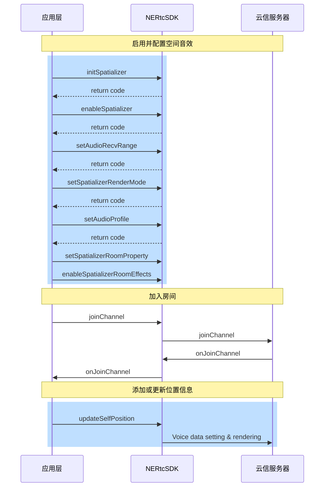

空间音效也称 3D 音效，是通过在音频信号中添加空间信息，使得听众可以感受到声音来自于特定的位置和空间环境。它可以增强音频的真实感和沉浸感，让听众感受到更加真实的声音效果。

## 功能介绍
NERTC SDK 从 V5.4.0 开始支持空间音效。

空间音效可以将实时语音渲染成具有空间方位的效果。同时，空间音效具有房间混响，距离衰减和范围语音等属性，综合使用相关属性可以提升空间音效的真实感和沉浸感。

例如，在游戏中模拟真实世界的空间音效，玩家可以感知说话者的 3D 空间方位。同时，空间音效可以根据双方距离的远近实现语音音量的衰减，使近处的声音更响亮，远处的声音更低。这样可以让玩家更清晰地感受到游戏中的环境和位置信息，增强游戏的沉浸感和真实感。此外，空间音效还可以应用于虚拟现实和增强现实等领域，让用户更真实地感受虚拟环境中的声音效果。

## 功能原理

空间音效涉及到音频源和接收者两个对象。在RTC场景下，开启空间音效时，发送端会在语音中包含自身的坐标信息，远端接收该音频信息时，会将其作为音频源。接收者会基于自身坐标、接收到的音频及其位置，将音频渲染到特定方位，然后进行播放。

空间音效利用头部相关转换函数（HRTF）和声波空间卷积模仿自然声波的传播，使其仿佛来自三维空间中的一个点。空间音效通过方向、距离和环境三个关键因素实现空间感的形成。

空间音效的距离衰减和语音范围如下图所示。


## 注意事项

需要用户佩戴**有线耳机**体验空间音效功能，暂不支持蓝牙耳机。

## API 调用时序



  
## 实现方法

### 1. 启用空间音效

1. 请在**引擎初始化之后（<a href="https://doc.yunxin.163.com/nertc/api-refer/macOS/doxygen/Latest/zh/html/classnertc_1_1_i_rtc_engine.html#a1e816fd56f1cc6953a263f6798d0f1d4" target="_blank">`initialize`</a>）**，调用 [`initSpatializer`](https://doc.yunxin.163.com/nertc/api-refer/macOS/doxygen/Latest/zh/html/classnertc_1_1_i_rtc_engine_ex.html#a4cad276e2451c1db83595ccde648de5c) 方法初始化空间音效。   
2. **加入房间（<a href="https://doc.yunxin.163.com/nertc/api-refer/macOS/doxygen/Latest/zh/html/classnertc_1_1_i_rtc_engine.html#acc3f404cee7cd1b56b5019776dbb660a" target="_blank">`joinChannel`</a>）之前**调用 <a href="https://doc.yunxin.163.com/nertc/api-refer/macOS/doxygen/Latest/zh/html/classnertc_1_1_i_rtc_engine_ex.html#a0f3fcf9e337d633b215a25c7d346582b" target="_blank">`enableSpatializer`</a> 方法以启用音频空间化, 如果您需要只针对本小队开启 3D 音效, 设置 `apply_to_team` 为 `true`。

**示例代码**如下：
```
//打开空间音效功能
void enable3DAudio() {
    //需要在执行完`initialize`接口之后调用
    rtcEngine->initSpatializer();
    rtcEngine->enableSpatializer(true, false);

    //audio profile must be stereo,2 channels
    rtcEngine->setAudioProfile(kNERtcAudioProfileMiddleQualityStereo, kNERtcAudioScenarioMusic);
}
```

### 2. 设置距离衰减和语音范围

在加入房间前，调用 <a href="https://doc.yunxin.163.com/nertc/api-refer/macOS/doxygen/Latest/zh/html/classnertc_1_1_i_rtc_engine_ex.html#ae7e407ee359548e341b470110392bb93" target="_blank">`setAudioRecvRange`</a> 方法设置空间音效的距离衰减属性和语音范围，该属性可以让声音随着音频源和接收者之间距离的增加逐渐衰减音量。

::: note notice
- 空间音效房间内的本端成员和对端成员需要**都开启**空间音效（enableSpatializer），本端才能听到对端声音的方位感。
- 通常在 3D 网络游戏开始后，都能获取地图上角色 GameObject 坐标，一般用坐标来计算空间距离，传给setAudioRecvRange接口
:::

**参数描述**如下表所示：

| 参数 | 描述 | 
| ---- | -------------- | 
| audible_distance | 监听器能接收到音频的最大距离，用户的声音在该范围内可被听见。取值范围：[1, max int) ，无默认值。| 
| conversational_distance | 监听器不对音频进行衰减的距离，在该距离范围内，扬声器音频保持其原始音量，超出该范围时，声音将会随距离的增加而衰减。默认值为 1。| 
| roll_off | 距离衰减模式。一共有三种：|\
|| - kNERtcDistanceRolloffLogarithmic（0）：指数衰减。|\
|| - kNERtcDistanceRolloffLinear（1）：线性衰减。|\
|| - kNERtcDistanceRolloffNone（2）：无衰减。| \
|| - kNERtcDistanceRolloffLinearOnly（3）：仅线性衰减, 没有方位效果|

**示例代码**如下：

```
// 设置接收范围和声音衰减模型
void setup3DAudioRecvRange() {
    //需要在`enableSpatializer`执行成功之后调用。
    rtcEngine->setAudioRecvRange(50, 1, kNERtcDistanceRolloffLinear); 
    // ...
}
```

### 3. 设置渲染模式

在加入房间前，调用 <a href="https://doc.yunxin.163.com/nertc/api-refer/macOS/doxygen/Latest/zh/html/classnertc_1_1_i_rtc_engine_ex.html#a4a48f2700aa45fb781d864e8a045f47e" target="_blank">`setSpatializerRenderMode`</a> 方法设置渲染模式，通过设置 `mode` 参数选择不同复杂程度的算法以实现不同的听觉效果。

其中 <a href="https://doc.yunxin.163.com/nertc/api-refer/macOS/doxygen/Latest/zh/html/namespacenertc.html#a79ef6ed6b3b86c72c3b42f9736fe32c9" target="_blank">`NERtcSpatializerRenderMode`</a> 类型的各字段说明如下表所示。

| 字段| 描述 | 
| ---- | ---- |
| kNERtcSpatializerRenderStereoPanning | 立体声 PANNing 方法 | 
| kNERtcSpatializerRenderBinauralLowQuality | 低复杂度双耳渲染方法 | 
| kNERtcSpatializerRenderBinauralMediumQuality | 中复杂度双耳渲染方法 | 
| kNERtcSpatializerRenderBinauralHighQuality | 高复杂度双耳渲染方法(推荐) | 
| kNERtcSpatializerRenderRoomEffectsOnly | 仅房间混响 |

**示例代码**如下：

```C#
// 设置空间语音渲染模式
void Setup3DAudioRenderMode() {
    //需要在`EnableSpatializer`执行成功之后调用。

    rtcEngine->setSpatializerRenderMode(kNERtcSpatializerRenderBinauralHighQuality); 
    // ...
}
```

### 4. 设置音频属性

在加入房间前，调用 <a href="https://doc.yunxin.163.com/nertc/api-refer/macOS/doxygen/Latest/zh/html/classnertc_1_1_i_rtc_engine_ex.html#a34c04a16ffdd9702636191073b3dbe99" target="_blank">`setAudioProfile`</a> 方法将音频类型（`NERtcAudioProfileType`）设置为 `kNERtcAudioProfileMiddleQualityStereo` 或者 `kNERtcAudioProfileHighQualityStereo`，并将音频场景（`NERtcAudioScenarioType`）设置为 `kNERtcAudioScenarioMusic`。

```C#
// 设置音频属性
void setup3DAudioProfile() {
    //需要在`Initialize`执行成功之后,`JoinChannel`之前调用
    rtcEngine->setAudioProfile(kNERtcAudioProfileMiddleQualityStereo, kNERtcAudioScenarioMusic); 
    // ...
}
```

### 5. 设置房间混响属性（可选）

1. 调用 <a href="https://doc.yunxin.163.com/nertc/api-refer/macOS/doxygen/Latest/zh/html/classnertc_1_1_i_rtc_engine_ex.html#a6fa56b1bcb25fe14765422eab70911ea" target="_blank">`setSpatializerRoomProperty`</a> 方法设置 `room_property` 参数预设的房间大小，混响时长，混响增益，音色亮度等参数，以调整房间混响效果。

其中 <a href="https://doc.yunxin.163.com/nertc/api-refer/macOS/doxygen/Latest/zh/html/classnertc_1_1_i_rtc_engine_ex.html#a6fa56b1bcb25fe14765422eab70911ea" target="_blank">`NERtcSpatializerRoomProperty`</a> 类型的各字段说明如下表所示。

| 参数 | 类型 | 描述 |
| ---- | ---- |---- |
| room_capacity | NERtcSpatializerRoomCapacity | 房间大小，默认值为 `kNERtcSpatializerRoomCapacitySmall`。<br> 房间大小的枚举值请参见[`NERtcSpatializerRoomCapacity`](https://doc.yunxin.163.com/nertc/api-refer/macOS/doxygen/Latest/zh/html/namespacenertc.html#a18916b5c2b8a44173cc2d9289ae82ca2)|
|  material | NERtcSpatializerMaterialName | 房间材质，默认值为 `kNERtcSpatializerMaterialTransparent`。<br>更多的房间材质请参见[`NERtcSpatializerMaterialName`](https://doc.yunxin.163.com/nertc/api-refer/macOS/doxygen/Latest/zh/html/namespacenertc.html#af35698c71bfecefe53bdfcd4020cebf0) |
| reflection_scalar | float | 混响反射比例因子，默认值为 1.0 |
| reverb_gain |float| 混响增益比例因子，默认值为 1.0 |
| reverb_time |float| 混响时间比例因子，默认值为 1.0 |
| reverb_brightness |float| 混响音色亮度 |

2. 调用 <a href="https://doc.yunxin.163.com/nertc/api-refer/macOS/doxygen/Latest/zh/html/classnertc_1_1_i_rtc_engine_ex.html#ab0aac4e7b96a08636de717911faa8e5b" target="_blank">`enableSpatializerRoomEffects`</a> 方法，设置 `enable` 参数为 `true` 或 `false` 以开启或关闭空间音效的房间混响效果。
3. 调用 <a href="https://doc.yunxin.163.com/nertc/api-refer/macOS/doxygen/Latest/zh/html/classnertc_1_1_i_rtc_engine_ex.html#a0f3fcf9e337d633b215a25c7d346582b" target="_blank">`enableSpatializer`</a> 方法，设置 `enable` 参数为 `true` 或 `false` 以开启或关闭 3D 音效。

    3D 音效可以让声音有 3D 空间感且按距离衰减。

### 6. 添加或更新位置信息

在加入房间后，调用 <a href="https://doc.yunxin.163.com/nertc/api-refer/macOS/doxygen/Latest/zh/html/classnertc_1_1_i_rtc_engine_ex.html#afbc1b907c9620afa66e39d7506f425da" target="_blank">`updateSelfPosition`</a> 方法并设置 `info` 参数，以更新音频源或接收者的空间位置信息 <a href="https://doc.yunxin.163.com/nertc/api-refer/macOS/doxygen/Latest/zh/html/structnertc_1_1_n_e_rtc_spatializer_position_info.html" target="_blank">`NERtcPositionInfo`</a>，从而实现空间音频定位特效。
::: note note
- 通常在 3D 网络游戏开始后，都能获取地图上角色 `GameObject` 相互的坐标，此坐标即调用 `updateSelfPosition` 方法时需要更新的角色坐标。
- 建议在一定间隔内更新角色位置信息，以保证画面和音频位置同步，推荐更新频率为 10 ~ 25次/秒。
:::

| 参数 | 描述 | 
| ---- | -------------- | 
| speaker_position | 说话者的位置信息，三个值依次表示X、Y、Z的坐标值。默认值{0,0,0}| 
| speaker_quaternion | 说话者的旋转信息，通过四元组来表示，数据格式为{w, x, y, z}。默认值{0,0,0,0}  <note type="note">该参数设置的值暂时不起作用，保持默认值即可。</note>| 
| head_position | 接收者的位置信息，三个值依次表示X、Y、Z的坐标值。默认值{0,0,0}|
| head_quaternion| 接收者的旋转信息，通过四元组来表示，数据格式为{w, x, y, z}。默认值{0,0,0,0}|


**示例代码**如下：

```Cpp
{
    // 创建并初始化好引擎 rtc_engine_
    .....
    
    float position[3] = {0.0f};
    float queternion[4] = {0.0f};
    float position2[3] = {0.0f};
    float queternion2[4] = {0.0f};

    // 在游戏中更新玩家位置信息
    .....

    NERtcPositionInfo info = {};
    memcpy(info.speaker_position, position, sizeof(float) * 3);
    memcpy(info.speaker_quaternion, queternion, sizeof(float) * 4);
    memcpy(info.head_position, position2, sizeof(float) * 3);
    memcpy(info.head_quaternion, queternion2, sizeof(float) * 4);

    res = rtc_engine_->updateSelfPosition(info);
}
```


