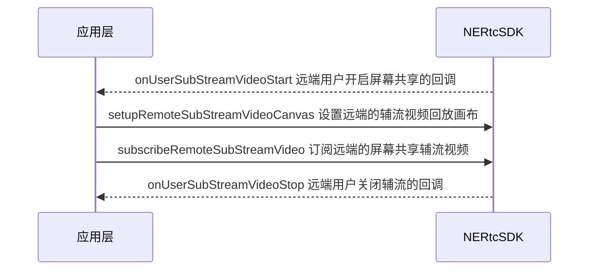

<!--- keywords:实时音视频,屏幕共享 -->

在大型会议或在线教育等场景中，为了满足提升沟通效率的需求，主讲人或老师需要将本端的屏幕内容分享给远端参会者或在线学生观看。网易云信音视频通话 2.0 在 NERTC SDK uni-app 框架上适配了屏幕共享功能，帮助您实时分享本端设备的屏幕内容。

## 功能介绍

通过 NERTC SDK，用户可以在视频通话或互动直播过程中实现屏幕共享，主播或连麦者可以将自己的屏幕内容，以视频的方式分享给远端参会者或在线观众观看，从而提升沟通效率，一般适用于多人视频聊天、在线会议以及在线教育场景。

- 视频会议场景中，参会者可以在会议中将本地的文件、数据、网页、PPT 等画面分享给其他与会者，让其他与会者更加直观的了解讨论的内容和主题。

- 在线课堂场景中，老师可以通过屏幕共享将课件、笔记、教学内容等画面展示给远端的其他学生观看，降低传统教学模式下的沟通成本，提升教育场景的用户体验。

NERTC SDK 以辅流的形式实现屏幕共享，即单独为屏幕共享开启一路上行的视频流，摄像头的视频流作为主流，屏幕共享的视频流作为辅流，两路视频流并行，主播同时上行摄像头画面和屏幕画面两路画面。

## <span id="注意事项">安卓注意事项</span>

- Android 端 MediaProjection 等 API 需要 Android API level 21+，使用方法请参考《谷歌官方文档》[MediaProjection](https://developer.android.com/reference/android/media/projection/MediaProjection)。
- 如果遇到不生效的问题，可以将安卓 `manifest.json` 配置文件中的 `targetSdkVersion` 降低至 `28`。

## <span id="本端共享屏幕">iOS 前置工作</span>

当前的 uni-app 在 iOS 端支持屏幕共享功能与安卓有一定的区别，由于系统限制，iOS 端屏幕共享本质上是跨应用屏幕分享。您需要增加 **Broadcast Upload Extension** 录屏进程，以配合主 App 进程进行推流。实现由系统在需要录屏的时候创建 Extension 录屏进程，并负责接收系统采集到屏幕图像。


总体流程如下图所示：


<a id="createAppGroup"></a>

### **<span id="步骤一（可选）创建 App Group"> **第一步：（可选）创建 App Group** </span>**

本步骤为可选步骤，如果您已创建了 App Group，则可以跳过本步骤。App Group 用于在主 App 进程和扩展程序之间之间进行视频数据和控制指令的传输。具体步骤如下：

1. 参考《苹果官方文档》[注册 App Group](https://help.apple.com/developer-account/?lang=en#/dev1d7b147dc)，在 [Certificates, Identifiers & Profiles](https://developer.apple.com/account/resources) 页面中注册 App Group。

2. 参考《苹果官方文档》[启用 App Group](https://help.apple.com/developer-account/?lang=en#/dev4cb6dfbdb)，为您的 App ID 启用 App Group 功能。

3. 重新下载 Provisioning Profile 并配置到 XCode 中。

### <span id="步骤二 创建 Extension 录屏进程"> **第二步：创建 Extension 录屏进程** </span>

创建一个类型为 Broadcast Upload Extension 的 Target，用于存放屏幕共享功能的实现代码。

1. 在 Xcode 中打开项目的工程文件。
2. 在菜单中选择 **Editor > Add Target...**。
3. 在 **iOS** 页签中，选择 **Broadcast Upload Extension**，并单击 **Next**。

    

4. 在 **Product Name** 中为 Extension 命名，例如 **NERtc-ScreenShare-Extension**，单后单击 **Finish**。

5. 添加系统库依赖：找到录屏 **Target** > **General** > **Frameworks and Libraries**，单击添加按钮，添加系统库依赖 `NERtcReplayKit.framework`，路径在 SDK 的插件 `NERTCUniPluginSDK/ios/NERtcReplayKit.framework` 中。

6. 选中新增加的 **TARGETS**，依次单击 **+ Capability**，双击 **App Groups**，如下图：

    

7. 在新创建的 Target 中，Xcode 会自动创建一个名为 `SampleHandler` 的类，用如下代码进行替换其中的 `.m` 文件。您需要将以下代码中的 `appGroup` 改为上文 [第一步](#createAppGroup) 创建的 **App Group Identifier**。

    ```Objective-C
    #import "SampleHandler.h"
    #import <NERtcReplayKit/NERtcReplayKit.h>
    @interface SampleHandler ()<NEScreenShareSampleHandlerDelegate>
    @end
    @implementation SampleHandler

    - (void)broadcastStartedWithSetupInfo:(NSDictionary<NSString *,NSObject *> *)setupInfo {
        NSLog(@"[uniapp] broadcastStartedWithSetupInfo() 屏幕共享");
        // User has requested to start the broadcast. Setup info from the UI extension can be supplied but optional.
        NEScreenShareBroadcasterOptions *options = [[NEScreenShareBroadcasterOptions alloc]init];
        //这里填写 上面步骤申请的 appGroup
        options.appGroup = @"xxx-xxx";
        //设置采集帧率 15 FPS
        options.frameRate = 15;
        //设置需要采集系统音频数据
        options.needAudioSampleBuffer = NO;
        [NEScreenShareSampleHandler sharedInstance].delegate = self;
        [[NEScreenShareSampleHandler sharedInstance] broadcastStartedWithSetupInfo:options];
    }

    - (void)broadcastPaused {
        // User has requested to pause the broadcast. Samples will stop being delivered.
        [[NEScreenShareSampleHandler sharedInstance] broadcastPaused];
    }

    - (void)broadcastResumed {
        // User has requested to resume the broadcast. Samples delivery will resume.
        [[NEScreenShareSampleHandler sharedInstance] broadcastResumed];
    }

    - (void)broadcastFinished {
        // User has requested to finish the broadcast.
        [[NEScreenShareSampleHandler sharedInstance] broadcastFinished];
    }

    - (void)processSampleBuffer:(CMSampleBufferRef)sampleBuffer withType:(RPSampleBufferType)sampleBufferType {
        NSLog(@"[uniapp] processSampleBuffer() 屏幕共享");
        [[NEScreenShareSampleHandler sharedInstance] processSampleBuffer:sampleBuffer withType:sampleBufferType];
    }

    - (void)onRequestToFinishBroadcastWithError:(NSError *)error {
        [self finishBroadcastWithError:error];
    }

    @end
    ```

8. iOS 的屏幕共享以 iOS Extension 方式集成，详情请参考《uni-app 官方文档》[uni 原生插件包格式](https://nativesupport.dcloud.net.cn/NativePlugin/course/package.html#ios-extension)。

    按照官方文档的步骤，插件的文件目录如下图所示：

    

    此外您需要在 uni-app 插件中的 `package.json` 文件，手动输入 `appGroup`，如下图所示：

    

### 第三步：注册屏幕共享组件

如果业务上有屏幕共享的场景，在初始化 NERTC SDK 引擎之后，您需要提前注册屏幕共享组件 [`setupShareKit`](https://doc.yunxin.163.com/nertc/references/uniapp/typedoc/Latest/zh/html/modules/nertc.nertc-1.html#setupsharekit)。

**示例代码** 如下：

```JavaScript
this.engine.setupShareKit({
    //设置为您的 app Group 的取值
    appGroup: 'group.xxx.xxx'
})
```

## <span id="SDK 实现方法">实现本端共享屏幕</span>

### **第一步：开启屏幕共享**

1. 在加入房间之后调用 [`startScreenCapture`](https://doc.yunxin.163.com/nertc/api-refer/uniapp/typedoc/Latest/zh/html/modules/nertc.nertc-1.html#startscreencapture) 接口开启屏幕共享，以辅流形式发送屏幕共享内容。

    调用此接口时，您需要设置 `screenConfigParam` 配置本地辅流的编码参数。参数说明如下表所示。

    参数 | 参数说明 |
    -- | -- |
    contentPrefer | 屏幕共享编码策略倾向：|\
    | - CONTENT_PREFER_MOTION（默认）：内容类型为动画。当用户共享的内容是视频、电影或游戏等动态画面时，推荐选择此枚举值。此时 frameRate 参数完全按照您的设置处理。 |\
    | - CONTENT_PREFER_DETAILS：内容类型为细节。当用户共享的内容是图片、文字或 PPT 等静态画面时，推荐选择此枚举值。此时 frameRate 参数最高可设置为 10 帧。 |
    maxProfile | 视频编码的分辨率。<br>具体请参考 [ NERtcVideoProfileType](https://doc.yunxin.163.com/nertc/api-refer/uniapp/typedoc/Latest/zh/html/enums/types.nertcvideoprofiletype.html)。 |
    frameRate | 视频编码的帧率。<br>可以设置为 0、7（默认）、10、15、24、30 FPS，具体请参考 [NERtcVideoFrameRate](https://doc.yunxin.163.com/nertc/api-refer/uniapp/typedoc/Latest/zh/html/enums/types.nertcvideoframerate.html)。 |
    minFramerate | 视频编码的最小帧率。<br>默认值为 0，表示使用默认的最小帧率。 |
    bitrate | 视频编码的码率，单位为 Kbps。<br>若设置的码率为 0 或超出合理范围，SDK 会自行计算出合理区间处理码率，具体请参考 [分辨率、帧率、码率参照表](https://doc.yunxin.163.com/nertc/guide/jA0Nzk5MDY?platform=uniapp#分辨率-帧率和码率参照表)。 |
    minBitrate | 视频编码的最小码率，单位为 Kbps。 |
    needBroadcastExtensionLauncher | （仅 iOS）增加屏幕分享的触发按钮（可选）。 |

    **典型场景参数配置推荐**

    以下表格列出了针对一些典型场景的屏幕共享参数的推荐值，供您参考。

    参数名称 | 常规推荐值 | 一起看视频 | 共享 PPT |
    -- | -- | -- | -- |
    contentPrefer | CONTENT_PREFER_MOTION | CONTENT_PREFER_MOTION | CONTENT_PREFER_DETAILS |
    videoProfile | HD720P | HD720P | HD1080p |
    frameRate | FRAME_RATE_FPS_7 | FRAME_RATE_FPS_30 | FRAME_RATE_FPS_7 |
    bitrate | 0（默认值） | 0（默认值） | 0（默认值） |

    ::: note note
    - 若屏幕共享的内容为静态画面，设置较高的帧率并不经济，帧率推荐设置为 7 FPS。
    - 若用户要共享的屏幕内容包含大量文字，可以适当提高分辨率和码率设置。
    :::

    **示例代码** 如下：

    ```JavaScript
    let screenConfigParam = {
        maxProfile: NERtcVideoProfileType.Standard,
        frameRate: NERtcVideoFrameRate.FRAME_RATE_FPS_24, //设置帧率 24
        minFrameRate: NERtcVideoFrameRate.FRAME_RATE_FPS_15, //设置最小帧率 15
        bitrate: 2500, //设置屏幕共享码率 2500kbps
        minBitrate: 1500, //设置屏幕共享码率最小为 1500kbps
        contentPrefer: NERtcSubStreamContentPrefer.CONTENT_PREFER_DETAILS, //屏幕共享功能的编码策略倾向
    };

    if (uni.getSystemInfoSync().platform === "ios"){
        //iOS 端屏幕共享，可以设置是否增加屏幕分享的触发按钮，该参数只有 iOS 端支持，需要做一下判断
        screenShareConfig.needBroadcastExtensionLauncher = true
    }

    this.engine.startScreenCapture(screenConfigParam)
    ```

2. （仅 iOS）设置 **`needBroadcastExtensionLauncher`** 参数，NERTC SDK 会自动弹出屏幕分享的触发按钮，用户单击 **开始直播** 即可。

    ::: note notice
    如果不设置 `needBroadcastExtensionLauncher` 参数，iOS 端屏幕分享必须要用户从控制中心中长按录屏按钮，并且选择要相应的应用，手动启动。
    :::

    

3. 屏幕共享成功，并且按照 [第二步：设置本地辅流画布](#setupLocalSubStreamVideoCanvas) 成功之后，效果如下：

    

<a id="setupLocalSubStreamVideoCanvas"></a>

### **第二步：设置本端辅流画布**

调用 [`setupLocalSubStreamVideoCanvas`](https://doc.yunxin.163.com/nertc/api-refer/uniapp/typedoc/Latest/zh/html/modules/nertc.nertc-1.html#setuplocalsubstreamvideocanvas) 接口设置本端的辅流视频画布。

调用此接口时，您需要设置 `render` 参数配置视频画布。

**示例代码** 如下：

```JavaScript
this.engine.setupLocalSubStreamVideoCanvas({
    renderMode: NERTCRenderMode.Fit, // Fit 表示应区域。视频尺寸等比缩放,保证所有区域被填满,视频超出部分会被裁剪
    mirrorMode: NERTCMirrorMode.AUTO, //AUTO 表示使用默认值,由 SDK 控制
    isMediaOverlay: false //表示小画布置于大画布上面
})
```

::: note note
您可以在开启屏幕共享前后随时设置本端辅流画布。
:::

### **第三步：停止屏幕共享**

若您要结束屏幕共享，请按照以下方式进行：

1. 调用 [`stopScreenCapture`](https://doc.yunxin.163.com/nertc/api-refer/uniapp/typedoc/Latest/zh/html/modules/nertc.nertc-1.html#stopscreencapture) 接口关闭辅流形式的屏幕共享。

    **示例代码** 如下：

    ```JavaScript
    console.log('关闭屏幕共享 closeTheScreen')
    //销毁本地屏幕共享画布
    this.engine.destroyLocalSubStreamVideoCanvas()

    if (uni.getSystemInfoSync().platform === "ios"){
        //iOS 端屏幕共享，可以设置是否增加屏幕分享的停止按钮，该参数只有 iOS 端支持
        this.engine.stopScreenCapture({needBroadcastExtensionLauncher: true})
    } else {
        this.engine.stopScreenCapture()
    }
    ```

2. （仅 iOS）设置 `needBroadcastExtensionLauncher` 参数，SDK 会自动弹出屏幕分享的停止按钮，用户单击 **好** 即可。

    ::: note notice
    如果不设置 needBroadcastExtensionLauncher 参数，iOS 端屏幕分享必须要用户从控制中心中单击录屏按钮来手动关闭。
    :::

    

    ::: note note
    在调用 `stopScreenCapture` 成功之后，大概会持续 5 秒才会弹出屏幕分享的停止按钮。这属于设备系统属性，NERTC SDK 无法控制。
    :::

## <span id="观看远端屏幕共享">观看远端屏幕共享</span>

### <span id="API 调用时序">API 调用时序</span>



### 实现步骤

1. 远端用户加入房间。
2. 收到 [`onUserSubStreamVideoStart`](https://doc.yunxin.163.com/nertc/api-refer/uniapp/typedoc/Latest/zh/html/interfaces/nertccallback.nertccallback-1.html#onusersubstreamvideostart) 其他用户开启屏幕共享辅流通道的回调。
3. 通过 [`setupRemoteSubStreamVideoCanvas`](https://doc.yunxin.163.com/nertc/api-refer/uniapp/typedoc/Latest/zh/html/modules/nertc.nertc-1.html#setupremotesubstreamvideocanvas) 设置远端的辅流视频回放画布。
4. 通过 [`subscribeRemoteSubStreamVideo`](https://doc.yunxin.163.com/nertc/api-refer/uniapp/typedoc/Latest/zh/html/interfaces/nertccallback.nertccallback-1.html#onusersubstreamvideostart) 订阅远端的屏幕共享辅流视频，订阅之后才能接收远端的辅流视频数据。
5. 收到 [`onUserSubStreamVideoStop`](https://doc.yunxin.163.com/nertc/api-refer/uniapp/typedoc/Latest/zh/html/interfaces/nertccallback.nertccallback-1.html#onusersubstreamvideostop) 其他用户关闭辅流的回调，结束屏幕共享。

### 示例代码

```JavaScript
this.engine.addEventListener("onUserSubStreamVideoStart", (userID, maxProfile) => {
    const message = `onUserSubStreamVideoStart 通知：对方开启屏幕共享，userID = ${userID}, maxProfile = ${maxProfile}`
    //设置对端的视频辅流画布
    this.engine.setupRemoteSubStreamVideoCanvas({
        renderMode: NERTCRenderMode.Fit, // Fit 表示应区域。视频尺寸等比缩放,保证所有区域被填满,视频超出部分会被裁剪
        mirrorMode: NERTCMirrorMode.AUTO, //AUTO 表示使用默认值,由 SDK 控制
        isMediaOverlay: false, //表示小画布置于大画布上面
        userID: userID //对方 userID
    })
    //主动去订阅对端视频辅流
    this.engine.subscribeRemoteSubStreamVideo({
        userID: userID,
        streamType:NERtcRemoteVideoStreamType.HIGH, //HIGH: 大流, LOW: 小流
        subscribe: true //true 表示订阅，false 表示取消订阅
    })
});
```

## API 参考

| **接口** | **功能描述** |
| :-- | :-- |
| [`startScreenCapture`](https://doc.yunxin.163.com/nertc/api-refer/uniapp/typedoc/Latest/zh/html/modules/nertc.nertc-1.html#startscreencapture) | 开启屏幕共享。 |
| [`setupLocalSubStreamVideoCanvas`](https://doc.yunxin.163.com/nertc/api-refer/uniapp/typedoc/Latest/zh/html/modules/nertc.nertc-1.html#setuplocalsubstreamvideocanvas) | 设置本端的辅流视频画布。 |
| [`stopScreenCapture`](https://doc.yunxin.163.com/nertc/api-refer/uniapp/typedoc/Latest/zh/html/modules/nertc.nertc-1.html#stopscreencapture) | 关闭屏幕共享。 |
| [`setupRemoteSubStreamVideoCanvas`](https://doc.yunxin.163.com/nertc/api-refer/uniapp/typedoc/Latest/zh/html/modules/nertc.nertc-1.html#setupremotesubstreamvideocanvas) | 设置远端的辅流视频回放画布。 |
| [`onUserSubStreamVideoStart`](https://doc.yunxin.163.com/nertc/api-refer/uniapp/typedoc/Latest/zh/html/interfaces/nertccallback.nertccallback-1.html#onusersubstreamvideostart) | 通知本端关于远端用户开启屏幕共享辅流通道的回调。 |
| [`subscribeRemoteSubStreamVideo`](https://doc.yunxin.163.com/nertc/api-refer/uniapp/typedoc/Latest/zh/html/interfaces/nertccallback.nertccallback-1.html#onusersubstreamvideostart) | 订阅远端的屏幕共享辅流视频 |
| [`onUserSubStreamVideoStop`](https://doc.yunxin.163.com/nertc/api-refer/uniapp/typedoc/Latest/zh/html/interfaces/nertccallback.nertccallback-1.html#onusersubstreamvideostop) | 通知本端关于远端用户关闭屏幕共享辅流通道的回调。 |