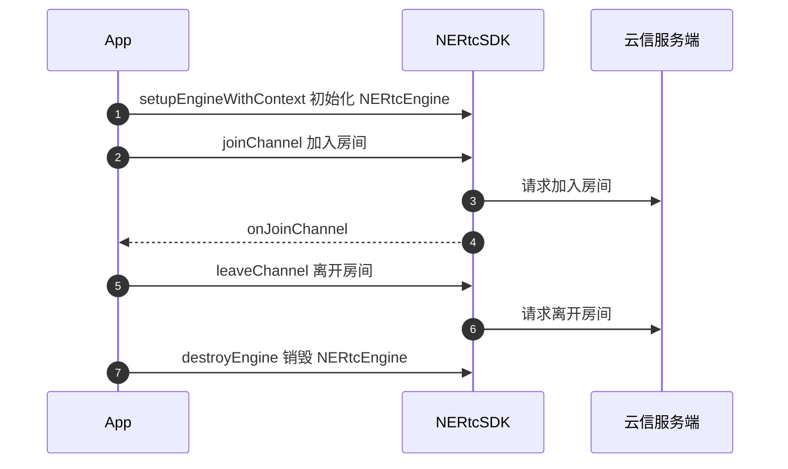
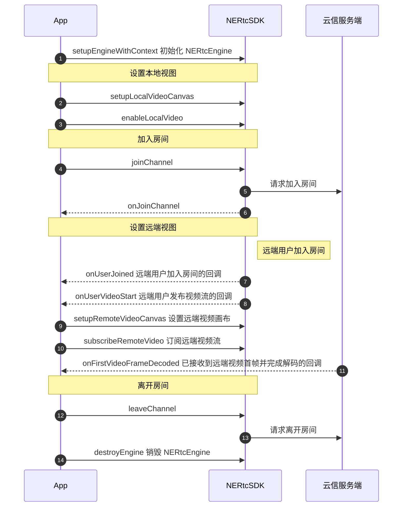

<!--和互动直播对应文档步骤不一致，请勿直接替换。相比互动直播文档，增加跑通示例代码、删除部分推流步骤-->

网易云信音视频通话产品的基本功能包括高质量的实时音视频通话。当您成功初始化 SDK 之后，您可以简单体验本产品的基本业务流程。本文介绍如何通过 NERTC uni-app SDK 实现基本的音视频通话。

## <span id="前提条件">前提条件</span>
请确认您已完成以下操作：

- <a href="https://doc.yunxin.163.com/console/guide/TIzMDE4NTA?platform=console" target="_blank">创建应用并获取 App Key</a>。
- <a href="https://doc.yunxin.163.com/nertc/quick-start/TYzODcyNjE" target="_blank">开通音视频通话 2.0 服务</a>。
- <a href="https://doc.yunxin.163.com/nertc/quick-start/DUxNzc4OTA" target="_blank">集成 SDK（uni-app）</a>。

## <span id="示例代码">示例代码</span> 

网易云信为您提供完整的**创建界面**及**实现基础音视频通话**的示例代码作为参考，您可以直接拷贝用于运行测试。

::: details xml 界面的完整示例代码
```
<?xml version="1.0" encoding="utf-8"?>
<view class="nertc-video-area">
    <view class="nertc-video-view">
        <nertc-local-view 
            style="height: 303.84rpx;flex: 1;" 
            mediaType="video" 
            :viewID="userID">
        </nertc-local-view>
    </view>
    <view class="nertc-video-view" v-for="(userID, index) in remoteUserIdVideoList" :key="userID">
        <nertc-remote-view
            style="height: 303.84rpx;flex: 1;"
            v-if="userID"
            mediaType="video" 
            :userID="userID">
        </nertc-remote-view>
    </view>
</view>
```
:::

::: details 实现音视频通话的完整示例代码
```
import permision from "@/NERtcUniappSDK-JS/permission.js";
import NERTC from "@/NERtcUniappSDK-JS/lib/index";
import NertcLocalView from "@/NERtcUniappSDK-JS/nertc-view/NertcLocalView";
import NertcRemoteView from "@/NERtcUniappSDK-JS/nertc-view/NertcRemoteView";

export default {
    components: {
        NertcRemoteView: NertcRemoteView,
        NertcLocalView: NertcLocalView
    },
    data() {
        engine: null,
        remoteUserIdVideoList: [],
    },
    methods: {
        createEngine() {
            console.log('初始化NERTC引擎');
            this.engine = NERTC.setupEngineWithContext({
                appKey: appkey, // your appkey
                logDir: logDir || '', // expected log directory
                logLevel: logLevel || 3
            });

            console.log('初始化引擎完成，开始设置本地视频画布');
			this.engine.setupLocalVideoCanvas({
                renderMode: 0, // 0表示使用视频，视频等比缩放，1表示适应区域，会裁剪，2：折中方案 
                mirrorMode: 1, //1表示启用镜像，2表示不启用
                isMediaOverlay: false //表示小画布置于大画布上面（从5.3.8002版本开始，该参数已废弃）
            })
            
            this.appendActionInfo('初始化引擎完成，启动视频')
            this.engine.enableLocalVideo({
                enable: true, //true表示设置启动摄像头，false表示关闭摄像头
                videoStreamType: 0 //0表示视频，1表示屏幕共享 //当前demo先使用数字
            })

            //判断权限
            if (uni.getSystemInfoSync().platform === "android") {
                permision.requestAndroidPermission(
                    "android.permission.RECORD_AUDIO"
                );
                permision.requestAndroidPermission(
                    "android.permission.CAMERA"
                );
            }

            //注册NERTC的事件
            this.engine.addEventListener("onError", (code, message, extraInfo) => {
                const message = `onError通知：code = ${code}, message = ${message}, extraInfo = ${extraInfo}`
                console.log(message)
            });
            
            this.engine.addEventListener("onWaring", (code, message, extraInfo) => {
                const message = `onWaring通知：code = ${code}, message = ${message}, extraInfo = ${extraInfo}`
                console.log(message)
            });

            //重要：UI视频view渲染的时间点不确定，有可能会出现设置videoCanvas时，对应的视频view还没有渲染好，导致设置videoCanvas失败，用户需要监听该事件去重新设置对应的videoCanvas
            this.engine.addEventListener("onVideoCanvas", (direction, videoStreamType, userID) => {
                const imessage = `onVideoCanvas通知：direction = ${direction}, videoStreamType = ${videoStreamType}, userID = ${userID}`
                console.log(imessage)
                if (direction == 'local') {
                    if (videoStreamType == 'video') {
                        //重新设置本地Video（即摄像头）的画布
                        this.engine.setupLocalVideoCanvas({
                            renderMode: 0, // 0表示使用视频，视频等比缩放，1表示适应区域，会裁剪，2：折中方案 
                            mirrorMode: 1, //1表示启用镜像，2表示不启用
                            isMediaOverlay: false //表示视图优先级，是否覆盖其他视频画布（从5.3.8002版本开始，该参数已废弃）
                        })
                    } else if(videoStreamType == 'subStreamVideo') {
                        //重新设置本地subStramVideo(即屏幕共享)的画布
                        this.engine.setupLocalSubStreamVideoCanvas({
                            renderMode: 0, // 0表示使用视频，视频等比缩放，1表示适应区域，会裁剪，2：折中方案 
                            mirrorMode: 1, //1表示启用镜像，2表示不启用
                            isMediaOverlay: false //表示视图优先级，是否覆盖其他视频画布（从5.3.8002版本开始，该参数已废弃）
                        })
                    }
                    
                } else if(direction == 'remote'){
                    if (videoStreamType == 'video') {
                        //重新设置远端Video（即摄像头）的画布
                        this.engine.setupRemoteVideoCanvas({
                            renderMode: NERTCRenderMode.Fit, // Fit表示应区域。视频尺寸等比缩放,保证所有区域被填满,视频超出部分会被裁剪
                            mirrorMode: NERTCMirrorMode.AUTO, //AUTO表示使用默认值,由sdk控制
                            isMediaOverlay: false //表示视图优先级，是否覆盖其他视频画布（从5.3.8002版本开始，该参数已废弃）
                            userID,
                        })
                    } else if(videoStreamType == 'subStreamVideo') {
                        //重新设置远端subStramVideo(即屏幕共享)的画布
                        this.engine.setupRemoteSubStreamVideoCanvas({
                            renderMode: NERTCRenderMode.Fit, // Fit表示应区域。视频尺寸等比缩放,保证所有区域被填满,视频超出部分会被裁剪
                            mirrorMode: NERTCMirrorMode.AUTO, //AUTO表示使用默认值,由sdk控制
                            isMediaOverlay: false //表示视图优先级，是否覆盖其他视频画布（从5.3.8002版本开始，该参数已废弃）
                            userID,
                        })
                    }
                }
            });

            this.engine.addEventListener("onJoinChannel", (result, channelId, elapsed, userID) => {
                const message = `onJoinChannel通知：自己加入房间状况，result = ${result}, channelId = ${channelId}, elapsed = ${elapsed}, userID = ${userID}`
                console.log(message)
            });

            this.engine.addEventListener("onLeaveChannel", (result) => {
                const message = `onLeaveChannel通知：自己离开房间状况，result = ${result}`
                console.log(message)
            });

            this.engine.addEventListener("onUserJoined", (userID) => {
                const message = `onUserJoined通知：有人加入房间，userID = ${userID}`
                console.log(message)
            });

            this.engine.addEventListener("onUserLeave", (userID, reason) => {
                const message = `onUserLeave通知：有人离开房间，userID = ${userID}, reason = ${reason}`
                console.log(message)
            });

            this.engine.addEventListener("onUserAudioStart", (userID) => {
                const message = `onUserAudioStart通知：对方开启音频，userID = ${userID}`
                console.log(message)
            });

            this.engine.addEventListener("onUserAudioStop", (userID) => {
                const message = `onUserAudioStop通知：对方关闭音频，userID = ${userID}`
                console.log(message)
            });

            this.engine.addEventListener("onUserVideoStart", (userID, maxProfile) => {
                const message = `onUserVideoStart通知：对方开启视频，userID = ${userID}, maxProfile = ${maxProfile}`
                console.log(message)

                //nertc-remote-view组件 viewID和userID的数据格式是String类型，onUserVideoStart事件通知的userID是number，这里做一下数据格式转换
                const remoteUserID = `${userID}`
                if (!this.remoteUserIdVideoList.includes(remoteUserID)) {
                    this.remoteUserIdVideoList.push(remoteUserID);
                    //保证当前nertc-remote-view组件渲染完成，在执行设置画布的接口
                    this.$nextTick(() => {
                        console.log('此时远端视频 nertc-remote-view 渲染完成')
                        //需要开发者主动去做订阅对方视频的逻辑动作
                        this.subscribeRemoteVideo(userID) 
                    })
                }
            });

            this.engine.addEventListener("onUserVideoStop", (userID) => {
                const message = `onUserVideoStop通知：对方关闭视频，userID = ${userID}`
                console.log(message)
            });

        },

        destroyEngine() {
            console.log('销毁NERTC引擎')
            //清除注册的所有事件
            this.engine?.removeAllEventListener()
            //释放资源
            this.engine?.destroyEngine()
            this.engine = null
            this.remoteUserIdVideoList = []
        },

        joinChannel(){
            console.log('加入房间')
            this.engine.joinChannel({
                token: '',
                channelName: 'uniapp', //自定义房间名称
                myUid: 111 //该房间中个人userID标识，要求number类型（不要超出number范围），房间中唯一
            });
        },

        leaveChannel(){
            console.log('离开房间')
            this.engine.leaveChannel();
            this.remoteUserIdVideoList = []
        },

        subscribeRemoteVideo(remoteUserID){
			console.log(`开始拉流: ${remoteUserID}, 首先设置对端视频画布`)
            this.engine.setupRemoteVideoCanvas({
                renderMode: NERTCRenderMode.Fit, // Fit表示应区域。视频尺寸等比缩放,保证所有区域被填满,视频超出部分会被裁剪
	            mirrorMode: NERTCMirrorMode.AUTO, //AUTO表示使用默认值,由sdk控制
	            isMediaOverlay: false //表示小画布置于大画布上面（从5.3.8002版本开始，该参数已废弃）
                userID: remoteUserID,
            }) ;

            console.log(`开始拉流: ${remoteUserID}, 然后订阅对端视频`)
            this.engine.subscribeRemoteVideo({
                userID: remoteUserID,
                streamType: 0, //0表示大流，1表示小流
                subscribe: true //true表示订阅，false表示取消订阅
            })
        }
    }
}
```
:::

## 实现流程

实现**音频通话**的 API 调用时序如下图所示。



  
实现**视频通话**的 API 调用时序如下图所示。


  


## <span id="实现音视频通话">实现音视频通话</span>

### 步骤一 （可选）创建音视频通话界面

::: details 您可以参考此步骤根据业务场景创建相应的音视频通话界面，若您已实现相应界面，请忽略该步骤。

实现基础的音视频通话，建议您参考 [xml 界面的示例代码](#示例代码)在界面上添加以下控件。

- 房间 ID
- 用户昵称
- 本端视频窗口
- 远端视频窗口
- 麦克风按钮
- 摄像头按钮
- 结束通话按钮

效果图如下图所示。


:::

### <span id="2.导入类">步骤二 导入类</span>


```javaScript
import permision from "@/NERtcUniappSDK-JS/permission.js";
import NERTC from "@/NERtcUniappSDK-JS/lib/index";
import NertcLocalView from "@/NERtcUniappSDK-JS/nertc-view/NertcLocalView";
import NertcRemoteView from "@/NERtcUniappSDK-JS/nertc-view/NertcRemoteView";
import { 
    NERTCRenderMode,
    NERTCChannelConnectionState,
    NERTCMirrorMode, 
    NERtcVideoStreamType, 
    NERtcVideoFrameRate, 
    NERtcVideoCropMode,
    NERtcDegradationPreference,
    NERtcVideoOutputOrientationMode,
    NERtcVideoProfileType,
    NERtcRemoteVideoStreamType,
    NERTCAudioDevice,
    NERTCAudioDeviceType,
    NERTCAudioDeviceState,
    NERTCVideoDeviceState,
    NERTCConnectionType,
    NERTCErrorCode,
    NERtcAudioVolumeInfo,
    NERTCAudioProfile,
    NERTCAudioScenario,
    NERTCChannelProfile,
    NERTCUserRole,
    NERtcSubStreamContentPrefer
} from '@/NERtcUniappSDK-JS/lib/NERtcDefines';
```

### <span id="3.初始化">步骤三 初始化</span>

调用 [`setupEngineWithContext`](https://doc.yunxin.163.com/nertc/api-refer/uniapp/typedoc/Latest/zh/html/modules/nertc.nertc-1.html#setupenginewithcontext) 接口，为对应的 App Key 创建引擎单例对象。

如果需要注册回调方法，开发者可根据实际需要，实现 NERtcCallback 中的某些方法，创建引擎后可通过调用 [`addEventListener`](https://doc.yunxin.163.com/nertc/api-refer/uniapp/typedoc/Latest/zh/html/modules/nertc.nertc-1.html#addeventlistener) 接口设置回调。


::: note notice
您需要将 `appKey` 替换为您的应用对应的 App Key。
:::

**示例代码**如下：

```javaScript
console.log('初始化NERTC引擎');
this.engine = NERTC.setupEngineWithContext({
    appKey: appkey, // your appkey
    logDir: logDir || '', // expected log directory
    logLevel: logLevel || 3
});
```
  
为了实现标准音视频通话业务，您还需要在初始化时**注册相关必要回调**，建议您请在初始化方法中传入原型为 **NERtcCallback** 的以下回调，并增加相应必要的处理。

```javaScript
//NERtcCallback 重要回调

//注册NERTC的事件
this.engine.addEventListener("onError", (code, message, extraInfo) => {
    const message = `onError通知：code = ${code}, message = ${message}, extraInfo = ${extraInfo}`
    console.log(message)
});

this.engine.addEventListener("onWaring", (code, message, extraInfo) => {
    const message = `onWaring通知：code = ${code}, message = ${message}, extraInfo = ${extraInfo}`
    console.log(message)
});

//重要：UI视频view渲染的时间点不确定，有可能会出现设置videoCanvas时，对应的视频view还没有渲染好，导致设置videoCanvas失败，用户需要监听该事件去重新设置对应的videoCanvas
this.engine.addEventListener("onVideoCanvas", (direction, videoStreamType, userID) => {
    const imessage = `onVideoCanvas通知：direction = ${direction}, videoStreamType = ${videoStreamType}, userID = ${userID}`
    console.log(imessage)
    if (direction == 'local') {
        if (videoStreamType == 'video') {
            //重新设置本地Video（即摄像头）的画布
            this.engine.setupLocalVideoCanvas({
                renderMode: 0, // 0表示使用视频，视频等比缩放，1表示适应区域，会裁剪，2：折中方案 
                mirrorMode: 1, //1表示启用镜像，2表示不启用
                isMediaOverlay: false //表示视图优先级，是否覆盖其他视频画布（从5.3.8002版本开始，该参数已废弃）
            })
        } else if(videoStreamType == 'subStreamVideo') {
            //重新设置本地subStramVideo(即屏幕共享)的画布
            this.engine.setupLocalSubStreamVideoCanvas({
                renderMode: 0, // 0表示使用视频，视频等比缩放，1表示适应区域，会裁剪，2：折中方案 
                mirrorMode: 1, //1表示启用镜像，2表示不启用
                isMediaOverlay: false //表示视图优先级，是否覆盖其他视频画布（从5.3.8002版本开始，该参数已废弃）
            })
        }
        
    } else if(direction == 'remote'){
        if (videoStreamType == 'video') {
            //重新设置远端Video（即摄像头）的画布
            this.engine.setupRemoteVideoCanvas({
                renderMode: NERTCRenderMode.Fit, // Fit表示应区域。视频尺寸等比缩放,保证所有区域被填满,视频超出部分会被裁剪
                mirrorMode: NERTCMirrorMode.AUTO, //AUTO表示使用默认值,由sdk控制
                isMediaOverlay: false, //表示视图优先级，是否覆盖其他视频画布（从5.3.8002版本开始，该参数已废弃）
                userID
            })
        } else if(videoStreamType == 'subStreamVideo') {
            //重新设置远端subStramVideo(即屏幕共享)的画布
            this.engine.setupRemoteSubStreamVideoCanvas({
                renderMode: NERTCRenderMode.Fit, // Fit表示应区域。视频尺寸等比缩放,保证所有区域被填满,视频超出部分会被裁剪
                mirrorMode: NERTCMirrorMode.AUTO, //AUTO表示使用默认值,由sdk控制
                isMediaOverlay: false, //表示视图优先级，是否覆盖其他视频画布（从5.3.8002版本开始，该参数已废弃）
                userID
            })
        }
    }
});

this.engine.addEventListener("onJoinChannel", (result, channelId, elapsed, userID) => {
    const message = `onJoinChannel通知：自己加入房间状况，result = ${result}, channelId = ${channelId}, elapsed = ${elapsed}, userID = ${userID}`
    console.log(message)
});

this.engine.addEventListener("onLeaveChannel", (result) => {
    const message = `onLeaveChannel通知：自己离开房间状况，result = ${result}`
    console.log(message)
});

this.engine.addEventListener("onUserJoined", (userID) => {
    const message = `onUserJoined通知：有人加入房间，userID = ${userID}`
    console.log(message)
});

this.engine.addEventListener("onUserLeave", (userID, reason) => {
    const message = `onUserLeave通知：有人离开房间，userID = ${userID}`
    console.log(message)
});

this.engine.addEventListener("onUserAudioStart", (userID) => {
    const message = `onUserAudioStart通知：对方开启音频，userID = ${userID}`
    console.log(message)
});

this.engine.addEventListener("onUserAudioStop", (userID) => {
    const message = `onUserAudioStop通知：对方关闭音频，userID = ${userID}`
    console.log(message)
});

this.engine.addEventListener("onUserVideoStart", (userID, maxProfile) => {
    const message = `onUserVideoStart通知：对方开启视频，userID = ${userID}, maxProfile = ${maxProfile}`
    console.log(message)
});

this.engine.addEventListener("onUserVideoStop", (userID) => {
    const message = `onUserVideoStop通知：对方关闭视频，userID = ${userID}`
    console.log(message)
});
```

### <span id="4.设置本地视图">步骤四 设置本地视图</span>

初始化成功后，可以设置本地视图，来预览本地图像。您可以根据业务需要实现加入房间之前预览或加入房间后预览。

::: note note
在加入房间前，默认预览分辨率为 640*480，您可以通过 [`setLocalVideoConfig`](https://doc.yunxin.163.com/nertc/api-refer/uniapp/typedoc/Latest/zh/html/modules/nertc.nertc-1.html#setlocalvideoconfig) 接口的 `width ` 和 `height` 参数调整采集分辨率。
:::

- 实现加入房间前预览。

  1. 调用 [`setupLocalVideoCanvas`](https://doc.yunxin.163.com/nertc/api-refer/uniapp/typedoc/Latest/zh/html/modules/nertc.nertc-1.html#setuplocalvideocanvas) 和 [`startPreview`](https://doc.yunxin.163.com/nertc/api-refer/uniapp/typedoc/Latest/zh/html/modules/nertc.nertc-1.html#startpreview) 方法，在加入房间前设置本地视图，预览本地图像。


      **示例代码**如下：
      ```javaScript
        console.log('初始化引擎完成，开始设置本地视频画布');
        this.engine.setupLocalVideoCanvas({
            renderMode: 0, // 0表示使用视频，视频等比缩放，1表示适应区域，会裁剪，2：折中方案 
            mirrorMode: 1, // 1表示启用镜像，2表示不启用
            isMediaOverlay: false //表示小画布置于大画布上面（从5.3.8002版本开始，该参数已废弃）
        })
        
        this.appendActionInfo('初始化引擎完成，开启预览')
        this.engine.startPreview(NERtcVideoStreamType.MAIN)
      ```

  2. 若要结束预览，或者准备加入房间时，调用 [`stopPreview`](https://doc.yunxin.163.com/nertc/api-refer/uniapp/typedoc/Latest/zh/html/modules/nertc.nertc-1.html#stoppreview) 方法停止预览。

      ::: note note 
      [`stopPreview`](https://doc.yunxin.163.com/nertc/api-refer/uniapp/typedoc/Latest/zh/html/modules/nertc.nertc-1.html#stoppreview)  的 `streamType` 参数请与  [`startPreview`](https://doc.yunxin.163.com/nertc/api-refer/uniapp/typedoc/Latest/zh/html/modules/nertc.nertc-1.html#startpreview) 的保持一致，即同为主流或辅流的开启和停止预览。
      :::

- 实现加入房间后预览。

    调用  [`setupLocalVideoCanvas`](https://doc.yunxin.163.com/nertc/api-refer/uniapp/typedoc/Latest/zh/html/modules/nertc.nertc-1.html#setuplocalvideocanvas) 设置本地视图，再调用 [`enableLocalVideo`](https://doc.yunxin.163.com/nertc/api-refer/uniapp/typedoc/Latest/zh/html/modules/nertc.nertc-1.html#enablelocalvideo) 方法进行视频的采集发送与预览。成功加入房间后，即可预览本地图像。

    **示例代码**如下：
    ```javaScript
        console.log('初始化引擎完成，开始设置本地视频画布');
        this.engine.setupLocalVideoCanvas({
            renderMode: 0, // 0表示使用视频，视频等比缩放，1表示适应区域，会裁剪，2：折中方案 
            mirrorMode: 1, //1表示启用镜像，2表示不启用
            isMediaOverlay: false //表示视图优先级，是否覆盖其他视频画布（从5.3.8002版本开始，该参数已废弃）
        })
        
        this.appendActionInfo('初始化引擎完成，启动视频')
        this.engine.enableLocalVideo({
            enable: true, //true表示设置启动摄像头，false表示关闭摄像头
            videoStreamType: 0 //0表示视频，1表示屏幕共享,也可以使用枚举
        })
    ```
 
### <span id="5.加入房间">步骤五 加入房间</span>

加入房间前，请确保已完成初始化相关事项。若您的业务中涉及呼叫邀请等机制，建议通过<a href="/docs/DA5MjI4NDY/DE2MTc5MTQ" target="_blank">信令</a>实现，总体实现流程请参见<a href="https://doc.yunxin.163.com/signaling/quick-start/DE2MTc5MTQ?platform=android#%E4%B8%80%E5%AF%B9%E4%B8%80%E4%BC%9A%E8%AF%9D%E6%93%8D%E4%BD%9C%E6%B5%81%E7%A8%8B" target="_blank">信令的文档</a>，具体呼叫邀请机制的实现请参见<a href="https://doc.yunxin.163.com/signaling/quick-start/zc3NDkzNDU?platform=android" target="_blank">邀请机制</a>。

调用 <a href="https://doc.yunxin.163.com/nertc/api-refer/uniapp/typedoc/Latest/zh/html/modules/nertc.nertc-1.html#joinchannel" target="_blank">`joinChannel`</a> 方法加入房间。


**示例代码**如下：
```java
    console.log('加入房间')
    this.engine.joinChannel({
        token: '', //如果云信业务后台开启了安全模式，需要填写token
        channelName: 'uniapp', //自定义房间名称
        myUid: 111 //该房间中个人userID自定义标识，要求number类型（不要超出number范围），房间中唯一
    });
```

**参数说明**：

<table>
  <tr>
    <th width="30%"><b>参数</b></th>
    <th width="60%"><b>说明</b></th>
  </tr>
  <tr>
    <td>token</td>
    <td>安全认证签名（NERTC Token）。<br><ul><li>调试模式下：可设置为 null。产品默认为安全模式，您可以在网易云信控制台将鉴权模式修改为调试模式，具体请参见<a href="https://doc.yunxin.163.com/nertc/quick-start/jI4MDkwNDM" target="_blank">Token 鉴权</a>。<br><b>调试模式的安全性不高，请在产品正式上线前修改为安全模式。</b><li>产品正式上线后：请设置为已获取的<a href="https://doc.yunxin.163.com/nertc/quick-start/jI4MDkwNDM?platformId" target="_blank">NERTC Token</a>。安全模式下必须设置为获取到的 Token 。若未传入正确的 Token 将无法进入房间。<p><b>推荐使用安全模式</b>。</td>
  </tr>
    <tr>
    <td>channelName</td>
    <td>房间名称，长度为 1 ~ 64 字节。目前支持以下 89 个字符：a-z, A-Z, 0-9, space, !#$%&()+-:;≤.,>? @[]^_{|}~"。<br>设置相同房间名称的用户会进入同一个通话房间。<br><note type="note">您也可以在加入通道前，通过<a href="https://doc.yunxin.163.com/nertc/quick-start/jg3NjcyNTE" target="_blank">创建房间</a>接口创建房间。加入房间时，若传入的 {channelName} 未事先创建，则云信服务器内部将为其自动创建一个名为 {channelName} 的通话房间。</note></li></td>
  </tr>
    <tr>
    <td>myUid</td>
    <td>用户的唯一标识 id，为数字串，房间内每个用户的 uid 必须是唯一的。<note type="notice">此 uid 为用户在您应用中的 ID，请在您的业务服务器上自行管理并维护。</note></td>
  </tr>
</table>

::: note note
- SDK 发起加入房间请求后，服务器会进行响应，您可以通过 <a href="https://doc.yunxin.163.com/nertc/api-refer/uniapp/typedoc/Latest/zh/html/interfaces/nertccallback.nertccallback-1.html" target="_blank">`NERtcCallback`</a> 的 <a href="https://doc.yunxin.163.com/nertc/api-refer/uniapp/typedoc/Latest/zh/html/interfaces/nertccallback.nertccallback-1.html#onjoinchannel" target="_blank">`onJoinChannel`</a> 回调监听加入房间的结果，同时该回调会抛出当前通话房间的 **channelId** 与加入房间总耗时（毫秒）；其中 **channelId** 即音视频通话的 ID，建议您在业务层保存该数据，以便于后续问题排查。

- 成功加入房间之后，您可以通过监听 [`onConnectionStateChanged`](https://doc.yunxin.163.com/nertc/api-refer/uniapp/typedoc/Latest/zh/html/interfaces/nertccallback.nertccallback-1.html#onconnectionstatechanged) 回调实时监控自己在本房间内的连接状态。
:::

### <span id="6.设置远端视图并发起订阅">步骤六 设置远端视图并发起订阅</span>

音视频通话过程中，除了要显示本地的视频画面，通常也要显示参与互动的其他连麦者/主播的远端视频画面。


1. 监听远端用户进出房间。
  
    当远端用户加入房间时，本端会触发 <a href="https://doc.yunxin.163.com/nertc/api-refer/uniapp/typedoc/Latest/zh/html/interfaces/nertccallback.nertccallback-1.html#onuserjoined" target="_blank">`onUserJoined`</a> 回调，并抛出对方的 uid。
    
    ::: note note
    当本端加入房间后，也会通过此回调抛出通话房间内已有的其他用户。
    :::

2. 设置远端视频画布。
  
    在监听到远端用户加入房间或发布视频流后，本端可以调用 <a href="https://doc.yunxin.163.com/nertc/api-refer/uniapp/typedoc/Latest/zh/html/modules/nertc.nertc-1.html#setupremotevideocanvas" target="_blank">`setupRemoteVideoCanvas`</a> 方法设置远端用户视频画布，用于显示其视频画面。


3. 监听远端视频流发布。

    当房间中的其他用户发布视频流时，本端会触发 <a href="https://doc.yunxin.163.com/nertc/api-refer/uniapp/typedoc/Latest/zh/html/interfaces/nertccallback.nertccallback-1.html#onuservideostart" target="_blank">`onUserVideoStart`</a> 回调。

4. 订阅远端视频流。

    在监听到远端用户发布视频流后，本端可以调用 <a href="https://doc.yunxin.163.com/nertc/api-refer/uniapp/typedoc/Latest/zh/html/modules/nertc.nertc-1.html#subscriberemotevideo" target="_blank">`subscribeRemoteVideo`</a> 方法对其发起视频流的订阅，来将对方的视频流渲染到视频画布上。


5. 监听远端用户离开房间或关闭视频功能。

  - <a href="https://doc.yunxin.163.com/nertc/api-refer/uniapp/typedoc/Latest/zh/html/interfaces/nertccallback.nertccallback-1.html#onuserleave" target="_blank">`onUserLeave`</a>：用户离开房间回调。

  - <a href="https://doc.yunxin.163.com/nertc/api-refer/uniapp/typedoc/Latest/zh/html/interfaces/nertccallback.nertccallback-1.html#onuservideostop" target="_blank">`onUserVideoStop`</a>：远端用户关闭视频功能回调。

**示例代码如下：**
```javaScript
    //对方开启视频，按需设置画布及订阅视频
    console.log(`开始拉流: ${remoteUserID}, 首先设置对端视频画布`)
    this.engine.setupRemoteVideoCanvas({
        renderMode: NERTCRenderMode.Fit, // Fit表示应区域。视频尺寸等比缩放,保证所有区域被填满,视频超出部分会被裁剪
        mirrorMode: NERTCMirrorMode.AUTO, //AUTO表示使用默认值,由sdk控制
        isMediaOverlay: false //表示小画布置于大画布上面
        userID: remoteUserID,
    }) ;

    console.log(`开始拉流: ${remoteUserID}, 然后订阅对端视频`)
    this.engine.subscribeRemoteVideo({
        userID: remoteUserID,
        streamType: 0, //0表示大流，1表示小流
        subscribe: true //true表示订阅，false表示取消订阅
    })
```

### <span id="7.音频流">步骤七 音频流</span>

在 NERTC SDK 中，本地音频的采集发布和远端音频订阅播放是默认启动的，正常情况下无需开发者主动干预。

### <span id="8.退出通话房间">步骤八 退出通话房间</span>

调用 <a href="https://doc.yunxin.163.com/nertc/api-refer/uniapp/typedoc/Latest/zh/html/modules/nertc.nertc-1.html#leavechannel" target="_blank">`leaveChannel`</a> 方法退出通话房间。

**示例代码**如下：
```javaScript
this.engine.leaveChannel();
``` 

**NERtcCallback** 提供 <a href="https://doc.yunxin.163.com/nertc/api-refer/uniapp/typedoc/Latest/zh/html/interfaces/nertccallback.nertccallback-1.html#onleavechannel" target="_blank">`onLeaveChannel`</a> 回调来监听当前用户退出房间的结果。

### <span id="9.销毁实例">步骤九 销毁实例</span>

当确定 App 短期内不再使用音视频通话实例时，可以调用 <a href="https://doc.yunxin.163.com/nertc/api-refer/uniapp/typedoc/Latest/zh/html/modules/nertc.nertc-1.html#destroyengine" target="_blank">`destroyEngine`</a> 方法释放对应的对象资源。

**示例代码**如下：

```javaScript
// 销毁实例
this.engine.destroyEngine();
``` 