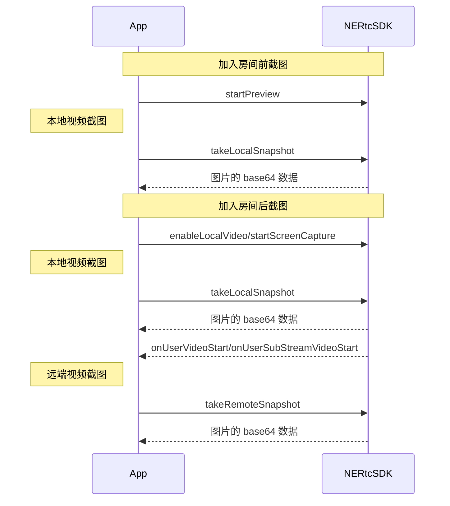

<!--keywords:音视频通话,视频截图-->

在音视频通话场景中，部分用户希望可以通过视频截图功能截取实时视频流画面，以便后续的存档分析、事件备忘、证据留存等等。NERTC SDK 提供视频截图功能，本文为您介绍如何通过 <a href="https://doc.yunxin.163.com/nertc/references/uniapp/typedoc/Latest/zh/html/modules/nertc.nertc-1.html#takelocalsnapshot" target="_blank">`takeLocalSnapshot`</a> 和 <a href="https://doc.yunxin.163.com/nertc/references/uniapp/typedoc/Latest/zh/html/modules/nertc.nertc-1.html#takeremotesnapshot" target="_blank">`takeRemoteSnapshot`</a> 方法进行实时截图。

## 功能介绍

NERTC SDK 支持针对实时视频流进行截图，包括本地主流和辅流画面、远端主流和辅流画面。

视频截图适用于在线教育以及主播直播等场景中，具体场景说明如下：
- 在线课堂场景中，学生对课件或板书内容进行截图，截图作为笔记保存。
- 互动直播场景中，可以通过截图对直播画面进行内容安全审核。

## 注意事项

- 视频截图功能只截取实时视频流数据，截图中 **不包含画布水印** 信息，但可以包含编码水印信息。
- 截图相关接口调用时机如下，如果在其他时机调用截图相关接口，会报错 `ERR_INVALID_OPERATION`，表示当前不支持该操作。

## API 调用时序



## 配置步骤

1. 根据需求调用截图相关接口，实现视频流截图。

    - 本地视频主流截图：

        - 加入房间前，在调用 <a href="https://doc.yunxin.163.com/nertc/references/uniapp/typedoc/Latest/zh/html/modules/nertc.nertc-1.html#startpreview" target="_blank">`startPreview(kNERtcVideoStreamTypeMain)`</a> 方法开启视频预览后，调用 <a href="https://doc.yunxin.163.com/nertc/references/uniapp/typedoc/Latest/zh/html/modules/nertc.nertc-1.html#takelocalsnapshot" target="_blank">`takeLocalSnapshot`</a> 方法，并设置 `NERtcVideoStreamType` 为 `kNERTCVideoStreamMain` 截取本地主流画面。

        - 加入房间后，在调用 <a href="https://doc.yunxin.163.com/nertc/references/uniapp/typedoc/Latest/zh/html/modules/nertc.nertc-1.html#enablelocalvideo" target="_blank">`enableLocalVideo(kNERtcVideoStreamTypeMain)`</a> 开启本地摄像头采集后，调用 <a href="https://doc.yunxin.163.com/nertc/references/uniapp/typedoc/Latest/zh/html/modules/nertc.nertc-1.html#takelocalsnapshot" target="_blank">`takeLocalSnapshot`</a> 方法，并设置 `NERtcVideoStreamType` 为 `kNERTCVideoStreamMain` 截取本地主流画面。

    - 本地视频辅流截图：

        - 加入房间前，在调用 <a href="https://doc.yunxin.163.com/nertc/references/uniapp/typedoc/Latest/zh/html/modules/nertc.nertc-1.html#startpreview" target="_blank">`startPreview(kNERTCVideoStreamSub)`</a> 方法开启视频预览后，调用 <a href="https://doc.yunxin.163.com/nertc/references/uniapp/typedoc/Latest/zh/html/modules/nertc.nertc-1.html#takelocalsnapshot" target="_blank">`takeLocalSnapshot`</a> 方法，并设置 `NERtcVideoStreamType` 为 `kNERtcVideoStreamTypeSub` 截取本地辅流画面。

        - 加入房间后，在调用 <a href="https://doc.yunxin.163.com/nertc/references/uniapp/typedoc/Latest/zh/html/modules/nertc.nertc-1.html#enablelocalvideo" target="_blank">`enableLocalVideo(kNERTCVideoStreamSub)`</a> 开启本地摄像头采集后，调用 <a href="https://doc.yunxin.163.com/nertc/references/uniapp/typedoc/Latest/zh/html/modules/nertc.nertc-1.html#takelocalsnapshot" target="_blank">`takeLocalSnapshot`</a> 方法，并设置 `NERtcVideoStreamType` 为 `kNERtcVideoStreamTypeSub` 截取本地辅流画面。

        - 加入房间后，在调用 <a href="https://doc.yunxin.163.com/nertc/references/uniapp/typedoc/Latest/zh/html/modules/nertc.nertc-1.html#startscreencapture" target="_blank">`startScreenCapture`</a> 方法启用屏幕共享后，调用 <a href="https://doc.yunxin.163.com/nertc/references/uniapp/typedoc/Latest/zh/html/modules/nertc.nertc-1.html#takelocalsnapshot" target="_blank">`takeLocalSnapshot`</a> 方法，并设置 `NERtcVideoStreamType` 为 `kNERtcVideoStreamTypeSub` 截取本地辅流画面。

    - 远端视频主/辅流截图：

        在分别收到 <a href="https://doc.yunxin.163.com/nertc/references/uniapp/typedoc/Latest/zh/html/interfaces/nertccallback.nertccallback-1.html#onuservideostart" target="_blank">`onUserVideoStart`</a> 与 <a href="https://doc.yunxin.163.com/nertc/references/uniapp/typedoc/Latest/zh/html/interfaces/nertccallback.nertccallback-1.html#onusersubstreamvideostart" target="_blank">`onUserSubStreamVideoStart`</a> 回调后，调用 <a href="https://doc.yunxin.163.com/nertc/references/uniapp/typedoc/Latest/zh/html/modules/nertc.nertc-1.html#takeremotesnapshot" target="_blank">`takeRemoteSnapshot`</a> 方法截取远端视频流画面，截图时可以通过 `NERtcVideoStreamType` 指定截取的视频流是主流还是辅流。

2. 通过回调的方式获取截图文件。

    截图画面数据以 base64 形式返回。

## Demo 源码

您可以下载 Demo 源码，参考截图功能的示例代码（1v1Call.nvue），体验功能实现视频截图。详情请参考 [下载 SDK 和示例代码](https://doc.yunxin.163.com/nertc/guide/zUyNzEwOTQ?platform=uniapp)。

## 示例代码

```JavaScript
//本地视频画面截图
this.engine.takeLocalSnapshot(NERtcVideoStreamType.MAIN).then(result=>{
    if(result.img){
        const imgBase64 = result.img
    } else {
        console.log('本地截图失败原因: ', result.errorCode)
    }
})

//远端截图
//本地视频画面截图
this.engine.takeRemoteSnapshot({
    userID: 100, //number格式的userID
    userStringID: '100', //string格式的userID,针对userID超过number范围的场景
    videoStreamType: NERtcVideoStreamType.MAIN
}).then(result=>{
    if(result.img){
        const imgBase64 = result.img
    } else {
        console.log('本地截图失败原因: ', result.errorCode)
    }
})
```

## API 参考

| **方法** | **功能描述** |
| :-- | :-- |
| <a href="https://doc.yunxin.163.com/nertc/references/uniapp/typedoc/Latest/zh/html/modules/nertc.nertc-1.html#takelocalsnapshot" target="_blank">`takeLocalSnapshot`</a> | 截取本地视频流画面 |
| <a href="https://doc.yunxin.163.com/nertc/references/uniapp/typedoc/Latest/zh/html/modules/nertc.nertc-1.html#takeremotesnapshot" target="_blank">`takeRemoteSnapshot`</a> | 截取远端视频流画面 |